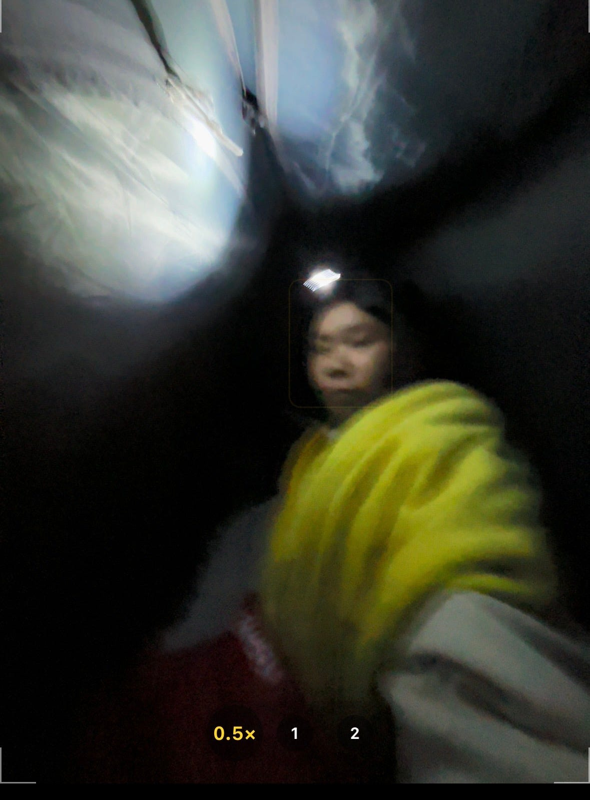
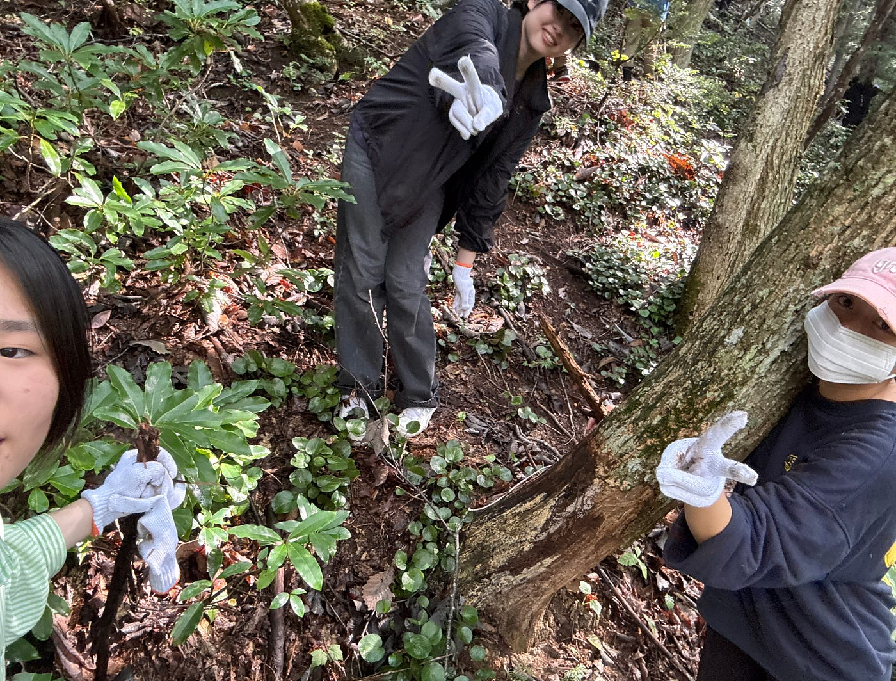
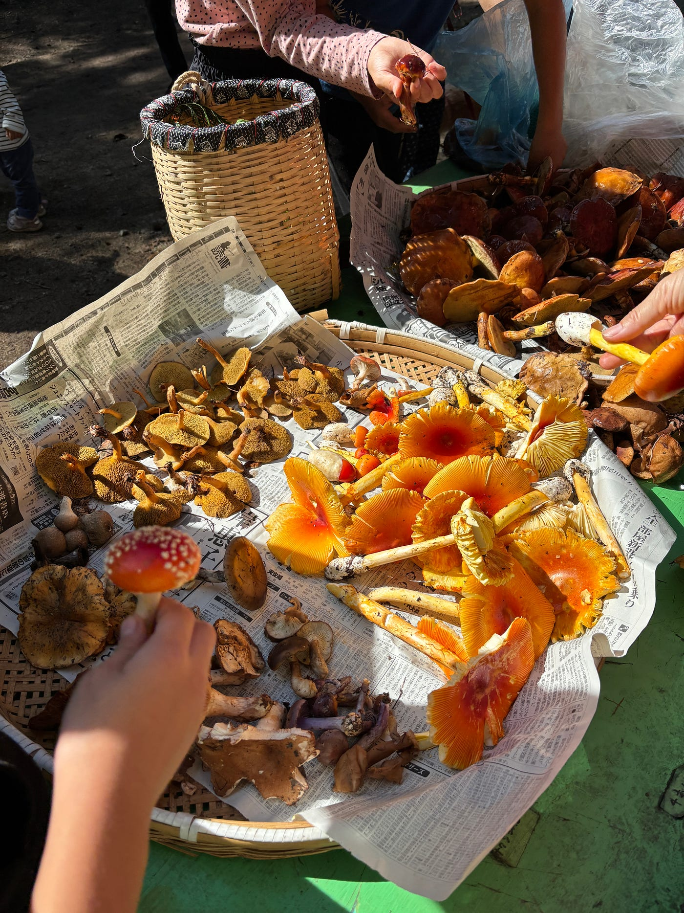
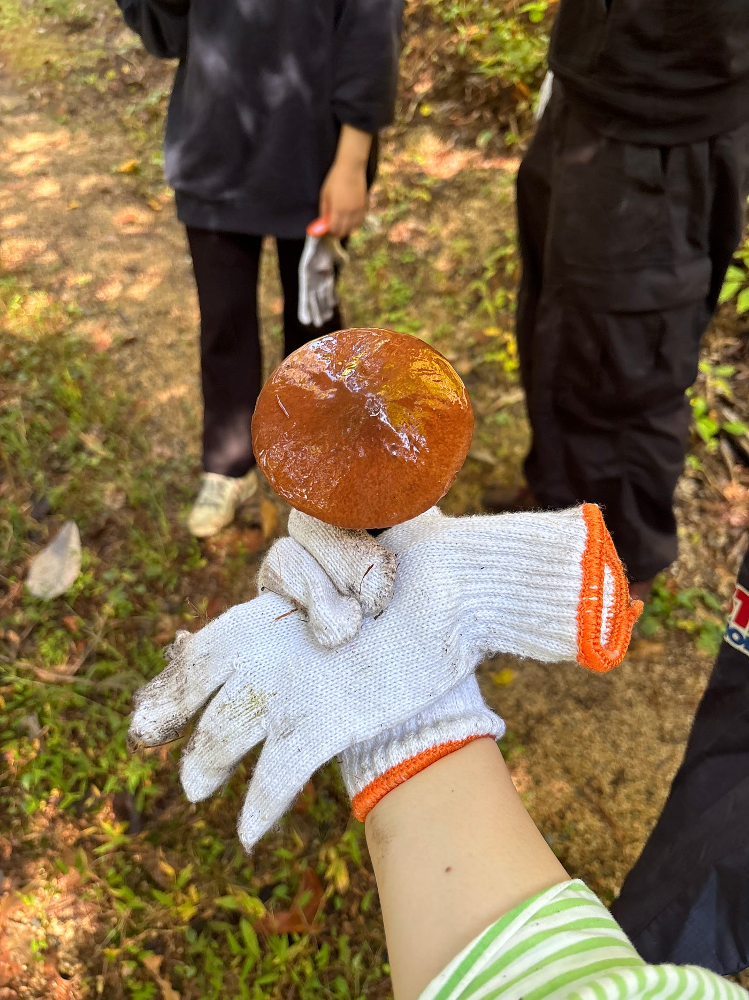
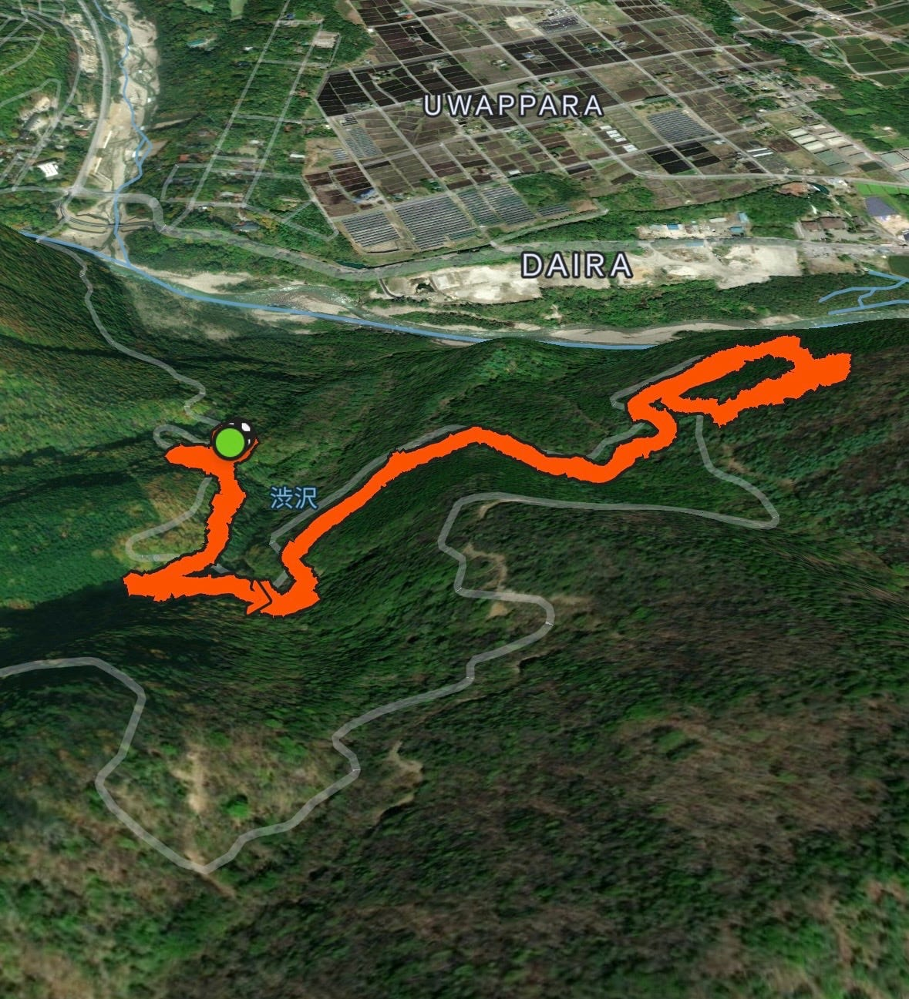
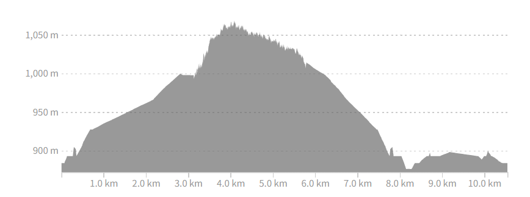
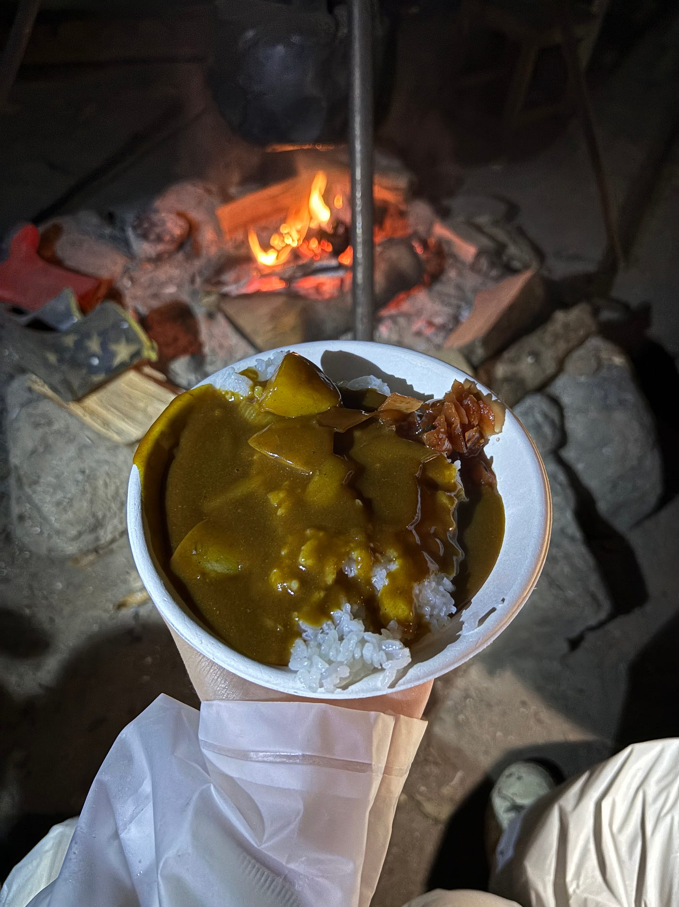
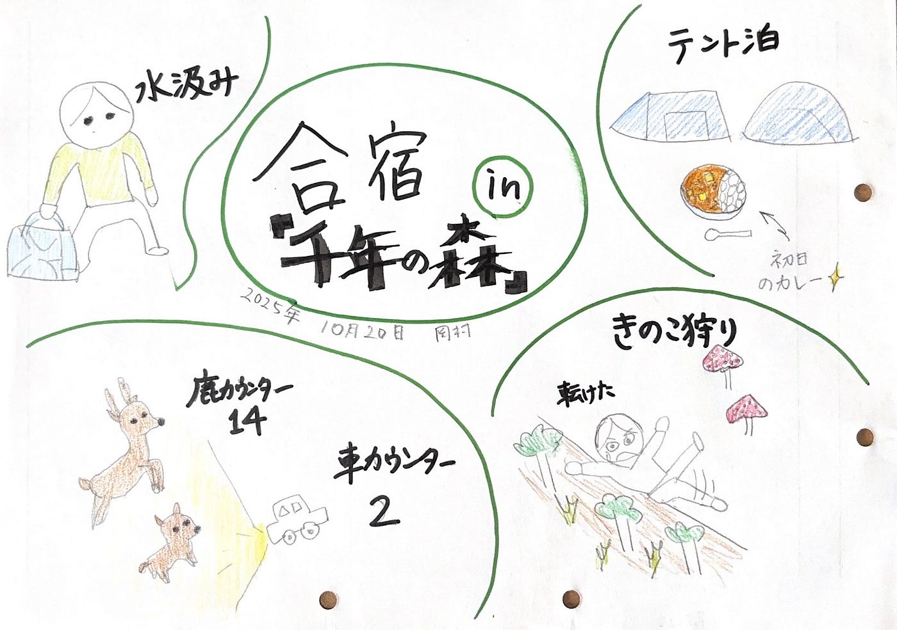

### **ツリーハウス合宿？？いや、サバイバルだろ。**

フィリピンでの国際会議が終わり、日本に帰国してわずか3日後、長野県大町の「千年の森」でキノコ狩り合宿に参加しました。
 この合宿を一言で表すなら、「生き延びた～」です。

私は参加前から、一抹の不安を抱えていました。

第一に、熊の出没（ちょうどこの時期、熊による被害のニュースが続いていました）。
 第二に、フィリピン帰国直後で、体力的にハードな片道6時間の長旅。
 第三に、天気予報は無情にも「雨」。

それでも、せっかくの機会だし、仲間と一緒に自然を体感できると思い、覚悟を決めて参加しました。

#### 初日

当日は、あいにくの雨で、ただでさえ、電気、水道もない環境が、より過酷なものになりました。

雨で濡れたテントで寝ることの不快さと、熊が出没することへの恐れで、寝れる気がしませんでしたが、いざ、テントに入ると思ったより快適で、それと、疲れが溜まっていたのか、不思議とすぐに眠りにつくことができました。

翌朝は5時半に寒さで目覚め、早起き組と一緒に川へ水汲みに行きました。冷たい空気と澄んだ水が、気持ちよかったです。

#### 二日目

いよいよメインイベントのキノコ狩り！

熊対策を万全にして、いざ出発！
急勾配の坂を上り、キノコをゲット。
一回、転んでからは、何も恐れることなく、キノコ狩りを楽しむことができました。
キノコの種類や見分け方を地元の方に教えてもらいながら、自然の奥深さを学ぶことができました。

Stravaキノコ狩りルート
[Lunch Walk | Strava](https://www.strava.com/activities/16112223555?share_sig=181921341760936332&utm_medium=social&utm_source=ios_share)

#### 感想

このタイトルでは、「ツリーハウス合宿？？いや、サバイバルだろ。」と書きましたが、それは大げさで、全然、やさしい自然との共存でした。
初日の夜は、おいしいカレーを頂きましたし、温泉に入ることもでき、割りと快適な時間を過ごすことができました。何より、長年、千年の森を守ってこられた方々のサポートがあったので、楽しみ、学びながら、キノコ狩りをすることができました。

とは言え、電気、ガスもない環境での生活は、予想通り、大変ではありました。しかし、そのおかげで、日々の生活の豊かさを実感するとともに、一つ一つの作業、例えば、水、食料の調達、寝床、明かりの確保などを、一から行うので、自然のありがたさを噛みしめることができました。
あと、空気がおいしい。

#### **つぶやき**

夜中に出発して千年の森に向かったのですが、たくさんの鹿に出合い、眠気も吹っ飛びました。メンバーが、出会った鹿の数と車の数を数えていたのですが、確か、鹿カウンター14？車カウンター2？とかだったかな、それくらい沢山の鹿に出合いました。いくつになっても、野生の動物に会うとテンション上がります。

#### **グラレコ**

