## ツリーハウス合宿に参加しました〜🏕️

こんにちは！3年の稲田優花です。

今日は、10月11日から12日にかけて、長野大町において古橋研究室のみんなと行っていたツリーハウス合宿についてまとめます。

今回の合宿では普段の日常における便利さから離れて、自分たちの力で生活する能力をつけることができたと感じています！

### 合宿1日目：

まずは、夜発の車で長野に向かいました。おでんを食べたり、散歩したりしながら、到着！先生とお蕎麦屋さんで合流し、皆でお昼ご飯を食べました。

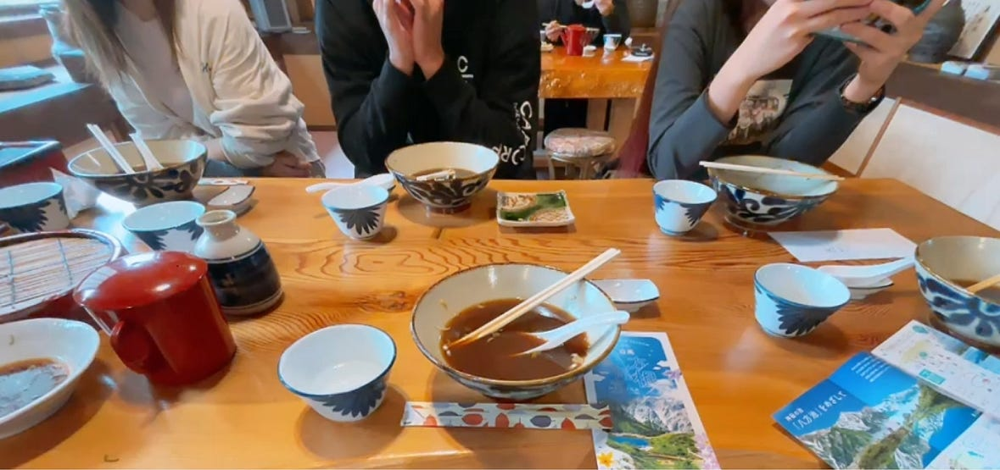

ツリーハウスの森(千年の森)に到着した後には、みんなで夜に寝るための地面を平らにする整地作業を行いました。

### 🪏平らな土地づくり

斜面を削る「切り土」と、土を盛ってならす「盛り土」を意識しながら、スコップやシャベルを手に、時には木で階段などを作りながら、少しずつ形を整えていきました。

1時間ほどの作業の成果として、夜には12人分の寝床になる土地を完成させることができました。

ぼこぼこの斜面を、自分たちの手で平らにしていく感覚はとても新鮮で、自然を感じられました。

来年度は、土地を拡張しつつ、より安定した降りるための段差を作ったり、濡れたものを干せるロープ張りを整えたりすると良いなと思います

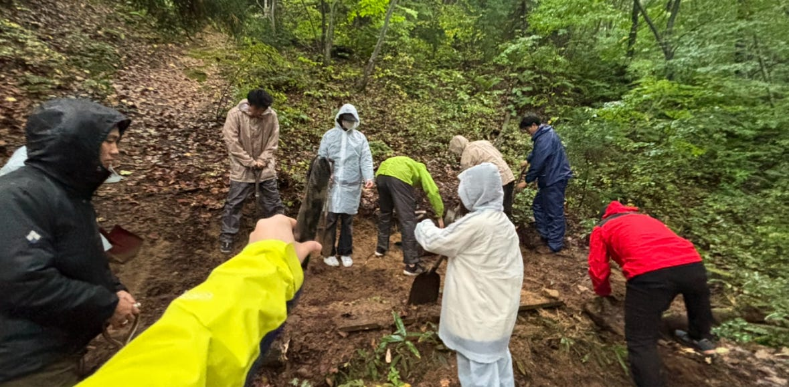

### 🕯火についての学び

1日目には、オイルランタンや焚き火を用いる際の火の扱い方についてや、薪割りの実践方法などについて学びました。

#### ◎合宿での学びポイント①

**「燃焼」には 酸素・熱・燃えるもの の3つが必要である！**

**そして、焚き火の炎に関しては、実は「段階的に」燃えている！**

一次燃焼では、温度と燃料が保たれれば火が安定して続き、

二次燃焼では、まだ残っている煙を誘導し、別の場所で再び燃やす構造を確保することで、より効率的に燃焼させられるそうです。

先生は「高級なストーブは三次燃焼もある」とおっしゃっており、火は奥深いものなのだ！と感じました。家のキッチンでは弱火中火などと自在に操れるものの、焚き火においては調節がとても難しいものだということにも気付かされました。

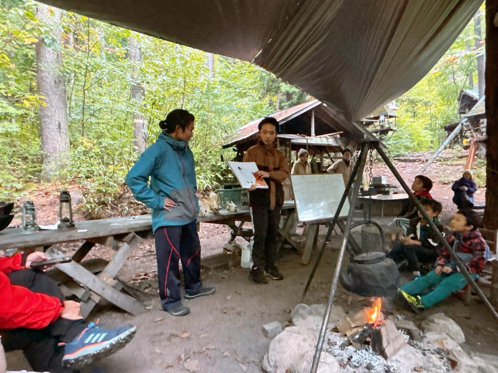

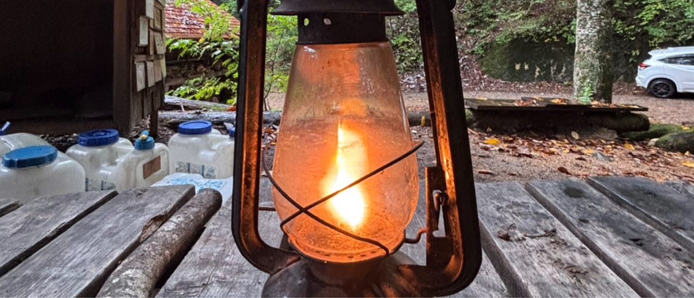

夕方は、寝床づくりを行いました。到着してから作っていた平らな土地に、みんなで夜に寝るためのテントをそれぞれ貼る作業を行いました。

先日の横瀬での合宿で学んだテントの貼り方を実践できる機会になりました！

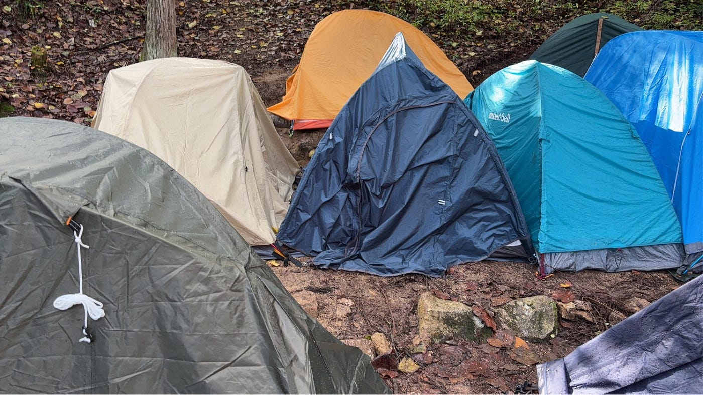

### 🐗イノシシの解体

テント貼りが終わった後、夜ご飯の準備は、イノシシの解体から始まりました。まだ毛の生えている足首や、イノシシの生々しい骨や肉を見ながら、生きていたものの命をいただくということの重みを改めて感じる時間になりました。

解体後は、イノシシカレーができあがり、みんなでご飯を盛って、焚き火のそばで食べました。できたてのカレーはとても暖かく美味しかったです。

また、夜ご飯の後はみんなで人狼をして、とても楽しい時間を過ごせました！

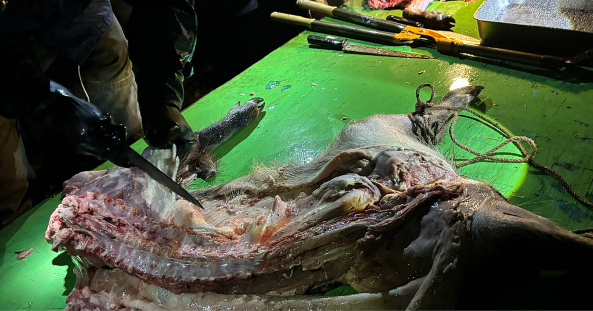

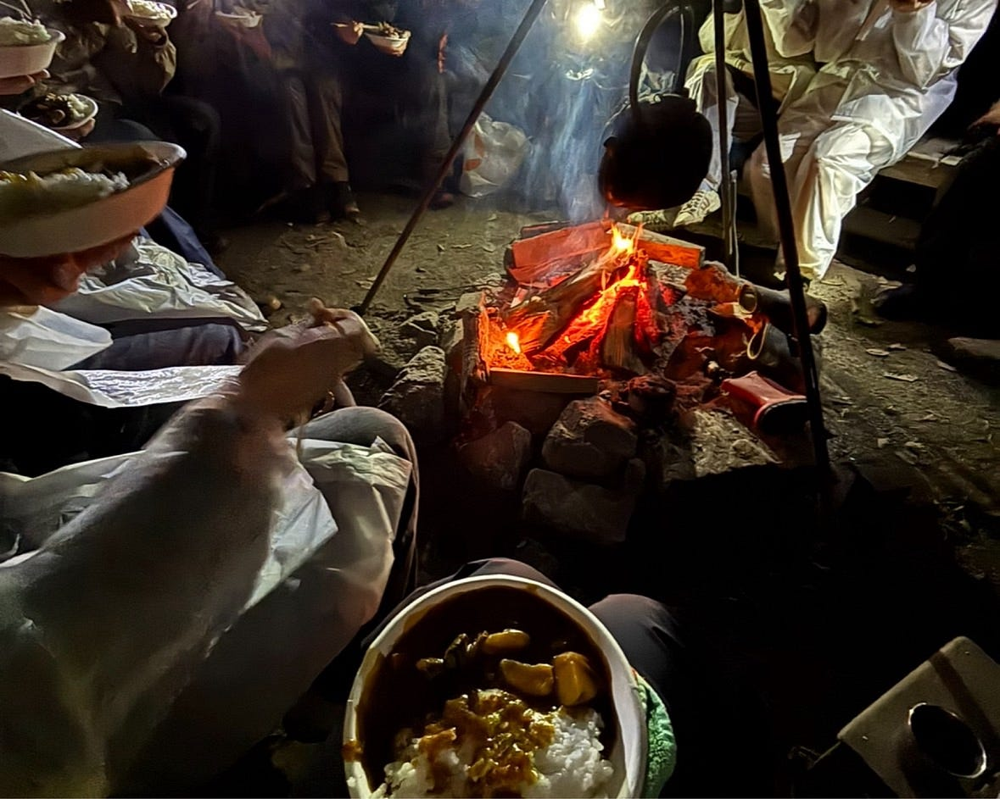

### 合宿2日目：

翌朝は、朝当番だった私たちと、早起きした組で、水汲みをする所から始まりました。2日目には、朝から昼の解散まで、山に登って水やきのこを自給自足するという、とても勇ましいサバイバルな生き方を体感することができました。

#### ◎合宿での学びポイント②

**水や食料を自分たちで自然から調達しないいけない、というオフグリッド（既存のインフラに頼らない生き方）の大切さを実感しました。**

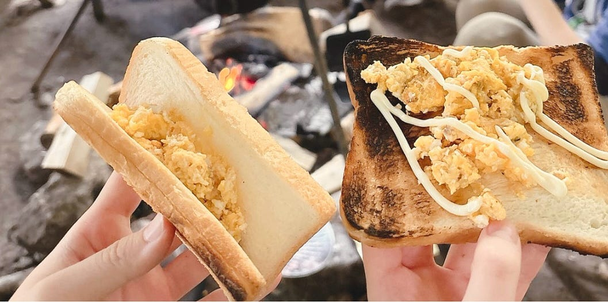

### 🍄‍🟫きのこ狩り

ラストイベントとなったきのこ狩り。1時間ほど、熊鈴を鳴らしながら集団で森の中の斜面を登りながら美味しそうなきのこを探していきました。

Stravaでの記録はこちら↓

[ツリーハウス合宿 | Strava
View 優花 稲田's walk on October 12, 2025 | Stravawww.strava.com](https://www.strava.com/activities/16112082638?utm_source=ios_share&utm_medium=social&share_sig=872FC7991760992614&_branch_referrer=H4sIAAAAAAAAA8soKSkottLXLy4pSixL1EssKNDLyczL1s%2FNS8s0MQoydI5Isq8rSk1LLSrKzEuPTyrKLy9OLbL1ycxLBQAbeHjTOwAAAA%3D%3D&_branch_match_id=1508920070346040813)

きのこの種類にはあまり詳しくなかった私にとって、今回の散策は驚きでいっぱいでした。森の中には本当にさまざまな色や形のきのこが生えているのだと実感し、貴重な機会になりました。自ら探してまわりながら、一つ一つ食べられるか否かを専門家の方に訪ねながら歩いていく作業はとても楽しかったです。

また、高所恐怖症の私にとって、途中からの登り降りはとても刺激的でした。しかしながら、前や後ろを歩いていたみんなが易しい道を教えてくれたり、付き添ってくれたりして、一緒に戻ってくることができて良かったです。

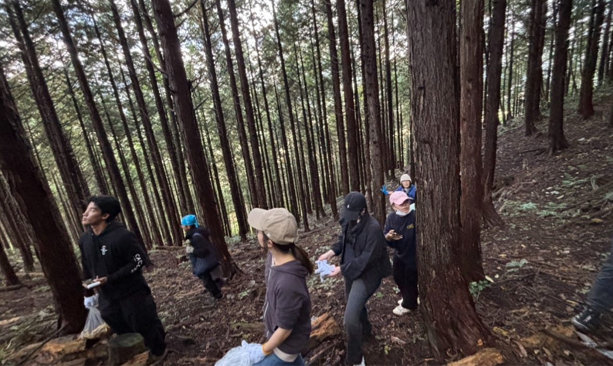

きのこ狩りを通して、山の奥深くには普段見られないようなきのこが沢山生息していることを理解するとともに、帰ってきてからは、自分たちで採ってきたきのこのうどんを食べ、美味しさも達成感も感じる特別なお昼ご飯になりました。

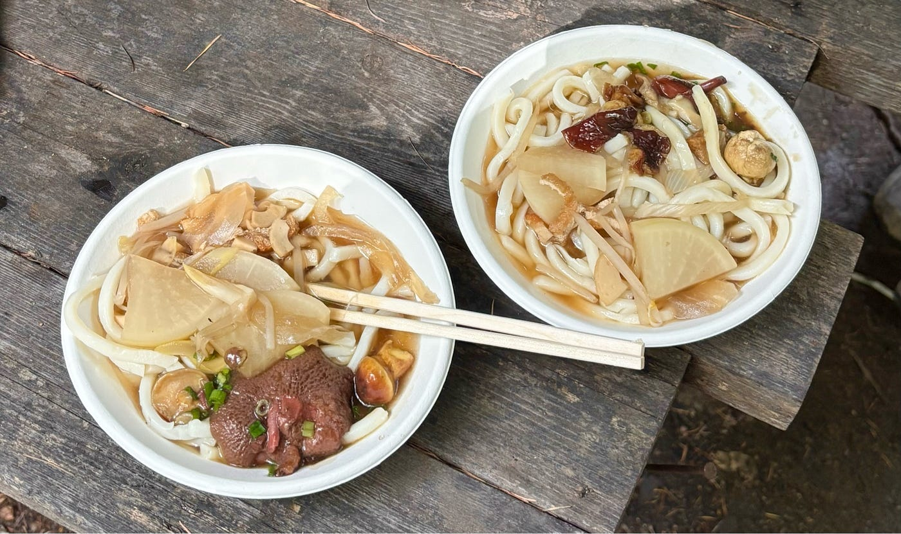

### 感想

ツリーハウス合宿全体を通して、自然の中で生きる楽しさ・大変さを理解しながら、充実した一泊2日のキャンプをすることができました。

整地や焚き火、テント貼りにイノシシの調理、水汲みやきのこ狩り、自給自足な食事づくりなど、どれもが私にとって初めての経験で、素晴らしい経験になりました。貴重な経験をさせてくださりありがとうございました！

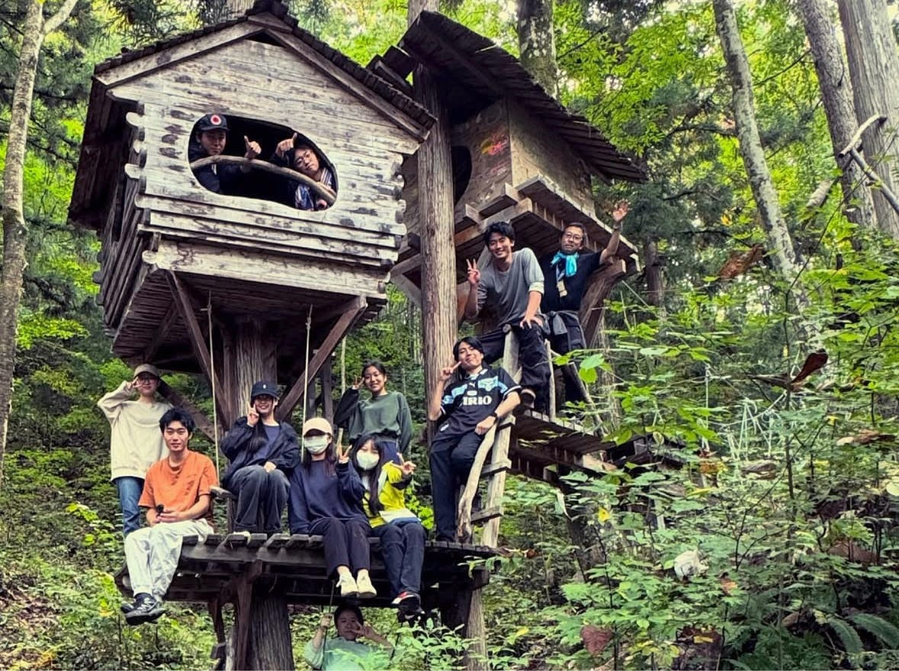

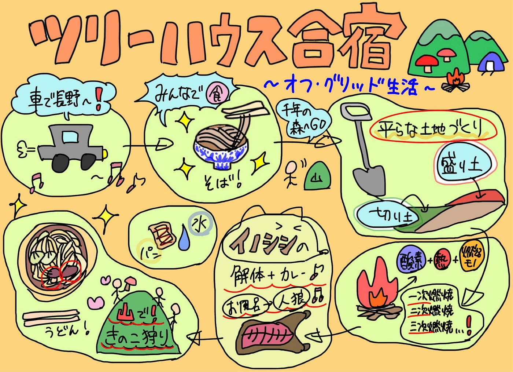
