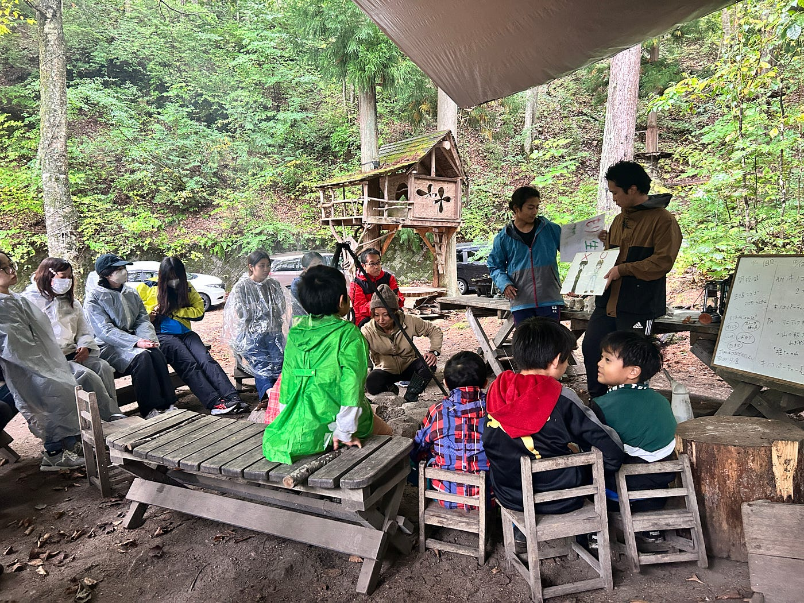
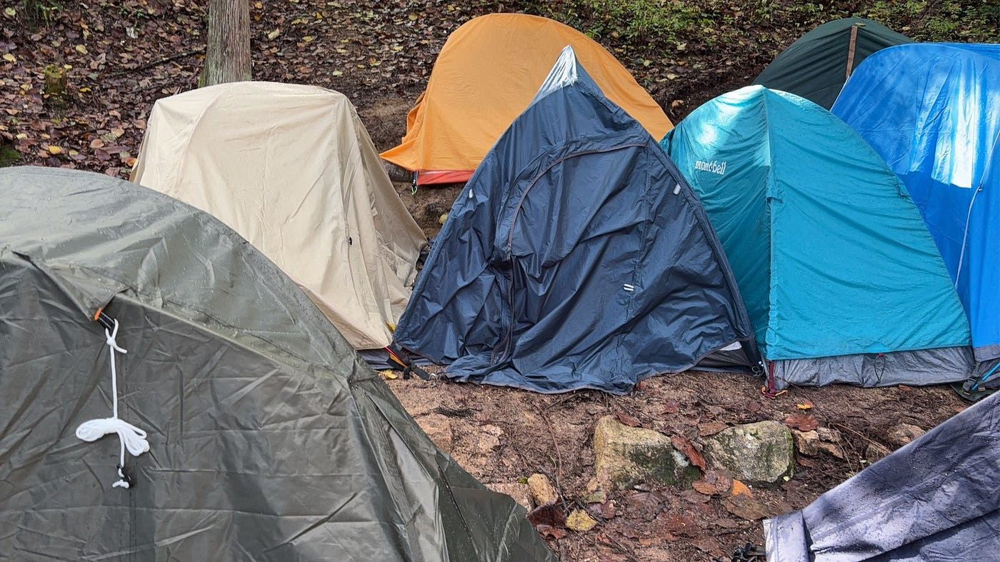
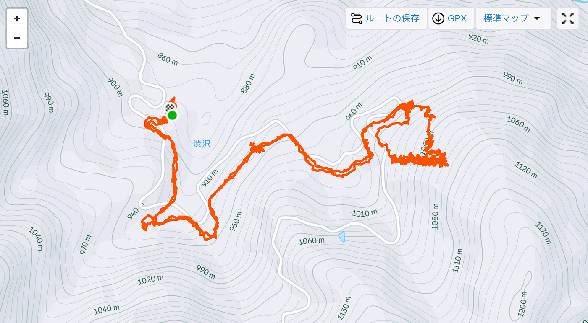
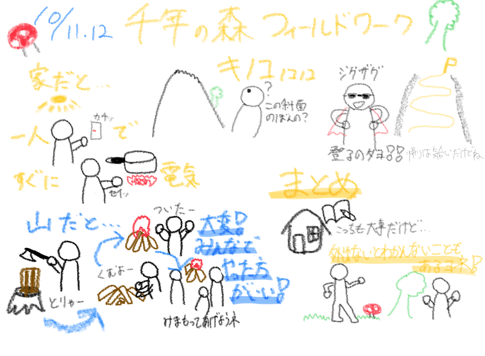

### 初めての共同作業？！

コンニチワ！秋ですねー寒いねー。

今回は、10/11,12に長野県大町市にある「千年の森自然学校」に訪れた際に感じたことをまとめようと思います。

> _**自然の中での共同生活_**

電気・水道・ガスといった、日常で当たり前に使用しているライフラインが最低限といった環境で生活しました。現地に到着してみると、子どもから大人まで、青学チームも含めると約30名ほどいたのかなと思います。

普段であれば、スイッチを押せば暖を取れる・料理に取り掛かることができる。しかし、ここでは火を付けなければ何も始まらない。しかも、一人で薪を割って火をつけて料理をして、、、というのは時間がかかるし難しい。

そんな中で、千年の森では当たり前に共同生活が行われているなと感じました。「不便ならその分自分たちで動いて何とかしようぜ」という空気が伝わってきました。

> _**雨の中の整地とテント張り_**

キャンプ場のような場所を想像して行った私が甘かったです。あまりにも斜面でした。木の根であったり、大きな岩の位置を考えながら整地をしました。なんとか12人分テントを張り切ることはできましたが、快適さや安全性を求めると、まだまだかなという感想です。来年参加することになったら、「快適性」をテーマに頑張らせようと思います後輩に。

整地、テント張りどちらも雨の中行いました。ほぼ毎年キャンプには出かけるのですが、あれほどがっつり雨が降る中でのキャンプは初めてでした。雨の中でテント張りってなかなかにしんどいなーと思いましたが、誰も不機嫌にならずにいたのって素晴らしいなーと思いました古橋研。なんかもう何でも耐えられそうだね。

> _**キノコノコノコ_**

2日目はキノコ狩りにチャレンジしました。キノコ狩りという何とも秋らしい響きの行楽に参加することができて良い経験になりました。

メインのキノコスポットまでは、斜面を登っていきました。どーやって上るんだこれーと思っていたら、ジグザグに登り始めたので、「あ、車で山越えるときも道がジグザグになってるよなー」なんて考えたりしました。確かに、一直線で登るよりはるかに上りやすかったです。

メインのキノコ狩りに関しては、新しくて綺麗な個体を見つけるのが意外と難しく、個人成果は僅かでした。また、針葉樹の区間はキノコないなーなんて思っていたら、樹木の持つ殺菌作用が関係しているらしく、おもしろいなと思いました。

斜面を登っている時、帰りどうすんねんと思っていましたが、ジグザグ作戦で安心していました。しかしなぜか下りはほぼ一直線で、「あ、帰りは捨て身なのね」と言いたかったけど気まずくて言えなかったです。

> _**最後に_**

1泊2日という短い中でしたが、自然のど真ん中での生活からは学ぶことが多かったです。特に、道具を多く扱う自然の中での共同生活の基本として、「安全」を第一に考えることを学ばせていただきました。普段使う機会の少ない斧やスコップの取り扱いなど、知識だけではなく体験として扱い方を学ぶことができました。この2日間で改めて”フィールドワーク”の大切さを実感しました。

[Stravaログ](https://www.strava.com/activities/16112043020)

