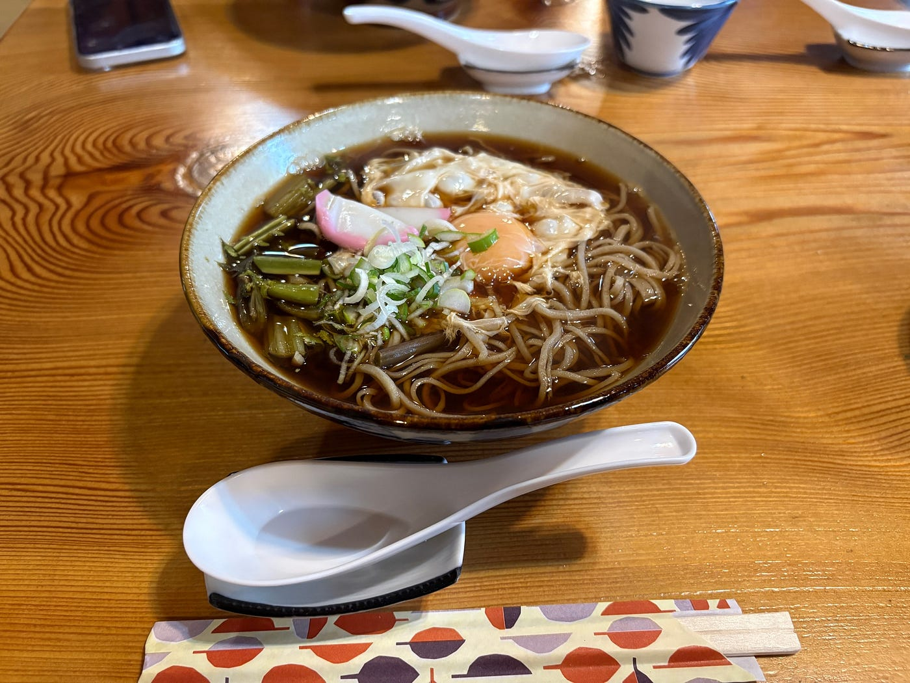
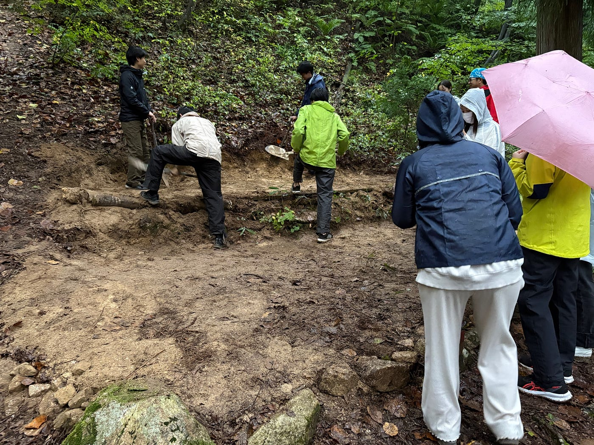
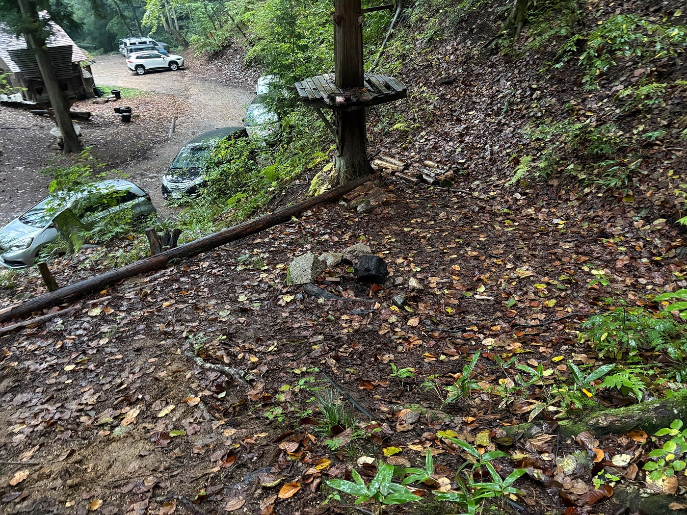
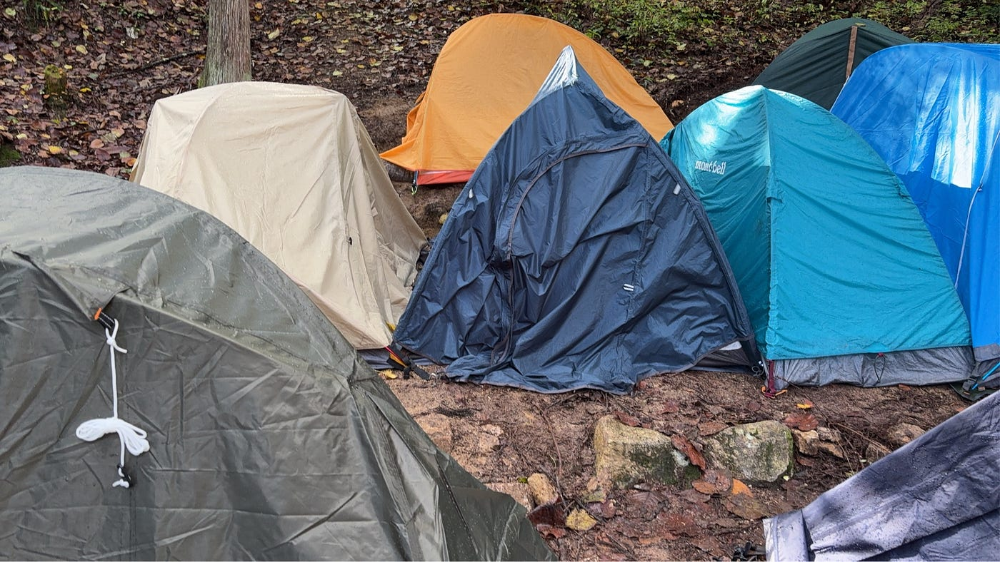
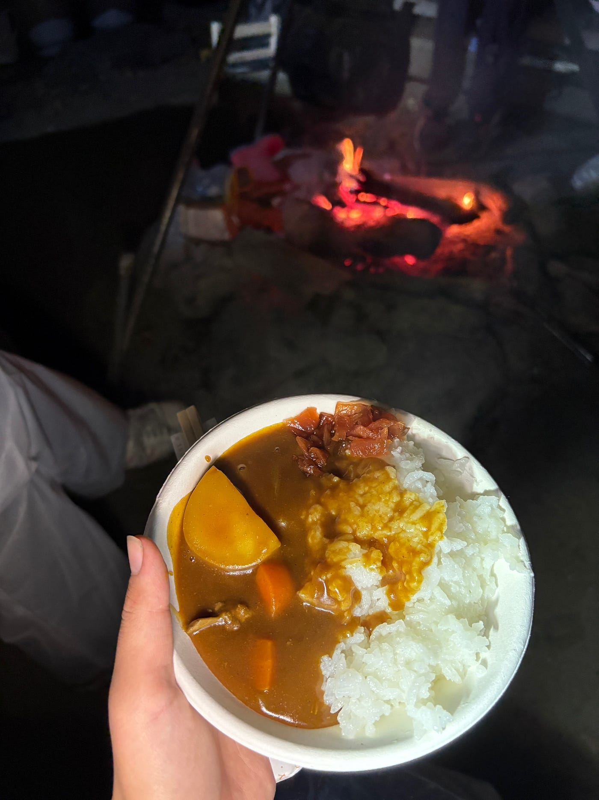
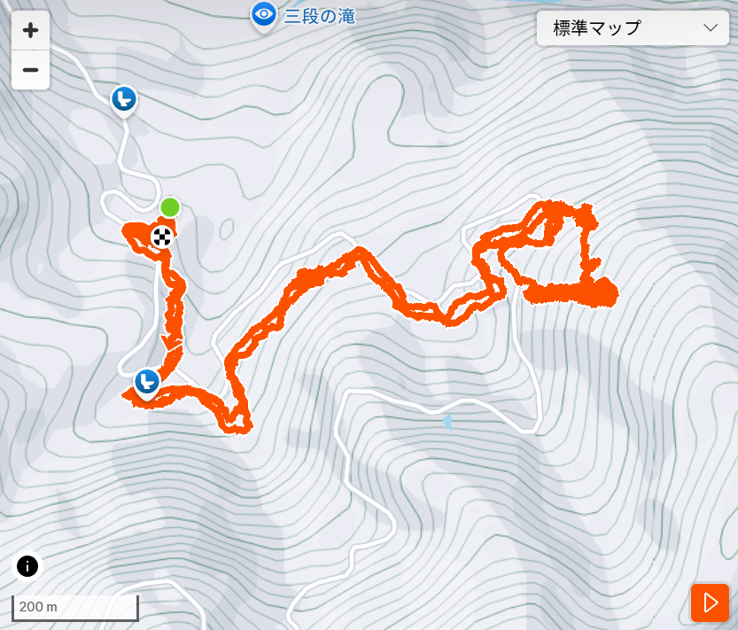
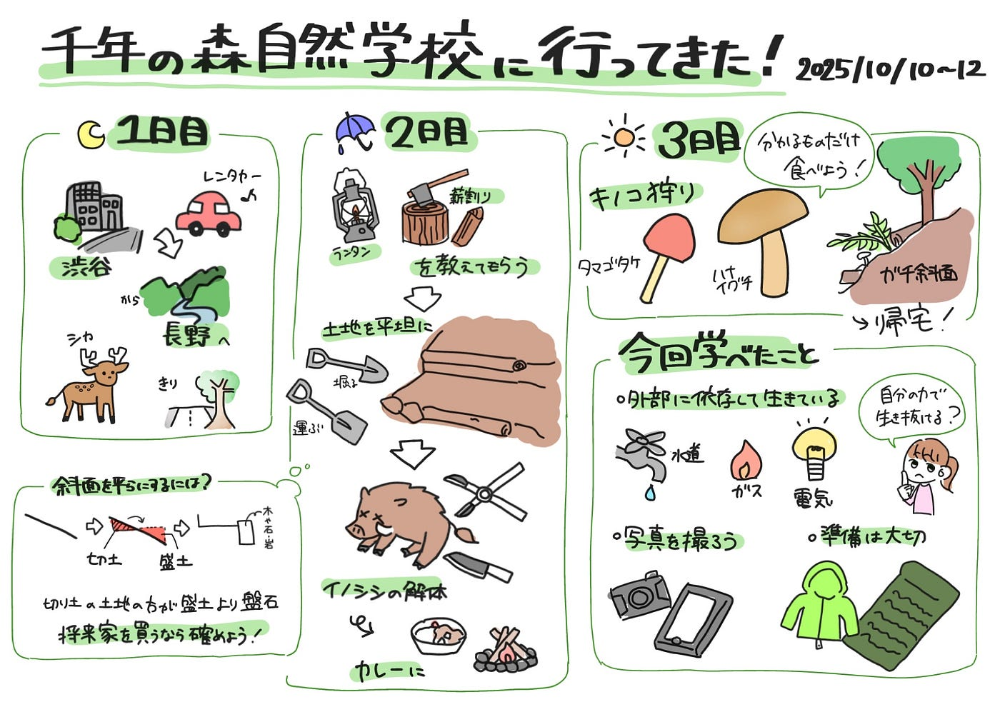

### 大自然の中で自給自足生活⁉ 千年の森自然学校での合宿に行ってきました！

こんにちは、臼井です。

今回は10月10～12日で行ってきた、長野県大町市に位置する千年の森自然学校でのゼミ合宿について書いていきます。

例年だとGWに行っているようですが、今年は古橋先生がミラノに留学に行っていたので後期に行うことになりました。気温的にはGWに行くのとさほど変わりませんが、今回は季節が秋という事でキノコ狩りが日程に含まれていました。

それでは３日間の出来事を紹介していきます！

#### 1日目 10/10(金)

1日目は夜遅くに渋谷のレンタカー店に集合し、長野県に向かいました。

渋谷に着いた時点で荷物の重さからヘトヘトでしたが、私たちの旅はここからです！

真っ暗な道を運転して長野県に向かいます。私たちは高速道路は使わず下道を利用しました。

山道では鹿を見かけたり、霧が出ていたり、都会ではなかなか体験できない経験が出来ました。私は運転していないですが、運転手はさぞ大変だっただろうと思います……(運転本当にありがとうございました)

#### 2日目 10/11(土)

わっぱら屋という蕎麦屋さんで11時に集合予定だったのでここで先生と合流しました。

蕎麦屋さんでは月見そばを食べました。山菜もおいしく、夜の間に凍えた体が温まりました。

腹ごしらえをしたら、いよいよ千年の森自然学校に向かいました。

到着したらまず説明を聞いて、森での過ごし方を教わりました。「森にあるものを利用するのは自由、必要なものは自分で調達するか、お金で解決することになる。」と言われ、森では何かに依存して生きていくことができないんだなと思わされました。

その後は今回一緒に過ごすことになる人と顔合わせをし、森での注意点、ランタンの使い方や薪割りのやり方を教えてもらいました。どれも初めての体験で、完璧にはできませんでしたが楽しかったです。

基本を教えてもらったら、学生たちで今夜寝る場所を作るために地面を平らにする作業を行いました。

歴代の古橋研究室の生徒が同じ作業を行い平坦な場所もありましたが、面積がまだまだ足りないため、拡大する作業をしました。

斜面の上の方を削り、斜面の下の方に出てきた土を移動させ固めることで斜面を平らにでき、最終形は段々畑のようになります。端には木や石を並べることで土が崩れるのを防ぎました。

この日は雨が降っていたので地面が濡れていて作業が大変でした。行く予定のある人は汚れてもいい靴・ズボン、レインコートを着るのがおススメです。

作業が終わった後にはただの斜面だった場所が、寝れるくらいの平坦な場所に変わっていて感動しました。

テントを建てると満員気味でしたが何とか今日寝る場所を確保することができました！

作業が終わったときには暗くなり始めていたので教わったやり方でランタンを点け、2日前くらいに狩ったイノシシの解体を見に行きました。もう血抜きが終わっていたのでグロテスクな感じはしませんでしたが野性味のあふれる匂いがしました。

その後、解体したイノシシを使ったカレーを食べました。イノシシ肉は癖のある味でしたが焚火を囲みながら食べるカレーは格別でした。

ご飯を食べたら近くの温泉に行きました。広くてとても気持ちよかったです。体の汚れを落としたらかなり気分が明るくなったので、人間って単純だなと思いました。

拠点に帰った後は皆で焚火を囲みながら人狼をしました。焚火の音を聞いていると落ち着いた気持ちになってリラックスできました。

その後は建てておいたテントの中で眠りにつきました。夜は底冷えする寒さで寝付けるか心配でしたが、下にマットを敷いたり重ね着したりで意外とぐっすり眠れました。

#### 3日目 10/12(日)

朝起きたら既に先に起きた人が焚火をおこしてくれていたので、ホットサンドメーカーにパンとチーズを挟んでカレースープに付けて食べました。先生に一口分けてもらった焼きおにぎりも絶品でした。

全員揃ったところで今回の合宿の一大イベント、キノコ狩りです！

元々想像していたより5倍くらい急な斜面が表れて正直ビビりました。しかし背に腹は代えられないので斜面を登り、尾根を下りながらキノコ狩りを続行！何とかキノコを採り、帰ることができました。

こちらはキノコ狩りの時に記録したStravaのログになります。

[https://strava.app.link/Uz9iq4vrDXb](https://strava.app.link/Uz9iq4vrDXb)

その後は先生から物が燃える原理を教えていただいたり、来年に期待する事などを話し合ったり、合宿の総括を行いました。

そして昼頃に解散し、また長距離の移動をし……東京に戻ってきました。

レンタカーの返却の時間がギリギリでとても焦りました。

#### 今回学べたこと

今回、ツリーハウス合宿に行って自給自足に近い生活をしてみて、分かったことは3つあります。

一つ目は、**私たちは外部に依存して生きている**という事です。

都市で生活していると中々気づきませんが、私たちは水道、電気、ガスなどに始まり、毎日の食事、移動など多くの外部から提供されるサービスに依存しています。

電車が遅延すれば学校に時間通り着けませんし、水道が止まっていればトイレすら自由に利用できません。毎日私たちが快適な生活を送れているのは他の誰かが仕事をこなして支えているからです。

もちろん全員それらが無くなるという事は望んでいません。しかし、災害が起きる場合もあります。特に地震は日本人にとって身近な恐怖です。災害が起こった時、サバイバルな環境に身を置かざるを得ない時、頼れるのは自分の力だけです。

私は今回の合宿を通じて、文明の素晴らしさを再確認し自分の力で生き抜くことの重要性を噛みしめることができました。

二つ目は**事前の準備や想像力は大切**という事です。

雨が降るという情報を持っていて雨具が必要と言われたら傘ではなく動きやすいレインコートを持って行く、寝る時には気温が下がるので防寒対策をしっかりする、といったように事前に対策できることは沢山あります。(私は事前の情報からあまり想像力が働きませんでした……)

物が少ない状況で快適な生活をするには準備が何より物を言います。情報をできる限り集めて対策を考えることが物事を円滑に進めることに繋がると再確認しました。

最後に**写真や動画で記録を取っておいた方がいい**という事です。

私は今回の合宿で本当に写真を撮っていなかったので、記事に載せる写真が無く本当に困りました。(記事内で使った写真がほぼ全てです。)

記事を書く予定が無くても、人間の記憶はあやふやで移ろいゆくものなので**絶対に**写真は残した方がいいです。

普段から写真を撮る習慣がなく、雨や足場の悪さからカメラを取り出しづらかったことから写真を撮っていませんでしたが、次回からは沢山写真を撮ろうと思いました。普段から写真を撮る意識を持とうと思います。

全体を通してハードな合宿ではありましたが、そこから得られた経験は何事にも代えられない物になったと思います。これから合宿に行く人は準備と写真を忘れずに！

#### グラレコ

