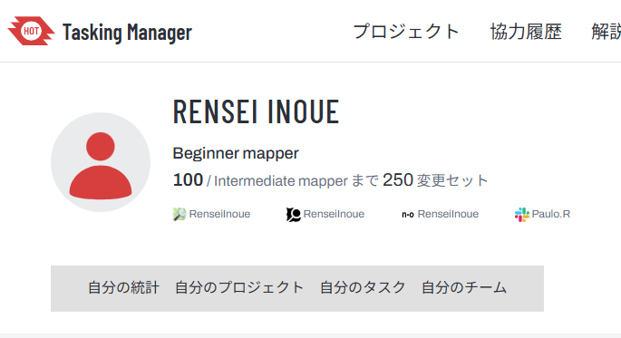
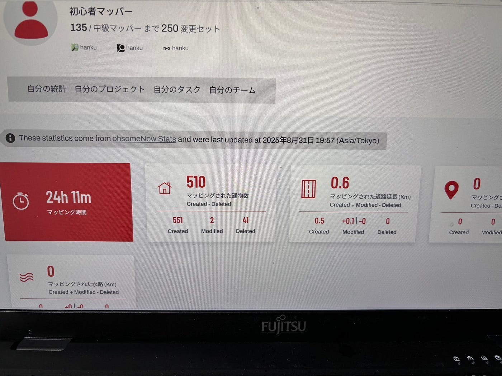
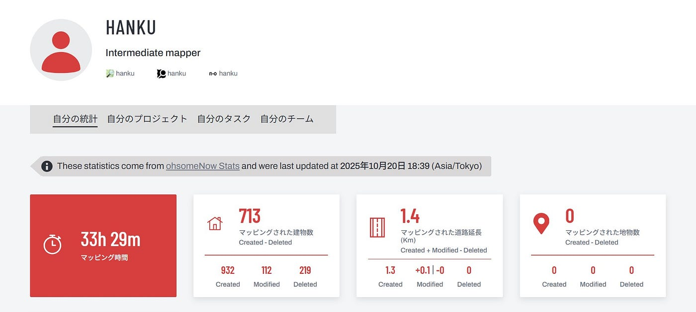
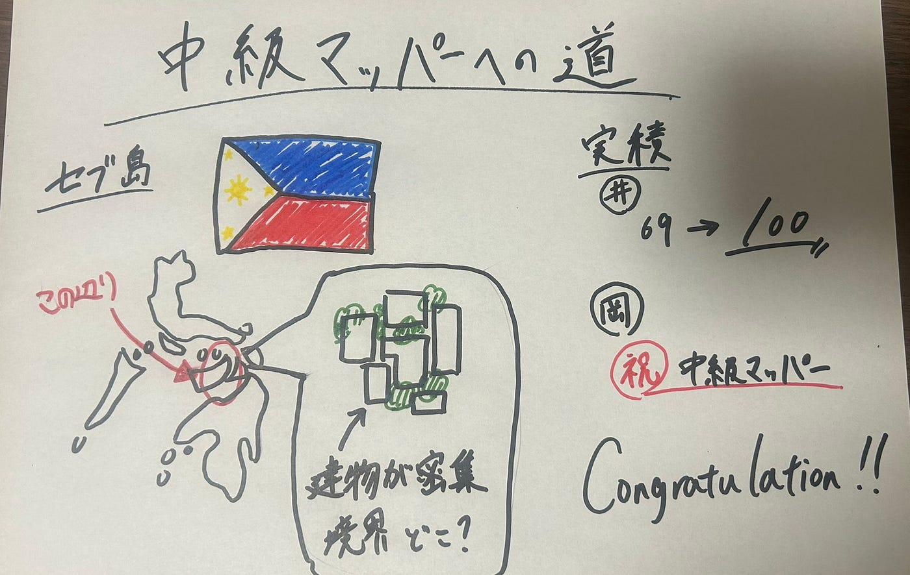

### 【youth①週報】中級マッパーへの道

こんにちは、３年の井上です。

最近は秋も深まってきて散歩シーズンだなとか思っていたのですが、連日の雨でなかなか散歩に行けてなくて残念です。そんなことはさておき、今週のyouthの活動報告です。

今週はyouth①とyouth②の合同活動報告になります。今回、セブ島北部における建物のマッピングを行いました。その中で現在初級マッパーの人たちの活動についてyouth①の週報を通して報告したいと思います。

> _マッピング概要_

プロジェクト名：[Building Mapping/Updating in Northern Cebu](https://tasks.hotosm.org/projects/32511#description)

説明：A magnitude 6.9 earthquake struck off the coast of Bogo City, Cebu, at 9:59 PM local time on 30 September 2025, making it one of the strongest recorded earthquakes in Cebu to date. The epicentre was located near Bogo City in northern Cebu, where intense ground shaking led to the collapse of buildings, destruction of roads, and power outages. Neighbouring municipalities, including Daanbantayan, Medellin, San Remigio, and even parts of Cebu City, were also severely affected.（HOT Tasking Manager

説明（和訳）：2025年9月30日午後9時59分（現地時間）、セブ島ボゴ市沖でマグニチュード6.9の地震が発生し、セブで記録された地震としてはこれまでで最も強い揺れとなった。震源地はセブ島北部のボゴ市付近で、激しい地盤の揺れにより建物の倒壊、道路の破壊、停電が発生した。ダーンバンタヤン、メデリン、サンレミジオ、さらにはセブ市の一部を含む近隣の自治体も深刻な影響を受けた。

この地震はちょうど私たちが参加した[SotM2025](https://2025.stateofthemap.org/)の開催直前だったので印象に残っている地震です。おそらく、古橋研の荒川と山崎は現地で実際に経験してたよね？

先生からの推薦や、フィリピンへの関心も高まったタイミングだったということもあり、今回このマッピングに取り組みました。

> _活動報告_

今回、初級マッパーから中級マッパーへの昇格を目指して取り組んだメンバーの活動として、代表してわたくし井上と岡村の活動を紹介します。

まずは、わたくし井上です。

私の今回の目標は変更セットを25個進めるというものでした。25個と聞くと少なくない？と思う人もいると思いますが今週のキツキツの予定を加味したうえでの目標です。ご容赦ください。

マッピング開始前は69セットという実績でした。そして結果が[こちら](https://tasks.hotosm.org/users/RenseiInoue)です。

結果はついに100セットまで達成しました！目標の25セットもクリアしたので今回は及第点かなと思います。ただ、中級マッパーの250セットまでまだまだあるのでペース上げないとまずそうです…

そして、続いて[岡村](https://tasks.hotosm.org/contributions)の報告です。

・現在の進捗状況
2025/08/31時点 135セット

・今回どのくらい進んだのか
251セット完了し、中級マッパーに昇格。

・今回のマッピングのコメント
11月までに中級マッパーになる目標でやってきたので、昇格できてよかった。
建物の数が多いところは、タスクを分割することで、どこまで建物をマッピングしたか把握しやすくなり、漏れが少なくなるので、そこを意識して取り組んだ。
次は、セブのバリデーションを行っていきたい。

という事で、岡村が初級マッパー卒業となりました！

おめでとうございます。自分も続けるように頑張らないとです。

> _まとめ_

セブのマッピングについては、建物が密集していることが多く、建物と建物の境界の判別に苦労しました。もっと経験値を積んですばやく見分けれるようになる必要があると感じました。

また、今回は初級マッパー卒業者が現れ、刺激をもらうことができる良い機会になりました。自分もこの波に乗って年内の卒業を達成できるように頑張りたいと思います。

最後に今回のグラレコになります。

