### サバイバルシリーズ新作、キノコ狩りのサバイバル

こんにちは、3年の井上です。

このブログのタイトルを考える際に、小学校の時によく読んでいた”サバイバルシリーズ”の本のことを思い出してなつかしさに浸っています。個人的に覚えているのは”人体のサバイバル”というものです。もし興味があったら是非どうぞ。（案件ではありません）

さて、今回は先日参加した古橋研名物ツリーハウス合宿の参加報告をしたいと思います。

> _概要_

場所：[千年の森自然学校](https://kanko-omachi.gr.jp/spot/deepforest/)（長野県、大町市）

日時：2025年10月11日～12日

スタッフの方たちにもサポートしていただきながら、自給自足の生活を体験しました。

> _活動内容_

#### **①平坦づくり**

到着して、まずは夜寝るための場所を整えるところから始まりました。

シャベルを使って人力で一から平坦を作っていきました。斜面には大きな石や倒木もあって苦労しましたが、みんなの協力もあって9人が寝れるだけのスペースを確保することに成功しました！

この平坦づくりで、”切り土”と”盛り土”の違いと、平坦の重要性について理解を深めることができました。また、シャベルの形による用途の違いについても知ることができました

”切り土”や”盛り土”はなんとなく聞いたことはあったものの、意味もそれぞれの特性も知らなかったので良い学びになりました。また、私たちが普段生活できている平坦は様々な人の努力によって成り立っているものと気づけました。

#### ②火の扱いとご飯🍚

火の扱いとしては、アルコールランプと焚火から学ぶことができました。

アルコールランプは初めて触ったのですが、想像よりも簡単に明かりをつけれて驚きました。その様子がこちらです。

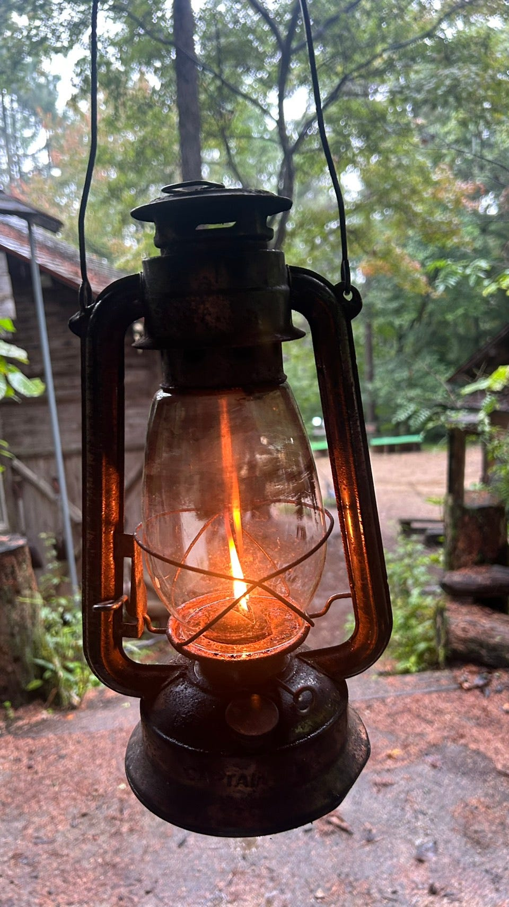

また、焚火に関しては薪割りまでレクチャーしていただきました。燃焼の条件である熱、酸素、燃えるものの三つを意識して焚火を行いました。

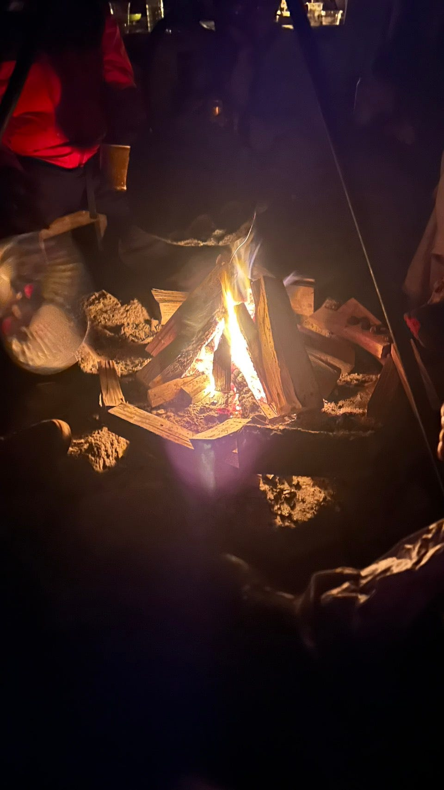

また、夜ご飯は解体したイノシシを使ったカレーでした。イノシシの解体をするのは初めてでしたが筋膜が多くてびっくりしました。そして何よりも獣臭がすごかった！貴重な経験ができました。

※閲覧注意

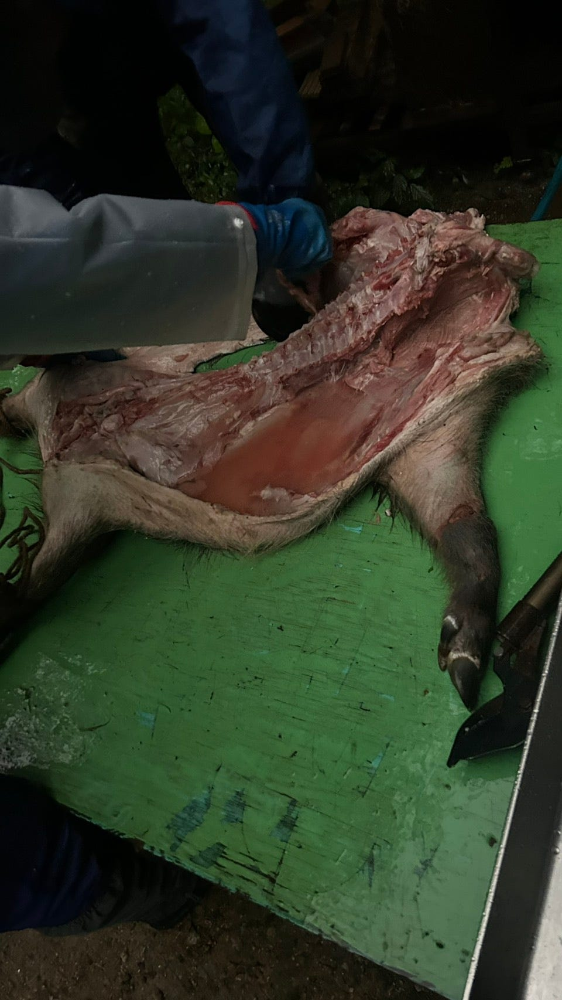

#### ③キノコ狩り

2日目にはキノコ狩りを行いました。

険しい山を登って、キノコを探しました。個人的には一番楽しい活動でした。斜面を登ってキノコが生えているところまで行ったんですがその斜面がかなり険しくて疲れました。また、キノコが枯れ葉と同化してなかなか見つけられず苦労しました。

面白かったのはキノコに関する針葉樹と広葉樹の影響で、針葉樹は抗菌作用があるから針葉樹の森にはあまりキノコが生えないというものでした。確かに、人工林（針葉樹）から自然林（広葉樹メイン）になった瞬間にキノコがいっぱい生えてて驚きました。

[こちら](https://strava.app.link/LrdjlMwoDXb)が苦労のキノコ狩りの際の移動記録です。

そんな苦労を乗り越えて食べたキノコはサイコーでした！

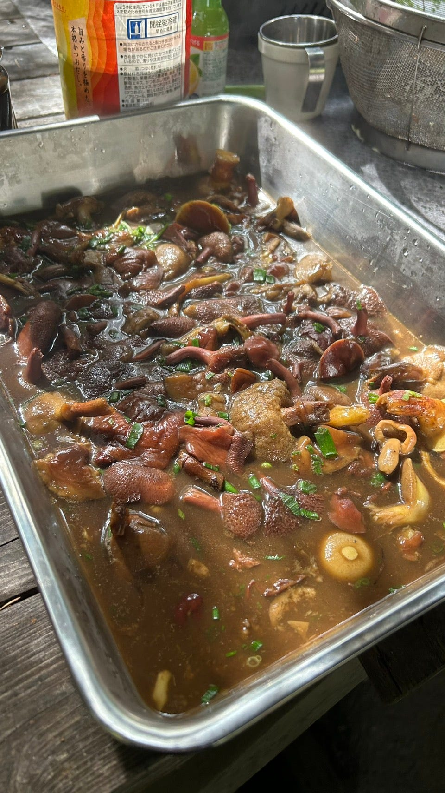

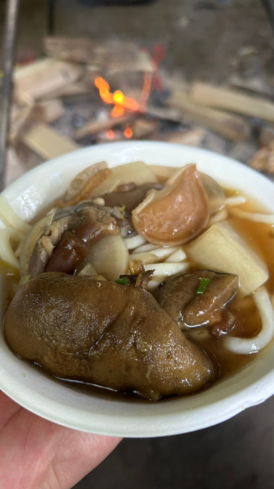

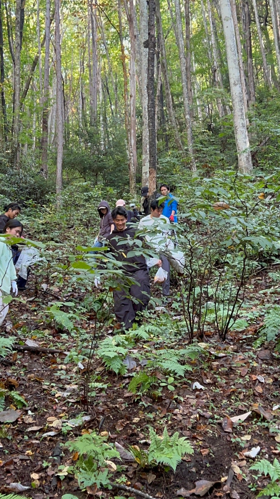

> _まとめ_

今回の合宿を通して特に3つのことを強く感じました。

1つは**「身の回りインフラへの感謝」**です。電気、水道はもちろんですが、道路や土地が平坦にきれいに整備されていることは決して当たり前でなく、多くの人の努力の上に成り立つものだと実感できました。現代文明のありがたみに気づくと同時に、自分自身で生きる力も身に付けていく必要があるなと考えました。

2つ目が**「記録を残すことの大切さ」**です。このブログを書いているときも感じたのですが、写真が少ない！やはり人の記憶というものは時間の経過とともに曖昧になっていくものです。得た学びを将来に正確に引き継いでいくためにも写真などの記録をこまめに残すという習慣をつけていく必要があると感じました。

学びも思い出もたくさんの合宿が経験出来てよかったです。改めて、古橋先生やスタッフの方たちに感謝したいと思います。

来年もぜひ参加したいです。

最後にグラレコです。

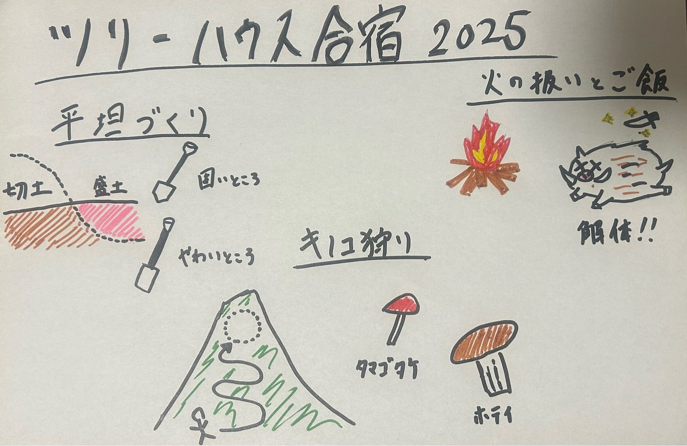

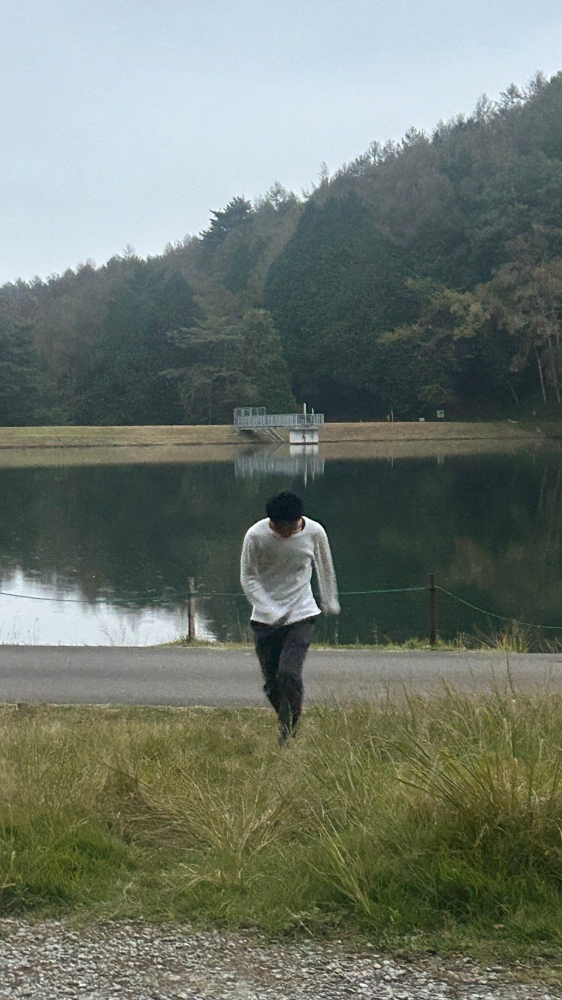

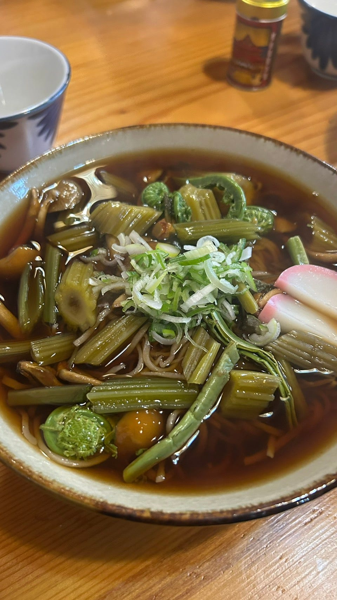

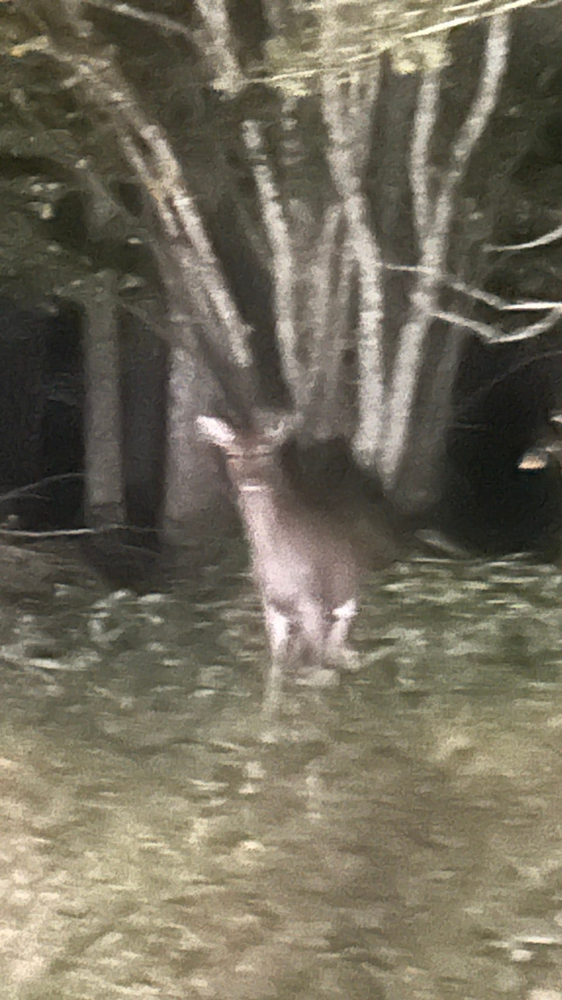

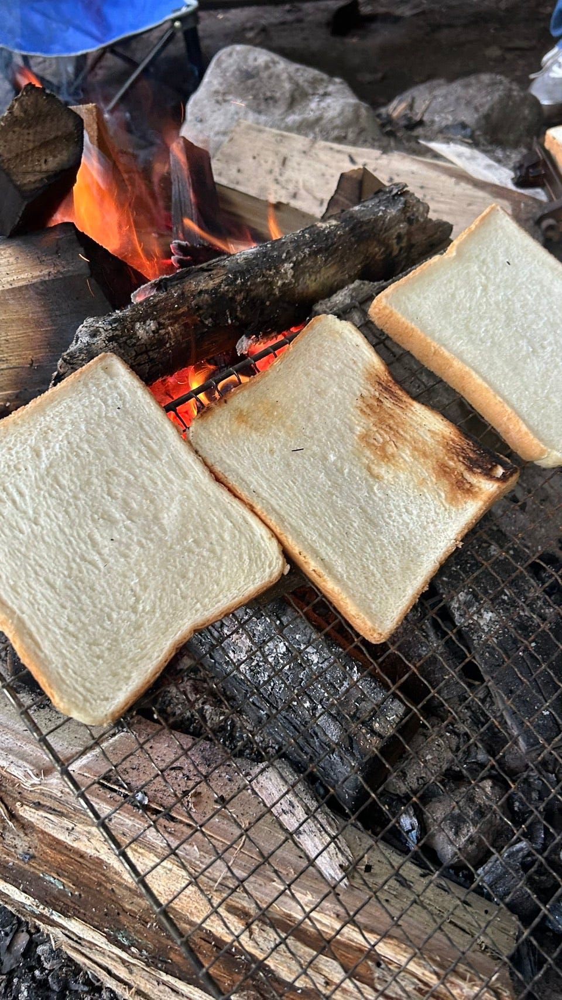

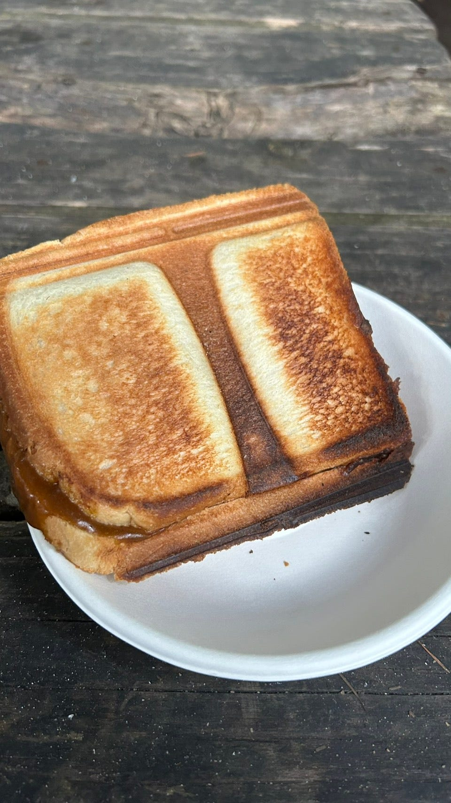
