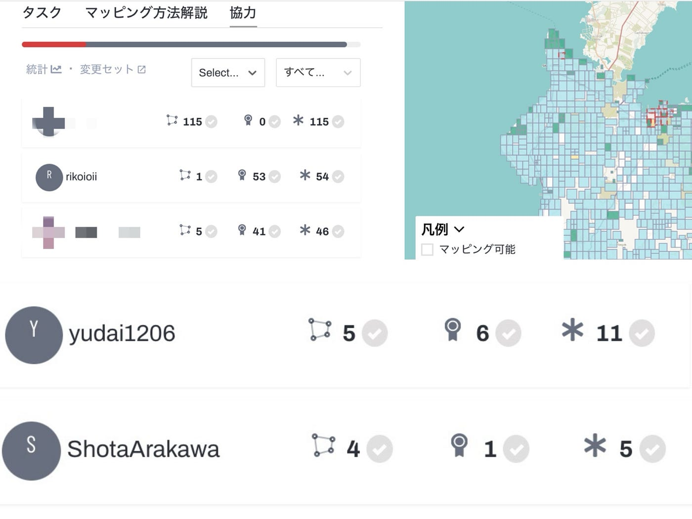
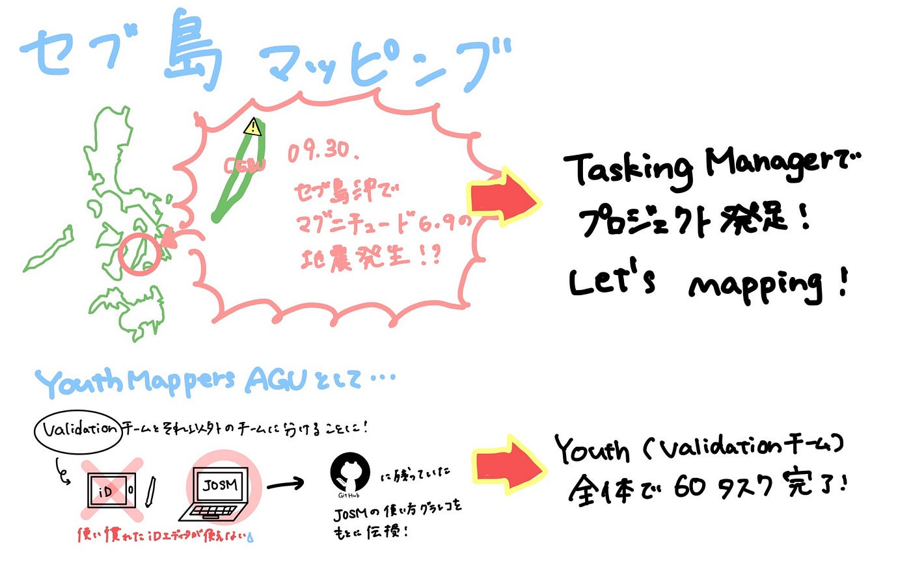

## セブ島建物マッピングValidationで貢献！

こんにちは。4年の末木です。気づかないうちに後期も始まって１ヶ月も経ってました…卒業まで間もないです…

そんな話は置いといて、今週のYouth②はセブ島の建物マッピングの検証作業に重きを置いて活動を行いました。

そもそもYouthMappers AGU全体の中でも中級マッパー以上の人がまだ半数もいなかったため、今週はYouth全体をValidationできる人とできない人に分けて活動を行いました。

### セブ島建物マッピングについて

以下のプロジェクトを取り組みました。

[https://tasks.hotosm.org/projects/32511](https://tasks.hotosm.org/projects/32511)

先週の週報でも説明あった通り、9月30日にフィリピンのセブ島近海で発生したマグニチュード6.9の地震に対するクライシスマッピングのプロジェクトが立ち上がったため、そちらにYouthMappers AGU全体として勢力を上げて取り組みました。

### JOSMとの戦い

Youthのうち中級マッパー以上のメンバー（末木、荒川、加藤、金澤）はValidationに重きを置いてとりくみました。

その中で生じたのがJOSMとの戦いです（？）今回のValidation作業はiDエディタの使用ができず、JOSMのみの対応だったため、JOSMインストール方法を教えるところから始まりました。私は昨年のゼミでJOSMを使用したマッピング経験があったのですが、3年生は初の取り組みだったので普段使用していたiDエディタと使い勝手が違い、少し躓く場面もあったみたいです。

昨年6月のハッカソンでインストールや操作方法まとめたグラレコが残っていたのでそちらを共有して、教えるためのまとまった時間が取れなかった中でもなんとか乗り越えてくれました。

参考にしたグラレコは以下から参照できます。

【インストールについて】

[GitHub - furuhashilab/V-F_UN-Validation: JSOMグラレコ作成
JSOMグラレコ作成. Contribute to furuhashilab/V-F_UN-Validation development by creating an account on GitHub.github.com](https://github.com/furuhashilab/V-F_UN-Validation)

【操作方法について】

[GitHub - furuhashilab/Drone_UN-Validation
Contribute to furuhashilab/Drone_UN-Validation development by creating an account on GitHub.github.com](https://github.com/furuhashilab/Drone_UN-Validation)

### 成果について

成果は以下の通りです。経験者としての意地で頑張りました…！10月21日午前9時時点では、私は全体で1番Validationに貢献できました！（タスク数は負けてます💦）YouthのValidationチーム全体としても60タスクに貢献できました。これからもっとスピードを上げて貢献していきたいと思います。

以下がグラレコです。

