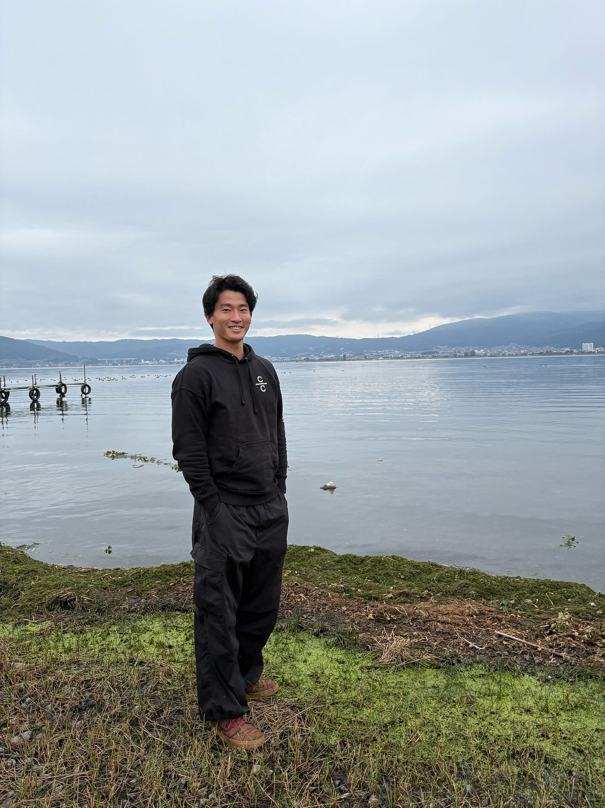
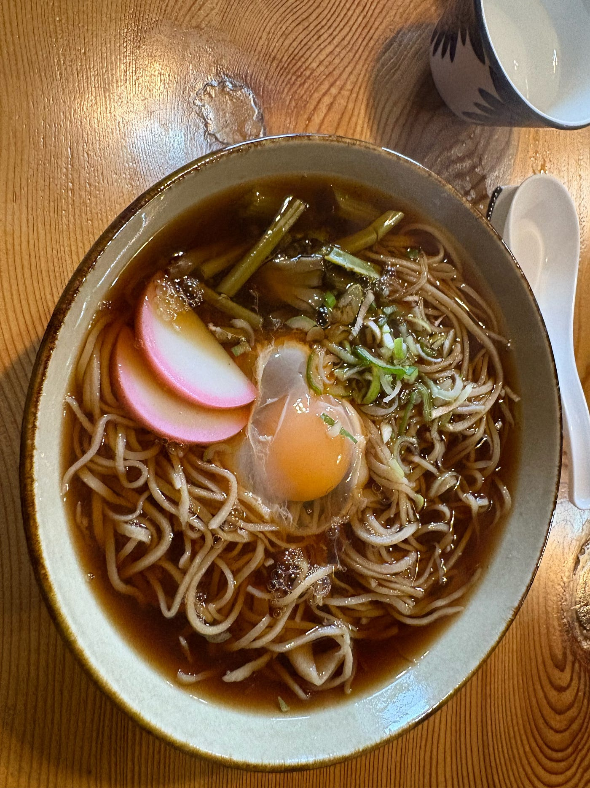
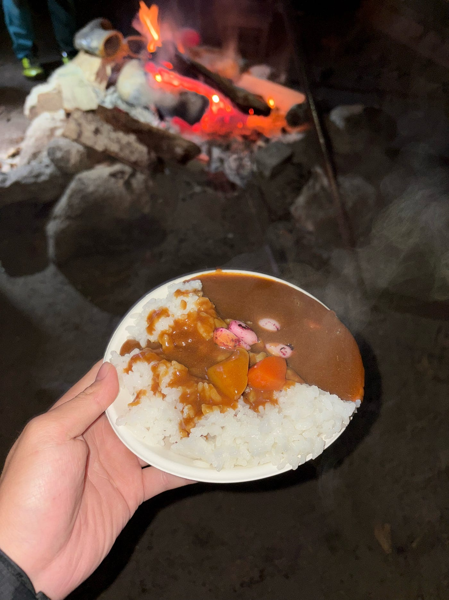
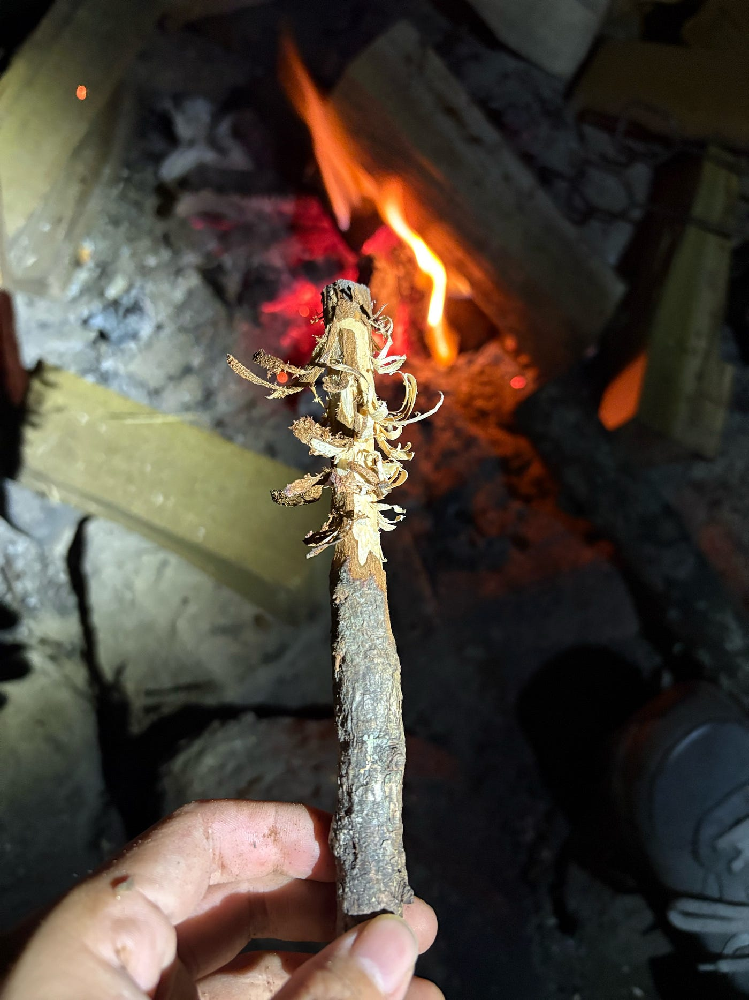
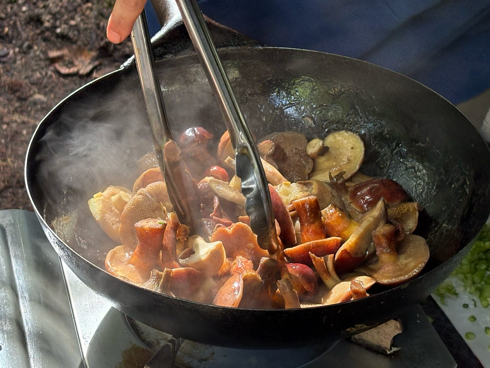
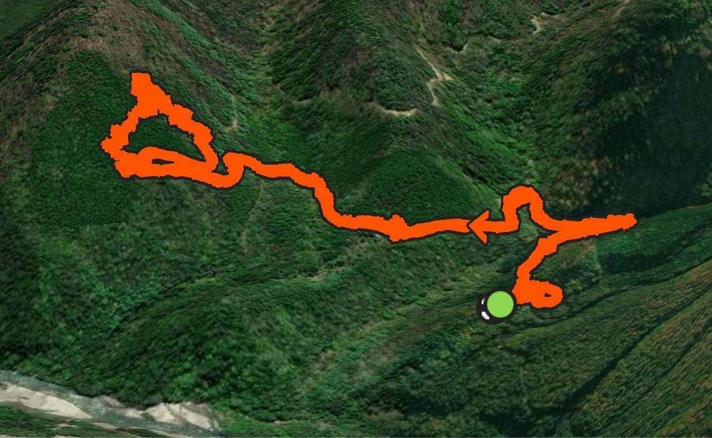
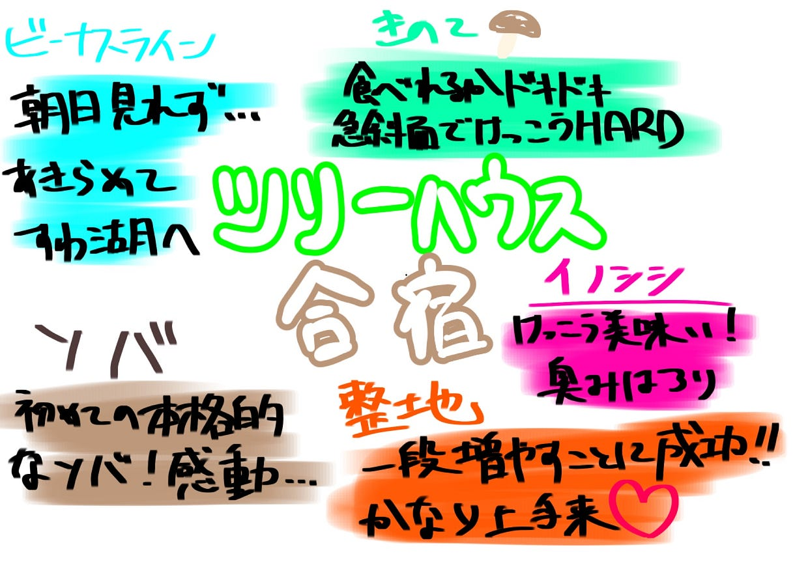

## ツリーハウス合宿

こんにちは本吉です。ツリーハウス合宿に行ったのでその報告です。

### ビーナスライン

現地に向かう途中でビーナスラインを通りました。有料のトイレがありましたが無料になっていてラッキーでした。朝日を見ようと思いましたが、朝霧が濃く諦め諏訪湖に降りました。

### 到着

現地に到着し、先生オススメの蕎麦を食べました。普段食べる蕎麦とは根本的に違い、これが上手い蕎麦かと思い知らされました。

### サバイバル

まずはテントを建てるための土地を平地にしなくてはなりません。僕たちが到着した地点よりもう一段平地を増やすことに成功しました。正直、作っている時は無理だと思っていましたが、思っていたよりずっと綺麗に完成してマンパワーの凄さを感じました。

雨の中テントを建てるのは至難の業です。僕は雨の日はキャンプに行かないため、レアな体験でした。今回は、いかに早くテントを建てることができるかというのが雨に打たれないためのポイントだったと感じました。

晩飯にはみんなで猪を解体して食べました。猪肉は臭みこそあるものの、旨みがありとても美味しかったです。

### 暇つぶし

他の人がお風呂に入っている間に焚き火を見ていました。焚き火を囲みながら自分はフェザースティック作りに挑戦しましたが、惨敗、、

### きのこ狩り

2日目にはきのこ狩りをしました。急斜面を歩きながらキノコを取るということは初めての経験でとてもワクワクしました。食べれるキノコと食べられないきのこの判別がつかず、食べる時は少しヒヤヒヤしていました。

### Strava

[https://strava.app.link/N0yH1ZEsDXb](https://strava.app.link/N0yH1ZEsDXb)

### グラレコ

