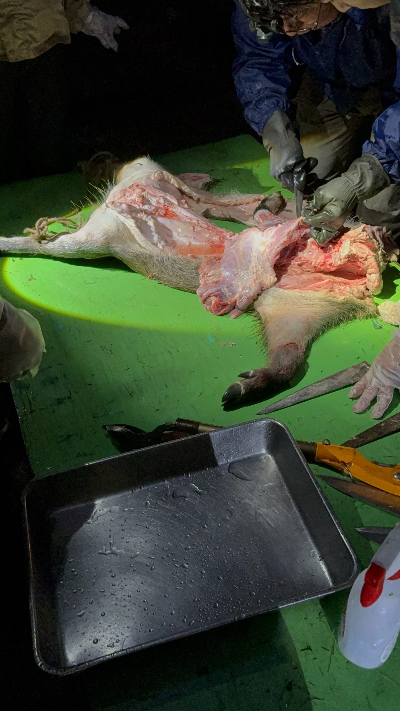
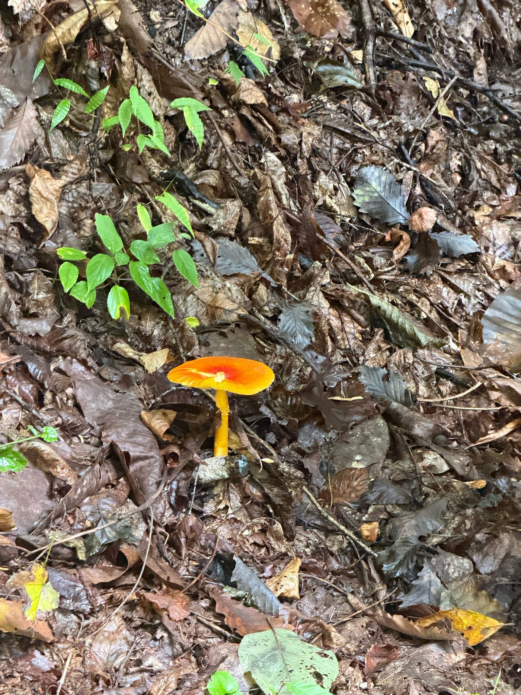
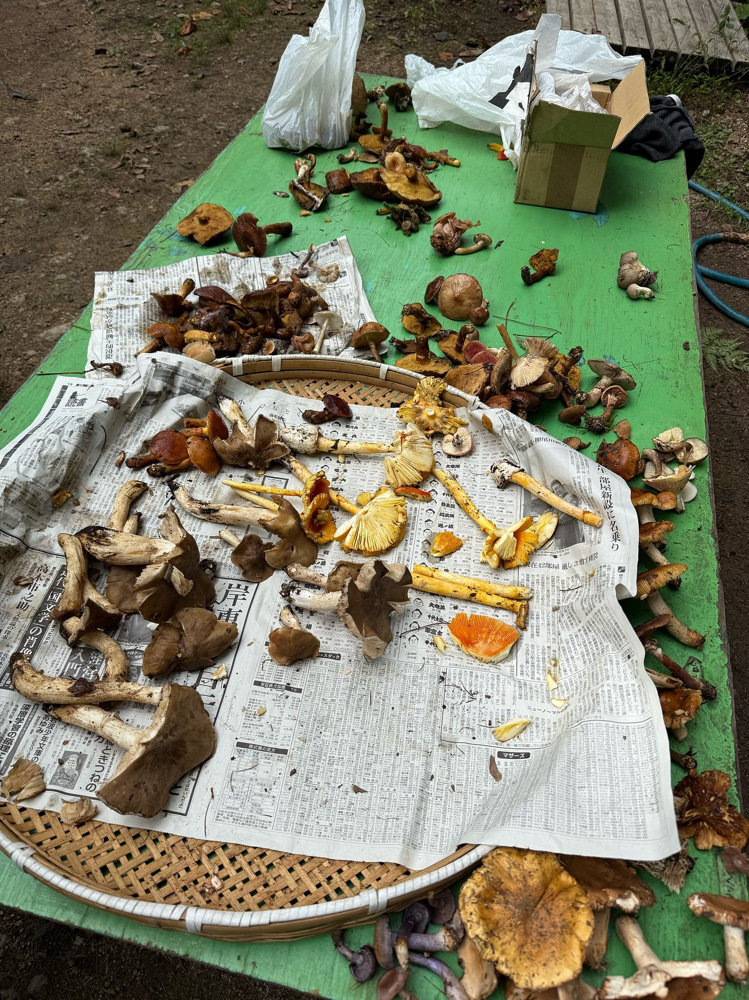
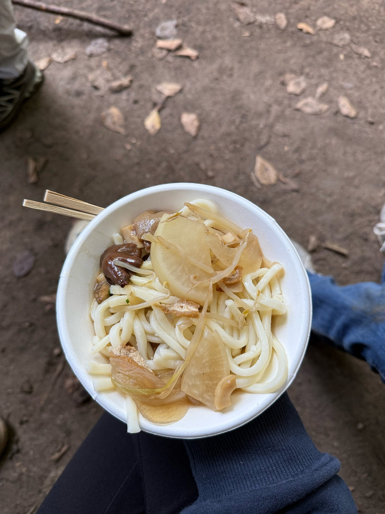

## ツリーハウス合宿に参加しました！

こんにちは。3年の小崎です。

10/11~10/12の間、長野県大町市にある千年の森自然学校という場所でツリーハウス合宿を行いました！

#### **雨の中整地！？**

まず、私たちはこの1泊をそれぞれのテントですごしたのですが、予報の通り日中はずっと雨☔️でした😭 3年のゼミ生約10名がテントを張れる場所を確保するため、山の斜面の整地を行いました。

最初は斜めに傾いた地面にスコップを入れて、石をどけ、足で踏み固めながら少しずつ平らをつくりました。

上側を削って（切土）、下側にその土を盛る（盛土）ことで、自然の傾斜をうまくならしていくことが大切です。

•	切土（きりど）：高い部分を削って平らにする方法。もとの地盤が硬く、安定しやすい。

•	盛土（もりど）：低い部分に土を盛って高さを合わせる方法。時間をかけてしっかり踏み固めないと、あとで沈んだり流れたりする。

力作業だったのでヘトヘトになりましたが、みんなで協力して石をどかしたりどこに何人寝れるかを考えたりするのが楽しかったです。

#### **イノシシ解体**

テントを組み立てて一息ついたあと、夜ご飯の食材として使う予定のイノシシが解体されていたので見に行きました。

まだまだイノシシの原型が止められている状態で、いつもスーパーの売り場で見るような食べ物である肉と生き物として見るイノシシが同じ場所に存在しているのが不思議な気分でした。私は解体には参加せずにずっと見学をしていたのですが、食べる時に口当たりを良くするために筋膜を剥がすのがとても大変そうでした。

#### **キノコ狩り！**

2日目は朝ごはんを食べた後にきのこ狩りをしに行きました。

私が想像していたキノコ狩りは、山をちょっと探索して道端にあるキノコを採る、みたいなイメージだったのですが、実際は約200mと昇り降りが発生するキノコ狩りでした！

何回も転びながら登ったり降りたりしたので、正直キノコまで手が回らなかったです！

キノコ狩りStrava記録

[https://www.strava.com/activities/16112051441](https://www.strava.com/activities/16112051441)

以下とったキノコたちとそれを使ったお昼ご飯です。私はきのこが苦手なのですが、頑張って収穫したきのこだと思ったら美味しく感じました🍄

#### **合宿に参加してみての感想**

情報技術が発達してきている現代だからこそ自分で体験することの大切さを感じました。

百聞は一見にしかずという諺があるように、画面越しの知識や映像では分からないような記録があると気づきました。便利さの中で忘れていた感じる力を取り戻せたような気がします。

手を動かして、汗をかいて、失敗しながら理解する時間は、検索やAIでは代わりがきかない自分だけのデータになると思います！

ぐられこ
