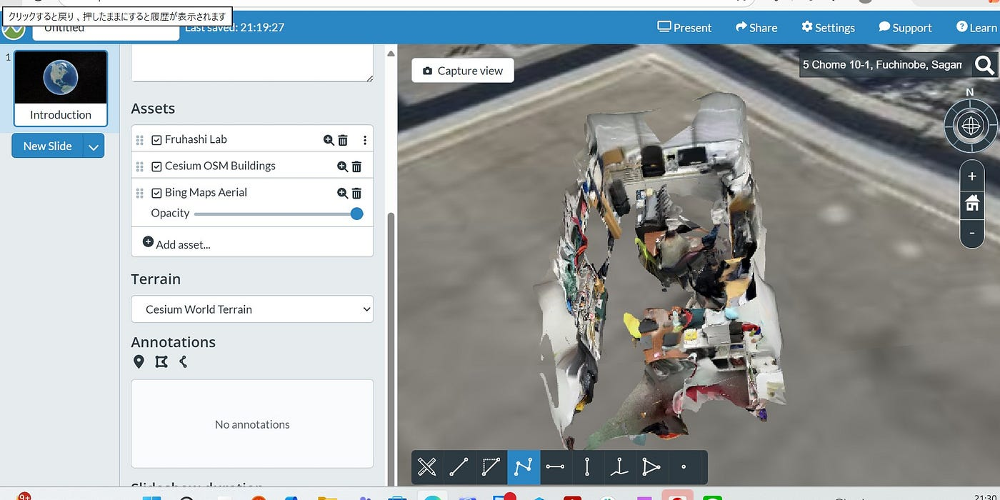
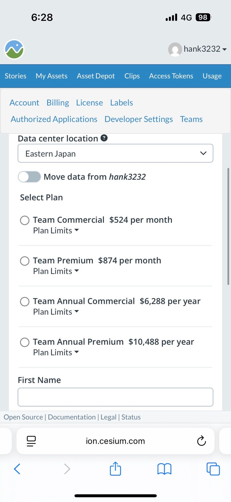
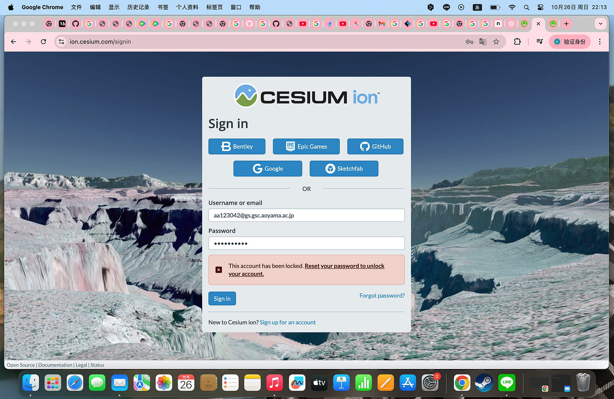
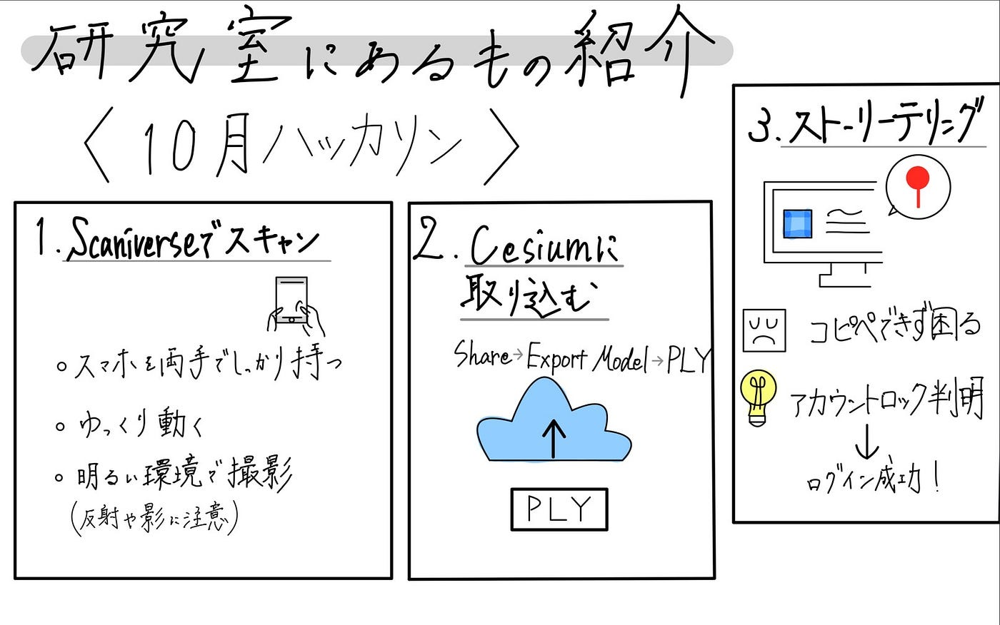

### 研究室にあるもの紹介【10月ハッカソン】

こんにちは、四年の福田です。

10月のハッカソンは、研究室メンバー内の情報共有を目的として。掃除組が掃除した後の研究室にあるものをオンライン組が[Scaniverse](https://forgers.co.jp/column/5803)（⇦特徴がまとめられています）で3Dスキャンし、[Cesium](https://cesium.com/)を使ってストーリテリングするという内容です。

私たちのチーマは、ふうか、ちさととこうなです。

1回目はSplatでスキャン→PLY でエクスポートができていなかったのでやり直ししました。

#### **１.Scaniverseでスキャン**

試行錯誤しながらふうかがScaniverseでスキャンしたものがこちらになります↓

[3D scan by @hank3233
View this 3D model by @hank3233 on Scaniverse.scaniverse.com](https://scaniverse.com/scan/pyiwutum7pgul3sp)

何回か撮り直し、うまく撮れました！

2回目の撮り直しでスキャンしたデータ

[https://drive.google.com/drive/u/0/folders/1UPGTcP-rGybLkBMNxOMV3yr9T1Cpap1v](https://drive.google.com/drive/u/0/folders/1UPGTcP-rGybLkBMNxOMV3yr9T1Cpap1v)

**スキャンする際のコツ**

1. 両手でしっかりスマホを持つ

スキャンをするとき、手がブレるとテクスチャや3Dモデル自体に悪影響を与えるので、手ブレを減少させるためにスマホは両手でしっかりと持つことが大切です。

２.スキャン中はゆっくり動く

普段歩いている速度の3分の2～半分程度を意識しながら、早くならないように、ブレないようにゆっくり撮ることが重要です。

3.明るい環境で撮影する

自然光や均一な照明がある場所でスキャンすると、テクスチャが綺麗に出ます。 暗い場所や強い影があると、スキャンしたデータが乱れやすいです。（反射する材料がある時もうまくスキャンできなくなるので、避ける、布で覆う）

他のコツにも気づけるようにScaniverseを使用する際には気になったことをまとめるようにすることを大切にします。

#### 2.ScaniverseのデータをCesium に

ScaniverseでスキャンしたデータをPLY 形式で出力

Share⇨Export Model⇨PLY

出力したPLY ファイルを Cesium ion のアカウントにアップロードしました。

地理参照させないとなので〒252–5258神奈川県相模原市中央区淵野辺5丁目10–1 を入力してそのデータを表示させる。

ストーリテリングを手分けしようと思ったが共同で編集することは不可能！

このようにお金がかかるので、こうなとちさとが研究室に置かれているものを何か写真と紹介をまとめふうかに送り、その内容をストーリテリングに起こす形で作業分担しました。

#### 3.ストーリテリング制作

**事件が起きる**

最初は置いてあるものが何か、機種であったり、値段、特徴そして実際にどのように使ってきたか、使っていくかについてまとめるようにしました。

その内容をあらかじめまとめ、ストーリテリングを作ってくれたふうかがコピペできるようにしたが、その内容をcesiumにまとめようとしたが、コピペができなく、内容がすぐに消えることがあってうまくいきませんでした。

一日中ふうかは試すことを繰り返し、解決方法を求めたが、上手くいかなく最終的にはログインできない状況に。

その後アカウントがロックされたことが判明し、ログインできない状況になり、このままではダメなので、こうなのパソコンからふうかのアカウントに入って編集できるか試したところ、ログインでき、編集できたました。

**ストーリテリングの過程で難しかったこと**

研究室に何があるか、スキャンしてくれたデータからだけではむずかしいところもあったので、研究室に行って、よく確認できない部分を直接確認するようにしました。ゆかりから掃除後の写真をもらったりも。ありがとう！

**完成したストーリテリング↓**

古い版：

[Cesium Stories
Edit descriptionion.cesium.com](https://ion.cesium.com/stories/viewer/?id=47c06eb0-0348-4c6b-a441-57aef2643a92)

新しい版：

[Cesium Stories
Edit descriptionion.cesium.com](https://ion.cesium.com/stories/viewer/?id=0c24547b-bbbd-418c-ad96-fc816425a788)

#### 感想

今回初めてCesium でストーリーテリング制作をしました。最初は使い方がわからなく、編集した内容が消えたり、共有して編集ができないなど今まで使ってきたGoogle Earthなどに比べたら操作が難しいと感じました。また共有して編集ができない観点から1人の負担が大きくなったり、みんなでその都度補足できなかったり、使ってみて思いました。

しかし、Scaniverseで3Dスキャンした内容をアップロードできることは他のツールと違う体験もできました。

#### やり直ししてみて

Splatでスキャンした内容はCesium にアップすると球体になったり、撮ったものより画質が荒くなってアップロードされたりということがあることに気づきました。部分的にみやすく調整できましたが、全体的に見ると雑に見えます。そしてSplatでスキャンしたデータは比較的重くなるので、編集する際は少し重くなります。

#### グラレコ

