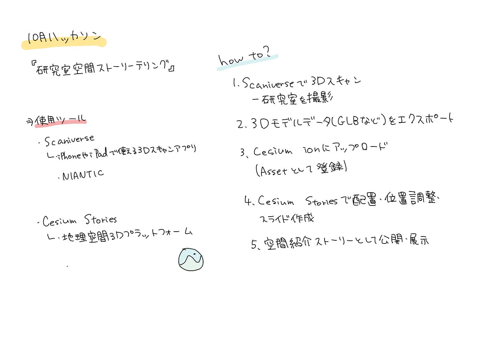

### 研究室空間ストーリーテリング[10月ハッカソン]

こんにちは。季節が進み、秋というより冬のような寒さになってきましたね。皆さまお変わりなくお過ごしでしょうか。4年の林です。

### 目的

研究室内を3Dスキャン([Scaniverse](https://scaniverse.com))で撮影し、Cesium Stories上で、「研究室空間のストーリーテリング」を構築することによって、研究室メンバー内の情報共有すること。

### 実施内容

・Scaniverseで研究室内の主要エリアをスキャン（椅子・机・VRエリア・出入口など）

- [Cesium ion](https://cesium.com/platform/cesium-ion/)にアップロードし、各オブジェクトを配置

- [Cesium Stories](https://cesium.com/platform/cesium-ion/cesium-stories/)上でスライドを作成し、空間の構成意図や魅力を説明

- スライドごとにタイトル・Infobox（説明文）・視点位置を設定

- スライドごとに「魅力①〜④」などとして空間の用途を可視化課題点

### ツール概要まとめ（CesiumとScaniverse）

**[Scaniverse（スキャニバース）](https://scaniverse.com)とは？**

・AndroidとiOSで3Dモデルを作成できるアプリ。

- LiDAR（ライダー）や通常のカメラなどを使って、現実の空間や物体を立体的にスキャンできる。

- スキャンしたデータは、「色付きの3Dモデル（.SPZ/ .glb / .obj / .usdz 形式）」として書き出せる。

- 研究室では、机・椅子・出入口などの空間をスキャンして、実際の部屋をデジタル空間に再現するための素材として使用。

- スキャン結果は、Cesium ionにアップロードしてWeb上で閲覧・共有できる。

**[Cesium（セシウム）](https://cesium.com)とは？**

・オープンソース地理空間3Dプラットフォーム。

- ブラウザ上で地図・地形・建物・3Dモデルなどを表示・操作できる。

- 「Cesium ion」でデータを管理し、「Cesium Stories」でストーリー形式の発表が可能。

- 研究室では、Scaniverseで作成した3Dモデルを読み込み、研究室内の空間紹介・展示ストーリー（GeoExhibition）」として可視化。

- スライド機能を使って、各エリア（交流スペース／iMac作業机／VR体験椅子／出入口など）を写真や説明文付きで紹介することができる。

### 連携の流れ

1. Scaniverseで3Dスキャン（研究室を撮影）

1. 3Dモデルデータ（.SPZ）をエクスポート

1. Cesium ionにアップロード（Assetとして登録）

1. Cesium Storiesで配置・位置調整・スライド作成

1. 空間紹介ストーリーとして公開・展示

### 活用意図

- 現実空間をそのままオンラインで見せる展示手法

- GeoExhibitionなどのイベントで、研究室を“バーチャル体験”として紹介できる

- 写真だけでは伝わらない空間の広がりや距離感を再現できる

### 課題点

1. 位置保存に関する不具合（未解決）

スライド内で「Adjust tileset location → Save → Capture View」を行っても、一度は保存されるが数秒後にモデルの位置が戻ってしまう。さらに、一つのモデル位置を修正すると次のスライドに影響が出る。

→ Cesium Stories側の仕様か、Ion上での再保存（Save as new asset）が必要かを検証中。

2. 制作目的の整理不足

掃除・配置を行った学生の「空間改善」という目的と、 先生の「情報共有・可視化」という目的が一致しているのか明確でない。

→ 次回ミーティングで目的のすり合わせが必要。

3. スライド1の表示制限

研究室全体を俯瞰表示しようとすると、ズームを300程度まで引いた時点でモデルが消えてしまう。

→ Cesium上でのモデル表示範囲（LOD制限）の確認が必要。

### 次のアクション

- Cesium Ionでの「Save as new asset」手順を再確認し、位置ズレの解消を試みる

- 各スライドの目的（展示意図・情報共有範囲）を再定義

Scanverse データ（れんせー作成）

[中央区
View this scan by @Rhyme2110 in 3D on Scaniverse.scaniverse.com](https://scaniverse.com/scan/fjeuwsetw6mz6w3h)

Cesium ストーリーテリング作成データ（まゆ作成）

前回の訂正版

[Cesium Stories
ion.cesium.com](https://ion.cesium.com/stories/editor/?id=a83929b5-0669-4906-a50a-1edbe0a63fd8#slide-id-359033)

今回版

[Cesium ion
ion.cesium.com](https://ion.cesium.com/signin/stories/editor/?id=42ae69bb-3883-40aa-b1a5-6fd6b9c0b25e#slide-id-359019)

### 感想

Cesiumを今回初めて使用して感じたことは、共有作業ができず、1人でしか編集できないので、1人の負担が大きく、手こずりました。また、ストーリーテリングを一つの部屋内でやるのは面白いと感じました。どうせなら入り口から入るふうにしてやって見ても良いと思いました。(byまゆ)

### グラレコ

