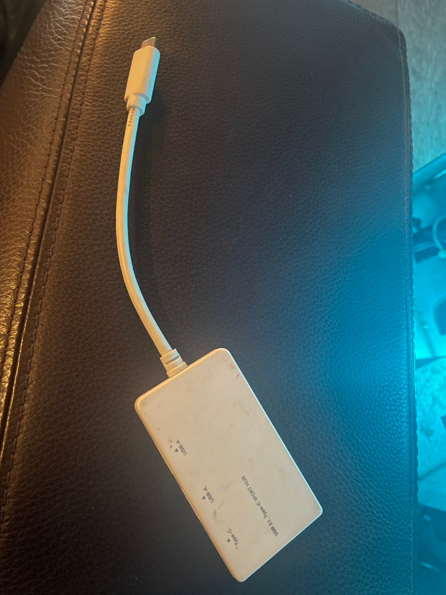
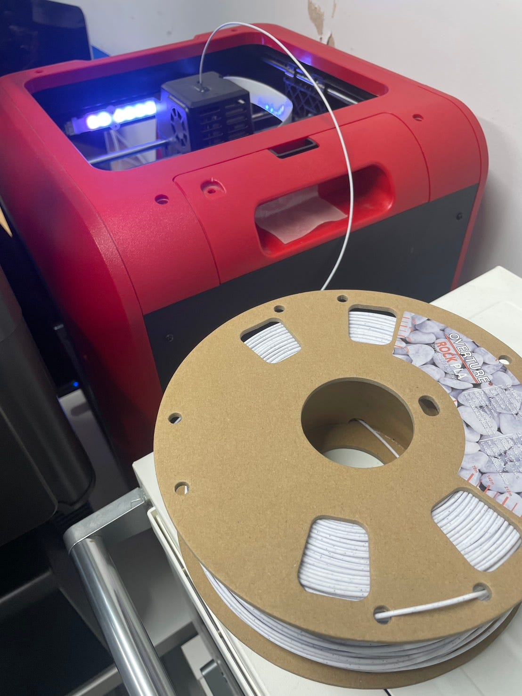
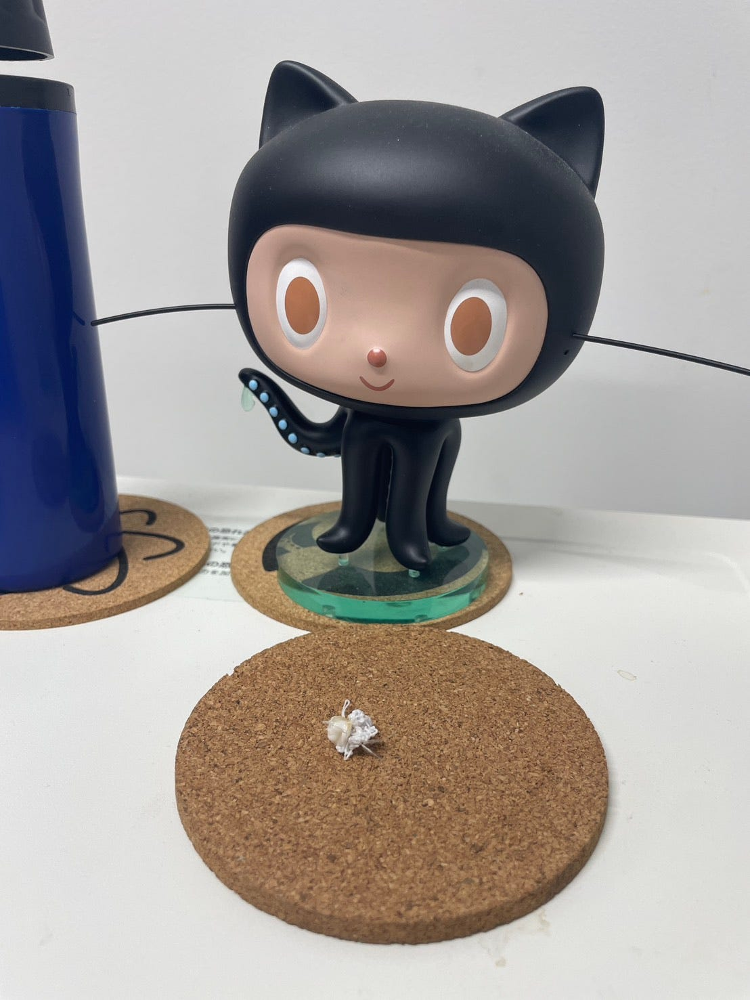
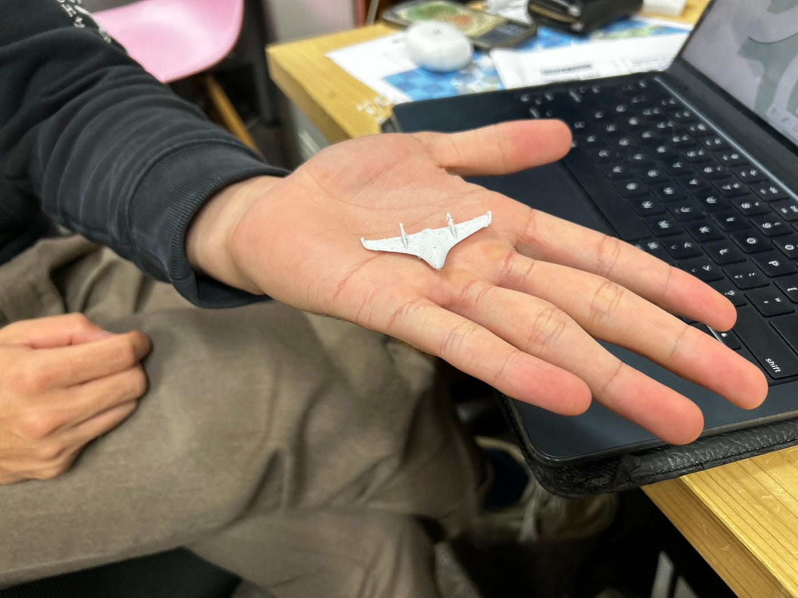
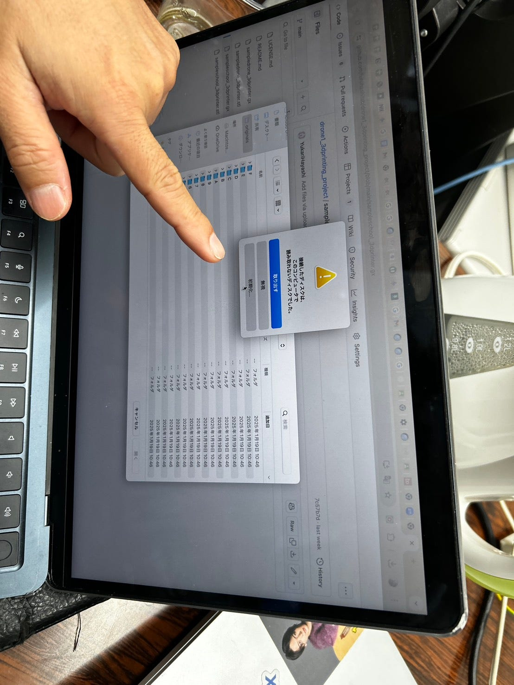
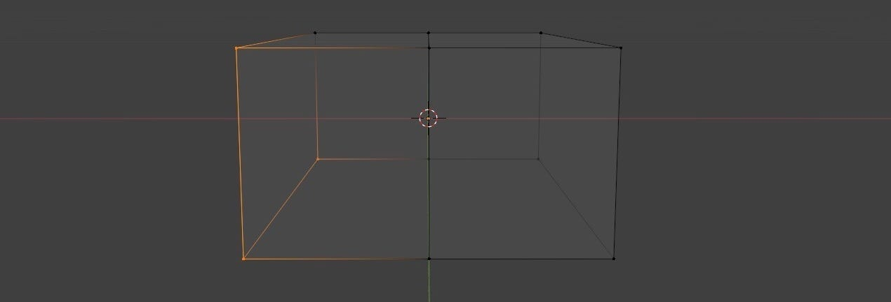
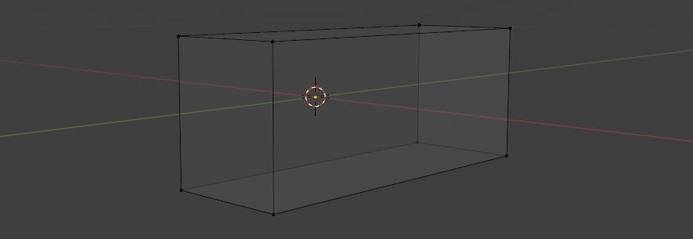
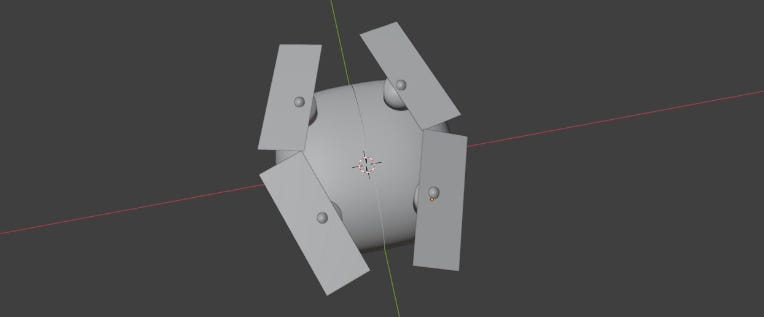
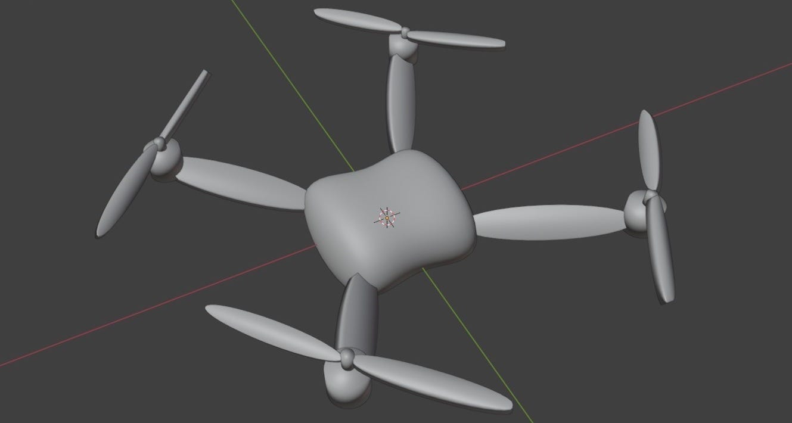
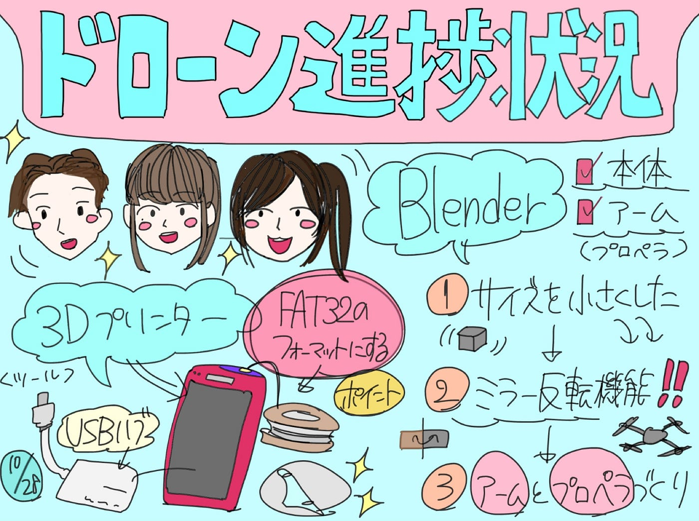

### ついにドローン（模型）作ったよ！

こんにちは！ドローン部１の山﨑です

ついについについに３Dプリンターを使ってみたよって話と優香たちのブレンダー報告をしたいと思います！

私たちドローン部は**[前回の週報**](https://medium.com/furuhashilab/ドローン部1の3dプリンター初挑戦記録-f3807afdbaa0)を読み返してくれたらわかると思いますが３Dプリンターを使おう！って話をしたはいいものの、当日にゆかり、りと双方がUSBをさせるUSBハブを忘れてしまった！！
前日、なんなら当日もUSBハブを持ってこようと話をしていたのに忘れちゃった😭

まぁ過ぎたことは仕方ないと切り替えて

#### 迎えた10月28日

じゃじゃ〜〜〜ん！！

家を一旦出て、何か忘れてないか？と自問自答を2分ぐらいして思い出しましたUSBハブ！（アダプターっていう人もいるらしい）あなたはどっち？

#### 早速使ってみた

固定するやつはまだ作れてないから、こんな感じに置いてスタート

フィラメントを指していきなり始まるわけもなく

加熱することが大切です！大体200〜220度くらいまでプリンターの方で設定して、加熱が完了したらフィラメントを3Dプリンターの手前の穴に入れてセット完了

びっくりしたのはUSBを指したら、特段設定する必要もなく簡単に始めることが出来ました：）もっと使ってみよう！

1時間もあるね〜、デザインの講義の課題が残っていたので、待ってる間に課題やっちゃおう！めっちゃ効率的で頭良いーーーー、なんて話しながら
課題をこなしていて定期的に確認しに行って、お、良いね良いね進んでる
って思ったのも束の間

びっくり仰天、フィラメントが抜けてるじゃん！！！！

なんか心理学で、ボールが何回交換されたか数えましょうという動画の終わりに、あなたはゴリラがいたことに気が付きましたか？みたいな動画みたいだなぁと思いました

出来たのは学校の底だけ

僕がすぐに始めようとしたところ
探偵のような咳払い
キャプテンから一言
「原因はなんだろう」
流石キャプテンだ失敗を失敗で終わらせてはいけない
失敗の原因は何か考えた末
座っている位置が悪くて、僕たちは忘れてしまうんだと分かりました
反省を活かすのが古橋研究室ドローン部１
すぐに席を移動しました

もし３Dプリンターを使いたいならMacの前の席が忘れにくいのでおすすめです

#### 1回目

なにこれ

恐らくなんですが、３Dプリンターで作ろうとしたサイズがめちゃくちゃ小さかったのでしょう

#### 2回目

出来ました！！[固定翼式ドローン](https://www.mbpjapan.net/archives/316)の模型が作れました！

#### あわや大惨事！？

USBを持ってきたのは良いものの
USBって実はパソコンに入れただけでは使えないこともあるんです
先生が教えてくれたので使うって人は絶対覚えて欲しいこと
フォーマットをFAT３２に変更すること

[先生がとりあえずFAT32に変更することだけは覚えとけ](https://www.asus.com/jp/support/faq/1044735/)

そのおかげですっかり具体的な理由は忘れてしまったのですが
この言葉は今でも覚えています、、、気をつけましょう
下手したらパソコンのデータが全部飛んでしまうそうです

怖かった〜〜

#### Blender

ドローン部１内ラインで突然行われたチーム分け(°_°)
見てみるとすでに３Dプリンターは埋まっている、、、ゆかりーは自由に選んでとは言いつつも、blenderをやって欲しそうなメッセージ
仕方なく引き受けた、blender担当（優花・萌）

ありがとうございます

ってことで今週から実際に動き始めたよ〜

blenderを触っているとはいえ、ドローンってどうやってやるのかは全然わからない！ まずはYouTubeで探してみたら、、、、ありました💡

[こちら](https://youtu.be/VEV3eMAdxXk)

操作については全然説明なかった😭

ここからは優花様の引用でございます

って始めようと思ったんだけど、今回書いている内容長過ぎたな、次のグループ読む時間あるのか心配になってきた
しかも投稿が一番早いのもタチが悪い
反省中
優花の内容の方が大事そうだから、次回書くときは構成も考えながら書いてみようかな

反省を少し挟んでみました

**”優花奮闘日記”開幕**

〜ドローン作りの流れ〜
**1**
まず、右端SceneよりUnitsのLengthをMillimetersに変更

**2**
OutputよりFrame Rateを30fpsに変更

**3**
動画とは異なるが、立方体を選択した状態でN→右側Transformの中の、Dimensions Xを140、Yを200、Zを80に変更（小さめに）

**4**
モード切りかえ(Ctrl+Tab)でEdit Modeにする

**5**
動画とは異なるが、立方体の真ん中に線を入れる！Ctrl+Rで黄色い線を引き、位置を真ん中に編集してから左クリックで確定する

**6**
Viewport ShadingをWireframeに変更し、左クリックからのドラックで半分を選択、オレンジ色になったら右クリックで1番下のDelete Verticesで左半分を削除する

**7**
Viewport ShadingをSolidに戻す

**8**
右下Modifiersより、Millerを選択しClippingにチェックを入れる（半分をいじると逆側にも反映されるようになる！作業の効率化！）

※参考動画はボディのみをじっくり作成させるものであったため、ミラー反転で時間短縮できる小さな立方体を完成させた所で見るのをやめて残りはChatGPTと話しながら進めることに

**9
**〜本体作成〜
10本体の角を滑らかにするため、
**Tabキー**で**オブジェクトモード⇨右下Modifiers**の**Add Modifier**をクリック。
**Generate**の中にある**Subdivision Surface**を押す⇨Levels Viewportを**3**に上げる＋**Shade Smooth**を右クリックから選択しなめらかにする。

**10**
〜アーム作成〜

**Shift+A→Mesh→Cylinder⇨円柱**追加
でも、サイズが大きい⇨**S**で**スケール調整⇨G**で適当に隣辺りに置く。

**S→Z**で**縦方向のサイズも好きな形に調整していく**。

**G**で今度はアームを置きたい位置に**移動⇨**本体の側面に。

**Shift+D**でアームを**コピー⇨**4本に配置。

**11**
〜プロペラ作成〜

**Shift+D**でアームを**コピー⇨**アームの先端に置く。

次に、Shift+A→Planeで四角いプロペラのもとを追加＋SやGなどでサイズ、位置を調整する。

※ここでのポイント
S＝サイズを変更できる
SY＝縦幅を変更できる
SX＝横幅を変更できる
G＝位置を変更できる

羽根をRで回転して、円の中心に合わせる。

自分はとりあえずShift+Dで複製し4枚羽にした。

ひとまず完成(⌒▽⌒)と作ったのをみてみたら

羽が近過ぎて、こんなの回らないだろ！！！ってなりすぐに修正

#### 来週すること

ブレンダーを皆んなで挑戦！プロペラの形を調整と色付け！！

チーム分けはしたのですが、ゆかり・りともやってみたいので、一緒にやってみます

[Github](https://github.com/furuhashilab/drone1_3dprinting_project/issues/8)に進捗報告しているので見てみてください！

では次回また！！さようなら

