### 普段グラレコってどう書いてる？デザイン部週報11/4

こんにちは臼井です。

もう11月ですね。だんだん寒くなってきて今年も終わりに近づいている実感が湧いてきました。

今回からデザイン部では、お互いのグラレコの作成風景を見て、自分のグラレコの描き方を振り返りながら、どんな描き方をしているか、コツは何か、よく使う機能は何かなどから学びを得ようと考えています。

第一回は、私、臼井のグラレコを見ていきます。

[アイビスペイント](https://ibispaint.com/about.jsp)でグラレコを描いた様子を早送りで動画にしました。

↓Youtubeのリンクになります。

#### 手順

まず私がグラレコを書く時の手順・ポイントを紹介します。

**①タイトルを書く**

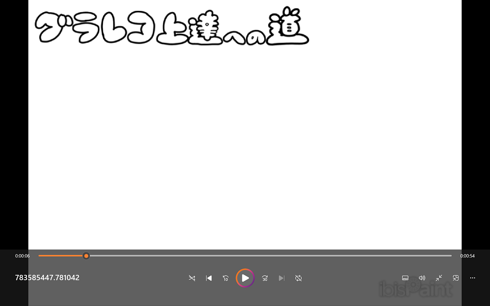

目を引くタイトルを書きます。文字の太さを太めに設定し、目立つようにしています。

**②記事の内容に合わせて文字を入れる**

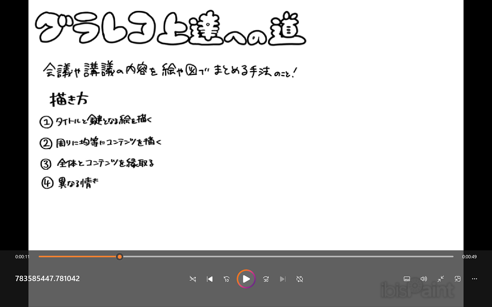

タイトルより太く、本文より細いペンを使って書いています。一旦文字だけを入れていきます。

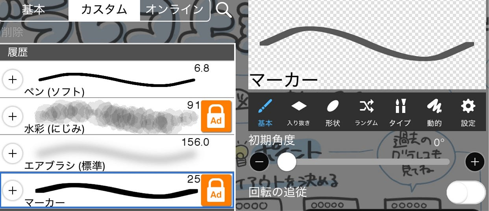

アイビスペイントを使用しているのですが、マーカーというペンを使うと縦が太く横が細い文字が書けるので字が上手く見え(る気がし)ます。

普通のペンより目立つので見出しにおすすめです。

**③文字の位置を調整し、空白に絵を入れる（項目ごとに繰り返す）**

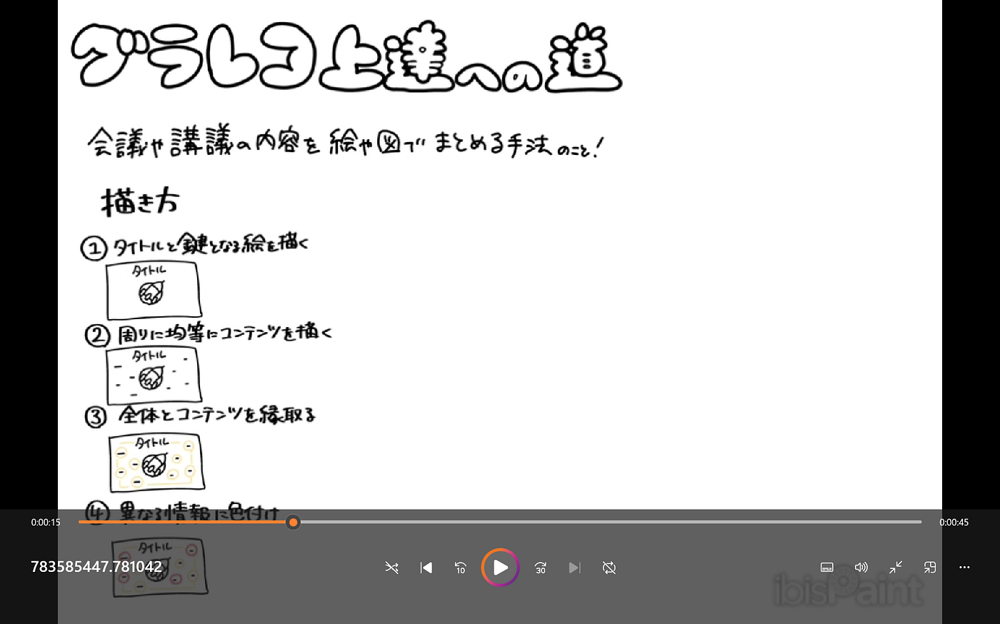

先ほど書いた文字の位置を変え、項目ごとにイラストを入れます。

なるべく空白ができないように文字やイラストを入れます。ここで空白を作らないことでクオリティの高いグラレコが書けます。

項目の数ごとにこれを繰り返し、画面を埋めていきます。

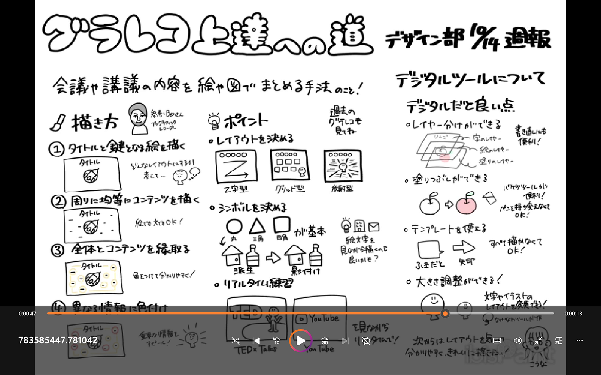

**④全体の位置調整をし、枠を書く**

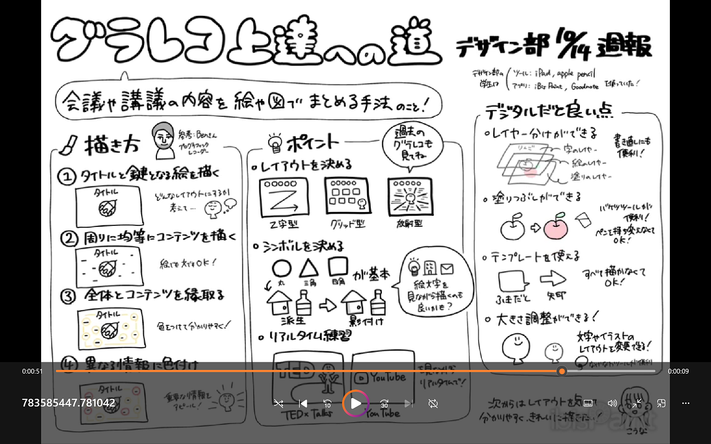

遠くから見て全体のレイアウトを調整します。文字やイラストの密度をなるべく均一にしています。その後、項目ごとに区切りを入れたり、吹き出しを付けたりして見やすい形にします。

**⑤色付け・色調整**

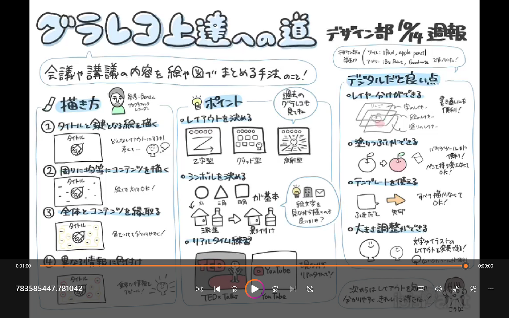

枠の色や文字の色を変えます。黒だとカチッとした感じで読みにくい感じがするので色を薄くしたり、色を付けることで雰囲気を変えています。

また、文字の後ろに色を付けることで目立たせます。イラストに色を付け見やすくしています。

この段階で枠などに使う色を統一すると統一感が出ます。色をいちいち決めなくていいので労力も削減できます。

**⑥完成**

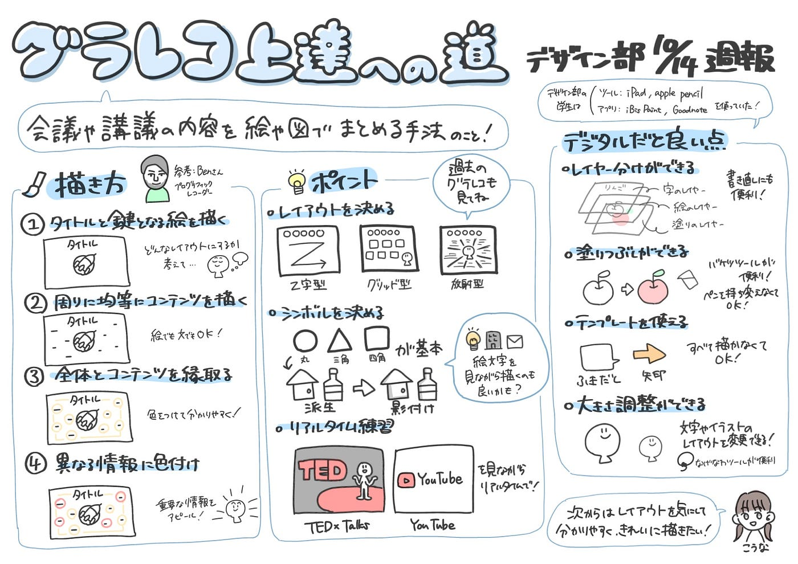

完成です！作成時間は1時間半ぐらいでした。

#### 便利ツール

いつも使っている便利なツールを紹介します。

**クリッピング**

クリッピングは色を付ける段階で使えるツールです。

上のようにクリッピングを使うと、描いたイラストの上だけに色を塗ることができます。

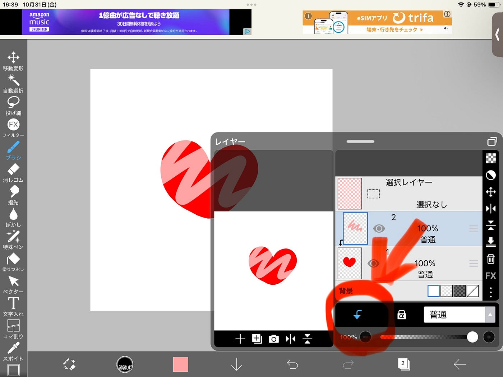

一度書いたものの色を変えたいときやイラストに書き込みたいときにおすすめです。

**なげなわ**

文字やイラストを移動させたいときに使います。

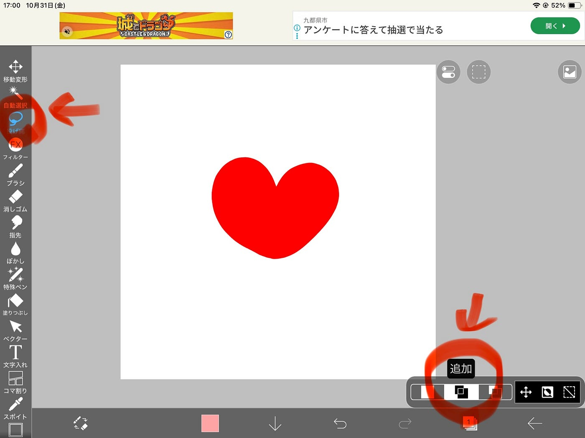

なげなわを選択し、右下が追加になっていることを確認します。

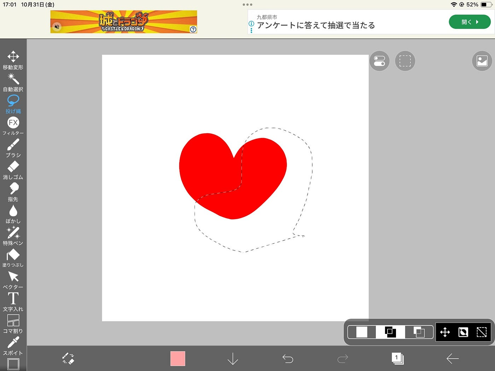

ペンで動かしたい範囲を囲むように選択します。

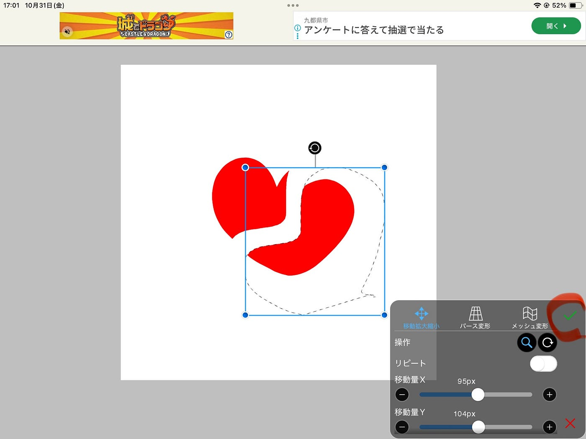

点々で選択している範囲を移動させたり大きさを変えたりできます。右下のチェックマークを押すと移動を確定できます。

次に他のメンバーの感想を載せます。

**こうな**

ちはながグラレコをかくアプリとしてアイビスペイントがよく使われているなという印象があって、私は一度使ったことがあるのですが、使い方を覚えるのに時間がかかりそうなので諦めました。が使い方を覚えたら書いた文字を消して新しい位置に書くではなく、セットで移動するなど便利だと感じました。

また、ちはなと書く手順は同じ所があるが、ペンの太さや種類はあまり意識したことがなかったり、色合いも全体で見た時のバランスに影響が出たりということを勉強することができました。

**ゆうか**

ちはなは作業の工程を書くのが上手いなとblenderでクマのモデリングをしていた時から思っていたのですが、今回の動画を見て、文字だけでなく図も使えるところは投げ縄機能でコピーアンドペーストして再利用していた所に驚きました。自分自身投げ縄機能は題名の大きな文字を書く時の位置調整でしか使っていなかったので、これからは図を書く時や、本文の位置揃えでも積極的に使ってみようと思いました。

また、ちはなと同じアプリを使ってはいたものの、クリッピング機能は手をつけたことがほとんどなかったため、レイヤーを用いて色を使い分けると塗りたいところだけに塗ることができるというのは初耳でした。そのため今回学んだ技術をこれからのグラレコに活かしたいです。

いかがでしたか？私は、今回この記事を書いて順序を言語化したことによって自分のグラレコを見つめ直すことができました。

他のメンバーからの感想も興味深いもので勉強になりました。

これから他のメンバーのグラレコも見ていきたいと思っているので楽しみにしていてください。研究室全体のグラレコ技術向上のために頑張ります！

#### グラレコ

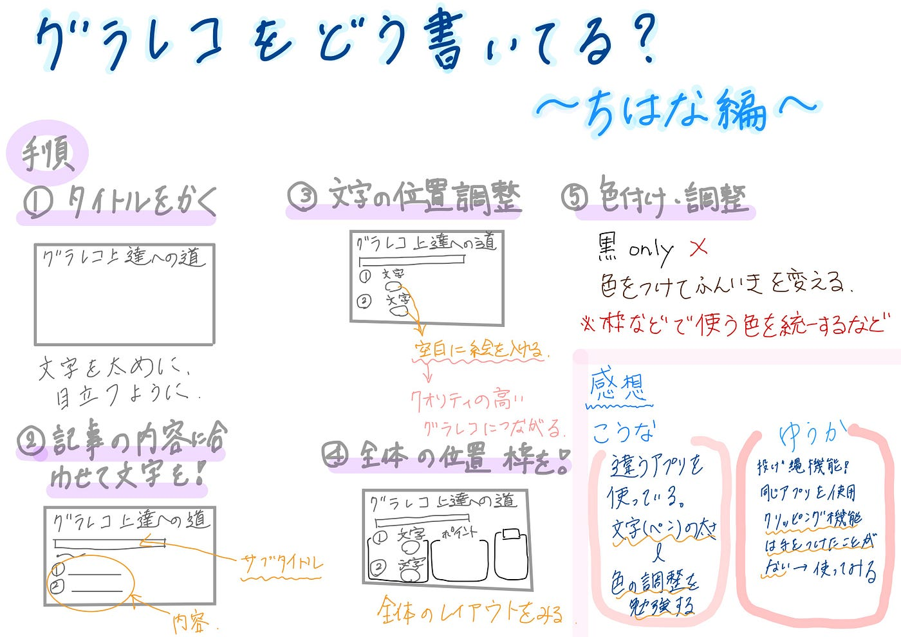
