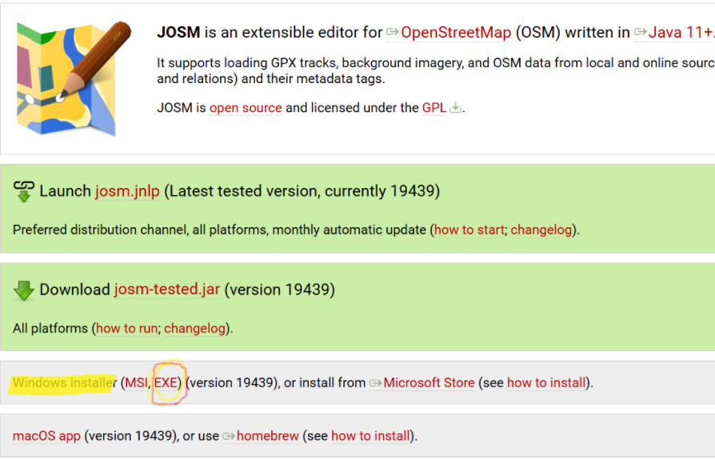
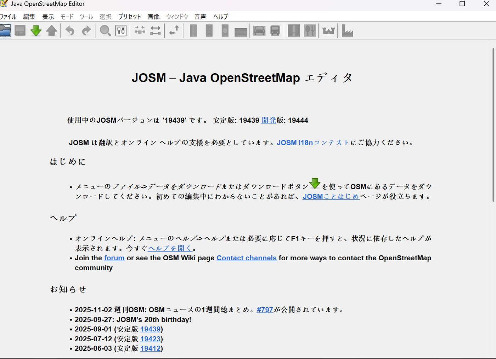
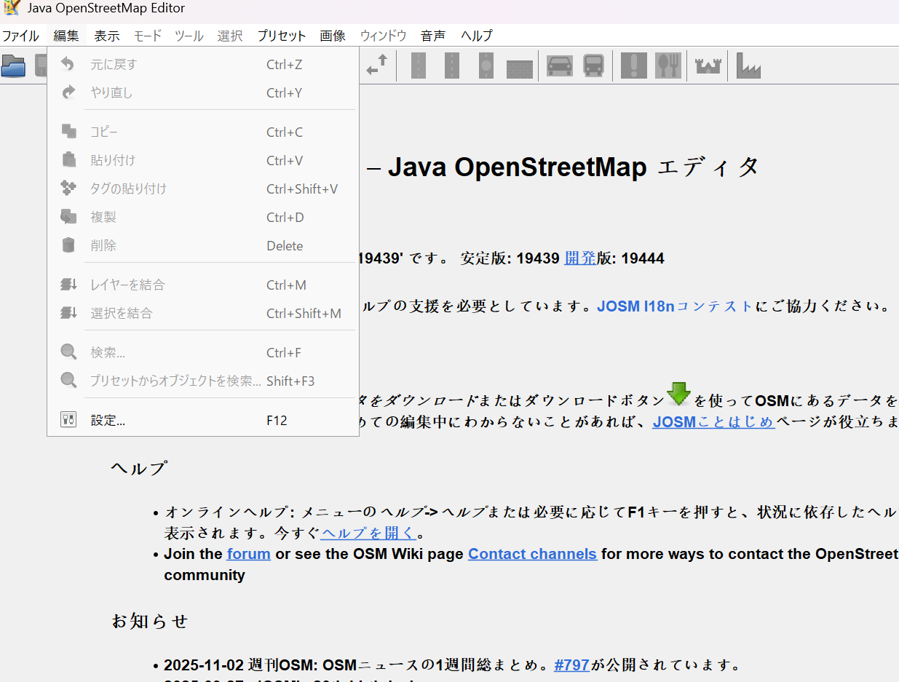
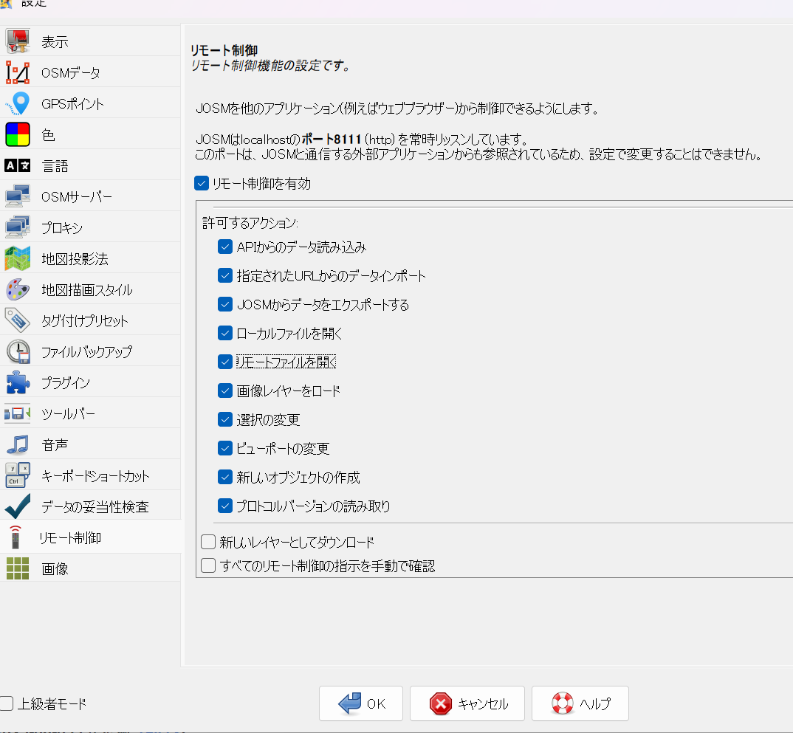
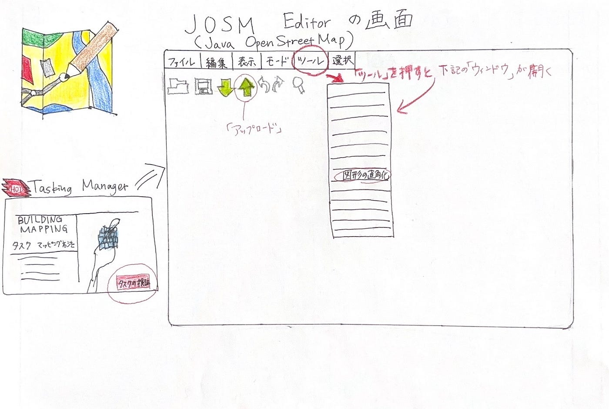

### HOT Tasking ManagerのValidationにおけるJOSMの使い方【Youth①週報】

この間（2025年10月20日）、HOT Tasking Managerにおいて中級マッパーに昇格した岡村です。中級マッパーになったので、下記プロジェクトのValidationに挑戦しました。

[#32511: Building Mapping/Updating in Northern Cebu — HOT Tasking Manager](https://tasks.hotosm.org/projects/32511)

前回のYouthの活動では、中級以上のメンバーがHOT Tasking ManagerでValidationを行っていました。その時の、JOSMのダウンロード方法や基本操作をまとめた資料を参考にしましたが、古い箇所やValidationに直接関係しない部分も含まれていたため、HOT Tasking ManagerでValidationをする上で必要なところだけをまとめました。

### 手順～JOSMの準備～

①私はWindowsを使っているので、Microsoft EdgeでJOSMと検索し、Windows installerからインストールしました。

②インストールが完了し、JOSMを起動すると下記の画面が表示される。

③画面左端にある「編集」から「設定」をクリック。

④「リモート制御」を有効にする。

上記の①～④の手順で、JOSMの準備は整いました。あとは、HOT Tasking Managerでプロジェクトを選択し、JOSM上でValidationを行うことができました。

JOSM上でのValidationの操作の仕方は、下記を参考にしました。
[How to Validate a Map in JOSM — HOT Tasking manager](https://www.youtube.com/watch?v=k-tVk_7IePM&t=4s)

### Validationする上で気を付けたこと

建物はすべて、直角にする。
異なる地物で重なっているものがあれば、はなす。

### これから、中級マッパーになる方に向けて

JOSMをダウンロードする際は、この週報を参考にしてみてください。
注意すべきなのは、手順④のリモート制御を有効にすることです。

### **グラレコ**

