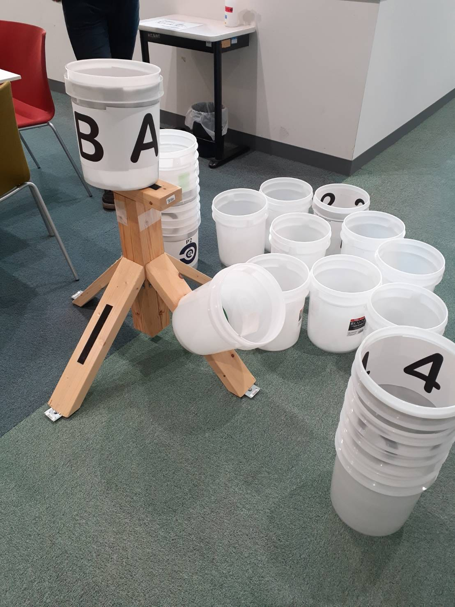
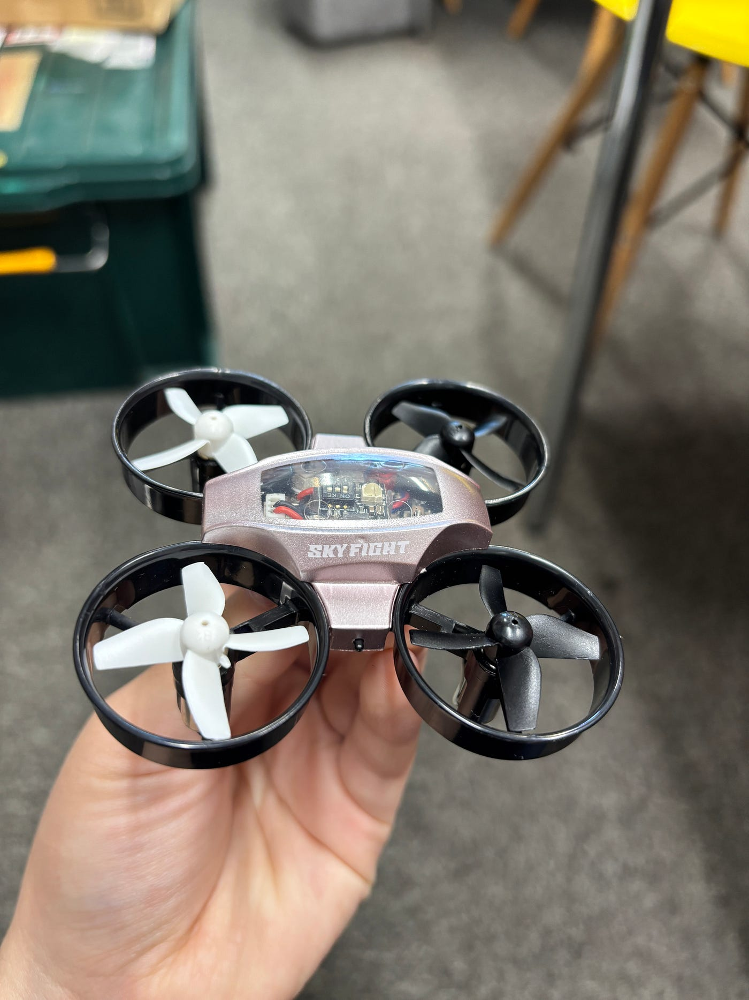
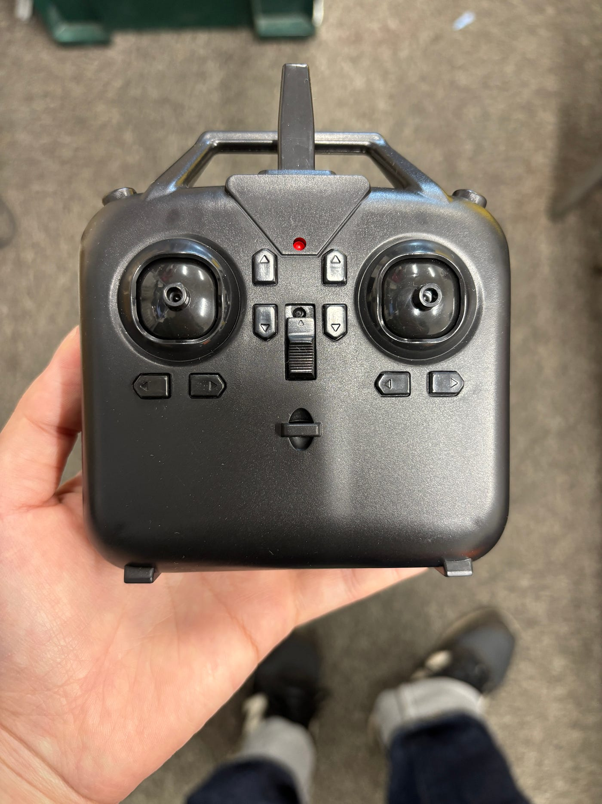
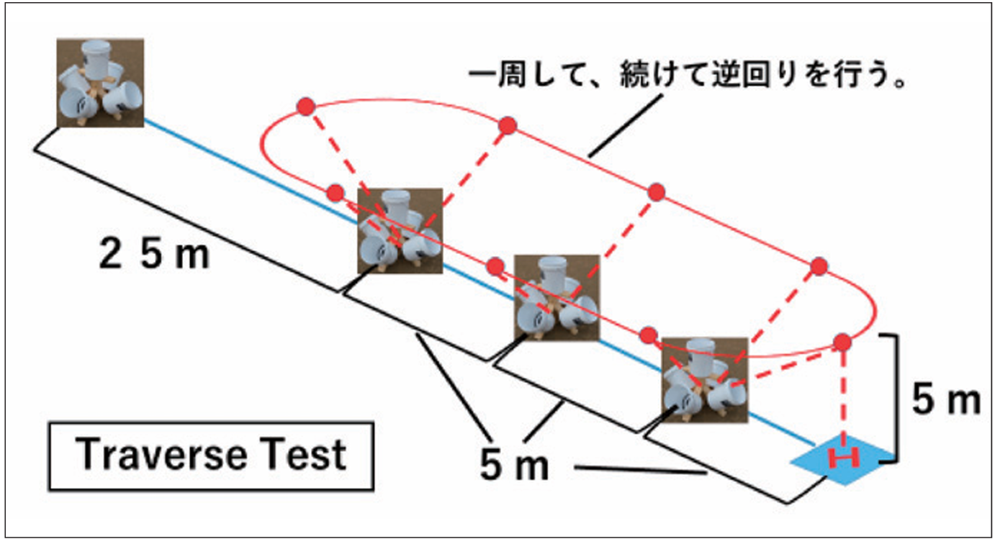
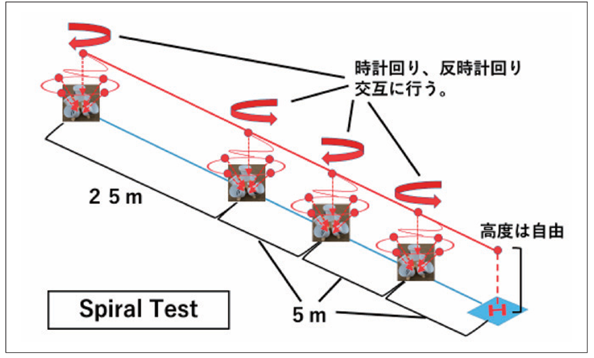
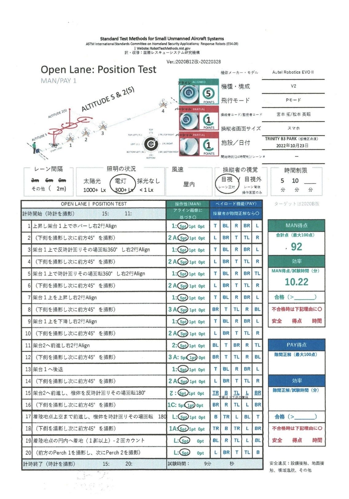
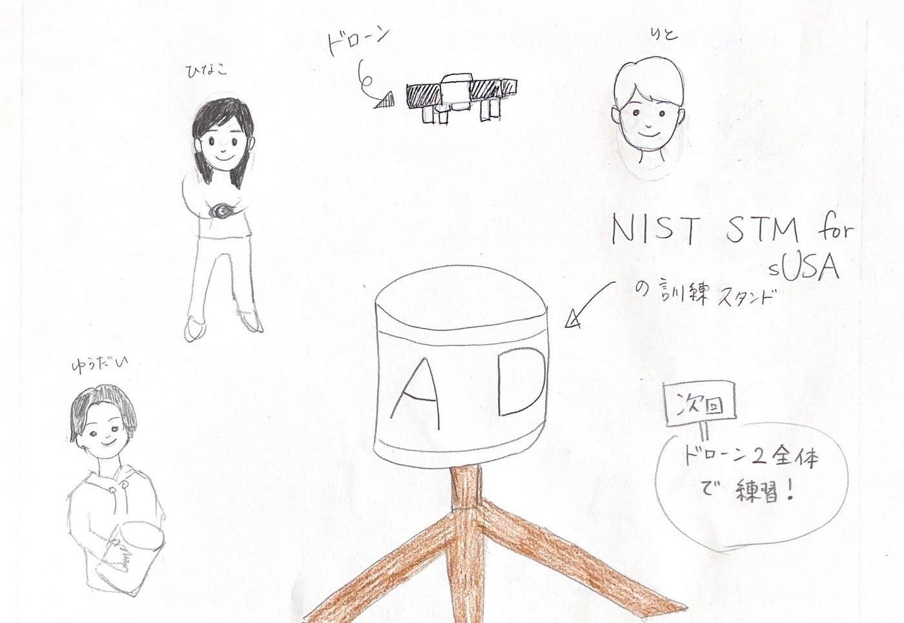

### NISTが提唱！ドローン操縦者技能評価メニューへの挑戦【ドローン②週報】

ドローン部２の週報を担当します岡村です。

今回の週報では、ゼミ室にあるスタンド（写真1）を使用した感想・今後の展望について報告します。

#### このスタンドは一体何？？

NIST STM for sUSAにおいて使われているものです。
NIST STM for sUSAとはStandard Test Methods for Small Unmanned Aircraft Systemsの略で、ドローンの能力と操縦者の技能を客観的かつ数値化された基準で評価できる手法です。
NIST STM for sUASでは専用の訓練フィールドを用いて、操縦者がどの程度の精度と速度で飛行操作を実行できるかをタイムトライアル形式で測定し、その結果を記録・評価する仕組みになっています。これによって、災害対応や情報収集の現場でその有効性が証明できるようになります。

#### 試しに使ってみた

今回使用したもの
・ドローン SKY FIGHT X

SKY FIGHT X 操作説明
[SKY FIGHT X 操作説明 | drone-net](https://drone-net.co.jp/youtube/sky-fight-x-%e6%93%8d%e4%bd%9c%e8%aa%ac%e6%98%8e/)

・スタンド（写真1）

籠の中にドローンを着地させようと奮闘する
[https://youtu.be/acNeV0iJiQo](https://youtu.be/acNeV0iJiQo)

他の動画はこちら
[25DroneClub2 — …FuruhashiLab — Google ドライブ](https://drive.google.com/drive/u/0/folders/1zS5wsLhSvjH9WPbUUW187ku_NjtoL7Ht)

#### 感想

りと
小さい分小回りはきくが、その分操作の技術を要する
練習しないと〜〜

ひなこ
バケツの中に入れてみるという練習をしたが、ホバリングが上手く行かずできなかった。しかし、凄くいい練習だったので今後も続けて行きたい。
ドローンスターより個人的には動かしやすいと思った。飛行時間は10分。電池は40分くらいでたまるからいくつか持っていけば長時間練習も可能だと思った。

ゆうだい
前後左右の操作が思った通りにいかなかったので前がどっちか意識して操作した。
バケツの近くになると、空気抵抗の影響か思いもしない動きをしてしまった。

#### これから

今回の試しで、ホバリングの良い練習になると感じたので、ドローン2全体で練習を進めていく予定です。
川口市消防局の無人航空機の訓練の導入事例を参考に、練習していきたいと思います。[https://www.fdma.go.jp/publication/ugoki/items/rei_0301_23.pdf](https://www.fdma.go.jp/publication/ugoki/items/rei_0301_23.pdf)

#### **グラレコ**

#### 参考文献

・川口市消防局警防課[https://www.fdma.go.jp/publication/ugoki/items/rei_0301_23.pdf](https://www.fdma.go.jp/publication/ugoki/items/rei_0301_23.pdf)（2025年11月3日参照）

・城北ドローンオフィス株式会社【NIST STM for sUAS】が拓く、新たな防災の可能性と弊社の取り組み
[https://j-drone-o.com/wp/news/post_11839/](https://j-drone-o.com/wp/news/post_11839/) （2025年11月3日参照）
