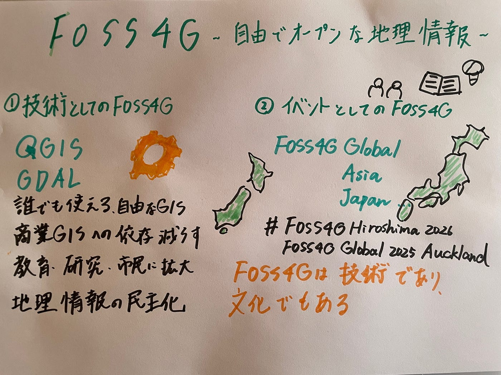

### FOSS4Gの２つの意味

こんにちは、Youth②の佐藤愛妃です。FOSS4G Global （New Zealand）の開催に伴い、FOSS4Gの概要についてまとめてました。

### はじめに

地理空間情報技術は、行政・研究・産業など多様な分野で急速に発展しており、その中核をなす概念の一つが「FOSS4G」である。
 FOSS4Gとは「Free and Open Source Software for Geospatial（自由でオープンソースな地理情報ソフトウェア）」の略称であり、主に二つの意味をもつ。
 第一に、地理空間情報を扱うためのオープンソースソフトウェア群（技術的意味）**としてのFOSS4G。
 第二に、それらの技術を共有・発展させる**国際的・地域的なイベント（社会的意味）としてのFOSS4Gである。
 本稿ではこの二つの概念の違いを明確にした上で、FOSS4Gの国際的展開および日本における取り組みを説明する。

### 1. ツールとしてのFOSS4G

FOSS4Gは、地理空間情報を扱うオープンソースソフトウェアの総称である（OSGeo, 2025）。
 この語は2004年頃に「Free and Open Source Software for Geoinformatics」として用いられ始めたとされる（FOSS4G Asia, 2025）。
 代表的なソフトウェアにはQGIS、GRASS GIS、GDAL、PostGIS、GeoServerなどが挙げられる。

これらのツールの特徴は、誰もが無償で利用・改変・再配布できる点にある。商用GISソフトウェアと異なり、ライセンス制約が少なく、教育・研究・行政・民間の幅広い領域で利用されている。国内でも、オープンデータの可視化、防災地図の作成、地域課題の共有など公共性の高い取り組みに活用されている（OSGeo Japan, 2025）。

このようにツールとしてのFOSS4Gは、地理情報の「民主化」を支える技術的基盤であり、専門家だけでなく市民が地理情報を扱える社会を可能にしている。

### 2. イベントとしてのFOSS4G

一方でFOSS4Gは、オープンソース地理空間技術に関する国際会議および地域イベントの名称としても用いられる（OSGeo, 2025）。
 Open Source Geospatial Foundation（OSGeo）が主催する国際会議「FOSS4G Global」では、世界中の開発者・研究者・行政・教育関係者・市民が集い、発表やワークショップを通じて知識共有と協働を進めている（FOSS4G, 2025）。

このイベントの目的は、単なる技術発表にとどまらず、教育・オープンデータ・地域連携などを通じて社会的課題の解決に資することである。各国・地域でも「FOSS4G Japan」「FOSS4G Asia」「FOSS4G Kansai」などのローカルイベントが開催されており、国内外のコミュニティ形成に貢献している（OSGeo Japan, 2024）。

### 3. ①ツールと②イベントの違い

FOSS4Gには技術的側面と社会的側面があり、その位置づけは明確に異なる。以下の表にその違いを示す。

観点 ① ツールとしてのFOSS4G ② イベントとしてのFOSS4G 概念の性質 技術的・機能的 社会的・文化的 本質 地理情報を扱うソフトウェア群 技術・知識を共有する場 主体 開発者・利用者 コミュニティ・OSGeo組織 成果物 プログラム・コード・ライブラリ 発表・ワークショップ・教育・協働 目的 地理情報の自由利用と技術革新 知識共有と人材・地域ネットワーク形成 支える価値観 自由（Free）・オープンソース 共有（Share）・協働（Collaboration）

両者は対立的ではなく、**相互補完的**な関係にある。
 ツールとしてのFOSS4Gが「手段（技術）」であり、イベントとしてのFOSS4Gが「場（社会）」である。
 すなわち、前者が地理情報の自由利用を支える技術基盤を築き、後者がその技術を発展・普及させる社会的枠組みを形成している。

### 4. FOSS4G GlobalとFOSS4G Japanの違い

FOSS4Gのイベントには、国際大会（FOSS4G Global）と国内・地域大会（FOSS4G Japanなど）がある。両者の特徴を比較すると次の通りである。

項目 FOSS4G Global FOSS4G Japan 主催 OSGeo（本部） OSGeo日本支部（OSGeo.JP） 開催地域 世界各国で持ち回り 日本国内（年1回） 使用言語 英語中心 日本語中心 規模 数百〜千人規模、国際参加者多数 数百人規模、国内ユーザー中心 内容 国際的研究発表・世界動向の共有 国内事例・教育・自治体・企業発表 目的 グローバルな連携・標準化 国内の普及・教育・地域連携

両者は補完的関係にあり、FOSS4G Japanで培われた事例や教育ノウハウが、グローバル大会で再発信されることで国際的連携を強化している。

### 5. 最新動向：FOSS4G Global 2025 AucklandとFOSS4G Hiroshima 2026

2025年の国際大会 **FOSS4G Global 2025** は、ニュージーランド・オークランドで2025年11月17日から23日まで開催される予定である（OSGeo, 2025）。
 会場はAuckland University of Technologyで、持続可能性と包摂性をテーマに、オープンソースGISの国際的な発展を議論する場となる。

さらに2026年には、次回グローバル大会として**FOSS4G Hiroshima 2026**が日本・広島で開催されることが決定している（OSGeo Japan, 2025）。
 会期は2026年8月30日〜9月5日で、メインカンファレンスは広島国際会議場にて行われる予定である。
 テーマは「地理空間情報を平和と持続可能な未来のために」であり、広島という都市の象徴性を踏まえた意義深い大会となる見込みである。

### 6. まとめ

FOSS4Gという用語は、技術的概念（ツール）**と**社会的概念（イベント）の意味を持つ。
 ツールとしてのFOSS4Gは、地理空間情報を自由に扱える環境を提供し、イベントとしてのFOSS4Gは、それを共有し、社会に広めるための基盤を形成している。

この両者の相互作用によって、オープンソースGISは単なる技術体系を超え、教育・研究・地域社会・国際協力を結ぶ「知のエコシステム」として機能している。
 特に、2025年のオークランド開催と2026年の広島開催は、FOSS4Gの理念がグローバルとローカルを結ぶ象徴的な出来事となる。古橋研究室でも準備を進めていきたい。

### グラレコ

### 参考文献

- OSGeo, “FOSS4G (Events)”, [https://www.osgeo.org/initiatives/foss4g/](https://www.osgeo.org/initiatives/foss4g/)（参照日：2025年11月4日）

- FOSS4G Asia, “FOSS4G History”, [https://foss4g.asia/foss4g-history/](https://foss4g.asia/foss4g-history/)（参照日：2025年11月4日）

- OSGeo Japan, “FOSS4G 2025 Japan”, [https://osgeo-jp.github.io/foss4g-2025-japan](https://osgeo-jp.github.io/foss4g-2025-japan)（参照日：2025年11月4日）

- Auckland Unlimited, “Auckland wins bid to host the 2025 FOSS4G conference”, [https://aucklandunlimited.com/news/auckland-wins-bid-to-host-the-2025-foss4g-conference](https://aucklandunlimited.com/news/auckland-wins-bid-to-host-the-2025-foss4g-conference)（参照日：2025年11月4日）

- OSGeo Japan, “FOSS4G Hiroshima 2026 開催概要”, [https://www.osgeo.jp/foss4g-hiroshima-2026-%E9%96%8B%E5%82%AC%E6%A6%82%E8%A6%81](https://www.osgeo.jp/foss4g-hiroshima-2026-%E9%96%8B%E5%82%AC%E6%A6%82%E8%A6%81)（参照日：2025年11月4日）
