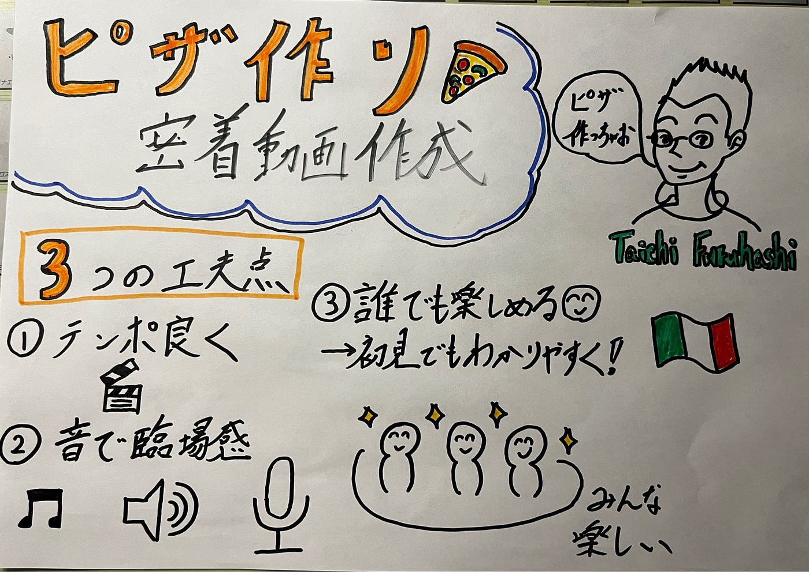

## 古橋先生のピザ作り、動画化してみた。[V&F 週報 11/4]

こんにちは。親知らずの抜歯をして、痛みに苦しんでいる、4年生の高井健太郎です。

今週のV&Fでは、[TikTok](https://www.tiktok.com/@furuhashilab)動画活動の一環として、10月22日に開催された「[青学つくまなラボ](https://sites.google.com/view/tukumanalab/)」での「古橋先生おかえりピザパーティー」に参加した際の動画を編集し、[TikTok](https://www.tiktok.com/@furuhashilab)用ショート動画を制作しました。

以下に、動画リンクと動画制作の工夫点をまとめます。

> **動画リンク**

[青学教授のピザ作りに密着（TikTok動画）](https://www.tiktok.com/@furuhashilab/video/7568685351733038356?is_from_webapp=1&sender_device=pc&web_id=7568685097551431188)

> **工夫点**

**1．テンポ感を意識した編集**

TikTokで最後まで見てもらうために、リズムよく展開することを意識しました。

特にピザ作りの工程では、不要な間をカットし、視聴者が途中で離脱しないよう工夫しました。

**2．音量バランスの調整**

古橋先生の声や現場の雰囲気がしっかり伝わるよう、AIボイスの音量を調整しました。

盛り上がるシーンでは、あえてナレーションの音を下げ、臨場感を重視しました。

**3．誰が見ても楽しめる内容に**

SNSで公開する以上、内部の人だけでなく初めて見る人にも楽しんでもらえるように、身内ネタや専門的な言葉を避け、誰でも分かりやすい表現を意識しました。

> **メンバーからのコメント**

- こうな：テンポよく先生がピザを作るところと取り出すところが編集されてて面白い。教室で作れることにびっくり👀 動_**画の最初と最後に映ってる先生が紹介しているスライドの内容が何か気になった！ので少しあったら良かったかも**_

- しょーた：クスッと笑えるようなポイントもあって動画として見やすいかなと思った！**谷さんの一瞬のカメラ目線がいいなと思ったので、これこら動画撮る時は少しカメラ目線もらうことを意識してみようかなと思った！**

- ちさと：古橋教授の笑顔が多くて、全体的にあたたかい雰囲気の動画になっていてよかった。ピザ作りのシーンもテンポが良く、見ていて飽きない構成だった！**もし他の参加者の反応も少し入っていたら、さらに臨場感が出て、視聴者もその場の楽しさをより感じられると思った。**

> **まとめ**

今回の動画では、「**テンポ**」「**音量**」「**わかりやすさ**」の3点を重視しました。

特に、古橋先生の楽しそうな様子や現場の空気感を大切にしながら、TikTokらしい軽快な編集を心がけました。

今回は、ピザ作りをメインに取り上げたことで、現場の雰囲気を中心に伝える内容になりました。

今後は、メンバーからのコメントでも挙がったように、古橋研究室らしい「学び」や「人とのつながり」が感じられる構成を意識し、研究室全体の魅力がより伝わる動画づくりに挑戦したいと思います。

> **グラレコ**

