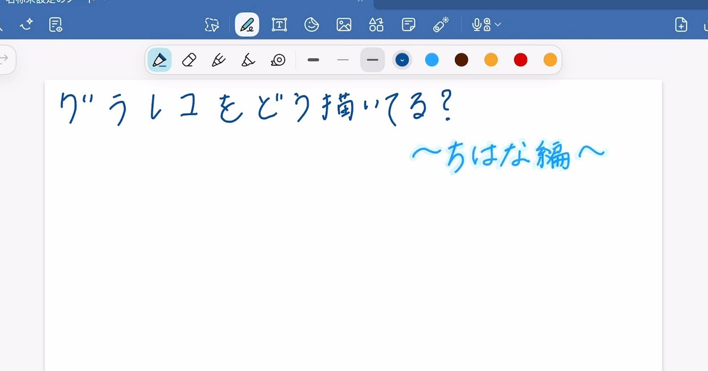
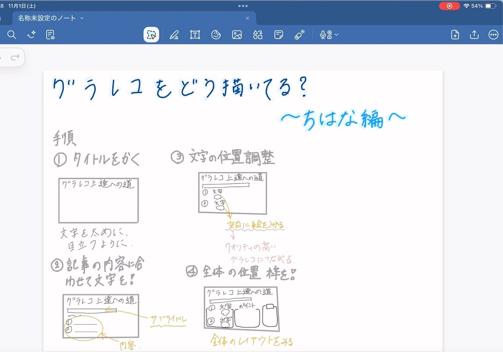
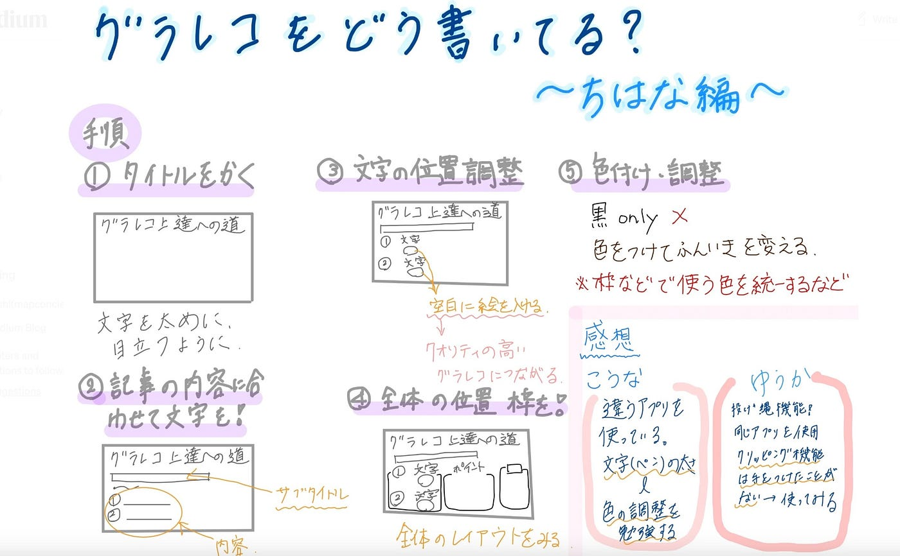
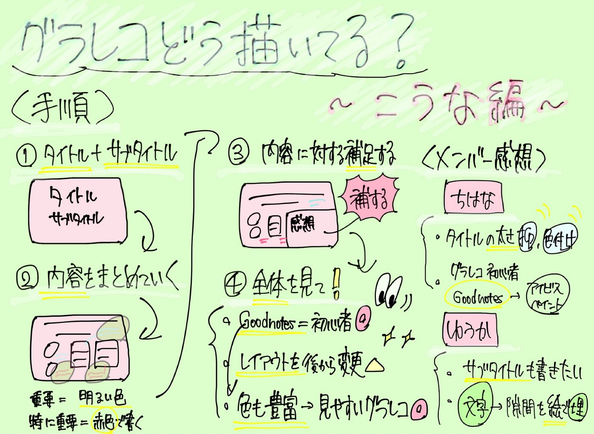

### グラレコどう描いてる？第二弾デザイン部週報【11/11】

こんにちは、四年の福田です。

前回ちはなが普段グラレコを描く様子・ポイントを紹介しました。

今回は私のグラレコを描く様子を[Goodnotes](https://www.goodnotes.com/jp/features)で描く際に録画して編集したものを使用してポイントや見返して気づいたことをまとめます。

私がグラレコを描く様子は↓

#### 手順

手順を追いながらポイントになる所

**①タイトル・サブタイトル**

タイトルはいつも大きめにかいて、サブタイトルはその下またはタイトルの大きさによってはその横に描いたりします。あまり太いペンを使うと何を書いたかわからなくなってしまうので、蛍光ペンでなぞって区別つけるようにしています。

**②内容をまとめていく**

文字の太さ・色を意識しながら、何を書いているかそして内容に合わせて、重要だと思った所ははみ出して明るい色で説明を書くことが多いです。特に重要な内容は目につきやすい赤色で書くことが多いです。

改善点）灰色を使うと薄くて見づらい所、全体のバランスをもっと意識

**③内容に対する補足**

補足は、例えば今回のグラレコでは感想という部分があります。他にもアプリの紹介をする記事であれば、アプリの機能を中心にグラレコを描いてから、みんなが使ってみた感想など補足をつけたりします。

改善点）文字だけでなく、似顔絵だったり、内容にあったイラストだったり必要→より充実した内容になるこのままだと少しつまらない

**全体を見て**

Goodnotesは初心者でも使い方は簡単で、単純に文字と絵をペンで描くでグラレコは作ることができます。消しゴム等もマークがあるので、タップしてそのまま使えて、特に覚えることが必要な作業はないです。その反面、レイアウトを後から変えるのが難しかったり、描く作業を再現できなかったりといった弱点もあります。

私がグラレコを描く際、全体的にバランスを調整したり、レイアウトを見ること、イラストや絵が足りないことが私のグラレコでは改善する必要がある所だと感じています。Goodnotesではペンの太さを自由に調整し、色も豊富なのでそこも意識しながら全体的に見やすいグラレコを描くようにしていきます。

Goodnotesの特徴等について以前デザイン部でまとめた週報があるので、参考に↓

[グラレコの描き方~デジタル編~ デザイン週報(6/18)
こんにちは！3年の末木です。medium.com](https://medium.com/furuhashilab/%E3%82%B0%E3%83%A9%E3%83%AC%E3%82%B3%E3%81%AE%E6%8F%8F%E3%81%8D%E6%96%B9-%E3%83%87%E3%82%B8%E3%82%BF%E3%83%AB%E7%B7%A8-%E3%83%87%E3%82%B6%E3%82%A4%E3%83%B3%E9%80%B1%E5%A0%B1-6-18-799fda3be6f2)

以下にメンバーの感想です。

ちはな

私がタイトルを書くときはとりあえず大きく太めに書くことを優先して、色付けにはそこまで気を配っていなかったので、字の太さを抑えめにして色で区別する方法は真似してみたいと思いました。

また、GoodnotesはUIがシンプルで初心者には使いやすそうだと感じました。アイビスペイントは機能は多い反面、使いこなすのには時間がかかります。グラレコを始めたばかりの人にはGoodnotesにまず触れてもらうのが良さそうだと思いました。

ゆうか

まず、タイトルとサブタイトルを２つ描くようにしている点が、重要なポイントが分かりやすいグラレコにつながっているように感じた。自分はいつもタイトルのみで終わらせていたので、サブタイトルも書こうと思った。次に、タイトルの書き方として、下に薄い色＋上に濃い色という書き方で工夫されていて綺麗だと思った。さらに、自分はいつも絵を描いてから文字で隙間を埋めており、文字を無理やり小さくしたりしていたため、先に文字を書いて空白を絵で埋める方がまとまりがあって綺麗なグラレコになりそうだと思った。また、自分はアイビスペイントを使用しており、下にパレットがあって間違えて触ってしまうことが多々あるが、こうな先輩のGoodnotesは、上側にパレットがあって、絵を描く手で間違えて触れたりしないのがとても良いなと感じた。

### グラレコ

