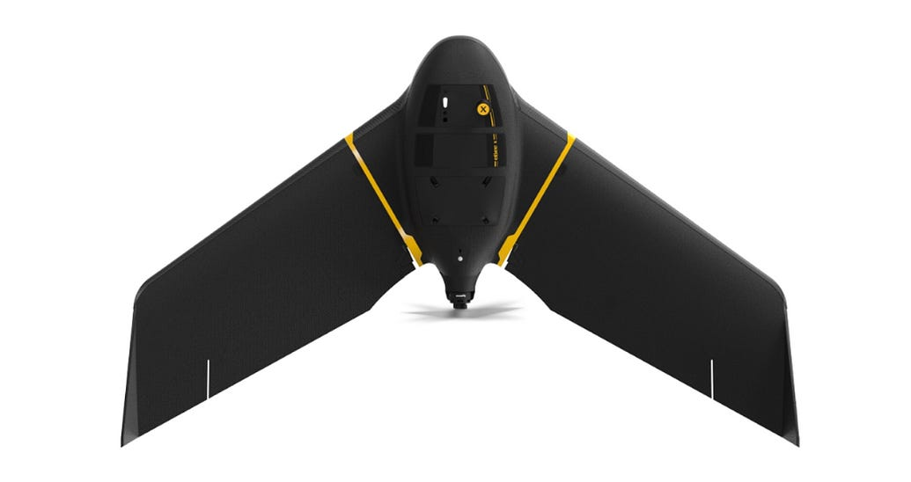
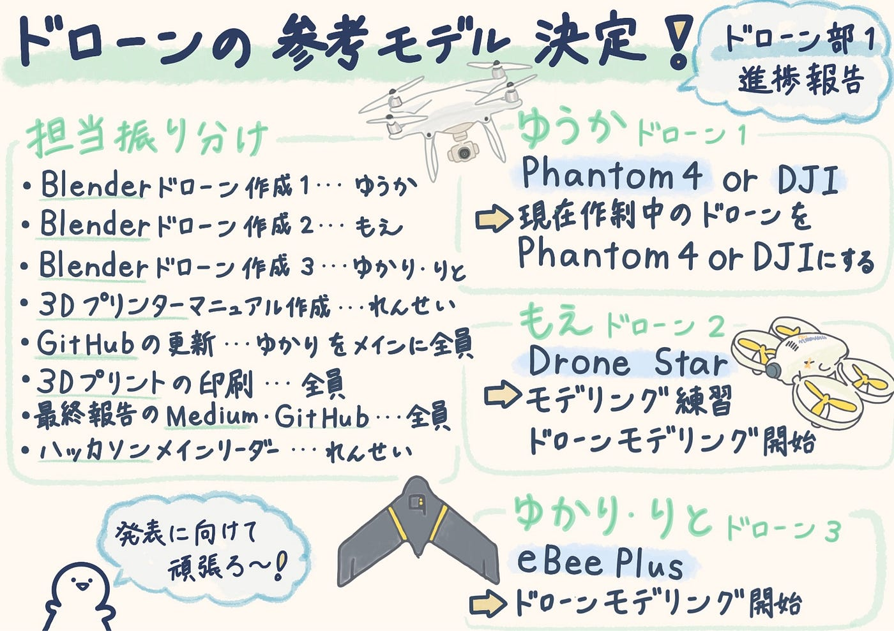

## 作成するドローンの参考モデルを決定！！

こんにちは！ドローン部1の稲田です。今週からは実際に作る際にモデルとするドローンについて調べて決定するところまで進みました！

まず、担当する振り分けについて改めて記載することにしようとおもいます。

最終的な担当は以下のようになりました！

・blenderでドローン作成① →担当:ゆうか

・blenderでドローン作成② →担当:もえ

・blenderでドローン作成③ →担当:ゆかり・りと

・3Dプリンタのマニュアル作成 →担当:れんせい

・GitHubの更新 →担当:ゆかりをメインに全員

・最終的な3Dプリントの印刷 →担当:全員

・最終報告のメディウムやGitHub →担当:全員

・ハッカソンメインリーダー →担当:れんせい

今週以降は、blenderでのドローンモデリングを行い、最終報告に向けて各自着々と作業をスタートさせていく予定です！冬休み明け最後辺りのゼミで実際に完成した成果物を発表します。

そして、今週の進捗報告につづきます！

### **ゆかり・りと**

#### 2025/11/04の進捗報告

Blenderで挑戦するドローンの形を決めていました。2人は「eBee Plus」という名前のドローンをモデルに作成していくそうです。

次回することとしては、Blenderに取り掛かることとしていました！

[Blenderで機体の作成③（ゆかりりと） · Issue #11 · furuhashilab/drone1_3dprinting_project
Contribute to furuhashilab/drone1_3dprinting_project development by creating an account on GitHub.github.com](https://github.com/furuhashilab/drone1_3dprinting_project/issues/11#issuecomment-3483893884)

### **もえ**

#### 2025/11/9の進捗報告

ゆかり・りとと同じく、今週はモデリング対象の決定を行いました。

もえがモデリングするドローンとしては、Drone Starを選んでいました。

実際に自分が所有している機体でもあるそうで、サイズ感や形状を直接確認しながら制作できるためこちらのドローンにしたそうです。

また、Drone Star 公式サイトにある、TRAININGモデルを参考にしていくそうです。

[ドローン国家資格向け、新・練習用機体　DRONE STAR TRAINING | DRONE STAR 公式ストア
DRONE STAR…dronestar.official.ec](https://dronestar.official.ec/items/86510539)

〈Drone Starの特徴〉

- 小型で軽量のため、屋内での操作に適している

- 前方に搭載されているカメラを使用して、飛行ルートの確認などが可能

- 操縦練習に向いている機体

もえの来週の予定としては、機体をモデリングする前に、簡単なモデリング練習を通して Blender の基本操作に慣れることを目標としていました。練習後は、Drone Star の胴体部分からモデリングを開始する予定です。

[Blenderで機体の作成②（もえ） · Issue #10 · furuhashilab/drone1_3dprinting_project
進捗があれば記載してください！github.com](https://github.com/furuhashilab/drone1_3dprinting_project/issues/10)

### **ゆうか**

#### **2025/11/9の進捗報告**

私自身は、現在既に作成しているドローンを少しずつ変形させて、Phantom 4 もしくはDJI（ディージェーアイ）のような四つのプロペラを持つドローンに出来ればと思っています。

・なぜPhantom 4 やDJIに興味を持ったか

Phantom 4は過去にドローン1で調べ、実際にグラレコを書いたこともあるものであり、既に商品についての資料や知識が他のドローンよりあると思ったためです。また、DJIは、現在モデリングしている途中のドローンと非常に似た形であったため、Phantom 4への変形が難しいと感じた場合には、DJIも視野に入れて作っていきたいです。

[Phantom 4って何？｜基本構造と機能をわかりやすく解説
こんにちは、ドローン部3年の井上です！これからよろしくお願いします。medium.com](https://medium.com/furuhashilab/phantom-4%E3%81%A3%E3%81%A6%E4%BD%95-%E5%9F%BA%E6%9C%AC%E6%A7%8B%E9%80%A0%E3%81%A8%E6%A9%9F%E8%83%BD%E3%82%92%E3%82%8F%E3%81%8B%E3%82%8A%E3%82%84%E3%81%99%E3%81%8F%E8%A7%A3%E8%AA%AC-2dbce0ee090f)

[Blenderで機体の作成①（ゆうか） · Issue #9 · furuhashilab/drone1_3dprinting_project
優花の今週の取り組み blender🔗1.zip ドローンをどうやって作るのか ※blenderでの注意ポイント⚠️ 1個前に戻りたい時はCtrl+zを押す‼️…github.com現在既に設計を進めているドローンを変形させるか、新しく作るかは1度Phantom 4を見ながら試してみてから決めようかと思っています。](https://github.com/furuhashilab/drone1_3dprinting_project/issues/9#issuecomment-3514757589)

今週は、まず上記のようにドローン作成にあたってモデルとなるドローン探しを行ってまとめていきました！来週以降も頑張っていきます！

グラレコ

