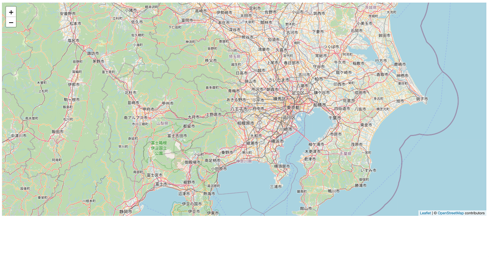
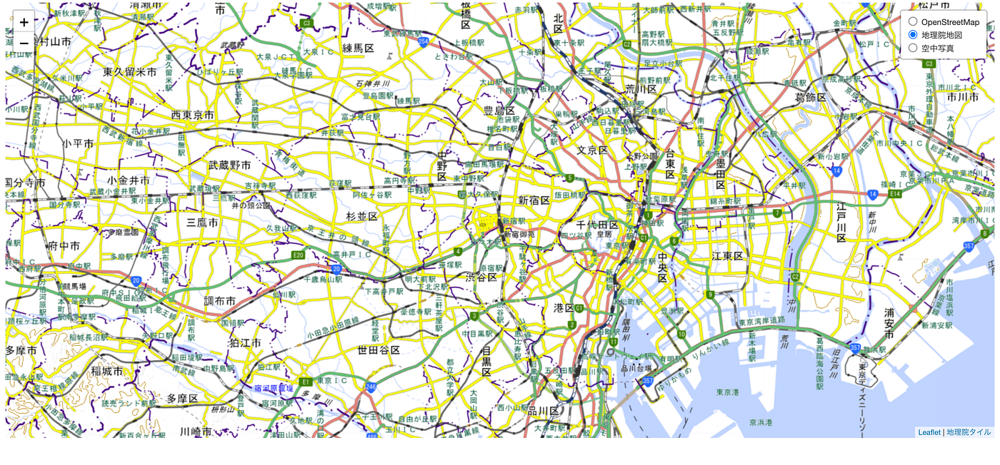

### HTMLで地図表示させてみた【Youth2週報】

みなさんこんにちは！Youth2の加藤です。

今回は古橋先生にお勧めされた井口奏大氏の著書である「[位置情報エンジニア養成講座](https://www.amazon.co.jp/%E7%8F%BE%E5%A0%B4%E3%81%AE%E3%83%97%E3%83%AD%E3%81%8C%E3%82%8F%E3%81%8B%E3%82%8A%E3%82%84%E3%81%99%E3%81%8F%E6%95%99%E3%81%88%E3%82%8B%E4%BD%8D%E7%BD%AE%E6%83%85%E5%A0%B1%E3%82%A8%E3%83%B3%E3%82%B8%E3%83%8B%E3%82%A2%E9%A4%8A%E6%88%90%E8%AC%9B%E5%BA%A7-%E4%BA%95%E5%8F%A3%E5%A5%8F%E5%A4%A7/dp/4798068926/ref=sr_1_1?crid=JLOELUUKUWN0&dib=eyJ2IjoiMSJ9.iayHJ_JSsluqbwLjkHR_ZD6G-Yir3k9zL9y0ew8Ig5b87yE3DP2xecZOyKqqsrz8iJKspNOZwZO_Nf5P--QPwulToVX6O1C4pq3g2DndI14xSvylQDeCvnZYCaoxeSYNGU1MZfevW0ap-K9Cf_XQRg.xzQwgwzAc2VZ8R7skAlHNbrc2GLHumlunFIIDBzdi5I&dib_tag=se&keywords=%E4%BD%8D%E7%BD%AE%E6%83%85%E5%A0%B1%E3%82%A8%E3%83%B3%E3%82%B8%E3%83%8B%E3%82%A2%E9%A4%8A%E6%88%90%E8%AC%9B%E5%BA%A7&qid=1762826772&sprefix=%2Caps%2C241&sr=8-1)」を参考にしてHTMLを使ってWebサイト上に地図を表示させるためのコーディングを行いました。いきなりですが実際に行ったコーディングを紹介したいと思います。

#### 1.まずはOpenStreetMapを表示させてみた

まずは任意のフォルダにindex.htmlを作成してからのHTMLを記入しました。これがないと始まりませんからね。

```xml
<!DOCTYPE hTml>
<html>
  <head>
     <title>サンプル</title>
  </head>
  <body>
  </body>
</html>

```

空のHTML作成完了。真っ白のページの完成です。ここからどんどんコーディングしていきます。

次は地図ライブラリである[Leaflet](https://leafletjs.com/)のCSSファイルとJavaScriptファイルを読み込みましょう。

```xml
<head>
        <title>サンプルタイトル</title>
        <!-- LeafletのCSS読み込み -->
         <link 
          rel="stylesheet"
          href="https://unpkg.com/leaflet@1.7.1/dist/leaflet.css" 
          integrity="sha512-xodZBNTC5n17Xt2atTPuE1HxjVMSvLVW9ocqUKLsCC5CXdbqCmblAshOMAS6/keqq/sMZMZ19scR4PsZChSR7A=="
          crossorigin=""
         />
        <!-- LeafletのJavascript読み込み -->
         <script
          src="https://unpkg.com/leaflet@1.7.1/dist/leaflet.js" 
          integrity="sha512-XQoYMqMTK8LvdxXYG3nZ448hOEQiglfqkJs1NOQV44cWnUrBc8PkAOcXy20w0vlaXaVUearIOBhiXZ5V3ynxwA=="
          crossorigin=""
         ></script>
    </head>
```

そしてLeaflet地図を埋め込むdiv要素を宣言。そしてOpenStreetMapの地図タイルを埋め込みます。

```xml
<body>
        <!-- 地図を表示するdiv要素を宣言 -->
         <div id="map" style="height: 80vh;"></div>
         <script>
          // 地図インスタンスを初期化 （=div要素に地図画面が埋め込まれる）
          const map = L.map('map' , {
            center: [36.5, 137.1], //初期表示の地図の中心の[緯度, 経度]
            zoom: 5, //初期表示の地図のズームレベル
          });
          // 背景レイヤーインスタンスを初期化
          const backgroundLayer = L.tileLayer(
            'https://tile.openstreetmap.org/{z}/{x}/{y}.png', // OSMのURLテンプレート
            {
                maxzoom: 19,
                attribution: 
                '&copy; <a href="https://www.openstreetmap.org/copyright">OpenStreetMap</a> contributors'
            },
          );
          // 地図インスタンスへレイヤーを追加
          map.addLayer(backgroundLayer);
         </script>
    </body>
```

ちなみにOpenStreetMapは出典を明記することで地図タイルを自由に使うことができます。地図タイルは一般にURLテンプレートと呼ばれるURL文字列で公開されており OpenStreetMapのURLテンプレートは以下の通り。

```bash
https://tile.openstreetmap.org/{z}/{x}/{y}.png
```

そんなこんなでもう完成。これでHTML上に OpenStreetMapが表示されるようになりました。HTMLの完成系はこんな感じ。

```xml
<!DOCTYPE html>
<html>
    <head>
        <title>サンプルタイトル</title>
        <!-- LeafletのCSS読み込み -->
         <link 
          rel="stylesheet"
          href="https://unpkg.com/leaflet@1.7.1/dist/leaflet.css" 
          integrity="sha512-xodZBNTC5n17Xt2atTPuE1HxjVMSvLVW9ocqUKLsCC5CXdbqCmblAshOMAS6/keqq/sMZMZ19scR4PsZChSR7A=="
          crossorigin=""
         />
        <!-- LeafletのJavascript読み込み -->
         <script
          src="https://unpkg.com/leaflet@1.7.1/dist/leaflet.js" 
          integrity="sha512-XQoYMqMTK8LvdxXYG3nZ448hOEQiglfqkJs1NOQV44cWnUrBc8PkAOcXy20w0vlaXaVUearIOBhiXZ5V3ynxwA=="
          crossorigin=""
         ></script>
    </head>
    <body>
        <!-- 地図を表示するdiv要素を宣言 -->
         <div id="map" style="height: 80vh;"></div>
         <script>
          // 地図インスタンスを初期化 （=div要素に地図画面が埋め込まれる）
          const map = L.map('map' , {
            center: [36.5, 137.1], //初期表示の地図の中心の[緯度, 経度]
            zoom: 5, //初期表示の地図のズームレベル
          });
          // 背景レイヤーインスタンスを初期化
          const backgroundLayer = L.tileLayer(
            'https://tile.openstreetmap.org/{z}/{x}/{y}.png', // OSMのURLテンプレート
            {
                maxzoom: 19,
                attribution: 
                '&copy; <a href="https://www.openstreetmap.org/copyright">OpenStreetMap</a> contributors'
            },
          );
          // 地図インスタンスへレイヤーを追加
          map.addLayer(backgroundLayer);
         </script>
    </body>
</html>
```

ついでにGithubも使ってみましょうか。今回のリポジトリはこちら。

[GitHub - yudai1206/location_app.github.io
Contribute to yudai1206/location_app.github.io development by creating an account on GitHub.github.com](https://github.com/yudai1206/location_app.github.io)

さらにさらにGithub Pagesで公開もしてみました。

[サンプルタイトル
Edit descriptionyudai1206.github.io](https://yudai1206.github.io/location_app/)

これで誰でももこのサイトを閲覧できるようになりました！やったね。



うーん。だけどこれだけだとなんか物足りない。。。

#### 2.レイヤ切り替えコントロールを実装して地理院地図と空中写真追加してみた

というわけで地理院地図と空中写真を追加して、レイヤを切り替えできるようにHTMLをいじってみましょう。ベースはもう完成しているのであとはちょこっと変更するだけ。

```javascript
 // レイヤー切り替えコントロール
            const layersControl = L.control
                .layers(baseLayers, [], { collapsed: false })
                .addTo(map);
```

Scriptの中に各地図の埋め込みと上のコードを追加するだけでレイヤ切り替えコントロールを用いて地図のレイヤを変更することができるのです！

完成系はこちら

```xml
<!DOCTYPE html>
<html>
    <head>
        <title>サンプル</title>
        <link
            rel="stylesheet"
            href="https://unpkg.com/leaflet@1.7.1/dist/leaflet.css"
            integrity="sha512-xodZBNTC5n17Xt2atTPuE1HxjVMSvLVW9ocqUKLsCC5CXdbqCmblAshOMAS6/keqq/sMZMZ19scR4PsZChSR7A=="
            crossorigin=""
        />
        <script
            src="https://unpkg.com/leaflet@1.7.1/dist/leaflet.js"
            integrity="sha512-XQoYMqMTK8LvdxXYG3nZ448hOEQiglfqkJs1NOQV44cWnUrBc8PkAOcXy20w0vlaXaVUearIOBhiXZ5V3ynxwA=="
            crossorigin=""
        ></script>
    </head>
    <body>
        <div id="map" style="height: 80vh"></div>
        <script>
            const map = L.map('map', {
                center: [35.68, 139.7],
                zoom: 12,
            });

            // 背景地図データ
            const baseLayers = {
                OpenStreetMap: L.tileLayer(
                    'https://tile.openstreetmap.org/{z}/{x}/{y}.png',
                    {
                        maxZoom: 19,
                        attribution:
                            '&copy; <a href="http://www.openstreetmap.org/copyright">OpenStreetMap</a> contributors',
                    },
                ),
                地理院地図: L.tileLayer(
                    'https://cyberjapandata.gsi.go.jp/xyz/std/{z}/{x}/{y}.png',
                    {
                        maxZoom: 18,
                        attribution:
                            '<a href="https://maps.gsi.go.jp/development/ichiran.html">地理院タイル</a>',
                    },
                ),
                空中写真: L.tileLayer(
                    'https://cyberjapandata.gsi.go.jp/xyz/seamlessphoto/{z}/{x}/{y}.jpg',
                    {
                        maxZoom: 17,
                        attribution:
                            '<a href="https://maps.gsi.go.jp/development/ichiran.html">地理院タイル</a>',
                    },
                ),
            };
            map.addLayer(baseLayers['OpenStreetMap']); // OSMを初期表示

            // レイヤー切り替えコントロール
            const layersControl = L.control
                .layers(baseLayers, [], { collapsed: false })
                .addTo(map);
                 </script>
    </body>
</html>
```

これもGithub使って公開してみました。

リポジトリ

[GitHub - yudai1206/location_app_layer.github.io
Contribute to yudai1206/location_app_layer.github.io development by creating an account on GitHub.github.com](https://github.com/yudai1206/location_app_layer.github.io)

Github Pages

[サンプル
Edit descriptionyudai1206.github.io](https://yudai1206.github.io/location_app_layer/)



感想

今回、ゼミ論でアプリ開発をしているということもありこのようなテーマにしてみましたが、HTMLとJavaScriptの基本的な仕組みを理解していれば意外とすんなり実装することができました。この知識をゼミ論にも活かしていきたいです！

グラレコ


