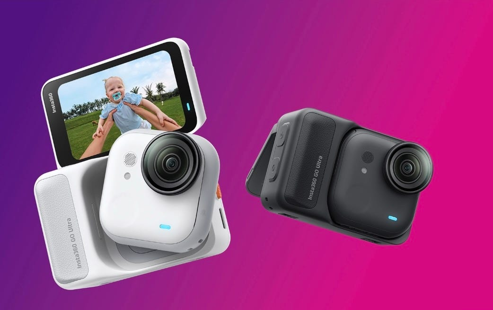
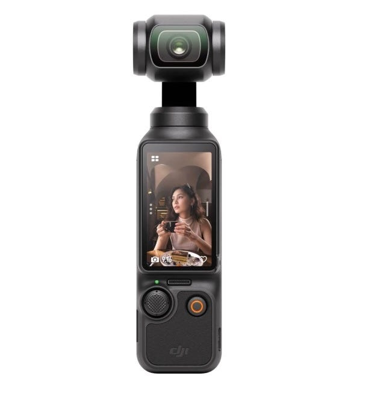
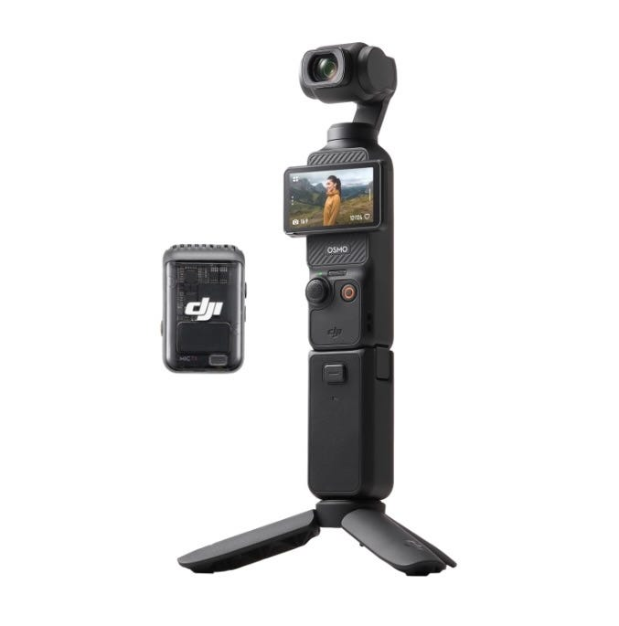
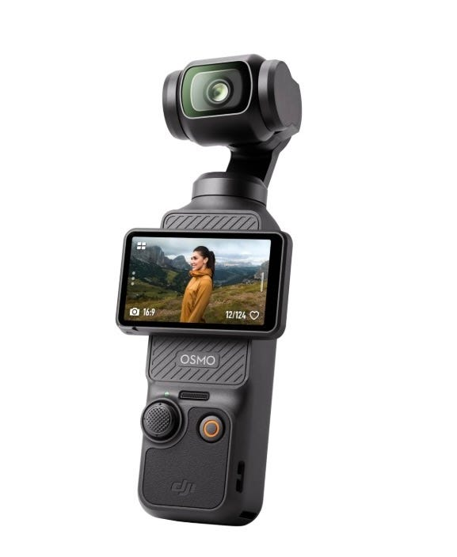
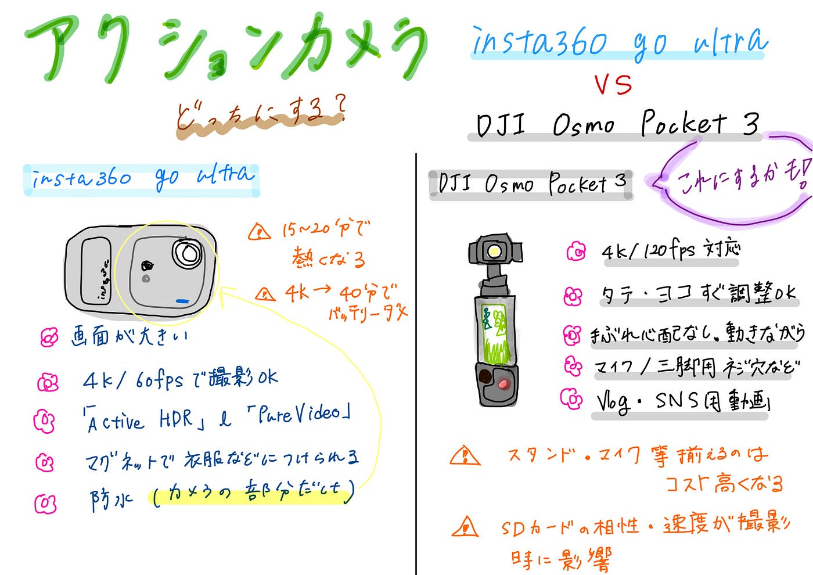

### アクションカメラを買いたい！から調べてみたV&F週報【11/11】

こんにちは、四年の福田です。

タイトル通り四年生になってからは自分の時間が増えてきて、旅行や今まで行きたくて時間がなくいけなかったお店等にいくことが多くなってきました。その時に、スマホカメラで撮影する選択肢しかないのですが、手荷物が多い時にスマホ回すのが大変だったり、通知が来て上に上げようとしたのに間違えてタップしたりなどちょっと撮りたいけど、めんどくさくなって撮らないが多めです。

Tiktokのvlog見ててアクションカメラ使ってる方が多いなと思って私も欲しいなと思いました。なので、どれがいいか調べていたので、まとめながら決めていきたいと思います。

二つまで絞りました。ビックカメラで見たりして、比較動画等参考にしながら！

#### **[insta360 go ultra**](https://www.insta360.com/jp/product/insta360-go-ultra)

このカメラの特徴について↓

1. 画面が大きい。

1. 最大解像度として 4K／60fps の動画撮影が可能。

1. 「Active HDR」や「PureVideo」モードなど、映像の階調・色合い・手ぶれ補正を支える機能も。

1. 本体重量およそ 53g。手首につけたり、服／帽子／車体などにマグネットで取り付けたりと自由度高。

1. 水深10m相当の IPX8 防水性能（カメラ単体）。（取り外した部分）

1. 両手使えない時便利。

問題点（気になる所）

1. 口コミで15〜20分で熱問題（お店で見た時はあんまりわからなかった)

1. 4kで撮影する場合、40分でバッテリー無くなる（画質落とした場合は長く持つ）

最初見てい他参考動画（装着して撮ってみた様子等あるので興味のある方はぜひ）

#### DJI Osmo Pocket 3

特徴↓

1. 4K／120fps の動画撮影対応

1. 2インチ回転式タッチスクリーンを搭載し、縦撮り・横撮り両方にスムーズに対応（指で回せばすぐ回転するようになっている）

1. 手ぶれをしっかり補正。動きながらでも安定した映像。

1. 別売のバッテリーハンドルで駆動時間をさらに延長、外部マイク／NDフィルター／三脚用ネジ穴など、撮影の幅を広げる構成。手で持たなくてもおk

1. Vlog・SNS用動画を撮るのにちょうどいい

問題点

1. スタンド、マイク等揃えるとコストは高くなる

1. SDカードの相性や速度が撮影時に影響するというコメント

参考にした動画（一年使った方が出した動画）

まだ完全に決まったわけではないが、Osmo Pocket 3がいいかなと思っているのでこれになるかと。

#### グラレコ

