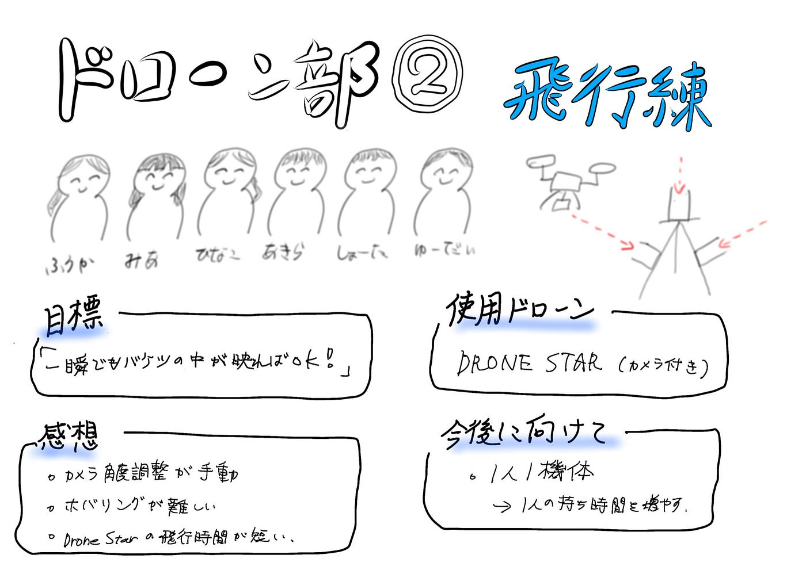

## ドローン部②今週も飛行練しました

週報を担当しますテラドです。

11月6日の4限の時間にドローン部②と、ドローンに興味のある3年生たちで集まりました。

#### 使用ドローン

使用したのはカメラ付きの「**DRONE STAR**」。今回は、前回の週報でふうかに紹介してもらった**NIST STM for sUSA**を使って「バケツの中を映す」練習と、基本のホバリング練習を行いました。

[NISTが提唱！ドローン操縦者技能評価メニューへの挑戦【ドローン②週報】
ドローン部２の週報を担当します岡村です。medium.com](https://medium.com/furuhashilab/nist%E3%81%8C%E6%8F%90%E5%94%B1-%E3%83%89%E3%83%AD%E3%83%BC%E3%83%B3%E6%93%8D%E7%B8%A6%E8%80%85%E6%8A%80%E8%83%BD%E8%A9%95%E4%BE%A1%E3%83%A1%E3%83%8B%E3%83%A5%E3%83%BC%E3%81%B8%E3%81%AE%E6%8C%91%E6%88%A6-%E3%83%89%E3%83%AD%E3%83%BC%E3%83%B3%E2%91%A1%E9%80%B1%E5%A0%B1-1dc4f0f590a8)

#### 今回の目標と感想

**「とりあえず一瞬でもバケツの中が映ればOK！」というシンプルなもの。**

実際に飛ばしてみると、**カメラの角度調整が手動**で意外と難しいことに気づきました。適切な位置を見つけないとバケツの中が映らず、少しのズレで全く違う方向を向いてしまいます。

また、ホバリングで同じ場所に留まるのもかなり難しく、ほんの一瞬しかバケツの中が見えなかったり…。改めて、**安定した操作＝ホバリングの精度が重要**だと感じました。

**DRONE STARの飛行時間はおよそ5〜6分**。今回は1機＋バッテリー2本をみんなで回していたため、1人あたりの持ち時間に少し偏りが出た印象もありました。

#### 今後に向けて

今後は、自分の機体を持っている人はバッテリーが切れるまで飛ばす、持っていない人は他の人から借りる or 研究室のカメラ付きドローンを使うなど、練習効率を上げる工夫をしていきたいです。

今後は、「1人1機体」でバケツを映す練習を続けていけば、ある程度安定して飛ばせるようになるのではないかと感じました。

また、研究室にある屋外用ドローンも活用して、もう少し広いスペースでの練習も試してみたいと思います。外で飛ばせたら、より実践的な練習になりそうです！

🎥 練習の様子はこちらです

グラレコ

