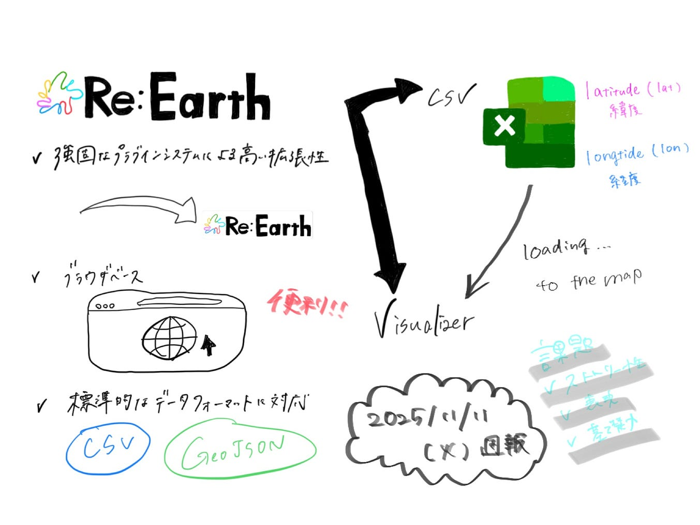

### 卒論のためにRe:Earthについて学んでみた

４年ユースの金澤です。

卒論の中間発表が近づいていますね。私の卒論のテーマは、“知覧町特攻隊の歴史を空間 × ストーリーで伝えること”であり、そのために Re:Earth を活用しようと考えています。

そこで、今週の週報では、私も含め、初学者にもわかるように、**CSV・Visualizer の基礎**をまとめていこうと思います。

### **１Re:Earth Visualizerとは？ （**[引用](https://help.reearth.io/9ef9eb31c49246e18d5df2c5ba6a05ad)）

フリーでオープンな拡張性の高いWebGISプラットフォーム。

[ビジュアライザーとは？ | Notion
はじめにeukarya.notion.site](https://eukarya.notion.site/Visualizer-1a816e0fb16580bda8b2c2699f80399c?p=19616e0fb16580149a6dcdd1952579d6&pm=s&source=post_page-----2b2afd639dde---------------------------------------)

**⑴ 強固なプラグインシステムによる高い拡張性**

> **プラグインシステム**：既存のアプリケーションやソフトウェアに機能を追加・拡張するための仕組み

つまり、自転車（本体）を作り直さなくても、かごやライト、ベル（付け足しパーツ）を追加できるイメージ。

**⑵ ブラウザベースのため、非常に便利**

ブラウザ上で動作する完結したWebGISプラットフォームで、インストール不要、いつでもどこでもデータにアクセスでき、**チームメンバーとの連携も簡単に**行える。（URLのみで共同編集可能、相手もすぐに参加可能。また、編集内容がリアルタイムに更新され、チーム戦に最適。さらに、Google Appの様に、閲覧だけor 編集可能など、役割をワンクリックで設定できる。）

**⑶ 標準的なGISデータフォーマットに対応**

一般的なGISデータ形式の読み取りに対応、既存のGISソフトで作成・編集したデータを読み込んで可視化することができる。

※現在対応：CSV、KML、CZML、GeoJSON
→其々のデータについて、全部「地理データのファイル形式」であるが、
 **場所の情報（座標）＋属性データ**をどう保存するかによって違いがある。

> 1. CSV

**ただの表データ （❌地理専用）**Excelの様に行と列で構成され、「緯度」「経度」の列を持てばGISで地図として使える。シンプルで軽い。

```css
name,lat,lon
店A,35.6,139.7
```

> 2. KML

**Google Earthなどで使う地理用XML形式。**点・線・面を表現し、アイコン、色、説明文などを細かく設定できる。Google Earthでルートや地点を共有する際に使用される。

> 3. CZML

**Cesium専用の動的3D地理データ形式。**時間の概念を持ち（アニメーション可能）、飛行ルートが動く。3Dオブジェクトの移動や変化を記述できる。

> 4. GeoJSON

**WebGISで一番使われる、JSON形式の地理データ。**軽い、扱いやすい。Re:Earth・Mapbox・Leafletなど全部対応。点・線・ポリゴンなどを表現

**⑷ マップのスタイルを自由に設定可能**

山の高さのような“地面のデコボコ”を、状況に応じて別のバージョンに切り替えたり、地球の大気の密度や色を変えるなど、自由な発想で楽しめる。Cesiumの高度な表現をより簡単に。

### ２Re:Earth の全体像

今回は卒論の序論について試作版を作成しました。

以下が、その際参考にしたわかりやすいマニュアルと簡単な説明です。

> CSV

「店の名前」「緯度」「経度」など、場所の情報が書いてあるだけの、見た目は地図じゃないただのメモ帳。例えると、 **「レゴのパーツの一覧表」**
 パーツが何個あるかが書いてあるだけで、遊べない。

[CSV | Notion
CSVとはeukarya.notion.site](https://eukarya.notion.site/CSV-19616e0fb165805b9d73f747fc176141?source=post_page-----2b2afd639dde---------------------------------------)

### ３ 卒論の試作版を実際にRe:Earthで作成してみた

[https://s-01k9k4c7vppg25rh676ad7sqxw.visualizer.reearth.io](https://s-01k9k4c7vppg25rh676ad7sqxw.visualizer.reearth.io)



#### 4 課題点

・序論（太平洋戦争の一連の流れ）から、本論（知覧特攻隊が出撃することになったことと、当時の実情）への流れをどう表現するか

・右のインフォボックスより左の自分で打ち込む形式の方が良いのか

とにかく、基礎を使いこなしていかないと、表現のフェーズに立てないと焦りました。ひたすら頑張ります
