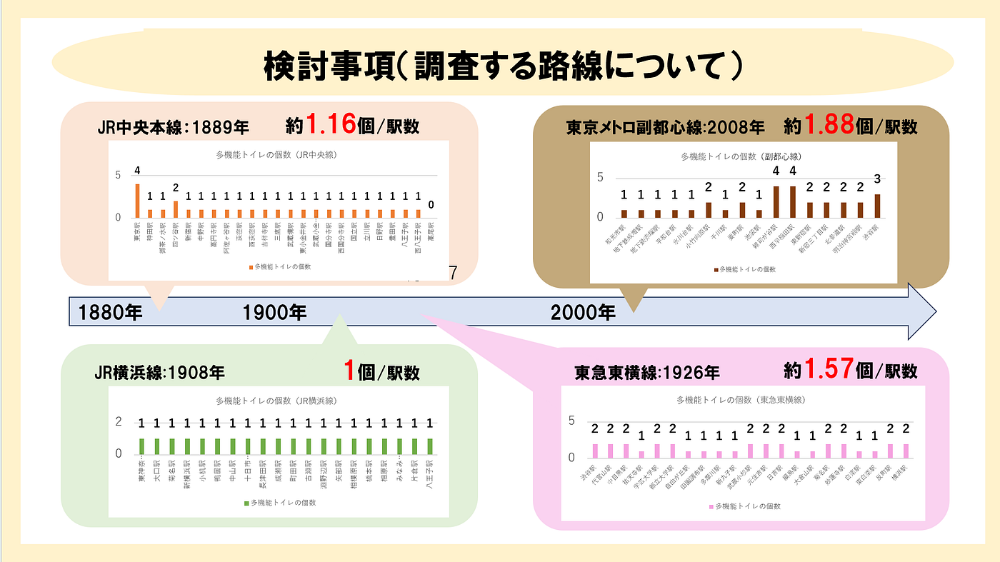
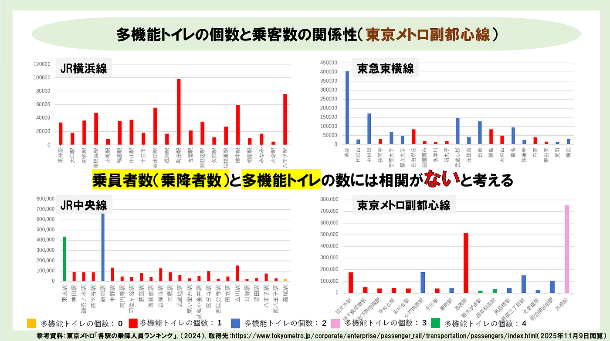
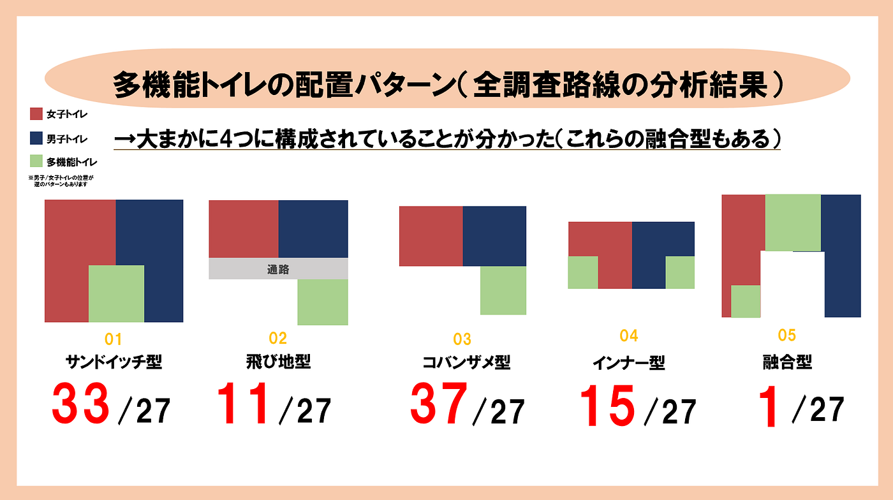
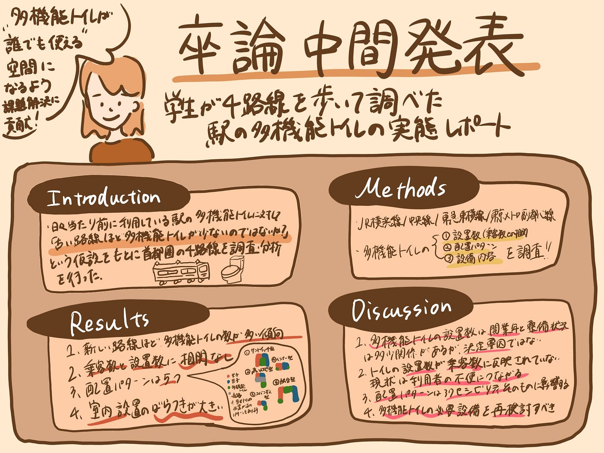

### 【卒論中間発表】学生が4路線を歩いて調べた、駅の多機能トイレの実態レポート

あっという間にクリスマス、年末ムーブが来てしまい焦っている古橋研究室4年の林です。

今回の記事では、3年から調査している「駅構内の多機能トイレを対象とした設置状況に関する調査」の結果をIMRaD形式で報告します。

GitHub：[2025gsc_YukariHayashi/README.md at main · furuhashilab/2025gsc_YukariHayashi](https://github.com/furuhashilab/2025gsc_YukariHayashi/blob/main/README.md)

中間発表資料：[卒論中間発表用スライドの作成 · Issue #6 · furuhashilab/2025gsc_YukariHayashi](https://github.com/furuhashilab/2025gsc_YukariHayashi/issues/6)

### Introduction

毎日多くの人が利用する駅は、単なる交通インフラではなく、街の生活を支える「公共空間」そのものだ。その中でも、トイレの存在はしばしば当たり前のように扱われるが、実は利用者の多様性をもっとも敏感に映し出す場所でもある。障害のある人、ベビーカーを押す親、高齢者、そして性的マイノリティの人たち「誰でも安心して使える」ことが求められる空間は、駅構内の中でも多機能トイレだと考える。

私はこの研究を通して、駅にある多機能トイレの数や質が、想像以上に路線や駅ごとで差があることに気づいた。「古い路線ほど多機能トイレが少ないのではないか？」という仮説をもとに、JR横浜線・東急東横線・JR中央線・東京メトロ副都心線を対象に調査を行い、設置数、配置パターン、設備内容を分析した。

駅のトイレは「使えて当たり前」と思われがちだが、実際にはその背後で、歴史・構造・予算・設計思想といった多くの要因が絡み合っている。本稿では、私が行った調査の成果をもとに、駅という日常の空間に潜む見えない格差をまとめた。

### Methods

今年度の調査対象は、以下の2路線に設定した。

- **JR中央線（快速）**：東京〜高尾の24駅

- **東京メトロ副都心線**：和光市〜渋谷の16駅

3年での調査対象

- **JR横浜線**：八王子～東神奈川の20駅

- **東急東横線**：渋谷～横浜の21駅

調査結果まとめ：

- [【ゼミ論最終発表】多機能トイレが充実している路線は！？ — Furuhashi(mapconcierge)Lab. — Medium](https://medium.com/furuhashilab/%E3%82%BC%E3%83%9F%E8%AB%96%E6%9C%80%E7%B5%82%E7%99%BA%E8%A1%A8-%E5%A4%9A%E7%9B%AE%E7%9A%84%E3%83%88%E3%82%A4%E3%83%AC%E3%81%8C%E5%85%85%E5%AE%9F%E3%81%97%E3%81%A6%E3%81%84%E3%82%8B%E9%A7%85%E3%81%AF-23d2b9b30de3)

- [【ゼミ論中間発表】JR横浜線の多機能トイレを調査してみた！ — Furuhashi(mapconcierge)Lab. — Medium](https://medium.com/furuhashilab/%E3%82%BC%E3%83%9F%E8%AB%96%E4%B8%AD%E9%96%93%E7%99%BA%E8%A1%A8-jr%E6%A8%AA%E6%B5%9C%E7%B7%9A%E3%81%AE%E5%A4%9A%E6%A9%9F%E8%83%BD%E3%83%88%E3%82%A4%E3%83%AC%E3%82%92%E8%AA%BF%E6%9F%BB%E3%81%97%E3%81%A6%E3%81%BF%E3%81%9F-85cf769c33ca)

どちらの路線も、改札内に設置された「多機能トイレ」のみを対象とし、駅を実際に訪れて位置・設備・内装を1つずつ確認した。構内案内図や現地写真をもとに、各トイレの配置パターンも記録した。

調査では以下を重点にした。

- 設置個数のカウント

- 設置設備の確認

- トイレの位置と構内動線の関係

- 路線の開業年・乗降客数データとの比較

- 配置パターンの類型化（サンドイッチ型／コバンザメ型／飛び地型／インナー型／融合型）

調査で得られた位置情報は OpenStreetMap に反映し、市民が使えるオープンデータ化を行った。

### Results

実際に歩いてみると、駅ごと・路線ごとの“個性”が見えてきた。数値としては、特に以下が特徴的だった。

**1．新しい路線ほど、多機能トイレが多い傾向にある**

副都心線（2008年開業）では、駅あたり**1.88室**ともっとも多く、
 中央線（1889年開業）では**1.16室**にとどまった。

既往研究の横浜線（1908）では1.00、東横線（1926）では1.57と、
 「古い＝少ない」とは単純化できないが、一定の傾向は確認できた。

**2. 乗客数とは、ほとんど相関がなかった**

利用者が多い駅でも多機能トイレが1室しかない例があり、逆に利用者が少なくても1室は確保されている駅も多い。

構造の制約や改修費用の優先順位などが影響していることが推測できる。

**3. 配置パターンは5種類に整理できた**

ほとんどの駅で、2つの類型が中心だった。

- サンドイッチ型：男女トイレの間

- コバンザメ型：男女トイレに寄り添う形

一方、歩いた中で新たに「融合型」というパターンも確認し、駅ごとの歴史と構造に応じて多様な配置が存在していた。

**4. 室内設備のばらつきが大きい**

多機能トイレという名前は同じでも、介護者呼び出しボタン、オストメイト設備など、駅によって装備の差は大きかった。

利用者が期待する「標準」が駅によって実は違うという現実が見えてきた。

### Discussion

調査を通して見えてきたのは、「多機能トイレの整備は、量・質・配置のどれをとっても統一されていない」という事実だ。

**1．多機能トイレの設置数は開業年と整備状況は関係するが、決定要因ではない**

たしかに新しい路線だけを見ると、計画段階からバリアフリーが組み込まれているため設備は充実していた。しかし、横浜線のように古くても改修によって整備が進んだ例もある。つまり、駅トイレの整備は“歴史”だけでは説明できず、更新タイミングや事業者の判断に大きく左右されると考える。

**2．多機能トイレの設置数に対して乗客数が反映されていない現状は、利用者の不便につながる**

本来、多機能トイレのニーズが最も高まるのは大規模駅だ。それでも整備が追いついていないのは、設備の大きさ・構造上の制約・予算配分など複合的な理由がある。ただし、これは「利用が集中する場所ほど、困難が増す」という問題を残し続ける。

**3．配置パターンはアクセシビリティそのものに影響する**

サンドイッチ型は見つけやすいが、人の動線が重なって混雑を生みやすい。コバンザメ型は動線は自然だが、エレベーターから遠いと車いす利用者には負担になる。広い意味での“使いやすさ”は、数以上に配置で決まることが多いのではと考察する。

**4．必要設備のガイドラインは再検討の必要性がある**

同じ「多機能トイレ」という名称でも、政府指定の基準には乗っ取っているが、設備レベルは駅ごとに大きく異なる。

#### 今後の展望

今回の調査を通して、私は駅トイレが「誰でも使いやすい空間」であるために、まだ取り組むべき課題が多いことを実感した。

今後は、

- OSMに駅内のトイレ情報の追加

- 最適な多機能トイレモデルの提案

- 必須設備のガイドラインの再提案

など、より実践的な提言につなげたいと考えている。

### 参考文献リスト

[https://docs.google.com/spreadsheets/d/1_htBHMGLvDqyguEaD0hBDAog1N85OBTi-HCpMyStdFk/edit?gid=0#gid=0](https://docs.google.com/spreadsheets/d/1_htBHMGLvDqyguEaD0hBDAog1N85OBTi-HCpMyStdFk/edit?gid=0#gid=0)

### グラレコ

