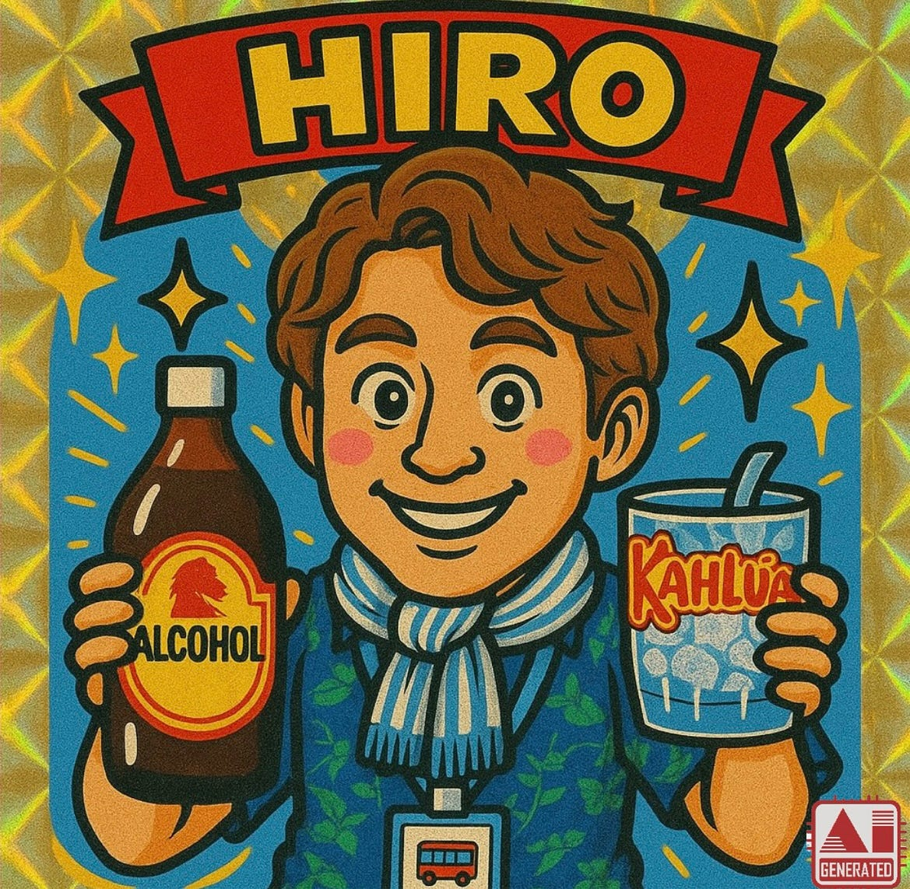
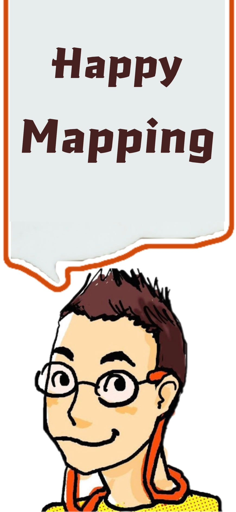
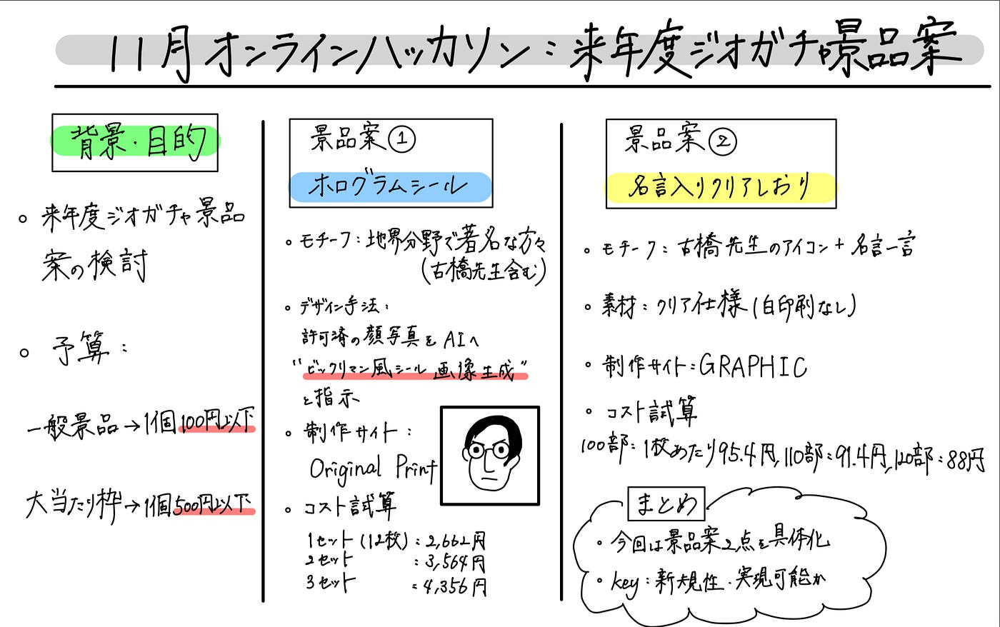

### 【11月ハッカソン】来年度ジオガチャ景品案の検討・試作

11月のオンラインハッカソンでは、来年度実施予定のジオガチャ企画に向けての景品案を出し合いました。
さらに、以下の条件を元に可能な範囲でプロトタイプ制作にも取り組みました。

- 一般景品は 1 個あたり 100 円以下で制作可能であること

- 大当たり枠は 1 個あたり 500 円以下を上限とする

- 従来のジオガチャとは異なる、新規性のあるコンテンツを企画すること

V&Fでは2 つの景品案を具体化し、試作方法・費用想定まで整理しました。

### 1. ホログラムシール（大当たり枠）

まず、大当たり枠として選定したのが「ホログラムシール」です。
 地図分野で著名な方々（古橋先生を含む）をモチーフに、ビックリマンチョコシール風のデザインを生成し、ホログラム仕様で制作を検討しました。

### デザイン・制作の流れ

1. 顔写真提供について対象者へ了承を取得

1. ChatGPT（2025–11–22版）に「ビックリマンチョコシール風の画像生成をして、名前は○○にして」と入力しデザイン案を生成

1. 生成画像をホログラムシールとして発注手配

### コスト試算

- 制作サイト：[Original Print](https://originalprint.jp/seals/%E3%83%9B%E3%83%AD%E3%82%B0%E3%83%A9%E3%83%A0%E3%82%B7%E3%83%BC%E3%83%AB%2012%E6%9E%9A%E3%82%BB%E3%83%83%E3%83%88%EF%BC%88%E3%82%B9%E3%82%AF%E3%82%A8%E3%82%A2%EF%BC%89)

- デザインごとに別発注、12枚単位で注文

- 1セット：2,662 円 （1枚あたり約 222 円）

- 2セット：3,564 円 （1枚あたり約 149 円）

- 3セット：4,356 円 （1枚あたり約 121 円）

この試算により、「大当たり枠」であっても予算枠内に収まる可能性があることを確認できました。

### 2. 名言入りクリアしおり（一般景品枠）

次に、一般景品枠として「名言入りクリアしおり」を提案します。

### デザイン案

- 古橋先生のアイコン＋名言を一行添える構成

- 白印刷なしのクリア仕様で、地図上で使っても違和感がないデザイン

### コスト試算

- 制作サイト：[GRAPHIC](https://www.graphic.jp/price/pp_bookmark_set/359_2_189_9404_101)

- 100部：1枚あたり 95.4 円

- 110部：1枚あたり 91.4 円

- 120部：1枚あたり 88 円

この結果、一般景品として目標の“1個 100円以下”を達成できることが確認されました。

### グラレコ

