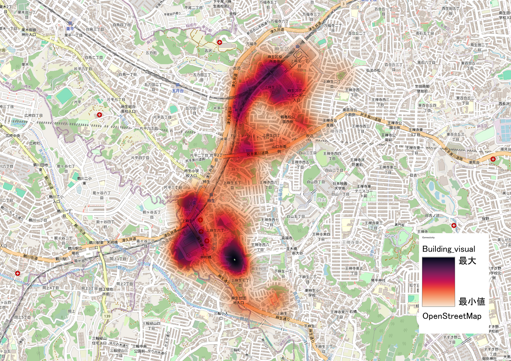
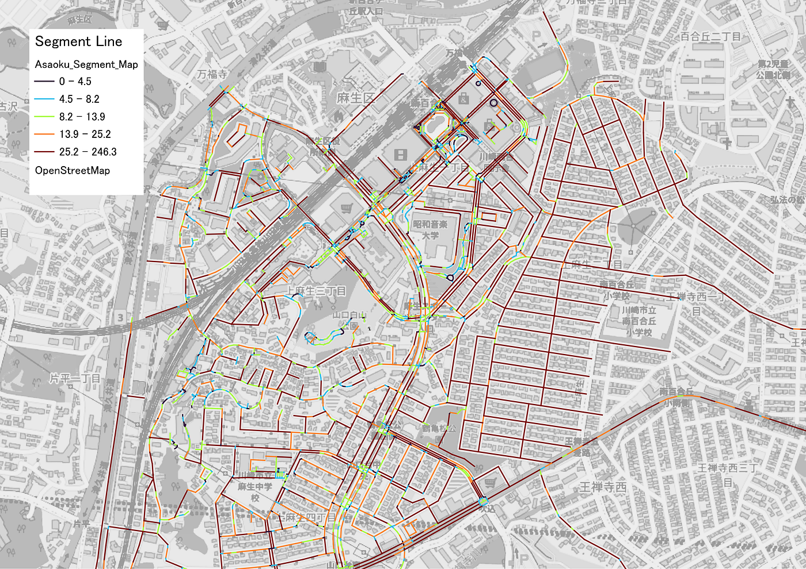
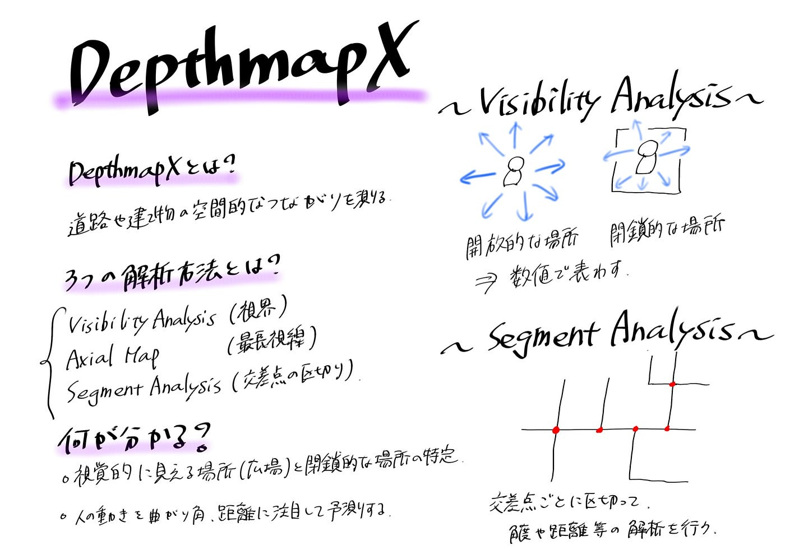

### DepthmapX使ってみた！

こんばんは。テラドです。

[GitHub - furuhashilab/2025GSC-Hinako-Terado: 2025ゼミ論
2025ゼミ論. Contribute to furuhashilab/2025GSC-Hinako-Terado development by creating an account on GitHub.github.com](https://github.com/furuhashilab/2025GSC-Hinako-Terado.git)

#### 今回私がDepthmapXで行ったこと

1. データの準備とエクスポート(QGIS/Quick OSM)

1. 空間解析の実行(DepthmapX)

- 建物データを用いた空間解析

- 道路データを用いた空間解析

3．解析結果の可視化(QGIS)

4．解析結果の理解

こちらのtutorialを参考に、

神奈川県川崎市にある上麻生を解析対象エリアに解析を行いました。

Tutorial Manualです。

[Tutorial | Notion
チュートリアルが実行している主要な解析www.notion.so](https://www.notion.so/Tutorial-2b4ad1d01b29800395c4d8d7ac594856?source=copy_link)

#### DepthmapXを使って何か分かったことはあったのか？

まず、動作方法にとても苦戦しました。

そもそもQGISも満足に使えない状況からのスタートで、データの抽出方法からCRS（座標参照システム）の設定、ファイルのエクスポート。

挙げたらきりがないくらいほど、たくさんのエラーに遭遇し一つ一つ解決していきました。

今回の中間発表は、tutorialを完全に終わらせてDepthmapXをある程度使えるようになることが目的で、

_**QGISでデータの準備、CRSの設定、データのDXF化。DepthmapXでの解析作業、MIF/MIDのエクスポート。そして、QGISで可視化。_**

この一連の流れをスムーズにできるようになりました。

次に、Space Syntaxという新たな学問分野の理解。

解析作業に時間がかかってしまい、正直まだ完全に理解が追い付いているわけではありません。

専門的な内容すぎて、学生が行う内容ではないと思われるので、別のアプローチから都市構造について理解してみようと思います。

最後に、

今回たまたま都市の成熟度を測る論文を見つけ、Space Syntaxという理論に出会いました。そこから街路ネットワーク、土地密度、土地利用を重ね合わせることで都市の成熟度合いを知ることができるそう。

私も日本の都市でやってみよう！というのが今年の目標でしたが、難しすぎるので考え直して、どのような視点から都市の分析をしようかと現在考え中です。

#### 今後に向けて

卒論の研究テーマを見つけるために、論文や本を読んで行こうと思います。

#### 成果

