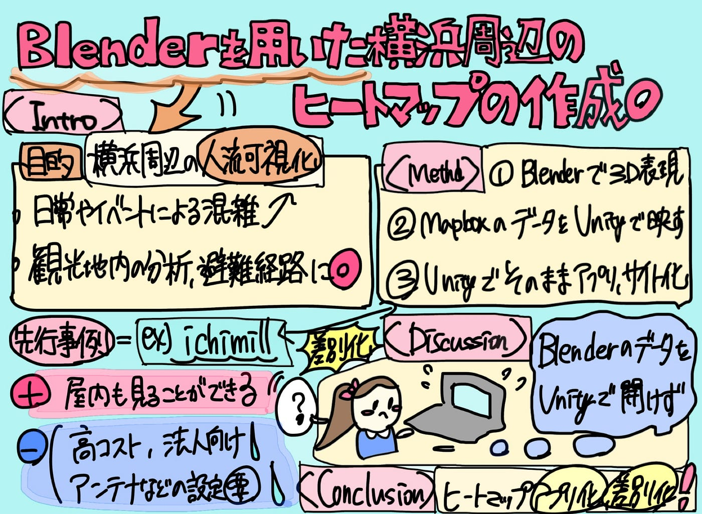

### 【ゼミ論中間発表】Blenderを用いた横浜周辺のヒートマップ作成

こんにちは！3年の稲田です。

今回は11月25日のゼミ論・卒論中間発表に向け、私が現在行っているBlenderを用いた横浜周辺のヒートマップ作成に関する研究の進捗状況や今後の流れについて報告していきます。

下記が3分発表用の[スライド](https://www.canva.com/design/DAG5oJXdYuI/uWB4aMCNfIWwidyLnPArxA/edit?utm_content=DAG5oJXdYuI&utm_campaign=designshare&utm_medium=link2&utm_source=sharebutton)になります⤵️

ここからは、古橋研究室のREADME内の卒論/ゼミ論ルールに則り、[IMRaD型](https://ja.wikipedia.org/wiki/IMRAD)で記載します。

(スライドと同じ内容になるため、中間発表の3分間はスライドのみの投影で大丈夫です！)

### Introduction(導入)

ゼミ論の概要は合宿での発表時と同じです。

> 本研究では、横浜駅周辺の人の動き・行為をBlenderを用いて3Dヒートマップとして可視化することを目的とする。

> 横浜駅は国内有数の巨大ターミナルであり、多くの人々の通勤通学の拠点であると同時に、観光スポットの密集地でもある。そのため、駅周辺の人流は日常と観光、大型イベントになどにより複雑なパターンを示すだろう。

> 歴史的に人類はこれまで紙地図やGoogle Mapsなどの2D地図に依拠してきたが、混雑時や災害時の避難経路として十分に理解するため、本研究ではBlenderによる3D化を行う。人々の移動を視覚的かつ体感的に理解することで、都市観光における回遊性の分析や、災害時に見る避難経路として、3Dによる分かりやすさを提示する。

ゼミ論/卒論においては、最終的にBlenderや他ツールを用いて、他との差別化要素を加えたヒートマップアプリもしくは現在地共有アプリ、サイトという成果物の提出を考えています。

また、現在地共有アプリの分析をした資料はあまり存在していないというフィードバックをいただいたため、アプリを作るにあたって、先行事例の課題や歴史を調べたいです。

(先行事例について調査)

🍒◎「ichimill」…高精度測位置サービス

メリット…屋内も見ることができる

デメリット…

・申し込み型有料サービス→[高コスト](https://ichimill.aeroentry.jp/?utm_source=chatgpt.com)

・RTK 対応アンテナ、受信機など[設定の必要性](https://www.softbank.jp/biz/services/analytics/ichimill/ichimill-tips/ntrip-settings/)

・[法人利用が主流](https://www.softbank.jp/biz/services/analytics/ichimill/ichimill-tips/ntrip-settings/)となっているため敷居が高い

**①リアルタイム位置情報系アプリ**

→スナップチャット、Googleマップ、WhatsApp、Yahooマップ(終了済)、ゼンリー(終了済)、Facebook(終了済)など

**②学生のアプリ作成事例**

→ ロケーションマインド(東大生が作成したリアルタイムタイム情報マップ)

### Method(方法)

次に、1月末の発表までの目標についてです。

①〜③の流れに沿って進めていきたいです。

> ①Blenderを使ったヒートマップの3D表現

> ②Mapboxの人流データをUnityで可視化する

> ③アプリ化もしくはサイト化を目指す

【〜アプリ化の際には〜】

作成する過程で他アプリやマップとの差別化を測りつつ、既にサービス終了したアプリなどが抱えていた課題や欠点を調べて把握し、それらを払拭するような新しいスタイルの物にしたいです。

### Results (進捗)

現在までの進捗状況、今後の進捗状況については、GitHub内にIssueとして記載して行きます。

> ①Blenderを使ったヒートマップの3D表現

まずは、①についてです。

[①Blenderを用い横浜駅周辺の3D地図作成 · Issue #5 · furuhashilab/2025gsc_InadaYuka
・まずはblenderで立体地図を作る 横浜駅周辺の3D地図を自力で作成するのは難易度が高い →そこで、YouTube上の動画を参考にした。 https://youtu.be/sTyYVCvS_eA?si=8Xa5mgXPA7Mu79VB…github.com](https://github.com/furuhashilab/2025gsc_InadaYuka/issues/5)

> ②Mapboxの人流データをUnityで可視化

続いて、②についてです。

[②Mapboxの人流データをUnityで可視化する · Issue #6 · furuhashilab/2025gsc_InadaYuka
MapboxとUnityそれぞれを選んだ理由…github.com](https://github.com/furuhashilab/2025gsc_InadaYuka/issues/6)

現在の進捗状況としては、この②の途中まで進められているという状況です。

具体的には、Unity内に、横浜の2Dマップを生成する所まで完了しました。ここから、①の時にBlenderで作成した3Dモデルを乗せる予定です。

### Discussion (問題点や課題)

現在の進捗状況で止まっている原因として、Unityの扱いに慣れていないという部分があります。

> Blenderで作成した3Dモデルを乗せるにあたり、課題となっているのが、バグのような状況です。Blender内や、可視化サイト(Windows 3Dビューアー)では綺麗な3D地図として映るものの、Unity内では反応しないという問題が起きています。

この課題はかなり深刻だと感じていて、この状況のまま、画面が白くなるバグが治らないようであれば、MapboxやUnityを用いない、他の方法でのヒートマップ作成を考えていきたいです。

### Conclusion (今後の展望)

最後に、これからの進め方についてです。

> UnityにBlenderで作成したモデルが反映でき次第、 Mapboxの機能であるHeatmap Layerを重ね、ヒートマップを完成させたいです。

> また、作成した3Dヒートマップをアプリ化させる際には、登録したユーザーにリアルタイムの混雑状況を把握させつつ、「災害時に活用できる有力避難経路」や「普段から混雑しているポイント」についても提示するなど、+αの機能も搭載して、既存アプリ・サービス終了済みアプリとの差別化を測っていきたいと思っております。

> 卒論としては、ヒートマップ、もしくは現在地共有アプリの分析をした上で先行事例の課題、歴史を踏まえつつ、差別化要素のある全く新しい形の現在地共有アプリを完成させる予定です。

グラレコ

