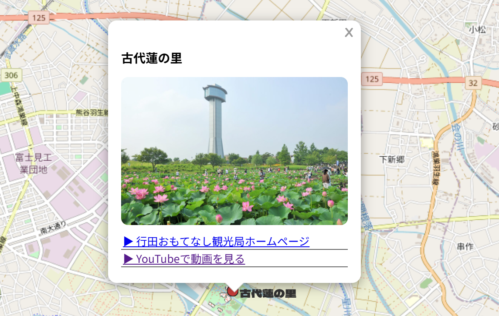
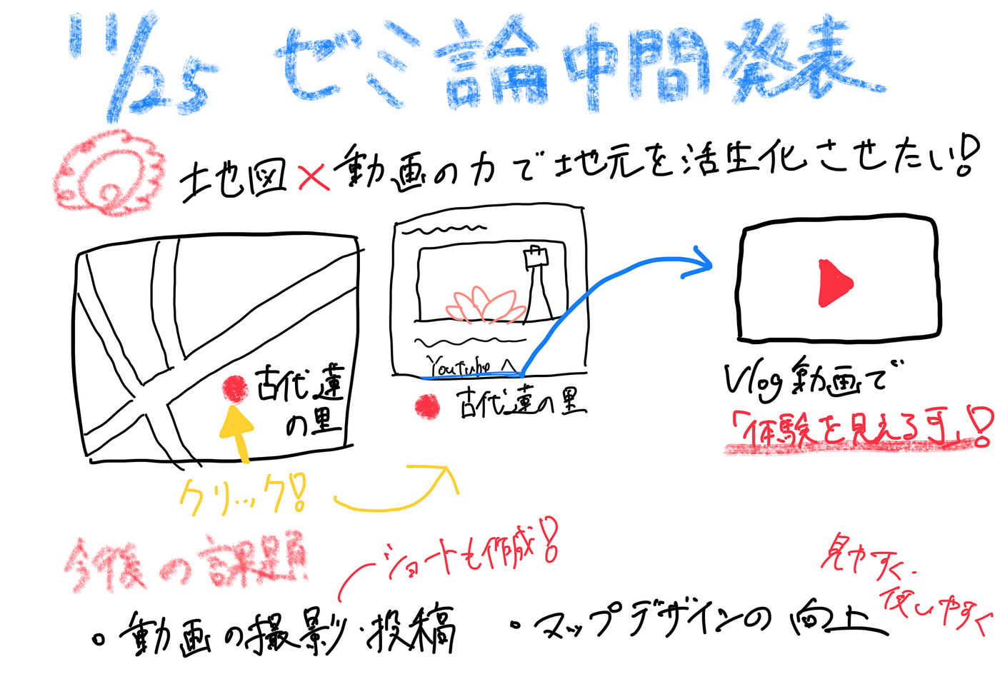

### 【ゼミ論中間発表】地図✖動画の力で地元を盛り上げたい！

こんにちは！最近バイクを買ったはいいものの、寒くてなかなか乗れていない荒川です。

今回は、私のゼミ論の中間発表をまとめました。

> _**発表スライド_**

[2025ゼミ論 中間発表 — Google スライド](https://docs.google.com/presentation/d/1CmGc4Rln8-TkVv6oGRRd13jz_N99A3MIi2Cyjd6I4s8/edit?slide=id.g3a6426898ac_0_30#slide=id.g3a6426898ac_0_30)

> _**Githubレポジトリ_**

[furuhashilab/2025gsc_ShotaArakawa: 2025ゼミ論](https://github.com/furuhashilab/2025gsc_ShotaArakawa)

以下、スライドの内容を抜粋したものです。

#### Introduction

本研究では、私の地元である行田市の観光地を対象とし、写真や動画を組み込んだ WebGIS形式の観光マップの作成を目的とする。近年、スマートフォンの普及により、紙の地図よりも Web 上で位置と情報が連動する観光マップが求められているが、既存のマップは写真や動画が不足し、観光地の雰囲気が十分に伝わらないという課題がある。
 さらに、WebGISは地域への興味や回遊の促進に寄与し得ると示されており（酒井, 2012）、観光地紹介における新しい情報提供手法として期待されている。そこで本研究では、地図上の各地点から写真や YouTubeにアクセスできる仕組みを構築し、利用者の理解や興味を高め、地域活性化に貢献することを目指す。

#### Methods

市内の観光スポットを表示するマップをqgis2webで作成し、公開する。

地図上のピンをクリックすると、施設概要や自身で作成したVlog動画へのリンクが表示され、施設への興味や訪問意欲向上を狙う。

QGISからqgis2webへエクスポートした際に、ポップアップ表示欄にエラーが見受けられたので、JavaScript ファイルを書き換え、対応する事にしました。書き換えコードに関しては、ChatGPTを使用しています。

#### 今後の課題

・動画撮影（ショート版も作成）

・マップのデザイン向上

