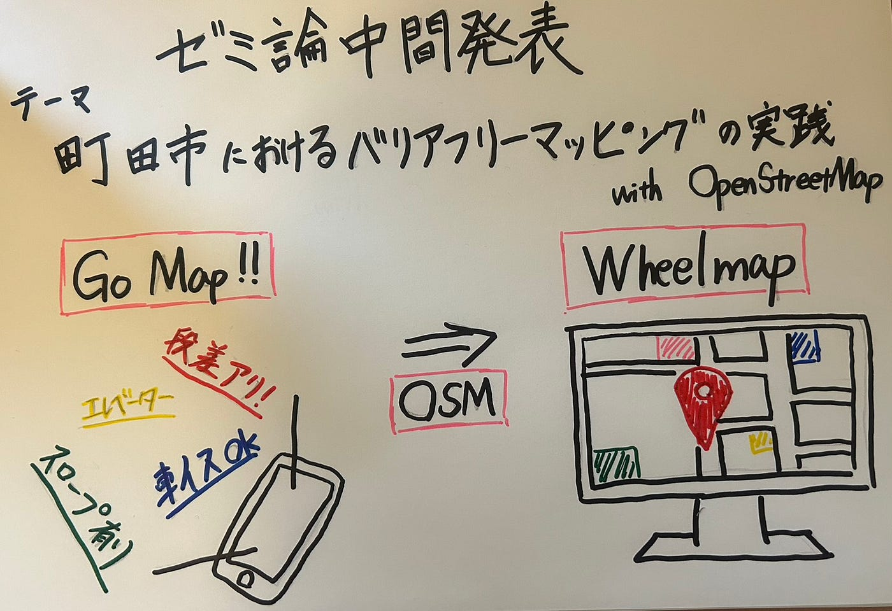

### 【ゼミ論中間発表】町田市をもっとマッピングし隊

こんにちは、3年の井上です。私事ですが、先日１年生から続けていたサークルを引退しました（お疲れ自分）！これから時間ができるかなと思うのでゼミからプライベートまでいろんなことに挑戦していきたいなとワクワクしています。

さて、今回は私のゼミ論の中間発表報告となります。

私のゼミ論のテーマは

「町田市におけるバリアフリーマッピングの実践 ― OpenStreetMapを用いた町田ゼルビア観戦支援ルート整備 ―」

となっています。以下にゼミ論リポジトリと発表スライド、中間報告の内容を紹介します。

> _ゼミ論リポジトリ（GitHub）_

[furuhashilab/2025gsc_RenseiInoue: 2025年ゼミ論](https://github.com/furuhashilab/2025gsc_RenseiInoue)

> _発表スライド_

> _報告内容_

発表スライドを抜粋し、IMRaD型で報告します。

#### Introduction

「本研究は、町田市と町田駅周辺を対象に、車椅子利用者や障害のある観客がサッカー観戦を円滑に楽しめる**バリアフリー対応ルートや施設を、OpenStreetMapおよびWheelmapで整備・可視化**することを目的とする。
Wheelmapはドイツ発の国際事例だが、日本国内での活用は主に駅周辺が中心で、スポーツ観戦に結びついたバリアフリーマッピング事例は数が少ない。

本研究では町田ゼルビアの本拠地**「町田GIONスタジアム」へのアクセシビリティ向上**に着目し、社会的包摂の促進とスポーツ×地理データ実践の融合を目指す。」

#### Method

「Go Map！を使って現地調査を行い、対象地域におけるWheelMapの整備を進める」

#### Results

「・町田駅周辺でGo Map！を使用

→使い方と使用を理解する

→タグ付けに必要な”[キーと値](https://github.com/furuhashilab/2025gsc_RenseiInoue/issues/5#issuecomment-3572684174)”を確立する

・WheelMapへの反映確認

→Go Map！、WheelMap、OpenStreetMapの関連を理解

→Go Map！でのデータの反映を一部確認」

#### Discussion

「・Go Map！で取得した情報がWheelMapに**反映される際に時間がかかったり、うまく反映されなかったりする**。

・まだ、町田駅の一部で町田GIONスタジアム周辺やそこまでのルート付近など**現地調査すべきところがかなり多い**。

・現在、車椅子を日常的に使わない私自身の主観で判断しており、**明確な基準が存在していない**。」

#### 今後の展望

「・車椅子での利用可能かどうかの判断基準の確立

・できるだけ早い段階での現地調査の完了

・Mapillaryを使っての写真記録の追加

・町田駅から町田GIONスタジアムへのバリアフリールートの確立」

最後にグラレコです。

