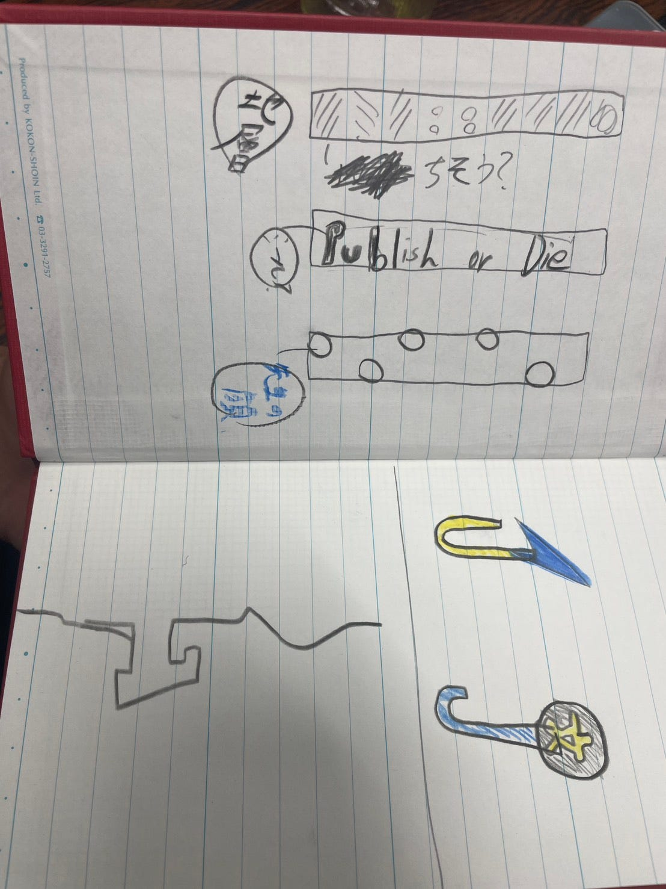
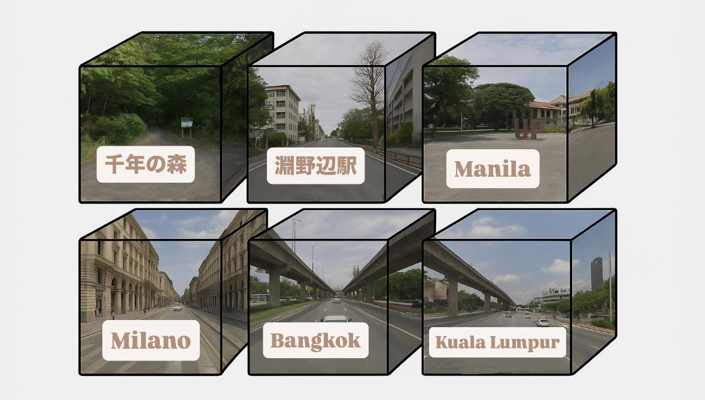
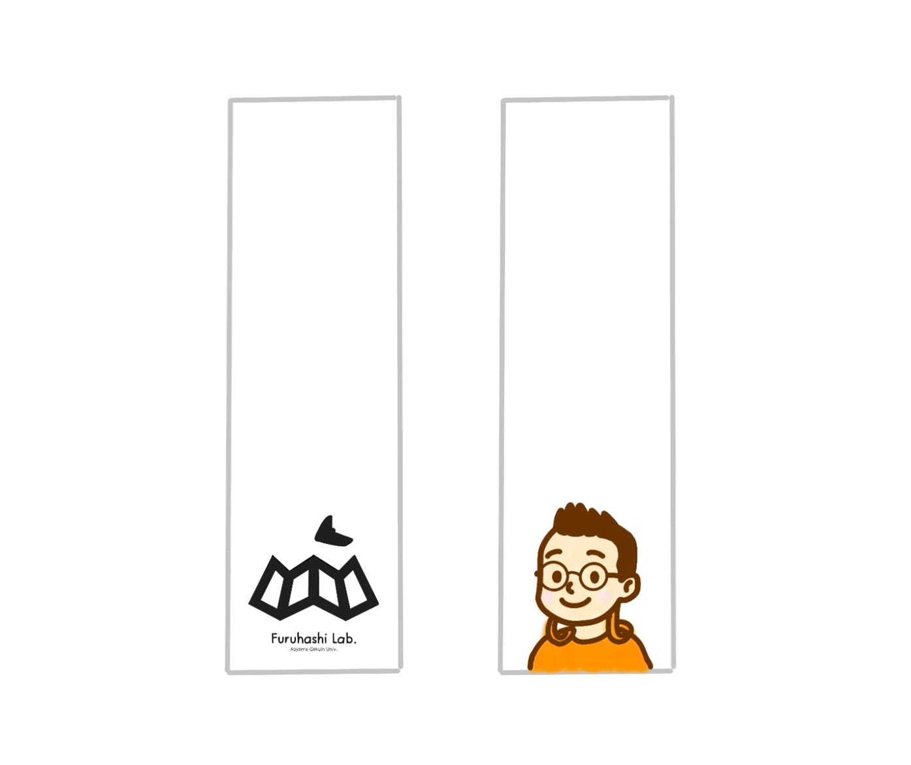
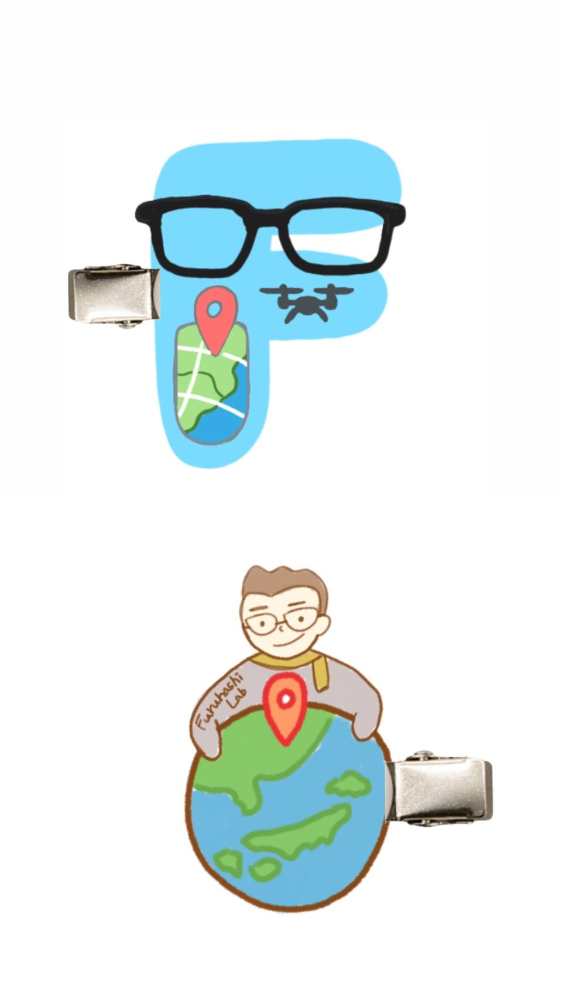
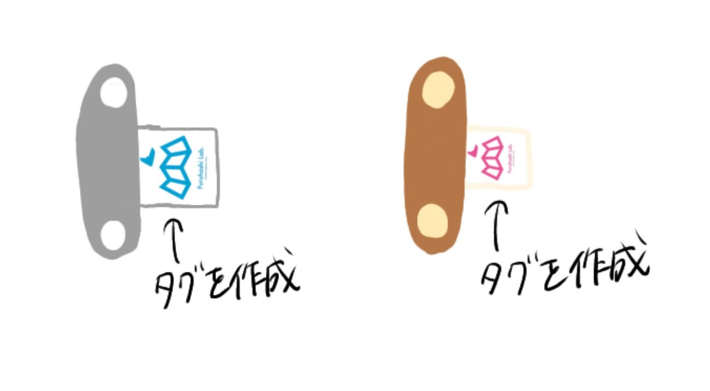
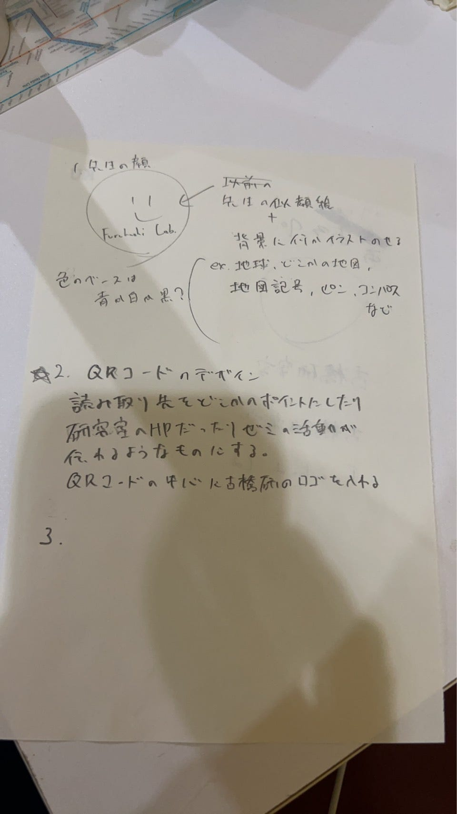
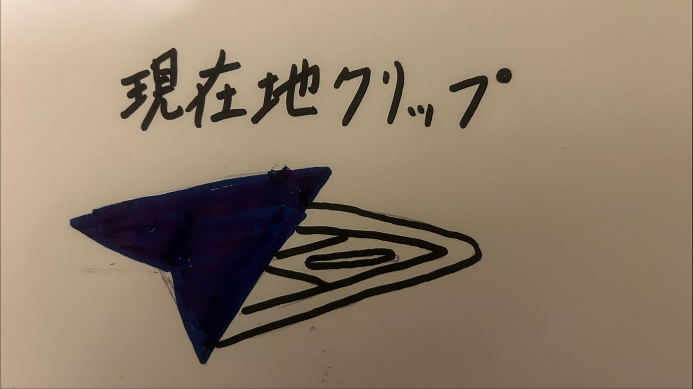
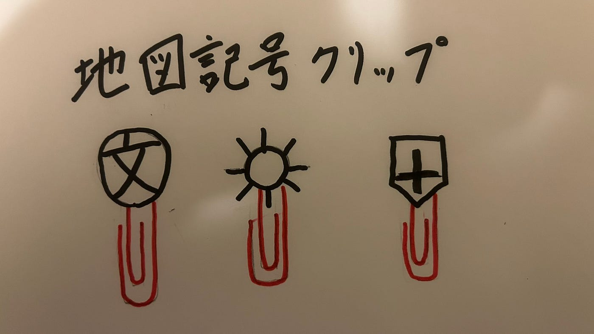
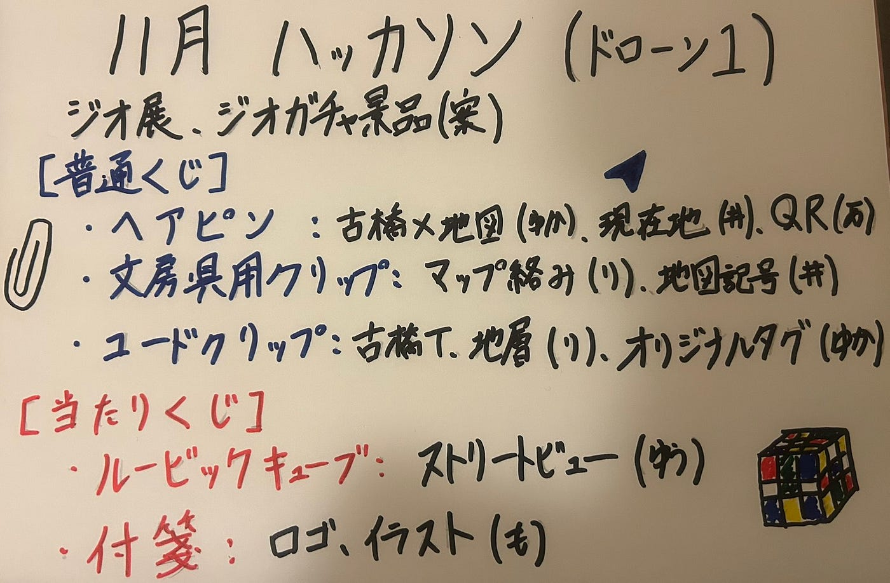

### 【ドローン1】11月ハッカソン

こんにちは、3年の井上です。来年のゼミ生がだんだんと動き始め、来年のゼミ活動への期待が高まると同時に、4年生との別れも近づいていることに気づき寂しい気持ちになってきました。本当です。

さて、今回は11月のハッカソンの報告という事で、私たちドローン部１と途中から参加してくれた2年生の愛甲くんが考えた来年のジオ展におけるジオガチャの景品案を発表したいと思います。

> ハッカソン概要

概要：来年のジオ展（2026/4/26）に向けてのアイデア出し

景品予算：当たり 500円

普通 100円

また、今回は今までのジオガチャで使われた景品とは違ったコンテンツが好ましいという事で”新規性”と”独創性”を重視したコンテンツの作成に努めました。

> 成果発表

それぞれが様々な景品を提案したのちに投票を行い、結果的に5つの景品を提案することになりました。

【普通くじ】
・ヘアピン
・文房具用クリップ
・コードクリップ

【当たりくじ】
・ルービックキューブ
・付箋

この5つになります。メンバーが景品案を考えてきたのでそれらを紹介したいと思います。

#### 【りと】

作成ポイント

「クリップはマップに絡めてみました！
タグ
先生の顔（なんか思いつかなかった）
真ん中 先生の好きな言葉
地層（地球って感じ）」

#### 【ゆうか】

作成ポイント

「ルービックキューブの案です。
6面にストリートビューを入れて、完成後にどこか当てるのも楽しめる感じにしましたー！

ChatGPT(GPT-5.1)利用
Mapillaryのストリートビューを立方体の6面にそれぞれ入れました。

①日本 千年の森自然学校
②日本 淵野辺
③フィリピン マニラのフィリピン大学ディリマン校
④イタリア ミラノ
⑤タイ バンコク
⑥マレーシア クアラルンプール」

#### 【萌】

作成ポイント

「付箋のデザイン案です！
①古橋研究室のロゴ
②古橋先生のイラスト
それぞれワンポイントとして余白を残すことで、実用性のあるシンプルなものにしました。」

#### 【ゆかり】

作成ポイント

「ヘアクリップ
古橋研をイメージしたクリップをデザインしました
古橋先生×地図って感じです！作成は[この動画](https://youtu.be/klMmsKbD61E?si=ZxZDXqjdm_ayFL6q)をイメージしてます！

材料は主に”プラ板”と”ヘアピンの土台”で100均でそろえることができます。」

「コードクリップのデザイン案です！
コードクリップ自体はシンプルで使いやすいものにし、オリジナルのタグを作るってつけることで日常使いしやすいと考え、このデザインにしました！コードクリップの作り方は[こちら](https://youtu.be/4J1x6O13VBw?si=-tizYzyx74VGT3Im)です！

オリジナルタグは布生地にガーメントプリンターで印刷しようと考えています！」

#### 【愛甲くん】

作成ポイント

「ヘアピンの案を作成しました。

QRデザインの方が面白いかなって思ってます」

#### 【井上】

作成ポイント

「ヘアクリップ案を作成しました。

ヘアクリップをつけて自分の”現在地”を表せたら面白いなと思い、現在地を表すこのマークを付けたデザインを考えました。」

「文房具クリップ案を作成しました。

文房具といったら勉強。勉強×地図といえば”地図記号”でしょ！この考えで文房具クリップに地図記号を付けたものを作ってみました。文房具クリップの作り方は[こちら](https://youtu.be/Q-mucbb0vZU?si=i2qqForRvuTTlsqx)になります。

材料は固まる粘土、木の棒、クリップ、アクリル絵の具、爪楊枝、ラッカー クリアとなっています。」

> _材料と費用（まとめ）_

メンバーが調べてくれた各情報をまとめると材料と費用については以下のようになります。

文房具用クリップ
（材料）
・ゼムクリップ（特大）
・粘土
・絵の具
・コーティング剤
1個約80–90円

ヘアピン
（材料）
・ヘアピン
・プラ板
・▲レジン剤
6個作るとして1個約80–100円

・コードクリップ
（材料）
・皮or布生地
・ボタン
作る量によるが、材料は布1枚とボタン1個なので200円で作れる分だけ大量生産可能

・古橋研究室ルービックキューブ
百均キューブ＋ロゴ正方形シールを切って貼るなども可
約120〜150円

・付箋
依頼する業者や注文部数、デザインによって変動するが、1つあたり300円前後

> まとめ

今回は今までと違ったコンテンツという事でデザイン案よりも景品決定に苦戦しましたがなかなか良いものが提案できたんじゃないかと思います！

また、今回のハッカソンでは私たちの班では4年生のゆかりさんが積極的に動いてくれたおかげで何とか形にすることができました。来年のジオ展では我々3年生が中心となっていくので、いつまでも4年生に頼らず主体的に動いていきたいなと感じました。

最後にグラレコです。

