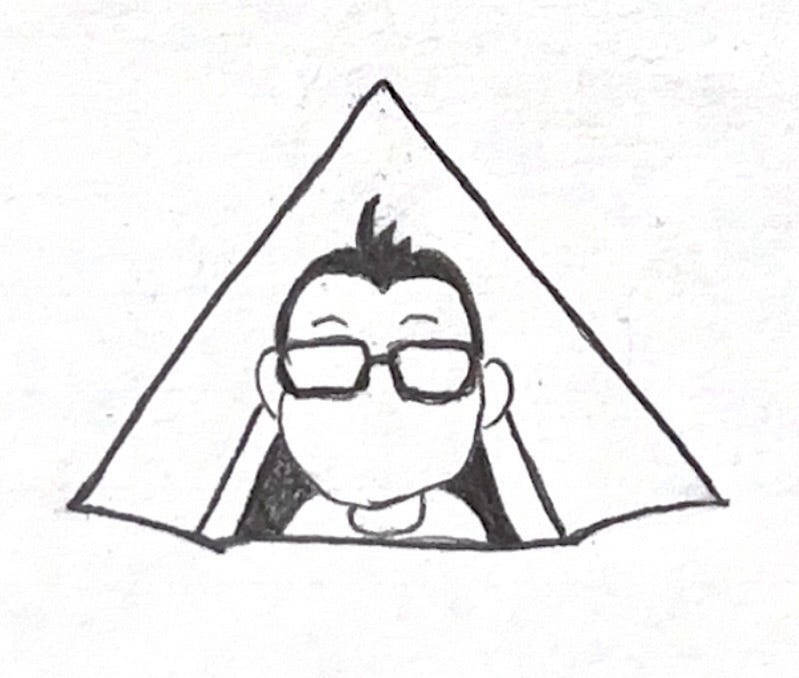
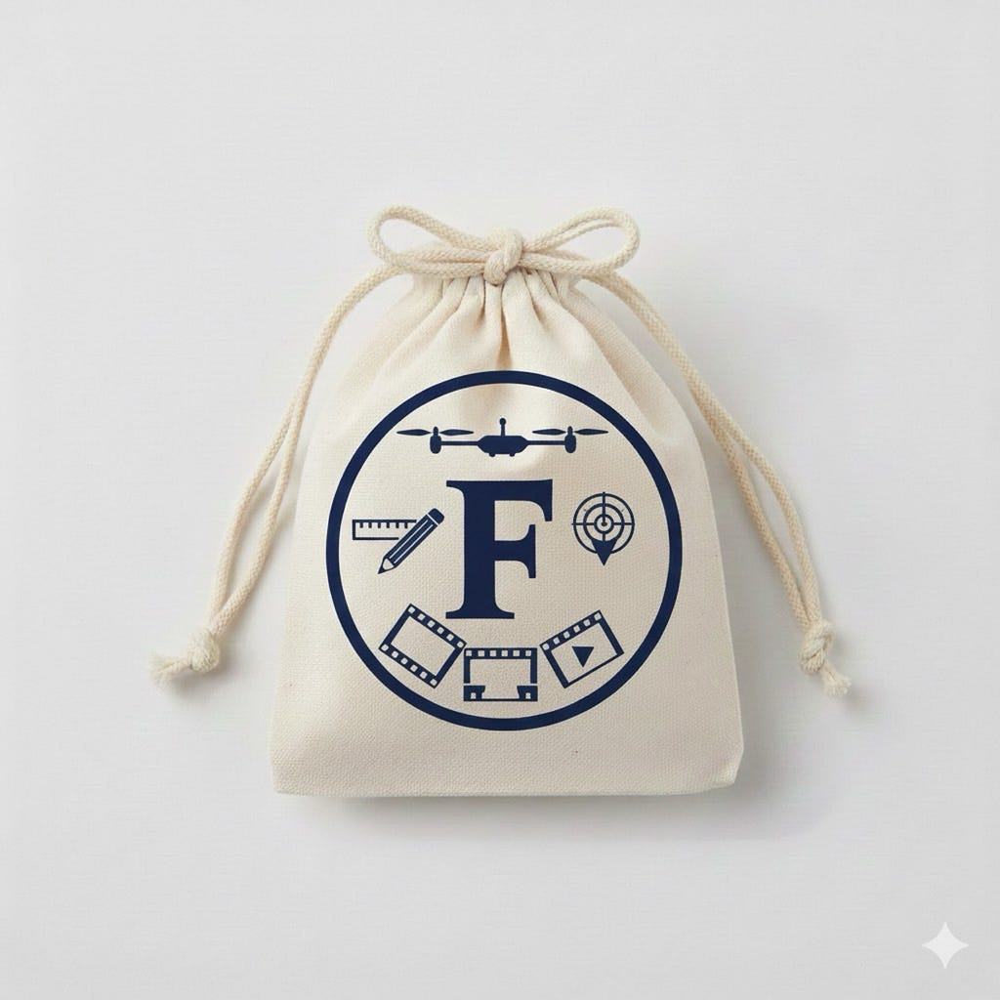
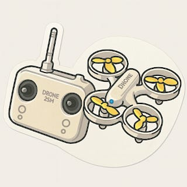
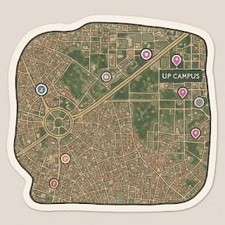
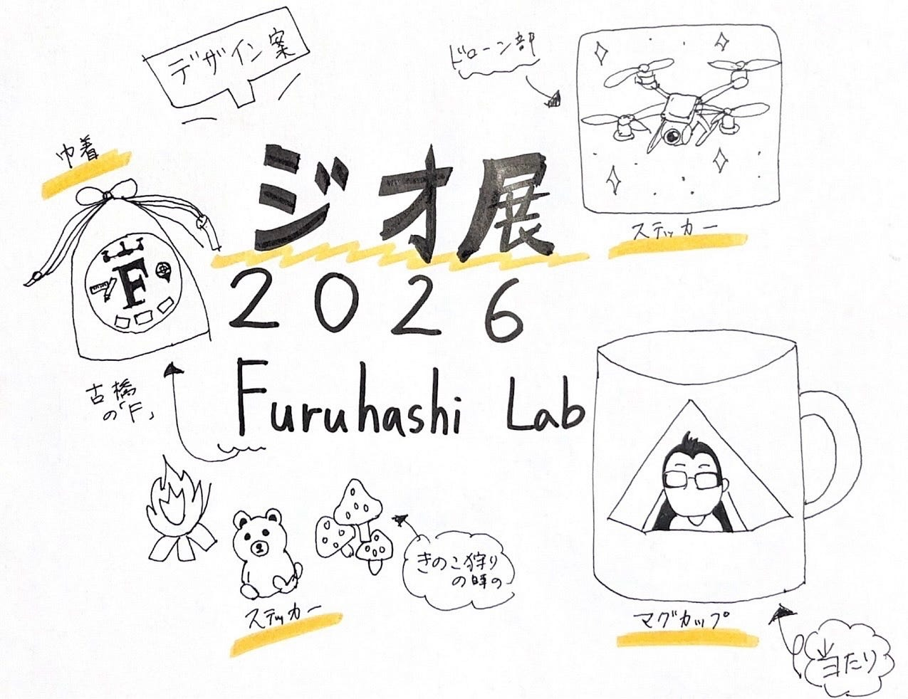

## 【ドローン部2】ハッカソン案

### 案1:マグカップ（当たり枠）

デザインテーマ:ゼミを象徴するテントと、古橋さんをスタイリッシュにデザインする。

余計なところを削ぎ落としたデザインにした。このデザインなら缶バッジもアリかも

ふうかが描いてくれました↓

### 案2:巾着袋

•	中央に「F」を据え、Furuhashi Labを研究の核として表現

•	その周囲に ドローン / YouthMappers / 映像 / デザイン の4活動をアイコン化して配置

•	それぞれ

•	上：ドローン

•	右：YouthMappers

•	下：V &F

•	左：デザイン

一色（単色）デザインで 印刷コストと視認性を両立。文字を使わず、多角的活動と統一感を同時にアピールできる構成

（Geminiで画像を出力）

### 案3:ステッカー

コスパがいいです。

外注の場合：90枚発注、1枚＝約44円

ドローン、ツリーハウス合宿、SOTM in Manilaをデザイン。

→ゼミ活動2025をシールで表現

(ChatGPT経由でDALL·Eにより生成)

[サイトはこちら](https://raksul.com/print/sticker/ondemand/sheet/prices?paper=ART&cutting=CUTTING_SHAPE&width=50&height=50&cutpath=FIT&paper_tube=NONE_PAPER_TUBE&print_direction=NONE_PRINT_DIRECTION&adhesive=STANDARD&color=ONE_SIDE_COLOR&coating=GLOSS_PP&signage_type=null&amount=90&business_day=7)

### グラレコ

