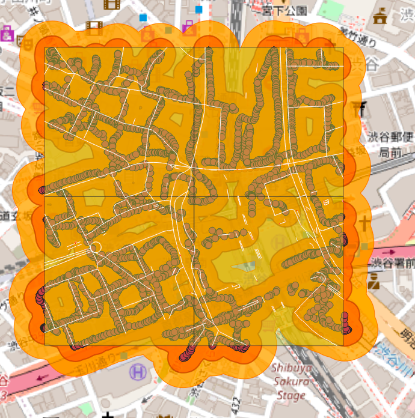

### {中間発表}渋谷で再現はできたのか！？

こんにちは山﨑です

先日CODE BLUEというサイバーセキュリティの国際会議に学生スタッフとして、参加しました
まじで、そこにいる学生は理系しかいなくて、最初は何言ってんだ？って感じで、完全アウェーの場所に来ちまったと
倍率3倍だったらしいのに、なんで俺が通っているんだよ
なんて思いも
でもでも、始める頃は誰も知らないっていうマークザッカーバーグがどこかの大学で言っていたセリフを思い出し、とにかく話しまくることに、、、

そこで知り合った方のご好意で誘ってもらったAVTOKYOというBlack hatに参加した日本人が始めた？日本中のハッカーの人たちが集まって、わちゃわちゃするイベントに呼んでいただき、LLMやら、周りの専門家などを味方にしていって、3位に入賞することができました：）
その方にさらにさらに誘ってもらい、サイバーセキュリティを先行する学生が有志で集まっているコミュニティにも参加させていただくことになりました。嬉しい、反面、どんどん練習しないと、置いてかれそうなんて思っています。

前置きというか近況報告はこんな感じで
実際に私が再現しようとしている論文と、それが結局どうなったの？みたいなのを本当に軽くまとめます。

slideは[こちらから](https://www.canva.com/design/DAG5Nc3qDjE/Eakw0gOLJvnUbFfPEGGrTA/edit?utm_content=DAG5Nc3qDjE&utm_campaign=designshare&utm_medium=link2&utm_source=sharebutton)

Github[
https://github.com/furuhashilab/2025gsc_RitoYamasaki](https://github.com/furuhashilab/2025gsc_RitoYamasaki)

### 再現を試みている論文とは！？

“Mapping WiFi measurements on OpenStreetMap data for Wireless Street Coverage Analysis”
Authours:Valenzano, Andrea;Mana, Dario;Borean, Claudio;Servetti, Antonio
ざっくりいうと

- 都市のWi‑Fi測定データをOpenStreetMapの街路データに重ね、街路ごとの「Wi‑Fi到達率（Street Coverage）」を可視化・定量化するオープンソース基盤を提案。

- クラウドソーシング計測（自作アプリ）やWiGLEのデータを用い、APの推定カバレッジ（半径約50m）を街路セグメントに投影して、区画ごとのAP密度と街路被覆率の関係を分析。

**どうやってエリア内の被覆率を測っているのか？**

AP の位置は WiGLE、基盤地図は OSM。まず AOI をタイルやブロックに分割し、各ブロック内で「非重複の10 m道路セグメント」に分割します。次に、各 AP についてカバレッジ半径（例: 25 m）の円を作り、その円と交差する道路セグメントを「被覆」としてマーキングします。最後に、そのブロック（=AOIの単位）内にある全道路長に対して、被覆されたセグメント長の合計を割って「street coverage（道路被覆率）」を算出します。

新規性は

1. 街路という「意味のある地物」に着目したWi‑Fi被覆の定量化 従来の可視化や解析は、APの位置点群やエリア被覆（面）の描画に留まることが多く、地図のセマンティクス（その面が建物なのか、公園なのか、道路なのか）を活用していませんでした。この論文はOpenStreetMapの街路グラフに測定データを重ね、街路長に対する被覆割合という運用的に有用な指標（Street Coverage）を導入・計測した点が新しいです。IoTなど「道路沿いでの接続可能性」を直接評価できる形に落とし込んでいます。

1. 三角測量に依らない「測定点ごとの保証円」での被覆推定と、その大規模適用 Wi‑Fi APの厳密位置推定（多数観測の三角測量）はデータ要件が重いのに対し、本研究は観測RSSIから実験的に得た距離マッピングを使い、各測定点の周りに「被覆が保証される円」を置く簡潔な推定法を採用。これをクラウドソース計測やWiGLEの大量データに適用し、都市スケールで街路被覆の統計を出した点が実務的に意義があります。

簡単にいうと
今まではAPを見つけるためには、複数のアクセスができた場所から一つのAPを見つけられるよねってのでAPをマップに見せたりするのが多かったのに対して、この論文は、AP見つけたところで人が実際に使うも所にどれだけ届くかみないと意味がないじゃんってことで、OSMをレイヤとしてマップに入れて、道路沿いでどれだけAPが繋がるの？ってことを調べた論文です。

私はこれを読んだ時に、あ、これ渋谷でやったら面白そうと思い始めることにしました
この論文ではr =50が大体の到達点として適切だと言っているのですが、私が調査するのはトリノと比べて超都会の渋谷

最初の仮説では、、、

・r =50よりも小さいrでも渋谷は十分にカバーできるんじゃないかな？
って感じだったので実際に作ってみました

カバー率の計算をしっかり間違えていたのを、発表前日に気付き、後で直すので、実際のカバー率はどのくらいなの？っていう質問には、後日答えさせていただきます

まぁみたらわかると思うのですが、仮説通りr =25のバッファーでもだいぶカバーできているんですよね

でもでも、この真似している論文のもう一つの目的、効率よくおくにはどうしたらいいかって話があるんですが

渋谷の場合r =25では隙間が残っている、r =50では大幅にカバーが重なってしまっている現状

ここで、新規性を持たせようと

私がこれからやっていくのは
新たなrの提唱です
実際には今後r =35,r =45などを実際に作り重ねてみたらどうなるのかな？などをみていくつもりです

#### 卒論ではどうするの？

卒論では、現在悩み中ですが、渋谷のビルに囲まれた地形を生かした研究を行えればなと思っています
例えば、、、

道を歩いているときに、天気がいいと上を見上げたりしませんか？

私はよくするのですが、実際に自分でwigleを使い現地調査しているときに、どうしてもwigleの取得が少ない場所があって、見上げてみるとーーーーー、空の見える範囲少なくね？って思ったのです
つまり、ビルがたくさんあって、空が見にくい場所ではAPの接続状況も変わるのでは？っていうのをPlateau を使って、入れてみたいなぁとか、他にも色々考えてて、全部をゼミ論、卒論に入れるかは未定なのですが、楽しみです。って言いつつも、先生から指導される場所をまず直すのが最優先です！
