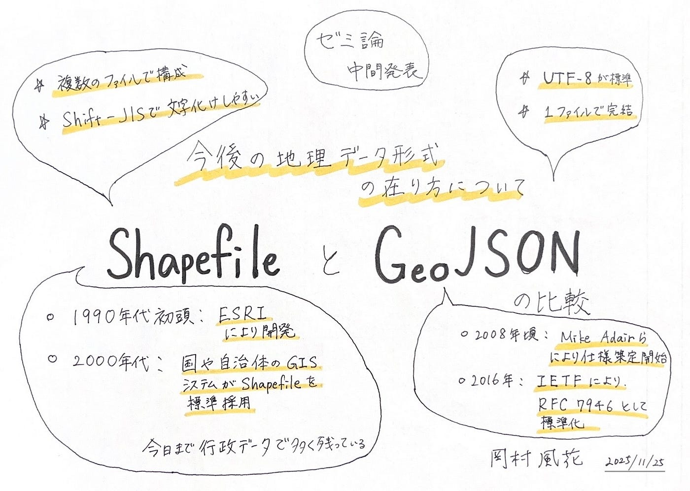

### 今後、地理データを制するファイル形式とは！？

3年の岡村です。
ゼミ論の中間発表資料を共有します。

・GitHub[
2025gsc_FukaOkamura/README.md at main · furuhashilab/2025gsc_FukaOkamura](https://github.com/furuhashilab/2025gsc_FukaOkamura/blob/main/README.md)

・中間発表資料

[ゼミ論_中間発表.pptx](https://1drv.ms/p/c/0d91c773653e6296/IQAc7v4ekIHFR4FguPwnRr47AZU0pwl1vGFwLe_A9pelNn0?e=iasvQS)

**テーマ
今後の地理データ形式の在り方について
ShapefileとGeoJSONの比較**

概要
GIS分野で長年利用されてきた Shapefile と、Web技術の普及によって急速に利用が広がった GeoJSON の2つの地理データ形式を比較し、Shapefile派と廃止派の意見を聞き、今後のファイル形式の在り方について考察する。

