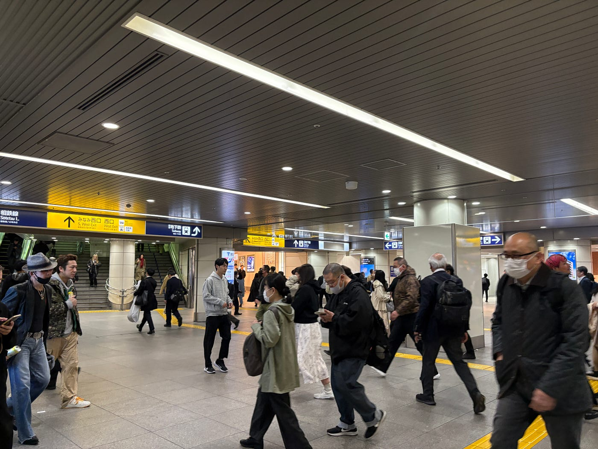
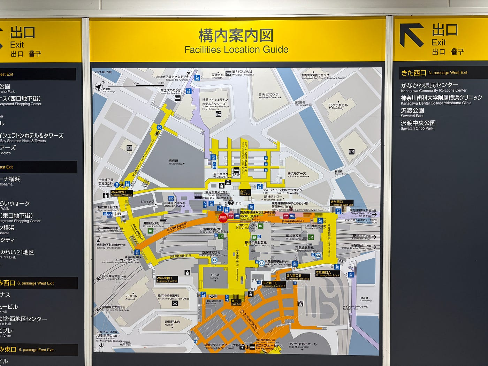
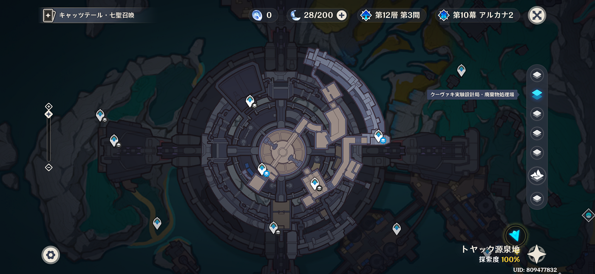
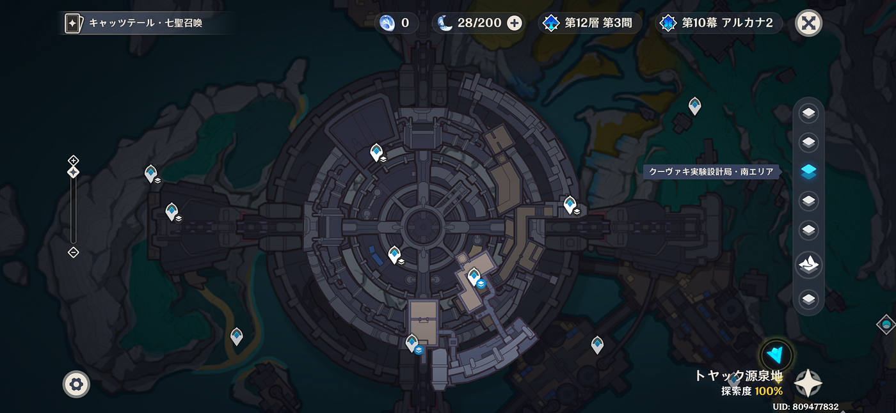
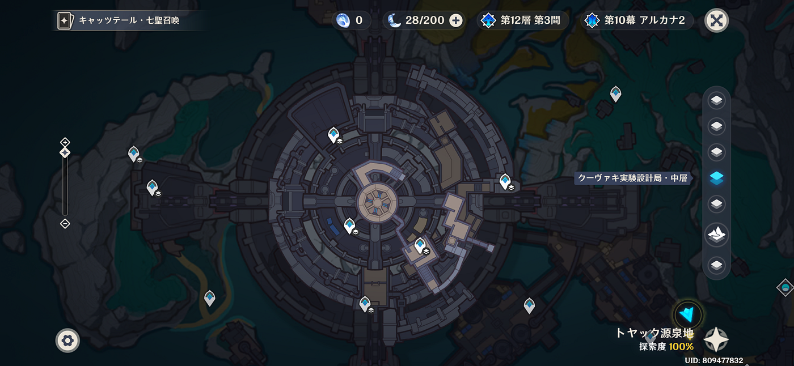
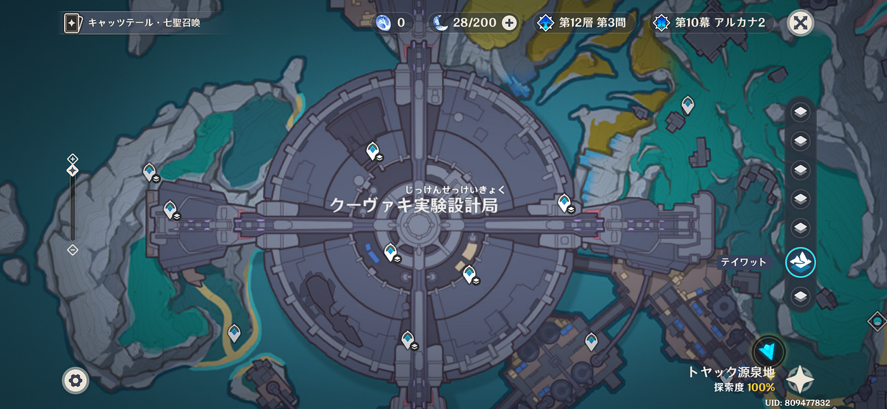
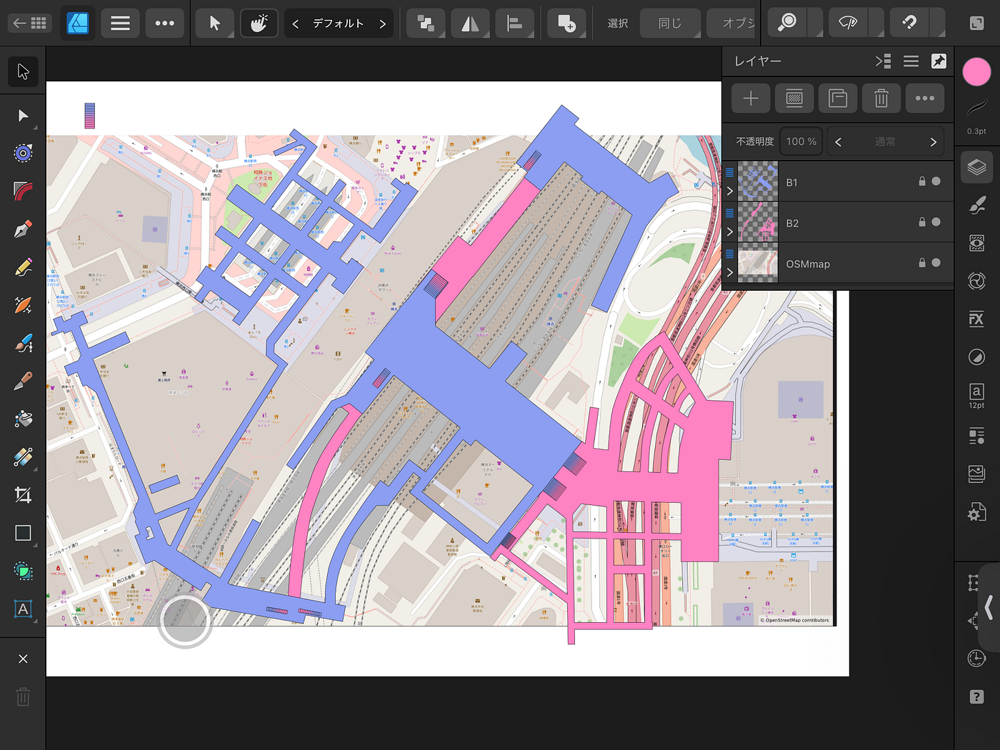
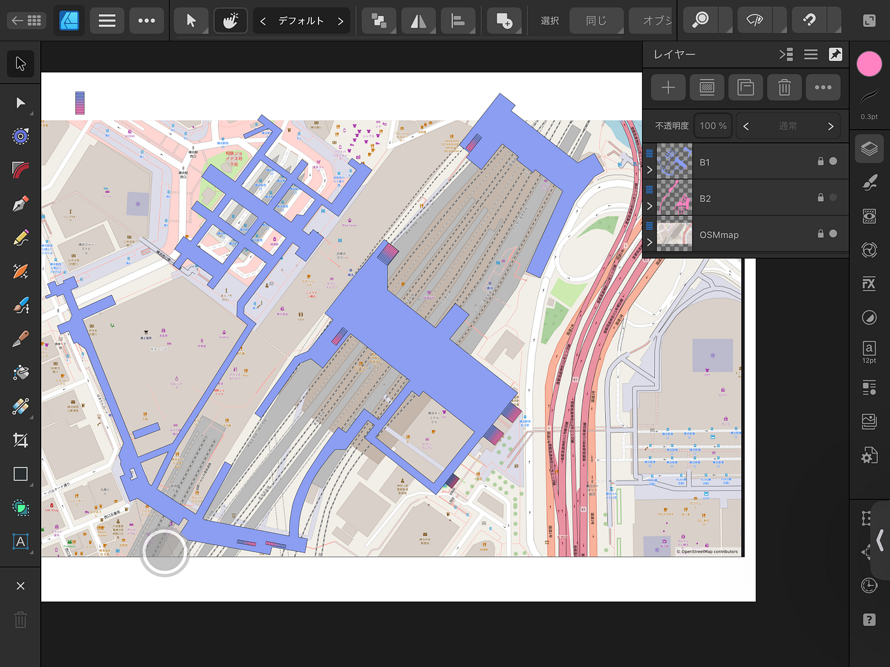
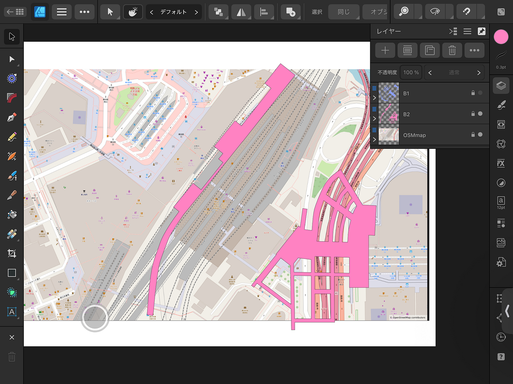
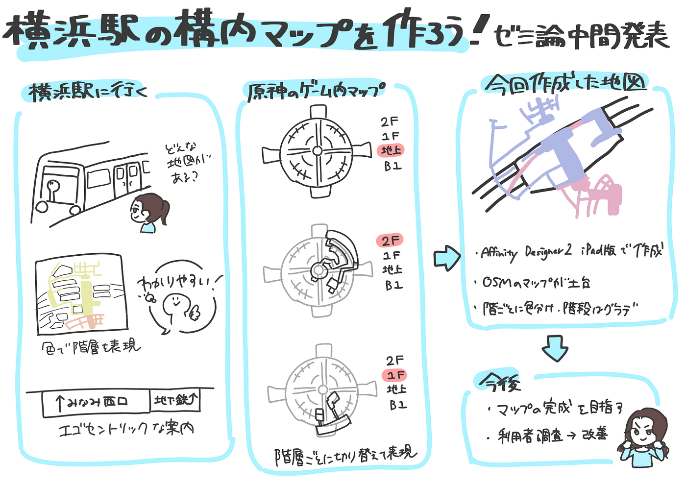

### 分かりやすい横浜駅の構内マップを作りたい！【ゼミ論中間発表】

こんにちは、臼井です。

今回はゼミ論の中間発表という事で現在の進捗とここに至った経緯をまとめてみました。

以下はGitHubのURLとプレゼン資料になります。

GitHub:

[ゼミ論中間発表 2025/11/25 · Issue #3 · furuhashilab/2025gsc-ChihanaUsui
2025年度ゼミ論. Contribute to furuhashilab/2025gsc-ChihanaUsui development by creating an account on GitHub.github.com](https://github.com/furuhashilab/2025gsc-ChihanaUsui/issues/3)

中間発表プレゼン資料：

[Seminar midterm presentation by Chihana Usui
古橋ゼミ ゼミ論 臼井千瑛 - View online for freewww.slideshare.net](https://www.slideshare.net/slideshow/seminar-midterm-presentation-by-chihana-usui/284279935)

私はゼミ論のテーマとして「横浜駅における高低差表現を含む地図デザインの課題と改善案」を選び、横浜駅の構内地図を作成しています。

簡単に言うと、「横浜駅の地図をもっと分かりやすくしよう」です。私は頻繁に横浜駅を利用するのですが、色々な路線が集まっていることもあり、いまだに複雑な全体像をはっきりつかみ切れていません。

そこで、自分で分かりやすいと思える地図を作ろうというのが今回のテーマになります。

どこから手を付けるか迷ったのですが、とりあえず最初は横浜駅に訪れて地図を収集することにしました。

様々な地図を集めましたが、エゴセントリックな案内が多いことに気づきました。

みなみ西口、相鉄線のように目的地に向かうための方向を指し示す標識が多いです。

目的地が分かっていれば空間を把握していなくてもたどり着けそうです。

一方でアロセントリックな地図もありました。

階層ごとに色分けされていてなかなか分かりやすいです。

ところで皆さん、原神というゲームをご存知でしょうか。

原神はオープンワールドRPGというジャンルのゲームでmiHoYoが2020年に発売しました。

オープンワールドRPGというゲームの性質上、プレイヤーは3Dマップを駆け回ることになり、それには地図が必須です。

私がどのような地図なら分かりやすく表せるか頭を悩ませていた時、原神で見た地図のことを思い出しました。

原神内で使われる地図は階層ごとに表示が分かれていて、同一階層がどのような形なのか把握できます。

どこが接続しているか分かりずらいという欠点もあるのですが、これは分かりやすいように感じます。

今回の中間発表では横浜駅構内で見た地図と、原神で見た地図のいいところを掛け合わせて、地図を作成してみました。

簡単な輪郭ですが青色でB1、ピンクでB2を表し、B1-B2間を行き来できる階段はグラデーションで表してみました。

OSMの地図を土台とし、作成はAffinity Designer2 iPad版で行いました。

初めて使ったので操作を覚えるのが大変でした。

今後は、エレベーターやエスカレーター、B1、B2以外の階層を作成して目印となるものの書き込みを行い、地図を完成させるのが当面の目標となります。

また、遠い話になりますが、出来上がった地図を他の人に評価してもらい改善も行っていきたいです。

**グラレコ**

