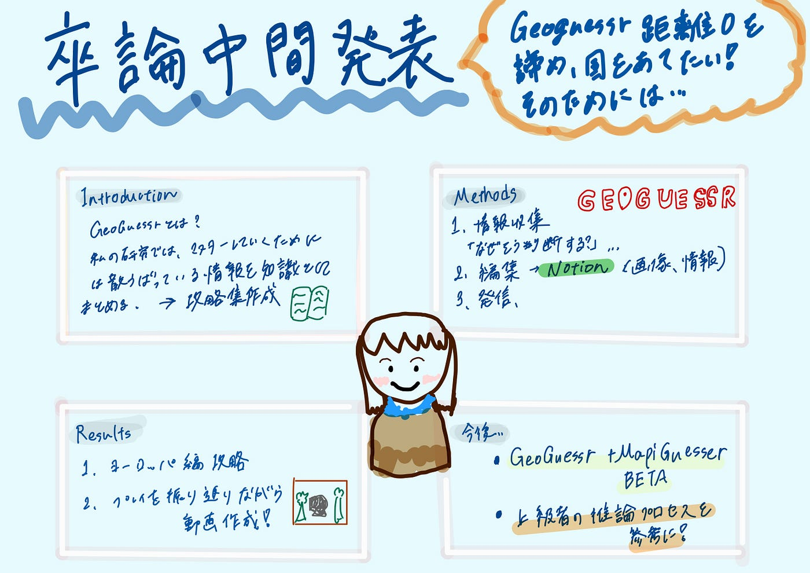

### 【卒論中間発表】GeoGuessr 距離0を諦め、国を当てたい！そのためには

こんにちは、四年の福田です。

今回の記事では、卒論テーマの「GeoGuessr マスターに向けて空間データを分析」で研究したことをIMRaD形式で報告します。

以下にGitHubと発表スライドを添付します。

GitHub：[https://github.com/furuhashilab/2025gsc-KounaFukuda](https://github.com/furuhashilab/2025gsc-KounaFukuda)

発表スライド：[https://aoyamajp-my.sharepoint.com/:p:/g/personal/aa122028_aoyama_jp/EQmwOnLVfH5Kkzo2tV09He8BLeK6tYz8LNVzN4mBY6Wmgw?e=e24CiG](https://aoyamajp-my.sharepoint.com/:p:/g/personal/aa122028_aoyama_jp/EQmwOnLVfH5Kkzo2tV09He8BLeK6tYz8LNVzN4mBY6Wmgw?e=e24CiG)

#### **Introduction**

[GeoGuessr](https://www.geoguessr.com/ja)は、ランダムに選ばれたGoogle ストリートビューの画像から、その場所を推測するゲームである。場所の推測には、道路標識や看板などの文字情報、電柱や道路などのインフラ、太陽の位置、植物相や土壌の種類などの自然環境、ストリートビューを撮影する車両の特徴、撮影された年、カメラの画質、Google carを護衛する車両などが使える。場所が推測できたら、画面のGoogle マップで場所を選択してピンを立て、「Guess」ボタンを押して解答し、正解の地点からの距離に応じて得点が決まる。

しかし、GeoGuessrはプレイする過程で、情報を吸収できなければ、上達にはつながらない。そのため、私はこの研究で、情報を捉える、判断するなどして、マスターしていくためには散らばっている情報を知識として集め、どれだけ近くに当てるための思考フローを作るために、GeoGuessrをマスターしていくのに必要となる情報を攻略集として制作することを目的にする。

#### Methods

> 1.情報収集-一次情報

> ・ひたすらプレイ、「なぜその判断をしたのか」「なぜ間違えたか」をメモする。

> 毎日3ゲームすることが可能。GeoGuessr に加え、短期で地域に特化した情報を吸収するためにMapiGuesser BETAを使った情報収集をする。

> ・スクリーンショットや画面録画を活用し、特徴的な風景のデータベースを自分で構築。

> ・プロプレイヤーの動画分析、参考

> ・コミュニティに参加、観戦配信を視聴

> 2.編集

> ・Notionに思考プロセスの可視化

> ・画像の活用

> ・情報の構造化と階層化

3.発信

・公開とプロモーション

・可能であれば）フィードバックの収集とアップデート

現在、2の編集をしながら、毎日のゲームを継続しています。

編集において、GeoGuessr を半年続けてきて、ヨーロッパの出題率が全体の27.41％を占め最も多いことがわかりました。また、情報の判断が難しく、最も難易度が高いと感じたため、ヨーロッパ編を作成する。

ゲームだけでなく、推論プロセスを学習するため、上級者Yutuberの動画や[GeoGuessr World League Week](https://www.youtube.com/watch?v=C_gOI5ST6iU)の観戦動画を参考に

**・思考の流れを**吸収

・国ごとの“雰囲気認識”が短期間で

・自分が知らない「高速判断の基準」を学ぶ

これらのことを意識しました。

#### Result

1．ヨーロッパ編攻略

[https://www.notion.so/GeoGuessr-2a2553500dbc80e6a621c6ab91d226a2](https://www.notion.so/GeoGuessr-2a2553500dbc80e6a621c6ab91d226a2)

2.プレイを振り返りながら動画を制作しました（何を考えていたか紹介します。失敗あり➕情報の読み取りが不足していることに気づきました）

#### 今後の展望

これまでの研究とゲームを通じて、まだまだ私が読み取る情報が少ないこと、知識量が足りないことから国や地域を特定できないと感じました。

今後は、

1. 攻略を作成するための情報を毎日のゲーム（GeoGuessr ＋MapiGuesser BETA）から収集しながら、得た情報を整理する。

1. 上級者の推論プロセス（ヨーロッパに特化した人）を参考にし、自身が判断する上で不足している部分を見つけ、補足する。

徹底的にマスターしていきたいと思います。

#### 参考文献リスト

[https://docs.google.com/spreadsheets/d/1nyZ4LV-7oNLaxoRsDwE_uZ5c88tZxngRCNEZImLuLHA/edit?gid=0#gid=0](https://docs.google.com/spreadsheets/d/1nyZ4LV-7oNLaxoRsDwE_uZ5c88tZxngRCNEZImLuLHA/edit?gid=0#gid=0)

#### グラレコ

