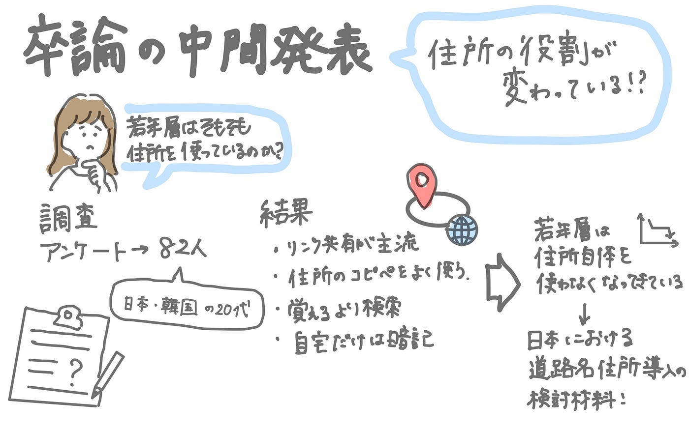

## 【卒論中間発表】若年層の住所利用行動から考える、日本の住所制度のこれから

こんにちは、４年の末木です。構想発表から早くも中間発表の時期が来ちゃいました。

卒論仕上げなきゃという焦りと同時に卒業まで残り少ないことを実感して複雑な気持ちですが、中間発表頑張ってやっていきたいと思います…

構想発表では、韓国の道路名住所制度が若年層にどれほど定着しているのか、また地域差があるのかを調べようとしていました。しかし準備を進める中で、「そもそも若い世代は住所をどれくらい使っているのか」という疑問が強くなりました。実際、私自身も住所を覚えたり書いたりするより、検索や位置情報リンクを使うことがほとんどでした。そのため卒論では、まず 若年層の住所の“使われ方”そのものを明らかにする 方向へと研究の軸を移しました。

スライドはこちらから参照できます。

GitHubページはこちらです。

[https://github.com/furuhashilab/2025gsc_RikoSueki](https://github.com/furuhashilab/2025gsc_RikoSueki)

ここからはIMRADの順に書いていきたいと思います。

### Introduction

これまで住所制度に関する研究は、地番住所の複雑さや道路名住所の利便性など、制度そのものの特徴に焦点が当てられてきました。しかし近年の若年層は、住所を覚えなくても生活できる環境にあります。アプリ検索や位置情報共有が当たり前となり、住所の役割が変化している可能性があるのではないでしょうか。そこで私は、次の仮説を立てました。

1. 若年層は住所を「覚える情報」ではなく「検索するためのデータ」として扱っている

1. 住所制度の違いより、地図アプリの利用の有無が行動に強く影響する

1. 若年層では、住所の役割そのものが「場所を示す情報→検索データ」へ変化している

今回卒論では、日本と韓国の若年層を対象に、住所の記憶・検索・共有の実態を明らかにし、住所制度を生活者の視点から捉え直すことを目的としています。

※若年層に焦点を当てた理由は構想発表と同じで以下の通りです。

- 既存研究は高齢層や農村部に焦点 → 若年層の実態が不明

- 若年層は今後の主要利用者であり、デジタル利用（地図アプリ・ECサイト）と密接に関わる

### Method

Googleフォームを用いて、日本語版・韓国語版のアンケートを作成し、SNS を通じて若年層に回答を依頼しました。回答者は 82 名で、居住地は日本が 69.5％、韓国が 29.3％でした。

質問項目は次のとおりです。

•	普段使う地図アプリ

•	自宅住所を覚えているか

•	人に場所を伝える方法

•	配達・行政手続き・初訪問などの場面別利用

•	地図アプリの住所コピー利用頻度

•	住所を覚える必要性の認識

本中間段階では単純集計に基づいて若年層全体の傾向を把握し、国別比較は今後の分析としました。

### Results

アンケートから、若年層の住所利用には次のような傾向が見られました。

①位置情報リンクの共有が最も多い（57.3%）

住所をそのまま伝える人は 19.5％にとどまり、リンク共有が主流でした。

②住所コピー利用が一般的（79.3%）

地図アプリの住所コピー機能を頻繁に使っている人が多く、住所は“コピペして使う”ものになっていました。

③住所は覚えなくてもよい（86.6%）

「検索できれば十分」と考える人が大多数でした。

④自宅だけは覚えている（95.1%）

日常で必要性が高い自宅住所のみ、暗記が維持されていました。

これらの結果から、若年層にとって住所は“覚える情報”ではなく、“必要なときだけ利用するデータ”へと変化していることが示唆されました。

### Discussion

今回の結果は、住所制度（地番住所・道路名住所）の優劣を議論する前に、**若年層が住所そのものをほとんど使わなくなっている**という実態が存在することを示しています。制度がどうであれ、検索・コピペ・リンク共有といった行動が中心となっているため、住所そのものの役割が変わりつつある可能性があります。住所制度の検討を行うには、こうした生活者の行動変化を踏まえる必要があります。

### Conclusion / 今後の展望

今後は、

- 若年層の利用行動と住所制度（地番住所・道路名住所）の相性

- 配達や行政手続きなど“住所を使う場面”での制度比較

- 若年層の行動に基づく「住所制度の新しい役割」の提案

を進め、道路名住所導入の検討材料として、より生活者に即した視点を示していきたいと考えています。

グラレコは以下の通りです。

