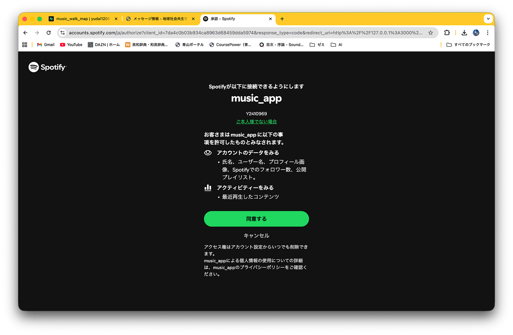
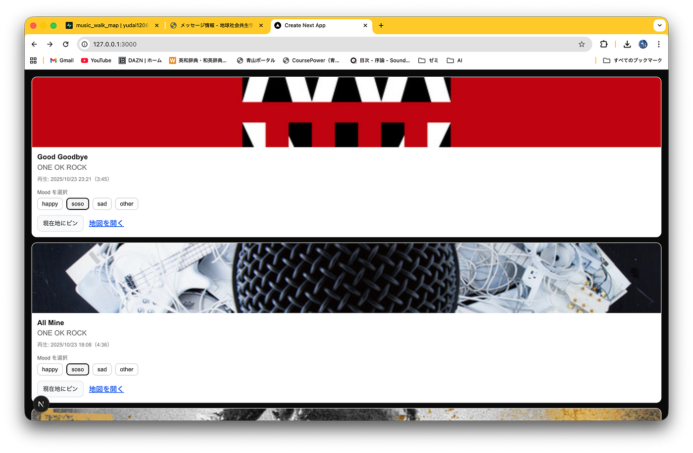
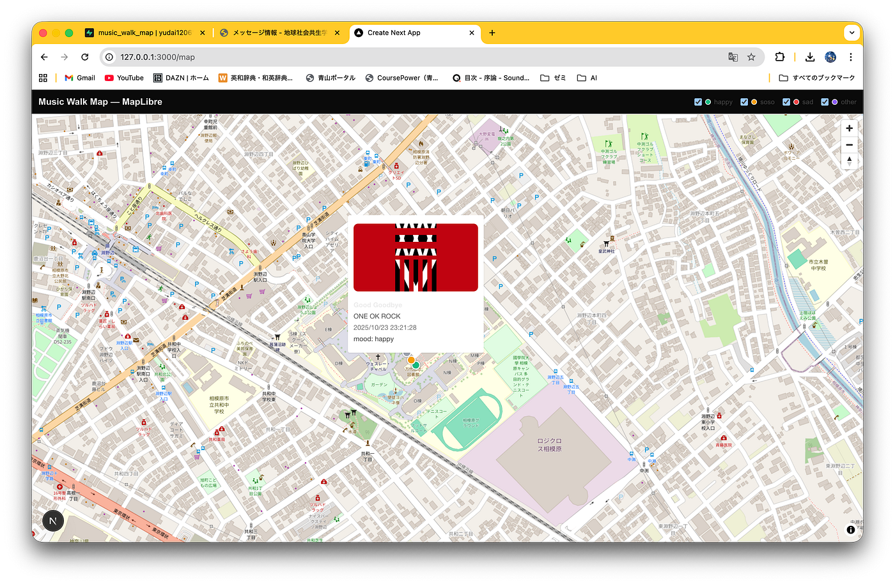
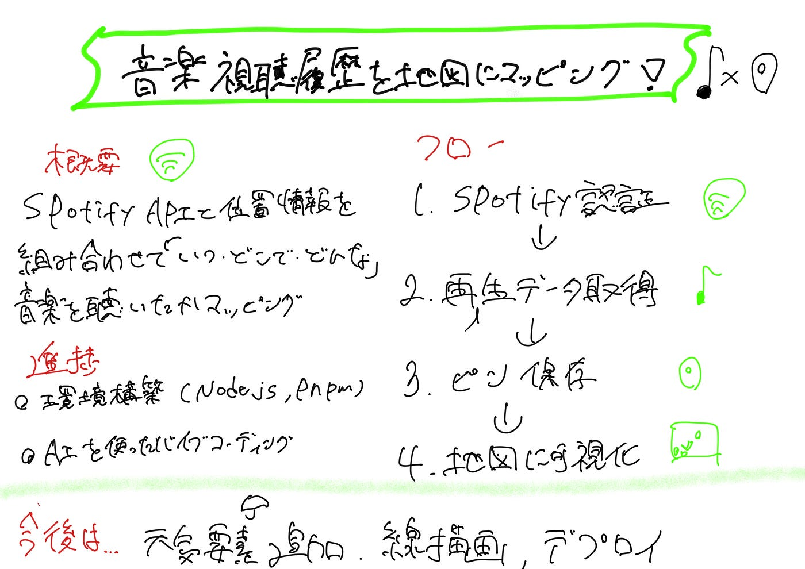

## 地図上に音楽視聴履歴マッピングしたい件

なんだか急に寒くなってきましたね。3年の加藤です。

今回は構想発表から 中間発表の間にゼミ論で何を研究してきたか、まとめてみました。

GitHubのゼミ論用リポジトリにREADMEおよび実際にコーディングしたソースコードを管理してあります

[GitHub - furuhashilab/2025gsc_YudaiKato
Contribute to furuhashilab/2025gsc_YudaiKato development by creating an account on GitHub.github.com](https://github.com/furuhashilab/2025gsc_YudaiKato)

また、中間発表用のスライドはこちらです。

### **概要**

ゼミ論の概要は構想発表時点と特に変わっていません

> 音楽は人の気分や記憶と深い結びつきを持ち、移動中に聴いた音楽は場所の記憶と強く関連すると考えられる。しかし現在、「どこで・どんな音楽を聴いたか」を記録・共有する仕組みは存在しない。そこで本研究では[Spotify API](https://developer.spotify.com/)などを用いて音楽の視聴履歴を取得し、位置情報と組み合わせて「音楽散歩地図」を生成する。これにより、音楽体験を空間的に可視化し、新しい体験価値や研究的知見を得ることを目的とする。さらに得られたデータを分析することで、時間帯や移動手段、天候や気分と音楽選択の関係を明らかにし、都市研究や観光への応用を目指す。

### 先行研究

先行研究は以下の３つを使用しています。

1.[楽曲の鑑賞場所と音響特徴量の相関に関する検証](https://proceedings-of-deim.github.io/DEIM2020/papers/C1-4.pdf)

気分はユーザの音楽選曲の際に重要な要素となり，環境が気分や音楽の選曲に強く影響を与えていることを示している．

2.[感情特徴に基づく景観ルートアウェア楽曲プレイリスト推薦システムの提案](https://proceedings-of-deim.github.io/DEIM2020/papers/P1-10.pdf)

景観も感情に影響を与える要因の１つと考えられる．例えば，海沿いを走行しているときには爽快な楽曲を，田園風景の中を走っているときには落ち着いた楽曲を聴きたくなるものである．このように，ドライブ時の景観に合わせて楽曲を変えたいという要求がある．

3.[現場のプロがわかりやすく教える 位置情報エンジニア養成講座](https://www.amazon.co.jp/%E7%8F%BE%E5%A0%B4%E3%81%AE%E3%83%97%E3%83%AD%E3%81%8C%E3%82%8F%E3%81%8B%E3%82%8A%E3%82%84%E3%81%99%E3%81%8F%E6%95%99%E3%81%88%E3%82%8B%E4%BD%8D%E7%BD%AE%E6%83%85%E5%A0%B1%E3%82%A8%E3%83%B3%E3%82%B8%E3%83%8B%E3%82%A2%E9%A4%8A%E6%88%90%E8%AC%9B%E5%BA%A7-%E4%BA%95%E5%8F%A3%E5%A5%8F%E5%A4%A7/dp/4798068926)

Web上に地図を描画する方法を参考にしました。

### 実際に手を動かした内容

主に以下の2stepを行いました。

1.環境構築

[Node.js](https://nodejs.org/ja)のインストール、[pnpm](https://pnpm.io/ja/)のセットアップ

2.Chat GPTおよびCodexを用いてバイブコーディングを実施

今はAIがとっても便利ですね。OpenAI社が提供している[Chat GPT](https://chatgpt.com/) および[Codex](https://openai.com/ja-JP/codex/)を利用して実際にコーディングを行いました。

### ワークフロー

ここからは実際に動いているフローを紹介します。

フロントエンドは以下の通りです。

- [Next.js](https://nextjs.org/)

UI全体は Next.js 15 + React + TypeScript

- [MapLibre GL JS](https://www.maplibre.org/maplibre-gl-js/docs/)

地図描画ライブラリとして使用

やっていること

- Spotify履歴をバックエンドから取得して画面に表示

- ブラウザのGPSで現在地取得

- /api/listens へ「位置×曲データ」送信

- /api/listens からピンデータ読み込んで地図に描画

バックエンドは以下の通り

- Next.js の API Routes

/api/spotify/* と /api/listens を実装

- Spotify API

OAuth（PKCE）認証

再生履歴を取得

- [Supabase](https://supabase.com/)（PostgreSQLデータベース）

tracks（曲マスタ）とlistens（聴取ログ）を保存

やっていること

- Spotifyと安全に通信する（フロントにトークン渡さない）

- DBに楽曲情報と緯度経度・moodを保存

### フローワーク

🟦→フロントエンド

🟩→バックエンド

🟨→外部サービス

🟫→データベース

🟥→ユーザ操作

#### 1.認証フロー

まず初めにSpotifyAPIの認証を行います。

🟦 Home

↓ /api/spotify/login

🟩 Next.js API（PKCE生成・state保存）

↓（リダイレクト）

🟨 Spotify 認可画面

↓ （ユーザーが許可）

🟩 /api/spotify/callback（token取得）

↓（Cookieへ保存）

🟦 Homeへ戻る

#### 2.再生データ取得

認証が完了したら実際にSpotifyAPIから再生データを取得します。

↓ /api/spotify/recent

🟩 Next.js API

↓（Spotify API 呼び出し）

🟨 Spotify API

↓（再生履歴取得）

🟦 TrackCard 一覧表示

#### 3. 現在地にピン→ログ保存

次に実際に取得した楽曲情報と現在地を紐づけて、そのログを保存します。

🟦 TrackCard

↓（Geolocation API）

📍 現在地取得（ブラウザ）

↓

🟦 TrackCard

↓ /api/listens POST

🟩 Next.js API

↓（tracks upsert / listens insert）

🟫 Supabase（DB保存）

#### 4.地図で可視化

ここまで来たら、あとはこのデータを地図に描画します。

🟥 ユーザー

↓（/mapへ）

🟦 Map Page

↓ /api/listens GET

🟩 Next.js API

↓

🟫 Supabase → listens 200件取得

↓

🟦 MapLibre（ブラウザ）

↓

🗺️ ピン表示（mood別色分け / popup）

### 今後の展望

今後の展望は以下の通りです。

- 天気、移動手段などの外的要因機能を追加できていないので、その機能を追加

- 現時点ではデータを「点」のみでしか表せていないので「線」描画に対応させる

- アプリ完成後はVercelにデプロイして公開予定（変更の可能性あり）

コーディング自体自分自身初めてであり四苦八苦しながらもここまでもってきました。

アプリ完成からデプロイまでをゼミ論で完成させたいので最終発表まで気を抜かずにとりくんでいきたいです！

