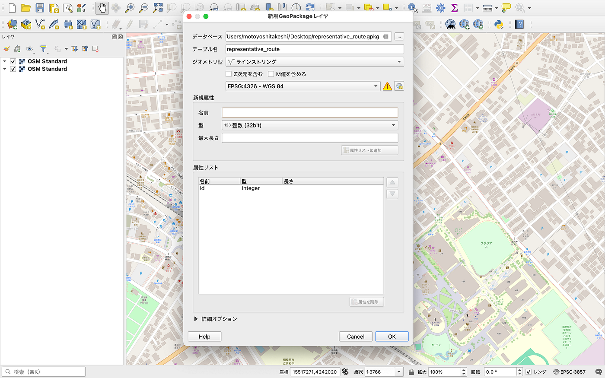
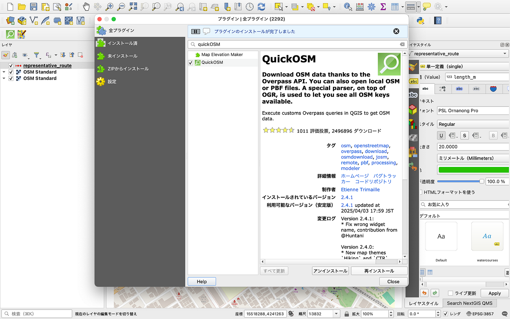
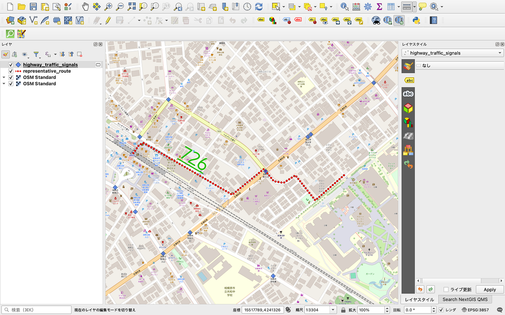
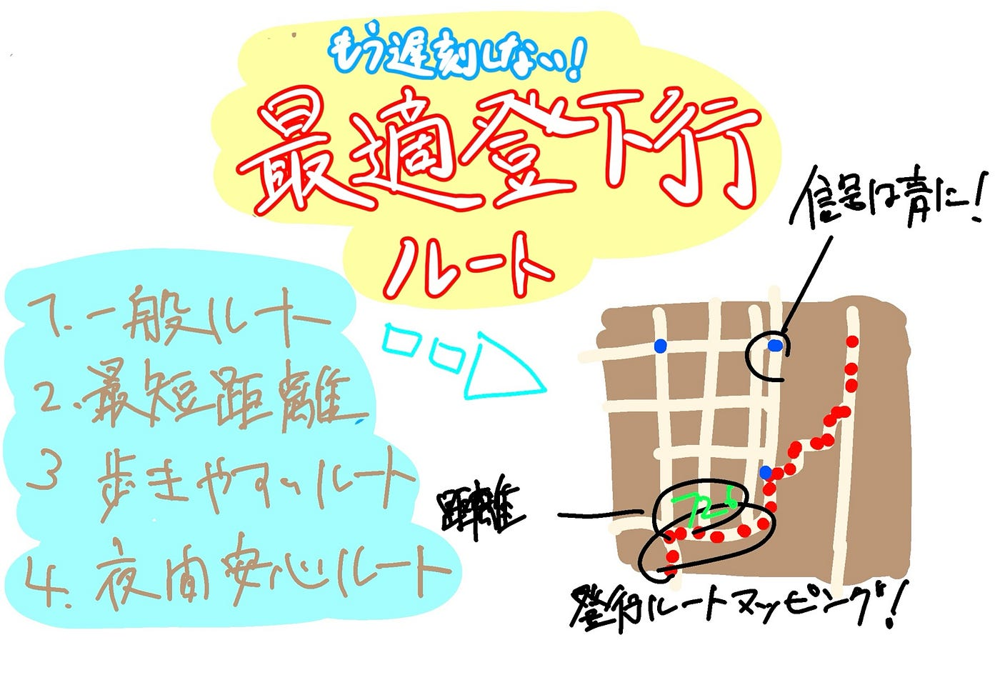

### 遅刻常習犯のあなたに大学への行き方を教えてあげましょう。

こんにちは。遅刻常習犯の本吉です。青学に通う学生なら誰もがESPOTの前を大学に行くでしょう。たまには他の道を使うこともあると思います。今日はそんな大学までの登下校ルートのお話です。

### **みんなの行く道が本当に正しいのか**

淵野辺駅北口から出て桜美林大学の前の道を突き進み、HOTEL BONITAの信号を渡り大学に来る。それが一番ありふれた青山学院大学相模原キャンパスまでの登校ルートで、それが一番早くて正しいと信じられているように感じます。

しかし、遅刻ギリギリの僕はこう思うわけです。

**「もっと早く大学にいける道があるはず！！」**

信号や道の混み具合を考慮するともしかすると他に最速ルートが存在するかもしれません。

### 研究方法

**1.調査対象エリア・ルートの設定**

•学校・自宅エリアを決め、代表的な登校ルートを選定

**2.GISデータ作成**

•ベースマップの準備（OSM 等）

•通学ルートを線としてデジタイズ（QGIS）

**3.交通インフラ情報の取得**

•QuickOSM で信号機などのポイントデータ取得

**4.分析**

•ルート距離の計測

•信号機・交差点との位置関係を見る

**5.考察・可視化**

•危険そうな区間・特徴の整理

- スクリーンショットや地図レイアウトとして出力

### いざ

- **代表ルート（LineString）の作成**

- 淵野辺駅北口 → 青学相模原キャンパスの代表となる通学ルートを QGIS 上で作図。

- **距離の計測**

- フィールド計算機で `$length` を使い、ルートの総距離（m）を算出。

- **OSM の信号データ可視化（QuickOSM）**

**QuickOSM** プラグインを使用して
 `highway=traffic_signals` のデータのみ取得。

信号機の位置を地図上に重ね、停止ポイントとして分析に活用

今回行ったのはここまでです。

### 今後の展望

・横断歩道レイヤーの追加

・街灯レイヤーの追加

・最短距離の算出

・階段等障害物のマッピング

以上を行った上で全てのルートを比較し、それぞれの状況に最適なルートを考えます。

### グラレコ

