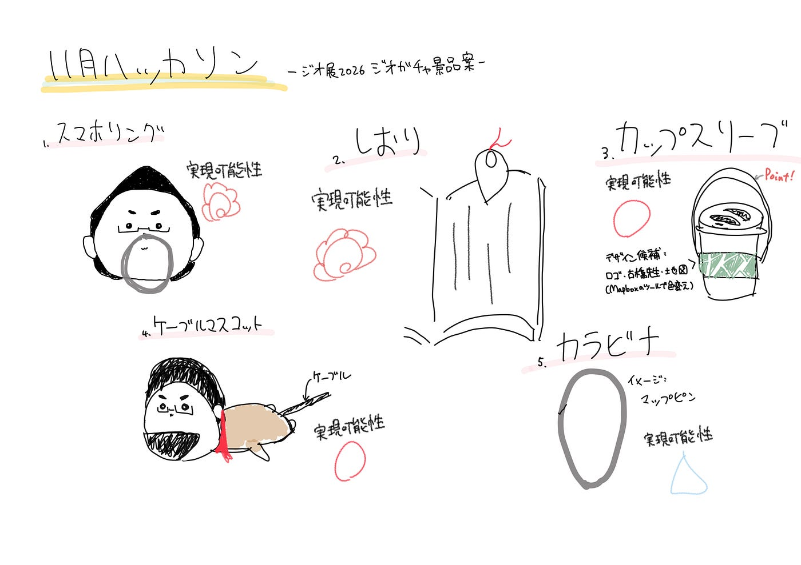

### [11月ハッカソン]ジオ展2026ジオガチャの景品案

こんにちは、4年の林です。

11月のオンラインハッカソンは、来年に行われるジオ展2026のジオガチャの景品案についてゼミ内サークル毎にアイディアを出すというものでした。
今回の、ハッカソンでの条件は、

- 今までの景品ではなかった、新しいもの

- 予算が1個あたり100円以下で作成できそうなもの

- 可能な限りプロトタイプを作成すること

- 新3年生をチームに巻き込んで行うこと

でした。これら3つの条件を基に、Youthでは5つのアイディア案を考えました。

#### 1. スマホリング

実現可能性：◎

制作方法：外注

デザイン案：古橋先生・古橋研ロゴ・地理空間情報の偉大な人物をイラスト化する（OSM設立者など）

単価：53円〜

[オリジナルスマホリング | ノベルティ・オリジナルグッズ製作のノベルティ製造
ご希望デザインでオリジナルスマホリング製作します。企業ロゴやお写真・イラストのオリジナルプリントから企業マーク・キャラクターの形でダイカットしたスマホリングの製作まで、工場直売ならではの格安価格で小ロットからオーダーメイド製作できます。www.noveltyseizou.com](https://www.noveltyseizou.com/product/iring/)

#### 2. しおり

実現可能性：◎

素材（候補）：厚紙・布・プラスチック（外注）・和紙

デザイン案：上に出す部分・全体の形をマップピンの形にする

古橋先生名言しおり

#### 3. カップスリーブ

実現可能性：◯

制作方法：自作

素材：フェルト・布

デザイン案：紐付き（取手）・古橋研のロゴ・古橋先生・地図（サガキャン）

[Maps for developers
Mapping platform designed for developers. Publish interactive maps in your web applications and on mobile devices.www.maptiler.com](https://www.maptiler.com/)

懸念点：サガキャンの地図を印刷するなら従来のアイディアと被る部分が多い→Mapboxのツールで地図の色を変える

#### 4. ケーブルマスコット

実現可能性：◯

制作方法：自作(blenderでモデリング→3Dプリンター)

デザイン案：古橋先生 ポーズを変えて数種類作る

#### 5. カラビナ

実現可能性：△

素材：鉄（理想）

デザイン案：マップピンの形

上記のデザイン案をイメージ図に起こしたものをまとめてグラレコに書いております。

