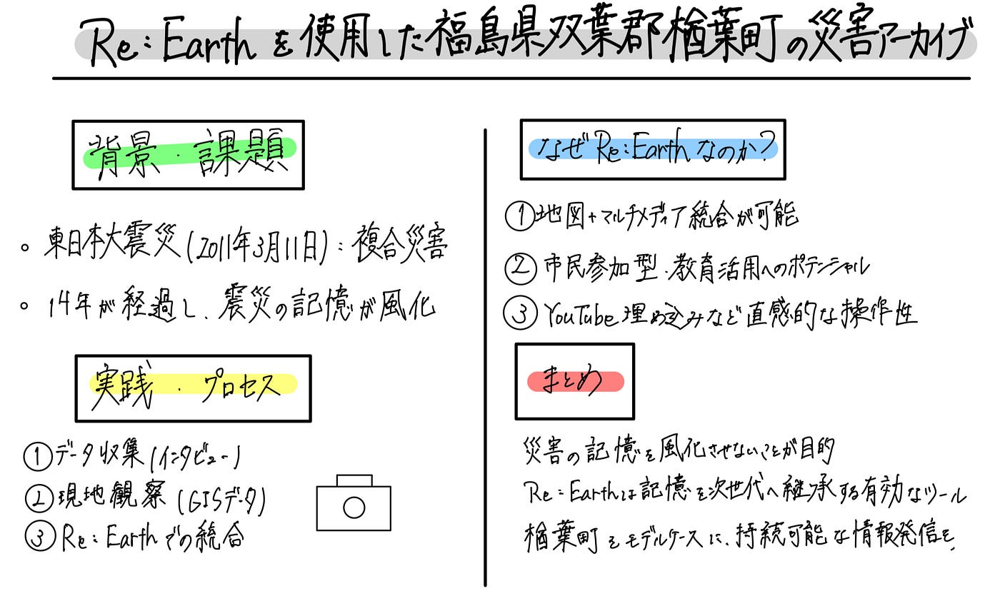

### Re:Earth を使用した「福島県双葉郡楢葉町の災害アーカイブ」の構築 【卒論中間発表】

### Abstract

この研究の目的は、東日本大震災および福島第一原子力発電所事故の影響を強く受けた 福島県双葉郡楢葉町に特化した デジタル災害アーカイブを構築することです。。

時間の経過とともに記憶が薄れつつある震災当時の記録を、 Re:Earth を用いて「空間的に閲覧可能なアーカイブ」として再構築し、 地域の復興過程や被災状況を後世に伝えることを目指しています。

### Introduction

2011 年 3 月 11 日の東日本大震災と原発事故は、双葉郡全域に甚大な被害をもたしました。
しかし、その中でも楢葉町は比較的早期に避難指示が解除され、 復興の進行と街の変化を観察できる貴重な地域です。

災害から 14 年が経過し、 「語り継げる世代」が徐々に限られてきている現状を踏まえると、 地域特有の資料を整理し、デジタルアーカイブとして記録し続けることは重要です。

広島・長崎アーカイブなど、既存事例から学ぶ点は多いものの、 楢葉町に特化した体系的アーカイブはまだほとんどありません。 その課題意識から、この研究に着手しました。

### Purpose

この研究の目的は次の 3 点です。

1. 楢葉町に関する写真・証言・地図情報を収集し、メタデータ化すること
2. Re:Earthを使って資料を空間情報として統合し、インタラクティブな災害アーカイブを構築すること
3. 防災教育や地域学習に活用できる形へ発展させること

アーカイブを「地図として閲覧できる形」にすることで、 震災の体験を時間軸・空間軸の両面から理解しやすくなると考えています。

### Methods

● インタビュー 
被災者や住民への聞き取り調査を行い、避難・帰還・復興に関する証言を収集。

● 現地観察（ならはCANvas） 
写真・動画・メモ・位置情報など、現地だからこそ得られる資料を蓄積。

● メタデータ整理 
撮影日、撮影場所、内容説明などを付与し、デジタル資料として整理。

● Re:Earth での統合 
写真レイヤ・証言レイヤ・地図レイヤを掛け合わせ、 
空間的に閲覧できるインタラクティブアーカイブのプロトタイプを構築予定。

● 教育利用の検討 
防災教育や地域史の授業での使用も視野に活用可能性を分析する。

### Progress

- 楢葉町関連の資料収集 
- 写真・動画・証言の整理 
- 地図データの整備 
- Re:Earth プロトタイプ構築の準備

これらが進行中のタスクです。

今後のステップとして、 収集した記録をRe:Earthに配置し、 時系列と地理情報を重ねて閲覧できるマップを作成する予定です。

### Issues

研究を進める中で、いくつかの課題も浮かび上がってきています。

● 資料の偏り 
震災当時の資料は個人所蔵が多く、収集が難しいケースも多い。

● Re:Earth の実装スキル 
- データの階層構造設計 
- ビジュアル表現の調整 
これらは今後さらに習得が必要。

● 教育利用の設計 
住民向け、学生向けなど、 誰が使うかによって求められる UI が異なるため、検討が必要。

### Discussion

楢葉町は帰還が進んでいるため、 時間とともに「変化が見える地域」であるという点は、 アーカイブ構築において大きな価値を持つと感じています。

一方で、資料の偏りや現地記録の難しさといった、 災害アーカイブ特有の課題も明らかになってきています。

また、Re:Earthなどのプラットフォームは可能性が大きい一方、 細かな UI の調整に制約があるため、 操作性やデザイン性の改善は今後の焦点になりそうです。

### Conclusion

本研究はまだ進行中ではあるものの、 楢葉町を対象としたデジタル災害アーカイブの構築は、 記憶の継承と復興の可視化に大きな意義があると感じています。

今後は、

- インタビューの拡充 
- Re:Earthを使ったアーカイブ第一版の構築 
- 地域や教育機関へのヒアリング 
- 実際の防災教育での試験利用

などを進め、より社会的に活用できるアーカイブの形を探索していきます。

### グラレコ

