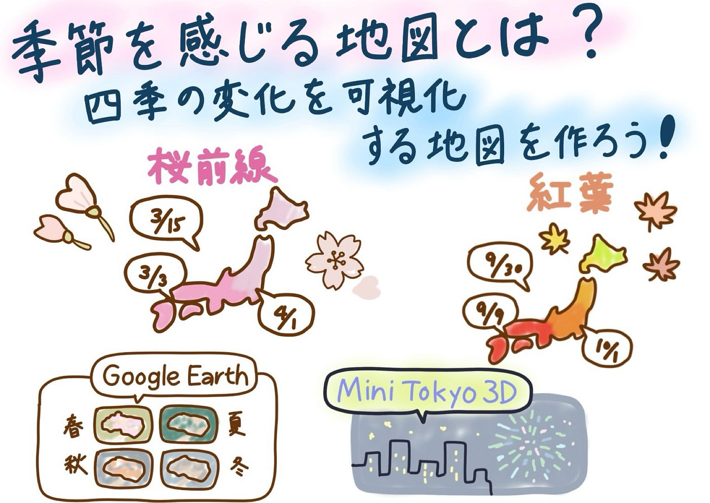

## 季節を感じる地図とは？

こんにちは。3年の安生です。

今回はゼミ論の中間発表についてです。

私は季節を感じる地図とは何かというテーマで研究を進めています。

日本には春夏秋冬があり、同じ場所でも季節によって景色が大きく変わります。しかし、普段目にする地図の多くは、この「季節の変化」を直接的に感じられるものは少ないと感じます。

そこで、

“季節を感じる地図とはどんな地図なのか”

というテーマで、先行事例や景観の特徴を整理しながら、四季の地図表現の可能性を探ります。

[GitHub - furuhashilab/2025gsc_MoeAnjo: 2025年度ゼミ論
2025年度ゼミ論. Contribute to furuhashilab/2025gsc_MoeAnjo development by creating an account on GitHub.github.com](https://github.com/furuhashilab/2025gsc_MoeAnjo)

**なぜ季節を感じる地図を考えるのか**

・日本は四季による景観の変化がとても大きい

・地図には多くの情報が載るが、季節の変化を視覚的に伝える表現は少ない

そこで、「四季の変化をどのように地図で伝えられるのか？」という視点から整理を進めています。

**季節を扱った既存の地図表現**

● 桜前線

開花予想を色分布や等時線で示した地図。

ピンクの色調を使うことで、「春らしさ」を視覚的に伝えています。

● 紅葉の見頃予想

灰色〜赤への段階的な色の変化で、紅葉の進み具合を表現。

秋の色を使った代表的な例です。

● 花火アニメーション（Mini Tokyo 3D）

花火大会の日時に合わせて、3Dの花火が地図上に出現。

夏のイベントを「動き」で示す表現が特徴。

● Google Earth の季節差画像

衛星写真を季節ごとに閲覧すると、

同じ場所でも“色・明るさ・植生”が大きく変化していることがわかります。

**四季らしさを作る視覚要素**

整理してみると、季節を感じるためには次のような視覚的特徴が重要だとわかりました。

•	色彩（春の淡い色、夏の濃い緑、秋の赤、冬の白）

•	明るさ（夏は明るい、冬は暗め）

•	植生（緑の量の変化）

•	天気の特徴（春の晴れ、夏の夕立、秋の澄んだ空、冬の雪）

•	空気感（霞・澄み具合・影の強さなど）

これらはそのまま地図のデザイン要素にも置き換えられるため、四季の変化を表す地図を作る際の重要なヒントになります。

**今後の取り組み：四季の地図スタイルづくり**

今後は以下の流れで、実際に四季の地図を作成していきます。

1.	Google Earth の季節画像を整理し、春夏秋冬の特徴をまとめる

2.	季節らしさを表すためのデザイン要素をリスト化

3.	Mapbox Studio で、四季の地図スタイル（春/夏/秋/冬）を4種類制作

4.	春→夏→秋→冬 と切り替えて比較できる地図を作る

地図の色・線の色・明度・透明度・背景色・モーションなどを調整しながら、季節を感じる地図表現に挑戦しようと思っています。

グラレコ

