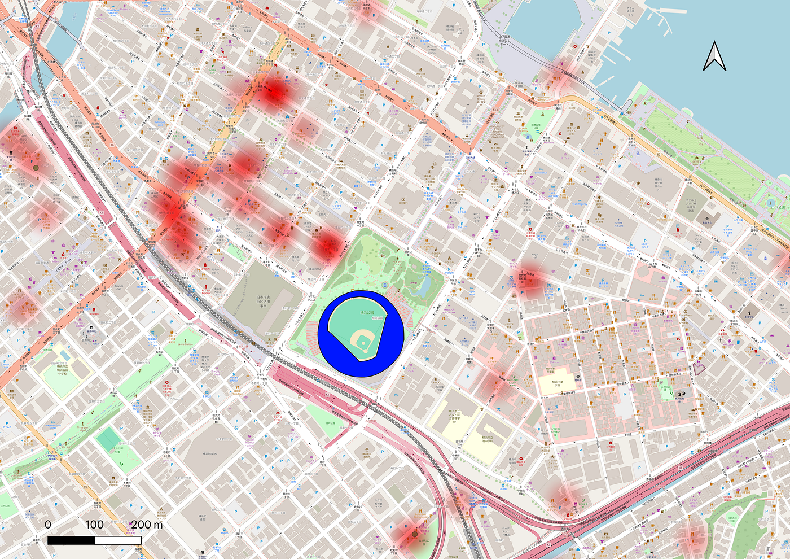

## 「感動」を地図上で可視化してみたい【ゼミ論中間発表】

こんにちは。3年の小崎です。

私のゼミ論の研究テーマは、プロ野球の「試合の勝敗（感情）」が、私たちの「足取り（移動距離）」をどう変えるのかを解明することです。

「勝った日は、興奮していつもより遠くの店まで歩いてしまうのではないか？」

もしこれが証明できれば、スポーツの「感動」を「経済価値（移動距離＝消費機会）」に換算できるかもしれない。そんな仮説から、私の研究はスタートしました。

Github

[2025gsc_MiaKozaki/README.md at main · furuhashilab/2025gsc_MiaKozaki
2025年ゼミ論. Contribute to furuhashilab/2025gsc_MiaKozaki development by creating an account on GitHub.github.com](https://github.com/furuhashilab/2025gsc_MiaKozaki/blob/main/README.md)

ゼミ論中間発表資料(3分用)

**挫折からのピボット**

当初、私は単純に「デーゲームとナイターの比較」をしようと考えていました。

しかし、実際に考え始めるとすぐに壁にぶつかりました。

• デーゲーム（昼）： 家族連れが多く、試合後は「夕食」や「買い物」へ。

• ナイター（夜）： 会社員が多く、試合後は「飲み会」や「直帰」へ。

「これでは、勝敗の影響なのか、単なる時間帯による客層の違いなのか分からない…」

そこで私は思い切ってテーマを変更しました。条件を「ナイター終了後」に統一し、「試合のドラマ性（興奮度）」という心理的な要因に焦点を絞ることにしたのです。

**今回やってみたこと**

そもそも私は、QGISを扱ったこともなければ、データ分析も行ったことがありません。少しでも操作に慣れるために、デモデータを使用してどのような手順で進めるかを学ぼうと思い、私は生成AI（Gemin 3 Pro Large Language Model）を活用し、自分の仮説通りの動きをする「合成GPSデータ（ダミーデータ）」を作成しました。これを使って、「QGIS」でどのように表現できるのかを試すことにしました。

ここからは、実際に私がQGISで行った検証プロセスを紹介します。

Step 1: 「祝杯の受け皿」を可視化する

まずは「人はどこへ流れるのか？」を知るために、OpenStreetMapのデータを使用しました。

QuickOSM プラグインを使い、横浜スタジアム周辺の pub（居酒屋）と restaurant（レストラン）のデータを抽出。

ここで「Polygon（建物の形）とPoint（点の店）が混ざって結合できない！」というエラーに直面しましたが、「Centroids（重心）」ツールを使ってすべてを点に変換することで解決。これらを結合し、ヒートマップ化することで「祝杯ポテンシャルマップ」を作成しました。

Step 2: 時系列アニメーションの実装

次に、[生成AIで作った合成データ](https://docs.google.com/spreadsheets/d/1bplo2ekq_HrlISrYpm0Nga-ABy8i5Ynw88U4ye-VK-0/edit?gid=1654218322#gid=1654218322)をQGISに読み込み、「時系列コントローラ」機能を使って動かしてみました。

「21:00にスタジアムにいた点が、21:30にかけて野毛の飲み屋街へ拡散していく…」

PCの画面上で点が動き出した瞬間、私の仮説が「可視化」されました。あくまでも検証のため、人の流れを重視したというよりは、上手く作動できるように軽いデータで試しました。

[copy_5AE4B913-9942-4B16-A9BD-A7E38BACE733.mov
Edit descriptiondrive.google.com](https://drive.google.com/file/d/1-6f8U6VAHHN57O8MFTMvA5ZzL08awS7D/view?usp=sharing)

#### これから考えること

このシミュレーションを通じて、机上の空論では気づけなかった重要な課題が見えてきました。

1. ノイズ除去の必要性:

ただデータを可視化するだけでは、通行人や住民も混ざってしまう。「試合終了時刻にスタジアム内にいたID」だけを抽出するフィルタリングが必須です。

2. 「時間の壁」との戦い:

負けたから帰るのではなく、「試合が長引いて終電がヤバいから帰る」のではないか？

この「交絡因子」を排除するためには、単に勝ち負けで分けるのではなく、「試合終了時刻がほぼ同じ試合」同士を比較するという厳密な条件統制が必要だと気づきました。

どのデータを扱うかも含めて、決めないといけないことは沢山ありますが頑張ろうと思います。
