### 普段のグラレコの書き方➕Cord for Japanに参加した感想！

こんにちは！3年の稲田優花です。

今回はデザイン部員がそれぞれ普段のグラフィックレコーディング(以下、グラレコ)を見せ合う週報の最終回となります。私が描いているグラレコについて動画とともにまとめようと思います！

また、Instagramで以前募集のあったCord for Japan Summit 2025に、グラレコボランティアとして参加したため、そこでの学びも記載します。

> ①私のグラレコの書き方について

↓YouTubeのリンクになります。

私のグラレコは見ての通り、毎回描き方やデザイン、ポイントが異なり、内容や登壇者の雰囲気、その時の気分やモチベーションの高さによってもその複雑さや色合いが異なります。

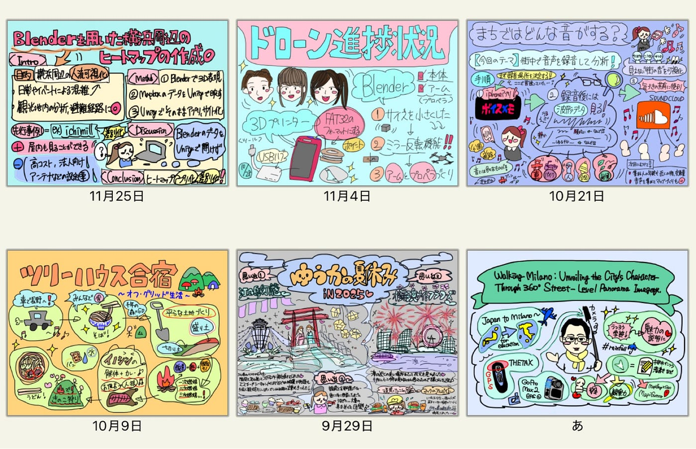

そこで、今回は分かりやすくできたと感じるグラレコを紹介しようと思います。

動画のグラレコは、マニラの国際会議の際に描いたものですが、レイアウトは変更せずそのまま、3枚を完成させたものになっています。紙だと書き直しができませんが、デジタルであれば内容のみ消して同じ紙に同じレイアウトで描けます！

### 〜グラレコの手順やポイント〜

### ①タイトルを描いて縁取る

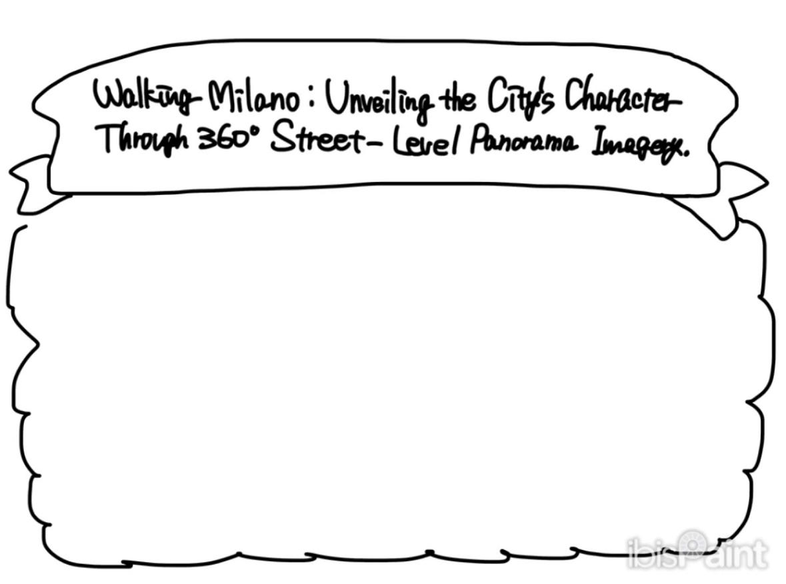

タイトルは大きめに書くのがポイントです！

この会では上にタイトル、下に内容を書く構成にしました。

### ②重要となる人物やメインイラストを中央に描く

この時は講演だったため古橋先生を書きましたが、週報の内容によっては、メインとなる物やことのイメージ、モチーフのような絵でも良いと思います。

### ③縁取りながら周りに内容を描いていく

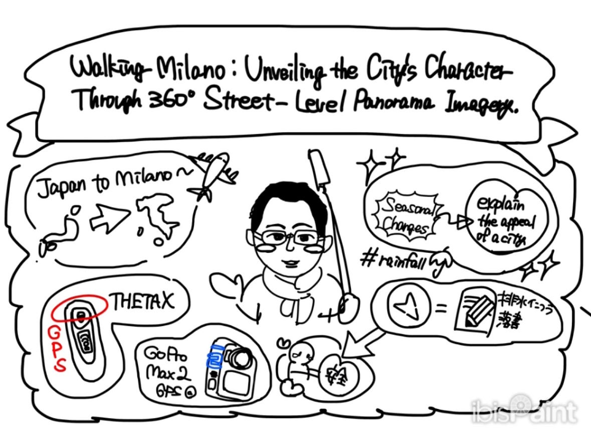

縁取ることで、どこまでが同じような内容で、どこから話が変わったか分かりやすくなります。これは週報グラレコでも同じで、少し話題が変わるところで区切って書くのが良いだろうと思います。少しでもイラストで表そうとします！

### ④目立たせたい所にはっきりさせる色を付けていく

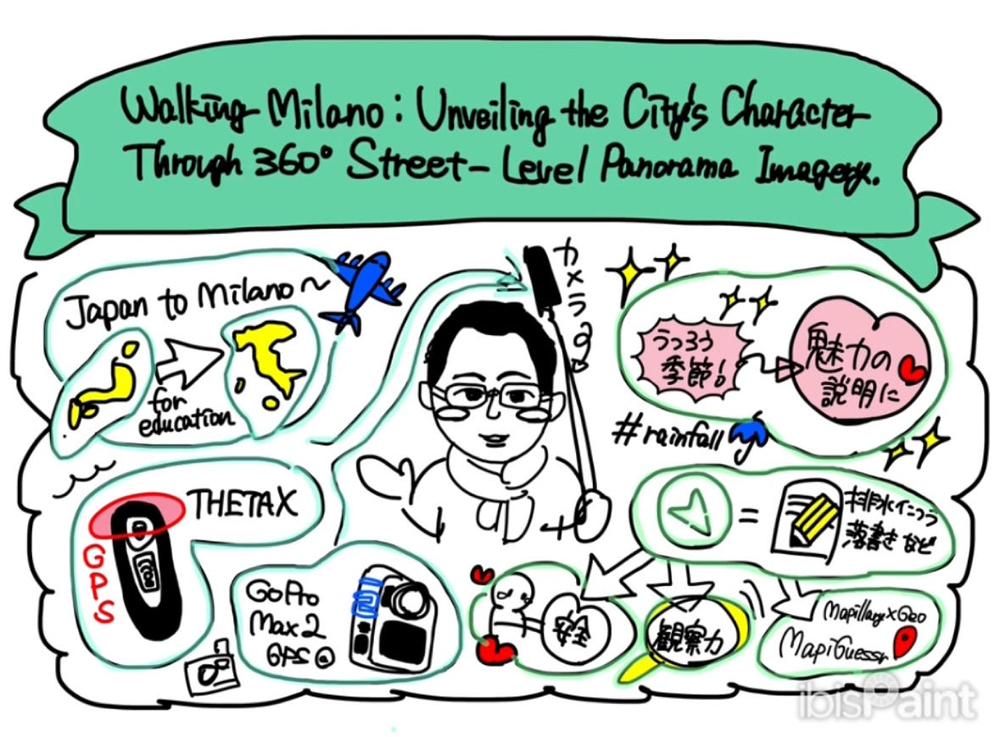

タイトルの背景として緑を選びました。この時の色選びは、マップのようなイメージから緑にしましたが、その時の気分や好きな色でいいと思います。

### ⑤縁取った枠内や背景も薄い色で塗ってみる

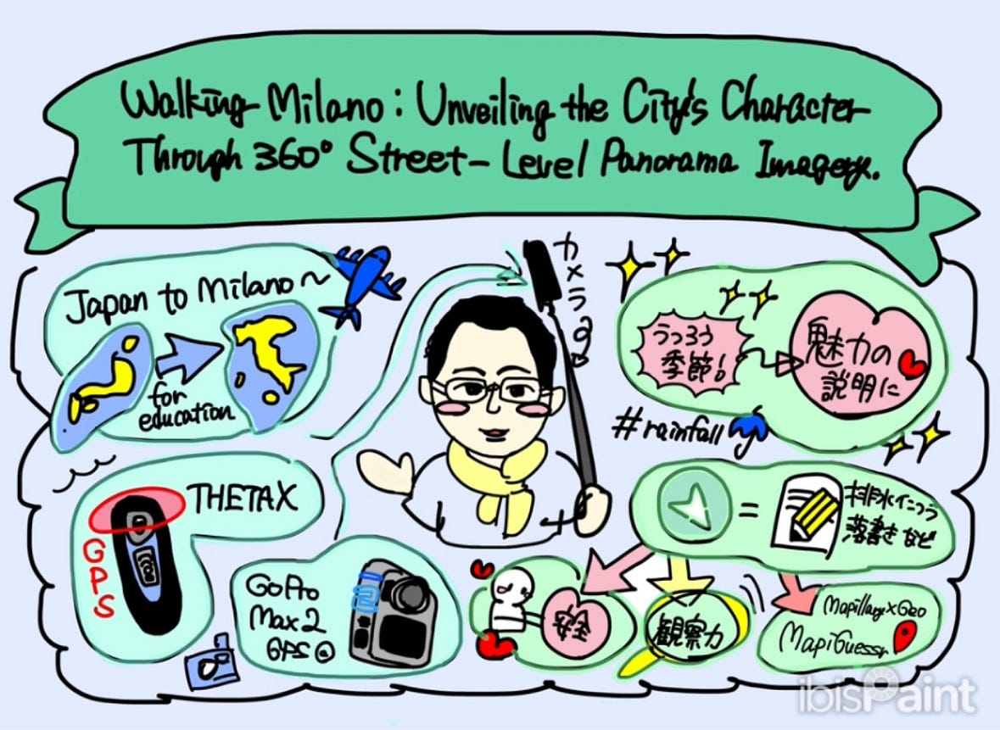

この⑤の工程は、ゼミに入ってからなんとなくやり始めたものなのですが、アイビスペイントであればまとめ塗り機能があり、すぐに色を変えることができるだけでなく背景の色を変更するだけでクオリティが上がって見えたのでおすすめです！

〜完成〜✨

### 感想

ちはな

背景色を変える考え方は私にないものだったので驚きました。確かに真っ白よりも余白が少なく見えて情報量が多くなるので良いと思いました。また、私のグラレコと比べてより絵が中心になっているように思えたので、字より絵というのを意識してグラレコを書きたいと感じました。

こうな

人物を中央に描くことによって、周りにポイントとなることを描いてまとめやすいと感じました。また、大量に文字より、絵と文字の割合がよく、色もはっきりしているのですごく見やすいです。背景は白にしがちなので、背景も意識していこうと思いました。

> ②Cord for Japan Summit 2025参加について

#### ｢Cord for Japan Summit」とは何か

一般社団法人コード・フォー・ジャパンを始めとした、テクノロジーを活用して市民と行政が協力して公共サービスを開発する活動について多数講演される、日本最大級のシビックテックカンファレンスです。世界中から、エンジニアなどのシビックハッカーや、自治体・省庁職員、民間事業者が訪れました。2025年度の今回は、渋谷駅にある国際連合大学にて開催されました。

開催日時 : 2025年11月29日（土）10:30～17:30

#### 2025年度の特色・トピック

Code for Japanの新しいコンセプトとして打ち出した「Social R&D」が主なテーマとなりました。

#### 前夜祭での練習の様子

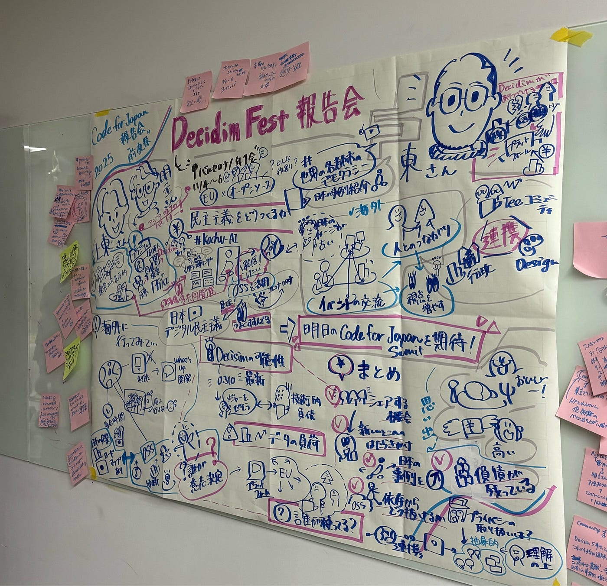

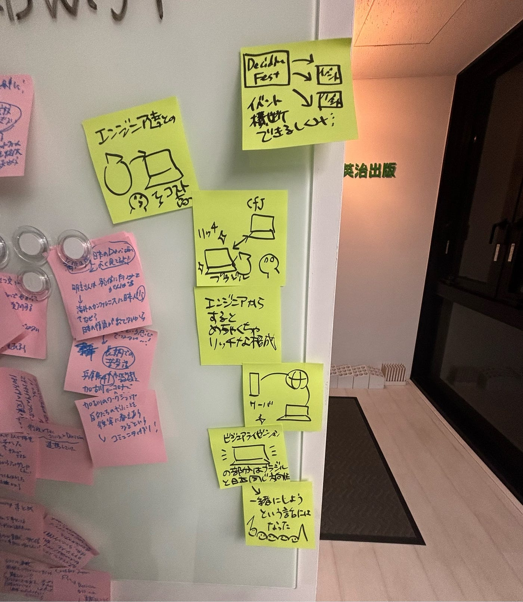

練習の際に描いたグラレコです。

この日は私はサブ(付箋で講演内容をメモしてメインでグラレコを描く人に次々と渡していく担当)をしたため、模造紙に描くというメインの役割はぶっつけ本番でやることになりました。

#### 当日の私たちの様子

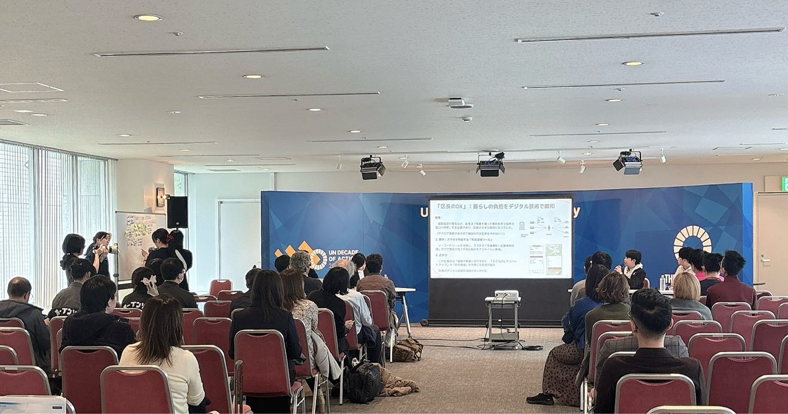

#### 完成したグラレコの数々

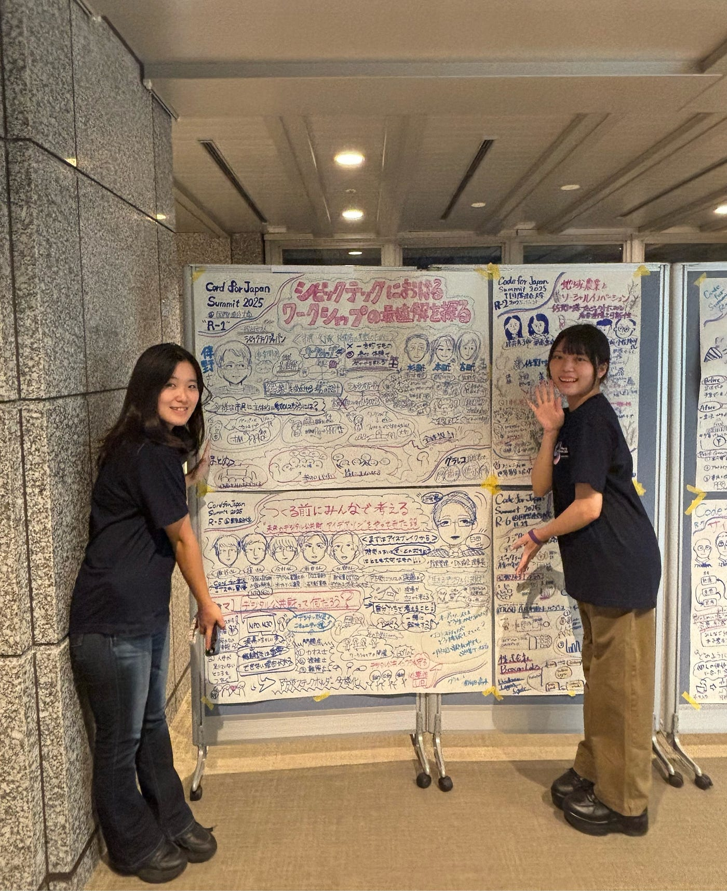

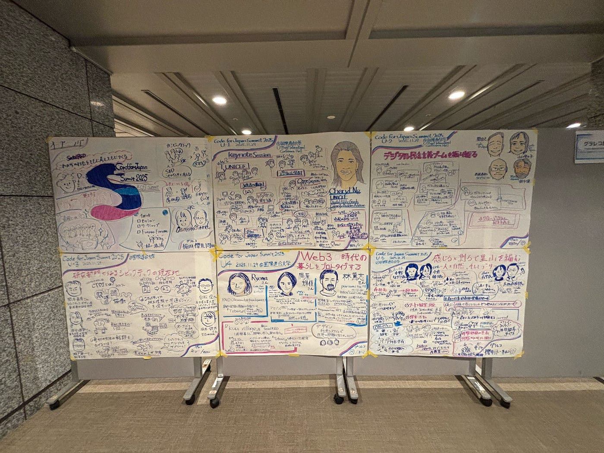

### 感想

学校の授業やゼミでは、小さな紙やデジタルで座って描くことしかしていなかったため、「40分間」などと限られた時間で、講演をその場で、客席の前でまとめていく作業は非常に緊張感がありました。文字やレイアウトを一つ一つ間違えないように考えることや、お話ひとつひとつを聞き逃さないことなど、沢山のことに意識を向ける必要があったのも難しかったです。しかし、ペアの方と1枚のグラレコ完成させることができたときにはとても達成感がありました。

### **グラレコ**

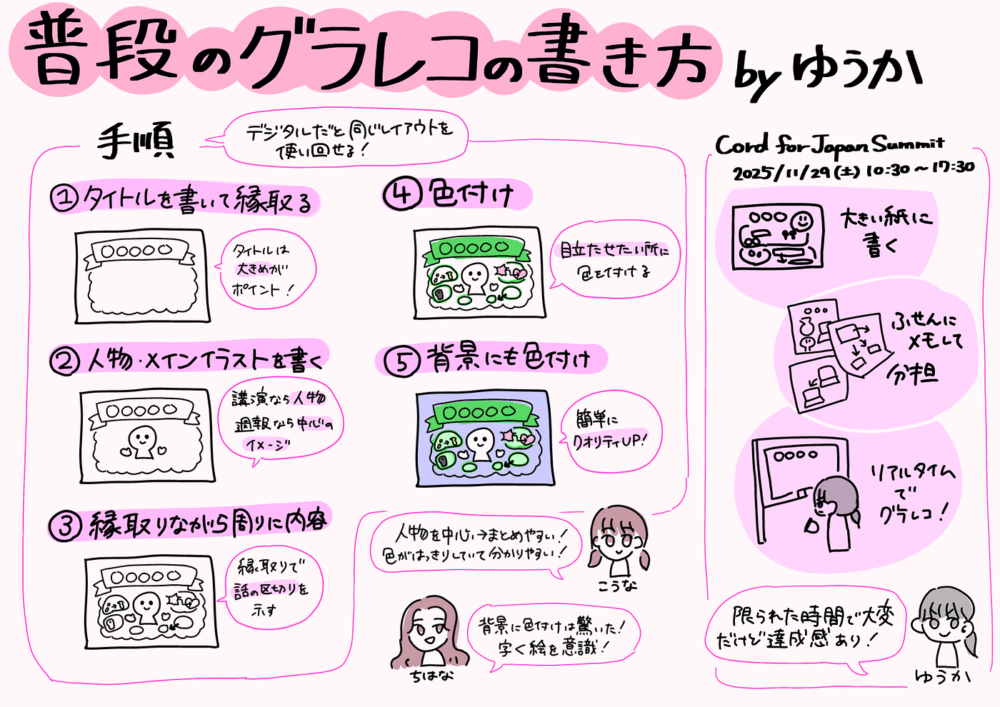
