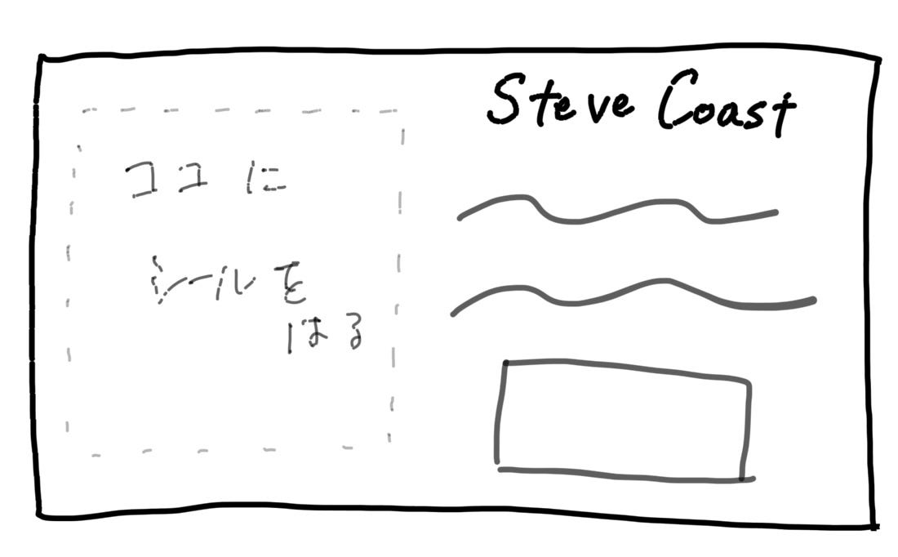
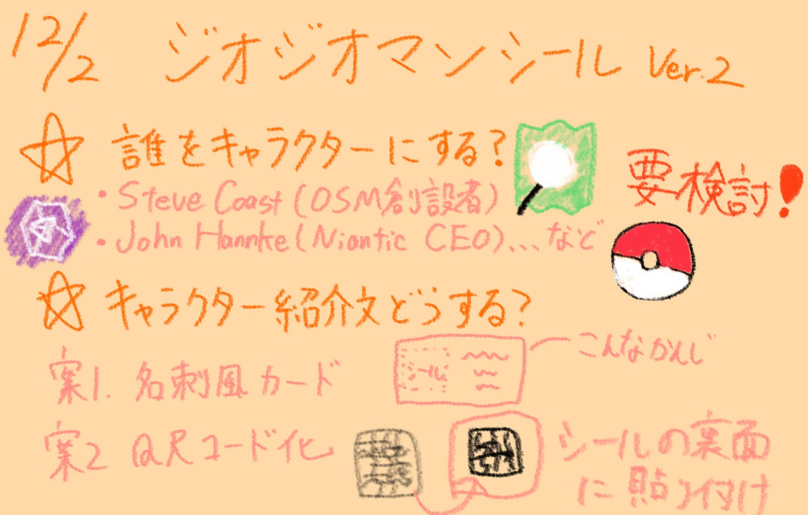

### 【12/2 V&F週報】ジオジオマンシール(仮)を実現させたい！

こんにちは！イナズマイレブンのゲームを購入しようか迷っている荒川です。ちなみに私は円堂守世代より、後の松風天馬のシリーズに熱中していました。必殺技も練習していました。

今週の週報では、11月のハッカソンのジオガチャ景品案について、先週のフィードバックを踏まえた改善案を考えました。

#### **採用キャラクターについて**

先生からいただいたキャラクター案の方々について調べてみました。

[ビックリマンシールもといジオジオマンシール・キャラクタ候補古橋案 · Issue #2 · furuhashilab/Nov_2025VF_hackathon](https://github.com/furuhashilab/Nov_2025VF_hackathon/issues/2)

**調べた情報からのキャラクター案**

・Steve Coast：[OSM創設者](https://ja.wikipedia.org/wiki/%E3%82%B9%E3%83%86%E3%82%A3%E3%83%BC%E3%83%96%E3%83%BB%E3%82%B3%E3%83%BC%E3%82%B9%E3%83%88)

誰でも編集・利用できるOSMの仕組みを作った人。広い分野で活用されるOSM の創設者としての認知度から、当たりとして採用したい。

・John Hannke：[Niantic CEO](https://ja.wikipedia.org/wiki/%E3%82%B8%E3%83%A7%E3%83%B3%E3%83%BB%E3%83%8F%E3%83%B3%E3%82%B1)

Pokemon Goを開発し、Ingressを提供するNiantic社のCEO。業界で人気のあるゲームを開発した企業のCEOとして、当たり枠として人気がありそう。

・小山文彦：[ジオ展ファウンダー](https://internet.watch.impress.co.jp/docs/column/chizu3/2015716.html)

ジオ展の創設者をシールキャラクターとして採用することで、イベント全体の盛り上がりを期待。

全員で5名ほどの作成になるのかなと思います。先生との関係性や、業界での知名度等もお伺いして、採用させていただく方々を決定したいと思います。

#### シール裏説明文問題

実際のビックリマンチョコシールにはこのような説明文が書かれていて、クスっと笑ってもらえるようなウケを作るためにも、これはマネしたいところです。

しかし、発注予定のシールの裏面はフィルムとなっているようなので、裏面に印刷することは難しそうです。

そこで、いくつか案を考えてみました。

**案1 名刺風カード案**

名刺のようなカードを作成し、そこにあらかじめ説明文を印刷しておきます。シールが当たった方にお渡しし、カードにシールを張ることで「シール＋説明文」の本物に近い状態を目指します。

**案2 QRコード作成案**

説明文を記載した画像へのQRコードを作成し、そのQRコードもシールにし、ジオジオマンシール裏に貼り付けます。

ジオ展まではまだ時間があるので、キャラクター案やデザインなどさらに詰めていきたいと思います。

**グラレコ**

