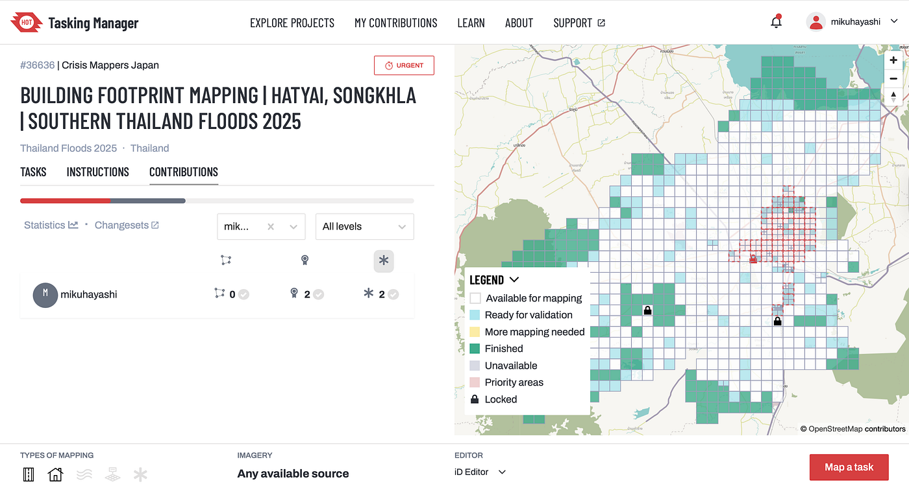
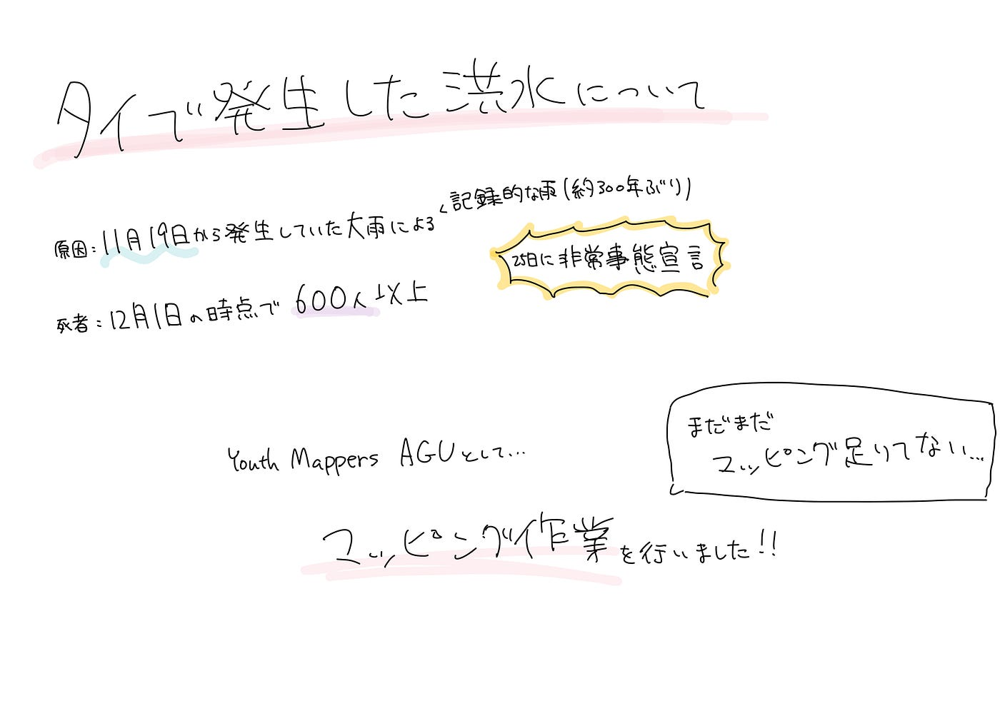

### [12/2 Youth1週報]タイ南部の洪水クライシスマッピング

こんにちは、4年の林です。

私が現在いるトロントは、すっかり気温も下がり、最高気温がマイナスになる日がほとんどで冬本番を迎え、毎朝起き上がるのに格闘しています。

今週の週報は、タイのFOSS4Gメンバーから[タイ南部の洪水クライシスマッピング](https://tasks.hotosm.org/projects/36636/tasks/?filter=MAPPED)要請が入ったため、こちらについて、まとめました。

#### タイで何が起こったの？

2025年11月28日に、タイ南部で大雨による洪水が発生した。報道によると、タイでは、11月19日からソンクラー県などのタイ南部で大雨が続き、ハートヤイでは、21日の24時間降水量が335ミリを観測するなど約300年ぶりの大雨が見られた。タイ政府は、25日に非常事態宣言を発令し、市民に非難を呼びかけた。しかし、非常事態宣言の発足から時間を経たずして、ソンクラー県ハジャイを中心に洪水が発生し、多くの市民が逃げ遅れた。12月1日時点でわかっている、犠牲者は600人を超えると言われており、一部市街地では3メートル近くまで水位が上昇したと言われている。

#### 活動内容

今回、YouthMappersAGUとして、マッピング作業を行いました。

この中で、私は検証作業を中心に作業を行いました。

私が検証作業をする際、特に気をつけたことは、

・建物の角が90度であるかどうか

・建物としてマッピングされている場所が本当に建物であるかどうか

などを中心に作業を行いました。

#### 活動成果

今回のマッピング作業で指定された区域の一つ一つどれも建物が密集しているものが多く、一つのタスクを完了するのに時間がかかってしまったため、完了したタスクの数は多くはありません。

マップからもわかるように、まだ大部分のマッピングが完了されていないため、引き続き、マッピング作業を行っていきたいと思います。

#### グラレコ

