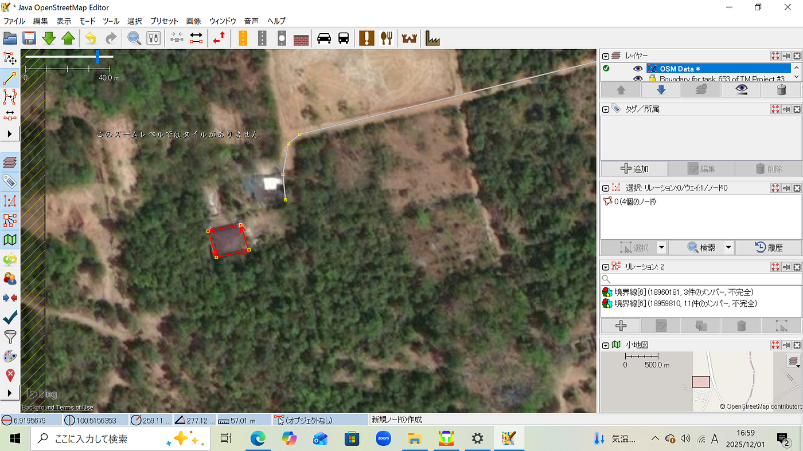
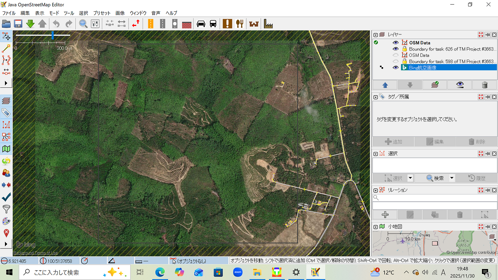
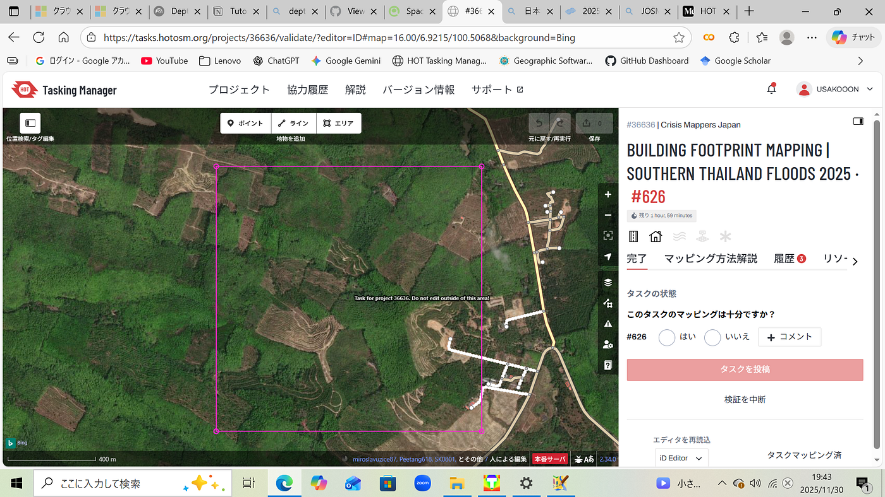
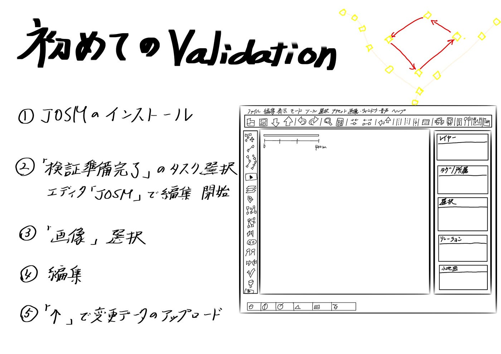

### 【12月2日ユース②週報】初Validation やってみた！

こんにちは！

夏に開催されたマッパソンの際に、中級マッパーに昇格していたテラドです。

折角中級マッパーになったのに、昇格したことに満足してしまい今までvalidation作業を避けてきました。

今回週報の担当になったので、重い腰を上げるような感覚でvalidationをやってみようという気分になり、さっそくJOSMのインストールから始めました。

参考したのは11月3日のユース①でふうかがまとめてくれた

> [HOT Tasking ManagerのValidationにおけるJOSMの使い方【Youth①週報】](https://medium.com/furuhashilab/hot-tasking-manager%E3%81%AEvalidation%E3%81%AB%E3%81%8A%E3%81%91%E3%82%8Bjosm%E3%81%AE%E4%BD%BF%E3%81%84%E6%96%B9-youth%E2%91%A0%E9%80%B1%E5%A0%B1-b637c242f2a5)

を見て直ぐにインストールは完了することができました。

次に、先日古橋先生が共有してくださった

> [Building Footprint Mapping | Hatyai, Songkhla | Southern Thailand Floods 2025](https://tasks.hotosm.org/projects/36636/tasks)

タイのプロジェクトを取り組みました。

#### 流れ

①「検証準備完了」のタスクを選択し、エディタ「JOSM」で編集を開始

②JOSMソフトを開き、「画像」から指定の衛星画像を選択

➂ざっと確認して、追加や編集が必要であれば編集

➃「↑」で変更データのアップロード

以上の流れでValidationを行ってみました。

建物が直角になっていなかったり、道路が微妙にずれているものを主に編集しました。

JOSMはiD Editorと違って、細かい作業ができるので機能を知っていないと良く分からず、今回は手探りでやってみました。妥当性検査結果で引っかからなければ大丈夫かという判断で編集を進めました。

これからは、色々なHow to validateといった動画を見てみようと思います。

iD EditorでもValidatonをやってみましたが、こちらの方が慣れていたのでやりやすかったです。

中級マッパーとして正確なValidation作業ができるように、勉強しながらこれからも続けて行こうと思います！！

