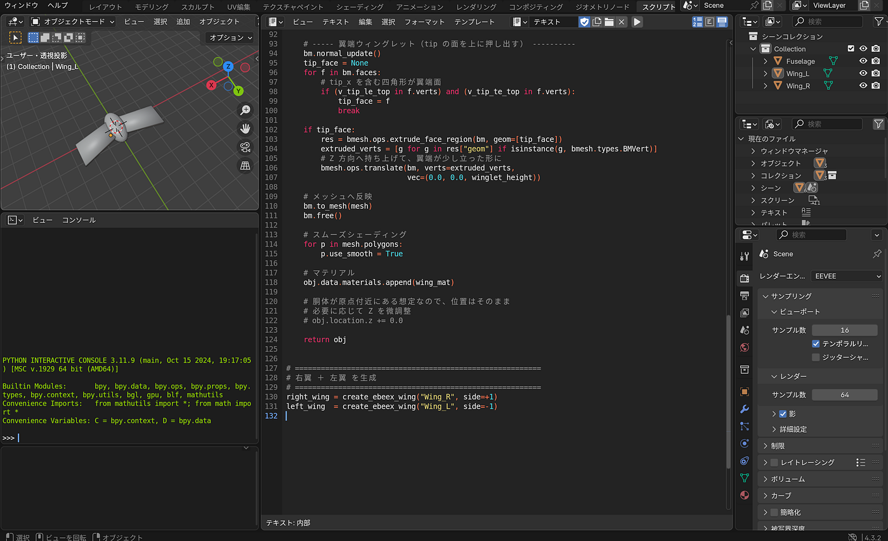
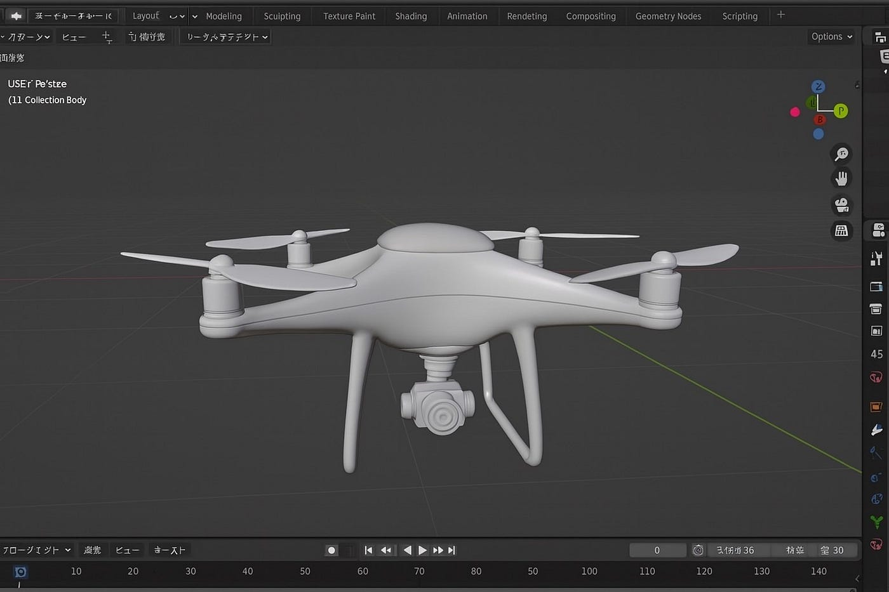
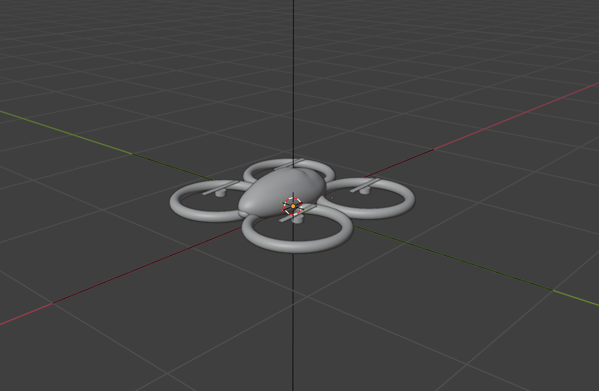
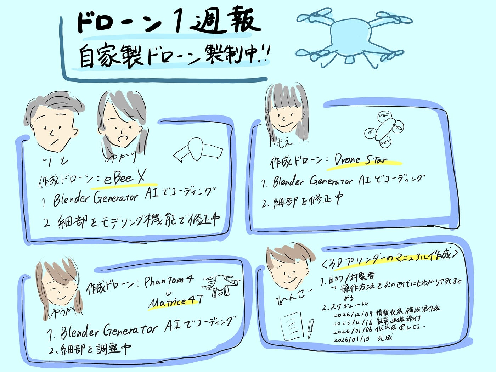

### 【ドローン1 週報 12/02】ちゃくちゃくと自家製ドローンを作成中！

こんにちは、3年の井上です。2025年もあと一か月…年越しジャンプをしたのが昨日のように感じます。この一か月で今年残したものを消化できるよう頑張りたいところです。

さて、今週のドローン１の週報では先週に引き続き、ドローン作成の進捗報告をしたいと思います。主な担当を改めて紹介します。

・blenderでドローン作成① →担当:ゆうか

・blenderでドローン作成② →担当:もえ

・blenderでドローン作成③ →担当:ゆかり・りと

・3Dプリンタのマニュアル作成 →担当:れんせい

それぞれの進捗状況を紹介していきます。

> _進捗状況_

#### ゆかり・りと

今週はBlenderに実際に取り掛かりはじめ、コードの作成を行いました。

コード生成の際は、[BlenderGeneratorAI](https://chatgpt.com/g/g-HbQVfk9FB-blender-program-generator-ai)を使って、eBee Xの形になるようにコードを生成してもらいました。ただ、まだ完全な形ではないため、今後はモデリング機能を使って細部を修正し、クオリティを上げていく予定です。

作成したデータはcodeに保存してあります。

次回以降は、完成形を目指してモデリングしていきます。

[Blenderで機体の作成③（ゆかりりと） · Issue #11 · furuhashilab/drone1_3dprinting_project
Contribute to furuhashilab/drone1_3dprinting_project development by creating an account on GitHub.github.com](https://github.com/furuhashilab/drone1_3dprinting_project/issues/11#issuecomment-3532355046)

#### ゆうか

今週はモデルの再検討とコード生成の生成に取り組みました。

前回の進捗報告の際の古橋先生のアドバイスを基に、作成時にPhantom4ではなくDJIにする場合は、Matrice4Tを選ぶことにしました。

コード作成に関しては、ゆかり・りとチームと同様に[BlenderGeneratorAI](https://chatgpt.com/g/g-HbQVfk9FB-blender-program-generator-ai)を使って、Phantom4もしくはDJI Matrice4Tの形になるようにコードを、そして完成画像についても生成しました。

今後は、今回作成したコードをもとにBlenderで見比べつつ実際のドローンモデリングを行っていく予定です。

[Blenderで機体の作成①（ゆうか） · Issue #9 · furuhashilab/drone1_3dprinting_project
優花の今週の取り組み blender🔗1.zip ドローンをどうやって作るのか ※blenderでの注意ポイント⚠️ 1個前に戻りたい時はCtrl+zを押す‼️…github.com](https://github.com/furuhashilab/drone1_3dprinting_project/issues/9#issuecomment-3593924746)

#### もえ

私もコード作成、画像の生成に取り掛かりました。

[BlenderGeneratorAI](https://chatgpt.com/g/g-HbQVfk9FB-blender-program-generator-ai)を使用して、Drone Starを形作るコードを生成したものの、大まかな形はできたが、プロペラの大きさや形、本体の形など、細かい部分はまだ元のデザインと少し異なっているため修正が必要です。

今後は、プロペラや本体の形を中心に、細かい部分を修正する方針です。

[Blenderで機体の作成②（もえ） · Issue #10 · furuhashilab/drone1_3dprinting_project
進捗があれば記載してください！github.com](https://github.com/furuhashilab/drone1_3dprinting_project/issues/10#issuecomment-3594197653)

#### れんせい

先週はマニュアル作成に取り組めなかったので今週から本格的に取り組み始めました。

まず、これからマニュアル作成に取り掛かるうえで必要な手順を確認しました。手順は以下の通りです。

【手順】

1. 目的と対象者を明確にする

1. 具体的なスケジュールと作業内容の決定

1. マニュアルの構成と概要をまとめる

1. 実際に執筆する

1. 画像や動画で理解度をアップさせる

1. レビューを受けて内容の改善を行う

今回は手順に従って１と２の手順を行いました。

1. 目的と対象者を明確にする
〈目的〉
研究室内の3Dプリンタの使い方を自分たちでも理解できるレベルで再整理し、自分たちの代だけでなく、それ以降の代でも操作に困らないようにする。
〈対象者〉
古橋研究室の学生（使用経験無し）

2.具体的なスケジュールと作業内容の決定
〈スケジュール〉
2025/12/02 目的と対象の設定、スケジュール作成
2025/12/09 情報収集、構成案作成（目次等）
2025/12/16 執筆、画像添付
2026/01/06 仮完成＆レビュー
2026/01/13 完成

今年度のゼミ最終回の一回前でちょうど終わるようにスケジュールを立てました。

今後は、この手順とスケジュールに従いながらマニュアル作成を進めていきたいと考えています。また、スケジュールについては随時メンバーと相談しながら最終発表に間に合うように調整する予定です。

[3Dプリンターの使い方マニュアルを作成する · Issue #7 · furuhashilab/drone1_3dprinting_project
Contribute to furuhashilab/drone1_3dprinting_project development by creating an account on GitHub.github.com](https://github.com/furuhashilab/drone1_3dprinting_project/issues/7#issuecomment-3594575183)

> _まとめ_

今週はそれぞれ本格的に作業が始まりました。最終発表に向けて来週以降も頑張ります。

最後にグラレコです。

