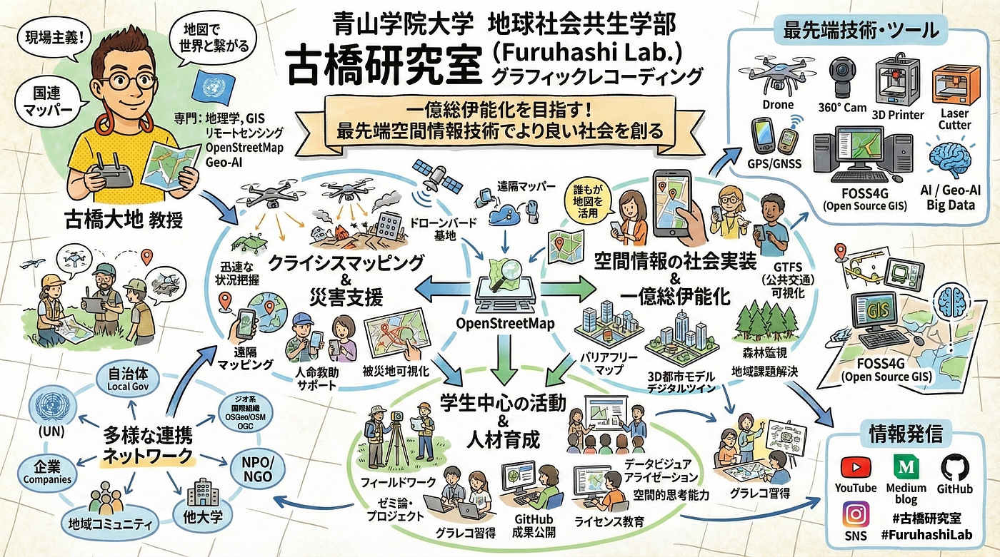
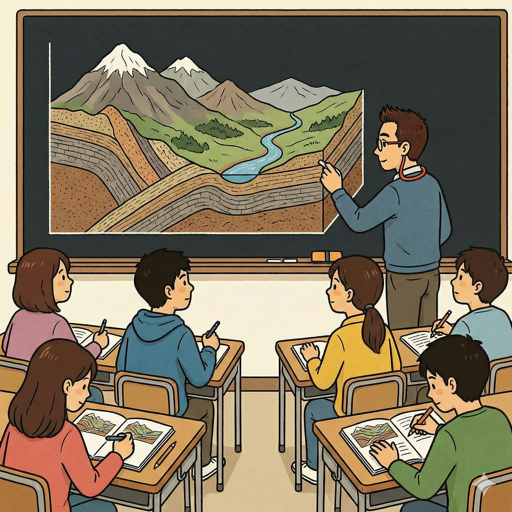
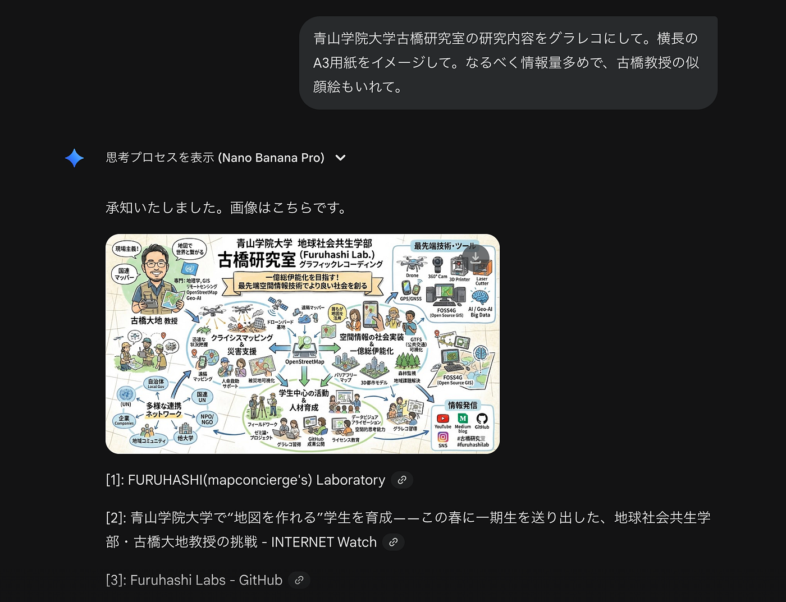
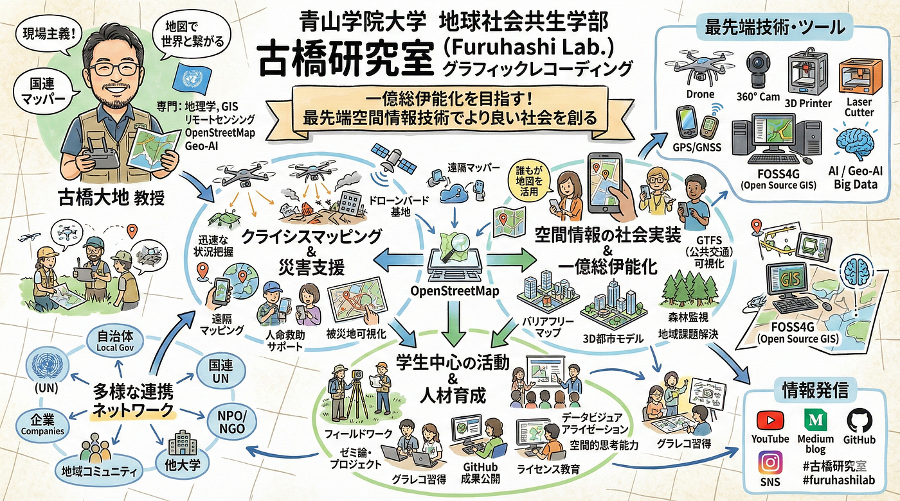
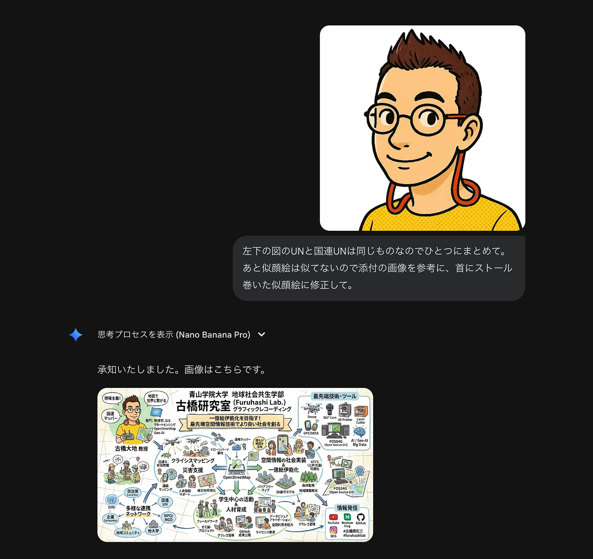
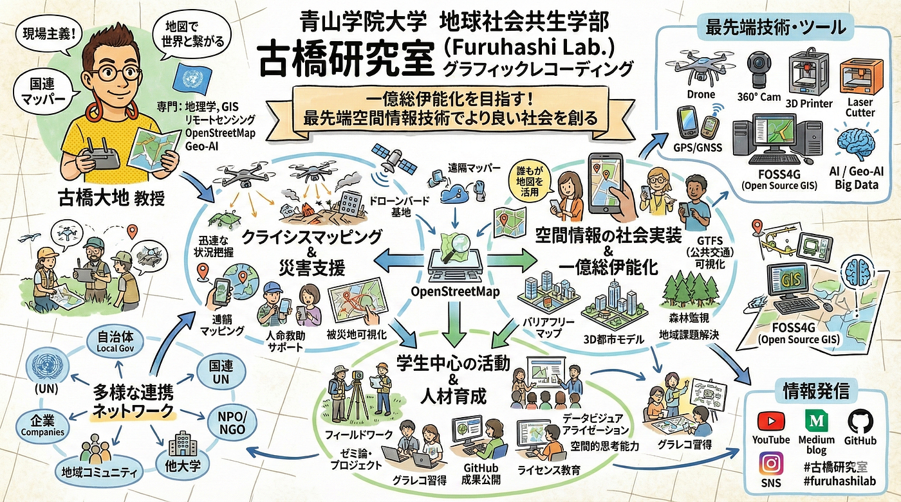
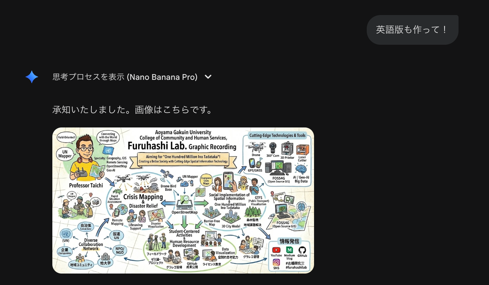
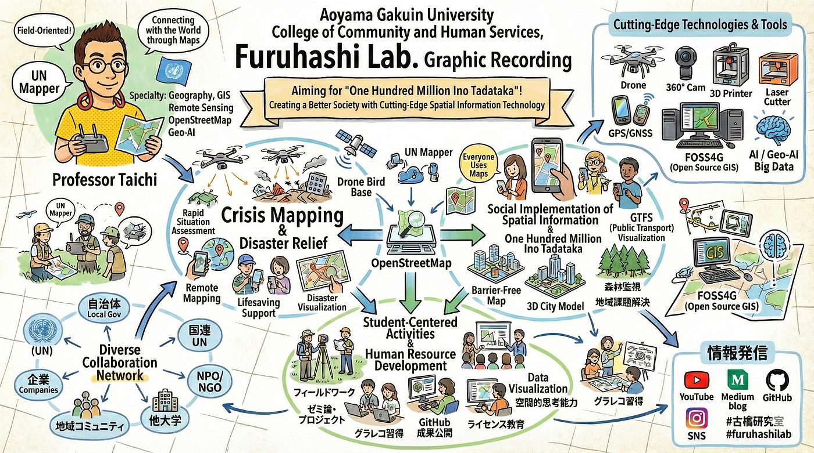

### 生成AIによるグラレコはもうすぐそこまで来ている。

チャッピー([ChatGPT](https://chatgpt.com/))や[Stable Diffusion](https://ja.wikipedia.org/wiki/Stable_Diffusion)などの登場により、教育の分野でも誰もが生成AIを使って文章や画像、動画などのコンテンツを自動生成することができるようになってきた。

古橋研究室でも生成AIは普段遣いのツールとして[学生たちにはハルシネーションに十分注意しながら利用するよう](https://github.com/furuhashilab/README/issues/39)に指導している。

[古橋研究室 AIとのつきあい方 v1.2.0 · Issue #39 · furuhashilab/README
新しい技術を積極的に使う…github.com](https://github.com/furuhashilab/README/issues/39)

そのなかで、大事にしているのが「**[写経**](https://ja.wikipedia.org/wiki/%E5%86%99%E7%B5%8C#%E7%8F%BE%E4%BB%A3%E3%81%AE%E5%86%99%E7%B5%8C)」という概念である。

### # 写経による学びの定着

本来は仏教において経典を書写することを意味するが、プログラミング言語を学ぶ際や、伝統的な黒板による記述のノート転写も含めて、ペンとノートで知らない知識や情報を自らの手で記述し直すことで、視覚からのインプットだけでなく、触覚による体感的な情報の入力が、記憶と理解を補完してくれる。

生成AIが発した言葉をそのままコピペするのではなく、あえて手書き/手描きで写経し直すことで、その理解がすすむとともに、場合によってはハルシネーションにも気づくため、その場で修正することもできるだろう。

このような写経という手法を生成AIが闊歩する現代の教育現場においても活用するために、古橋研究室では長年[グラレコ（Graphic Recording）を授業やゼミ活動で](https://medium.com/furuhashilab/all?topic=graphic-recording)取り入れてきた。

[青学グラフィックレコーディング奮闘記
グラレコアドベントカレンダーが１日空いていることを教えていただき、青山学院大学で取り組んでいるグラレコ授業の様子についてまとめてみました。medium.com](https://medium.com/furuhashilab/%E9%9D%92%E5%AD%A6%E3%82%B0%E3%83%A9%E3%83%95%E3%82%A3%E3%83%83%E3%82%AF%E3%83%AC%E3%82%B3%E3%83%BC%E3%83%87%E3%82%A3%E3%83%B3%E3%82%B0%E5%A5%AE%E9%97%98%E8%A8%98-ccacf8256765)

特に、グラレコは生成AIでもコピペ提出が難しく、生成AIを活用したとしても、たたき台生成したとしても、最後は自分で写経しなければならず、単なるコピペでは完成しにくい点でも**生成AI時代の教育手法として有効である**、はずだった…

### # Nano Banana の登場が時代を変えた

しかし、だ。

2025年11月にGoogleの生成AI Geminiに組み込まれている最新の画像生成モデル [Nano Banana](https://en.wikipedia.org/wiki/Nano_Banana) は、今までの画像生成系AIでは苦手としていた、日本語などもかなり精度よく記述できるほか、イラストの描画レベルも、そしてなにより思考モードの深読みの品質も従来の画像生成系AIのそれとは一線を画した領域に達していた。

そこで試しに、以下のような簡単なプロンプトを Nano Banana (思考モード)に投げて、どの程度のグラレコが自動生成できるのか試してみた。

悪くない。

強いて言うならば、似顔絵が全然似てない(笑)。しかし、古橋研究室の研究・教育活動がほぼ網羅されており、きれいに整理されている。多少冗長な記述も目立つが、大きな誤りなどのハルシネーションはほとんど起きていない。

そこで、古橋のSNSアバター画像を Nano Banana に添付し、似顔絵の書き直しと、冗長だった「国連UN」の部分を一つにまとめるように指示。

これで、似顔絵は変わった。首にストールを巻くように指示したけど無視されたw

そして、冗長だった部分は… これも無視された(笑)

ただ、驚いたのは、他の画像生成AIの場合、追加の指示をすると、全面的に画像が変更されて、部分修正はなかなかしてくれない挙動をすることが多いが、Nano Banana は ver.1 の画像とほぼ変わらず継承されている点で保守的であると感じた。

更に、調子にのって、英語版の生成も試してみた。

一見良さそうに見えるけれど、拡大してみると…

若干、日本語が残ってる…

この後何度かやりとりをして、英語版を作ろうとしたけれど満足いくレベルには到達せず。無念。

このあたりは今後の課題として改善されていくのだと期待する。

いずれにしても、日本語でのグラレコ生成については、かなり高品質に出力できたので、あとは [Figma](http://figma.com/) に放り込んで、細かな文言の修正を手作業で行って完成させたのが、この記事の[冒頭に貼ったグラレコ画像](https://miro.medium.com/v2/resize:fit:4800/format:webp/1*TOnEKSwhgxUnPE2q2lChSw.png)である。

### # 結論

- 日本語でのグラレコ生成は、適切な学習データを提供することで一定レベルまでは可能となった

- 概念整理が多少冗長になる傾向は見られるが、人間による再編集で対応可能

- 但し、多言語への自動翻訳については課題が残る

- グラレコ作成時のたたき台生成ツールとしては十分実用的と言える

- グラッフィクレコーダー(人間)の画風を再現性高く制御できれば、近い将来グラレコを自動生成することは可能であろう

- それでも「写経」というプロセスを組み込むことでグラレコの教育的効果は引き続き期待できる

— -

この記事は以下のアドベントカレンダー記事として執筆しました。

[Furuhashi Lab. - Qiita Advent Calendar 2025 - Qiita
Calendar page for Qiita Advent Calendar 2025 regarding Furuhashi Lab..qiita.com](https://qiita.com/advent-calendar/2025/furuhashilab)

[青山学院大学 GSC Advent Calendar 2025 - Adventar
GSC2023groupphoto](https://github.com/gsc-aoyama/docs4gsc/assets/416977/a08d30d5-e6b3-407e-bab3-55e60bf769bc) **[青山学院大学…adventar.org](https://adventar.org/calendars/12051)
