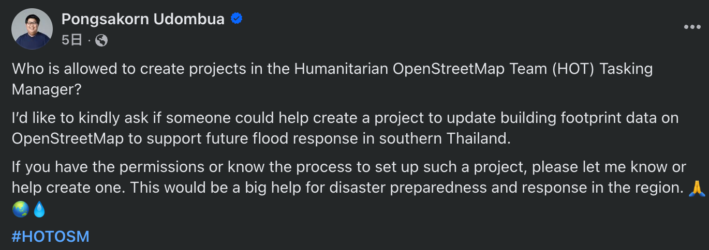
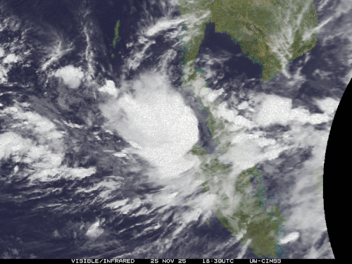
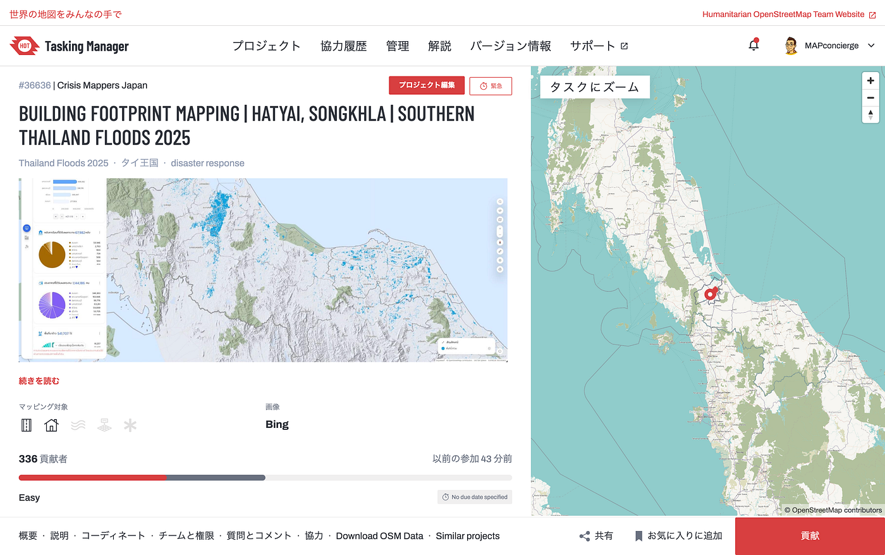
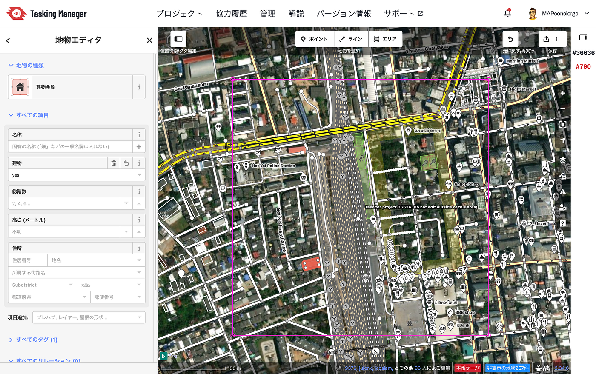
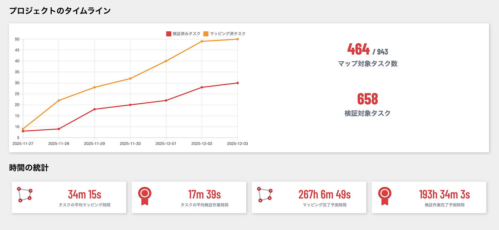

### 洪水が来てもマップは沈まない ― 2025アジアクライシスマッピング奮闘記

それは2026年11月27日の大学授業5限が終わる頃に届いたFacebookの Notification から始まった。

オープンソースGISコミュニティ FOSS4G Thailand のメンバーで友人である Pongsakorn Udombua 氏からの投稿であった。

詳細を読むと、タイ南部の洪水被害について状況報告と、建物マッピングの重要性についての投稿があり、[クライシスマッピングツール HOT Tasking Manager](https://tasks.hotosm.org/) でのマッピングプロジェクト開始リクエストがあり、具体的な状況を確認した。

調べてみると、今回の災害は、[北東モンスーンとラニーニャ現象の影響下で、更に強力な熱帯低気圧セニャールと他の同時発生の低気圧によって引き起こされた複合的な災害](https://en.wikipedia.org/wiki/2025_Southeast_Asia_floods_and_landslides)で、その影響はタイだけではなくインドネシアやマレーシア、スリランカ、フィリピン、ベトナムと広範囲に広がっていた。これはかなり深刻な事態である。

[2025 Southeast Asia floods and landslides - Wikipedia
The 2025 Southeast Asia floods and landslides disaster is a series of severe hydrometeorological disasters that struck…en.wikipedia.org](https://en.wikipedia.org/wiki/2025_Southeast_Asia_floods_and_landslides)

Pongsakorn氏から受け取った、タイ南部の被害状況と、建物マッピング優先エリアの GeoJSONファイルを急ぎ Tasking Manager に展開し、適切な情報をLLMと協働して作文し、最初の [Building Footprint Mapping | Hatyai, Songkhla | Southern Thailand Floods 2025 プロジェクト](https://tasks.hotosm.org/projects/36636/)を公開した。

一報を受け取って３時間後にPublishのスピード感ある初動がとれたのは、日頃の Pongsakorn らも含めたタイのFOSS4Gコミュニティとの交流があったからであり、Notificationを仲介してくれた [UN OpenGIS Initiative](http://unopengis.org/) の Co-Chair である[藤村氏](https://github.com/hfu)との連携の賜物ともいえる。

[https://tasks.hotosm.org/projects/36636/](https://tasks.hotosm.org/projects/36636/)

洪水被害のエリアはかなり広く、建物密度もかなり大きく、そう簡単に建物マッピングをコンプリートできるわけではない。それでも、現地で様々な被災状況の情報発信や実際に支援に取り組んでいる仲間たちの活動がよりスムーズに実施できるように、またこのような災害がまた訪れるであろう未来の災害に備えて、多くのマッパーと力を合わせ[OpenStreetMap](https://www.openstreetmap.org/)のデータを更新することが、未来の安心安全な社会の実現に一歩一歩近づくのである。

幸いにして、OpenMapHub のチームやアジアンOSMマッパーのメンバーがそれぞれ情報拡散してくれて、着々とマッピング作業が進んでいる。

我々の地図は、そう簡単に沈まないのだ。

クライシスマッピングが開始して６日目にて、336名のボランティアマッパーが参加、マッピング済みタスクは50%を突破している。

また、タイだけではなく、スリランカ・インドネシアなど複数の国でTasking Manager のマッピングプロジェクトが進行している。2025/12/03 現在ではいずれもまだマッピング作業は完了していないので、ご協力いただける方は、一つでも建物データの入力をご支援いただけるとうれしい。

* Thailand [https://tasks.hotosm.org/projects/36636](https://t.co/WFQ8kVRDmj) 
 * SriLanka [https://tasks.hotosm.org/projects/36867](https://t.co/ih2zTkooXk) 
 * Indonesia [https://tasks.hotosm.org/projects/36537](https://t.co/1cYsJ1o95O)

もし、建物マッピング方法がわからない場合は、青山学院大学と麗澤大学で急遽開催したHumanitarian Mapathon 2025 Dec の動画を参考にしていただきたい。

気候変動の影響が人間社会に与えるインパクトにどう抗っていくか。そのために我々は地図という武器を磨いていつでも使えるようにしておく必要がある。

そしてその地図は、特定の企業や国に縛られるのではなく、すべての人や組織が自由に地図を使える時代を我々は作っていかなければならない。

そのゴールは20年前よりも、10年前よりも確実に目の前に近づいている。

この記事は以下のアドベントカレンダー2025として投稿しました。

[Furuhashi Lab. - Qiita Advent Calendar 2025 - Qiita
Calendar page for Qiita Advent Calendar 2025 regarding Furuhashi Lab..qiita.com](https://qiita.com/advent-calendar/2025/furuhashilab)

[青山学院大学 GSC Advent Calendar 2025 - Adventar
GSC2023groupphoto](https://github.com/gsc-aoyama/docs4gsc/assets/416977/a08d30d5-e6b3-407e-bab3-55e60bf769bc) **[青山学院大学…adventar.org](https://adventar.org/calendars/12051)

[OpenStreetMap - Qiita Advent Calendar 2025 - Qiita
Calendar page for Qiita Advent Calendar 2025 regarding OpenStreetMap.qiita.com](https://qiita.com/advent-calendar/2025/osmjp)
