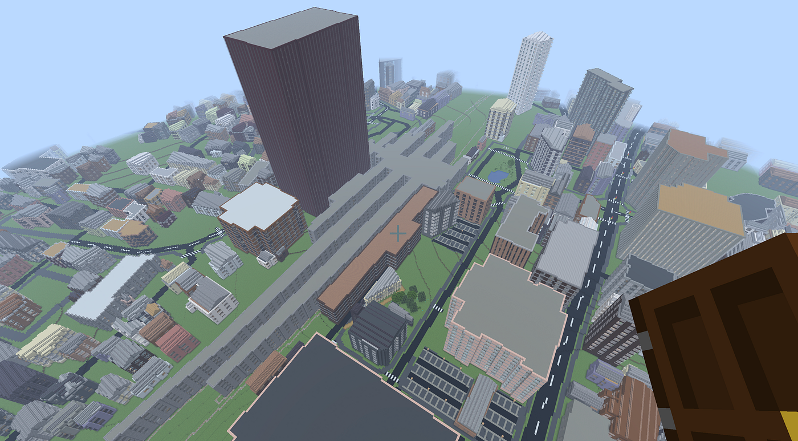
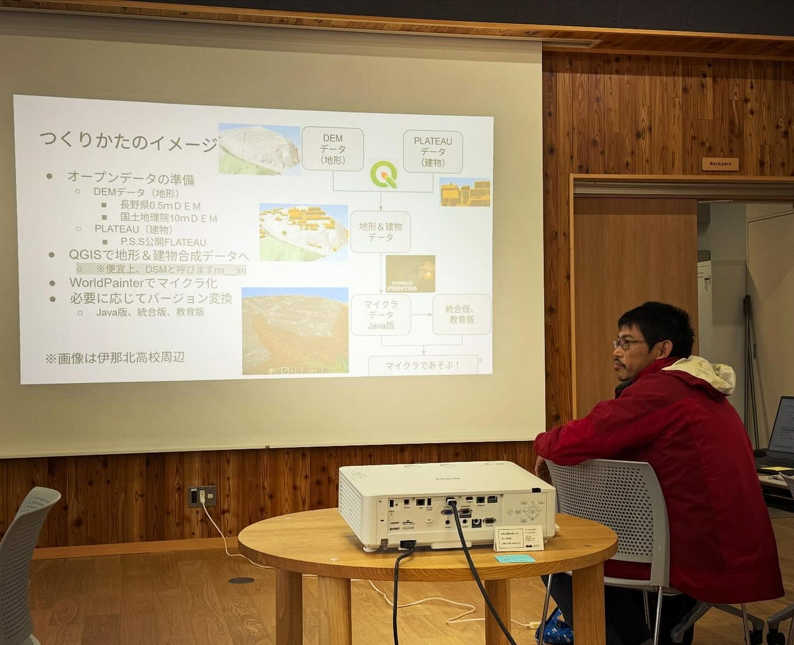
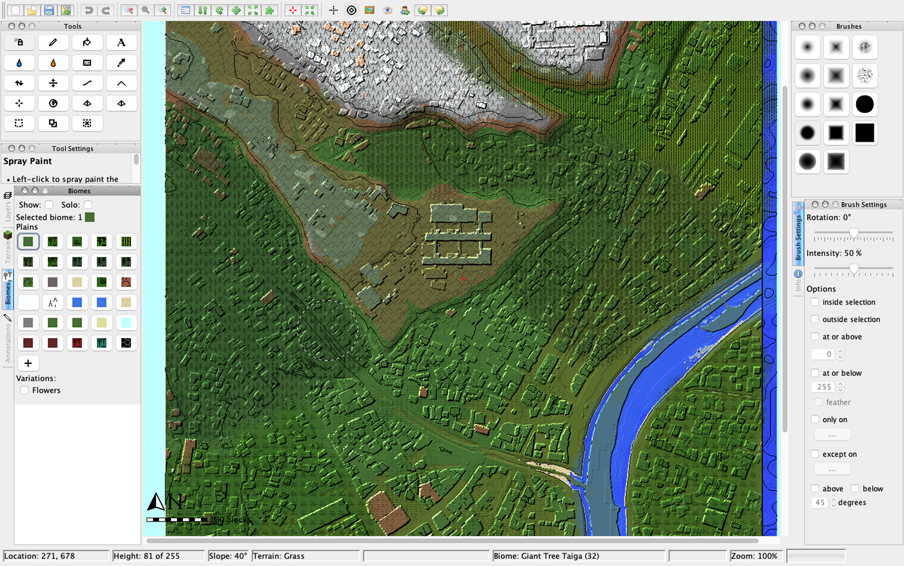
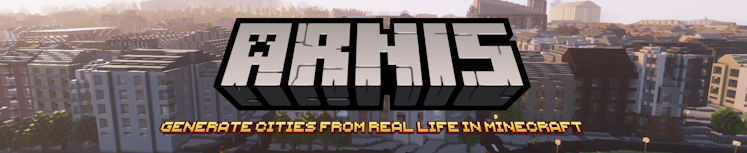
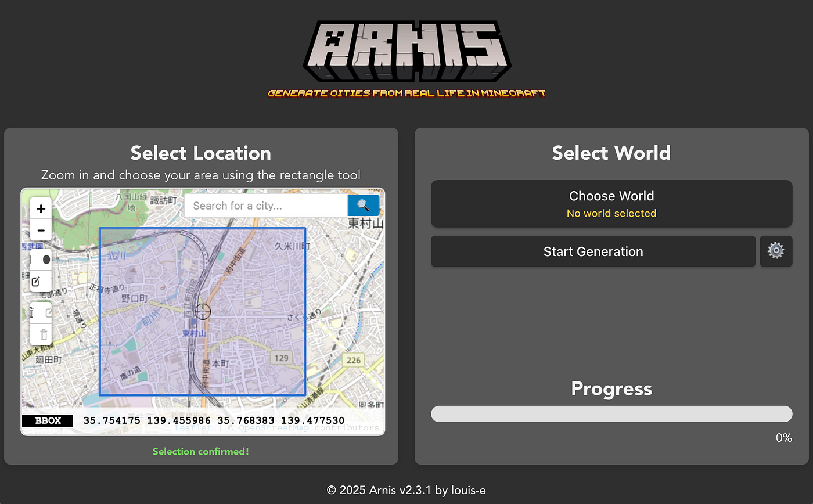
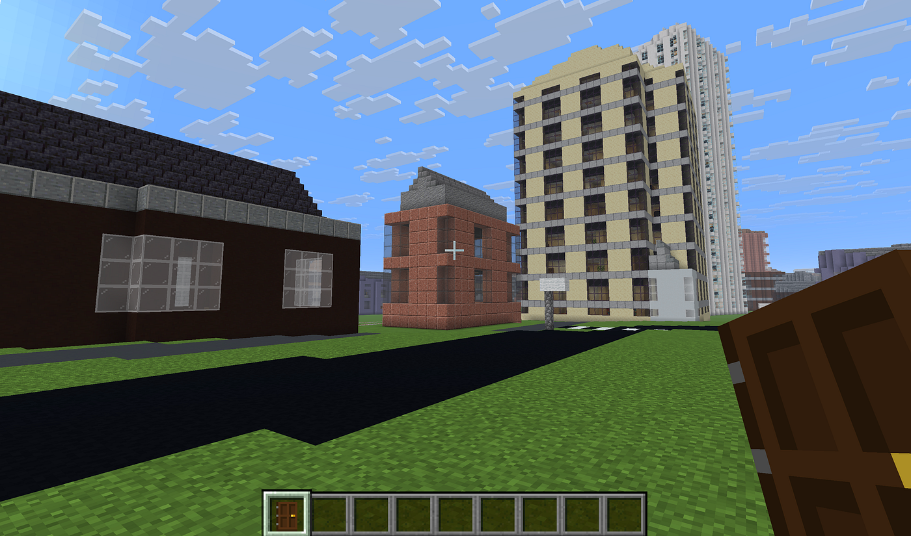

### PLATEAUデータをマイクラのワールドデータにする裏技を見つけた！



11/29–30 に信州大学農学部で開催されたオープンソースGISの国内カンファレンス「[FOSS4G SHINSHU 2025](https://sites.google.com/view/foss4gshinshu)」に参加・登壇するために、久々に伊那谷にやってきた。

[FOSS4G SHINSHU
自由でオープンソースな地理情報ソフトウェア（FOSS4G） の祭典を伊那谷で開催！sites.google.com](https://sites.google.com/view/foss4gshinshu)

最終日のハンズオンデーでは、合同会社ちいもりの杉本健輔さんによる「**親子でマイクラ！ DEMとPLATEAUから世界をつくろう。**」の回に参加。



普段、子どもたちがハマっている**[マインクラフト（通称マイクラ）**](https://www.minecraft.net/ja-jp)は何度かプレイし、いくつかのワールドデータをダウンロードして体験はしていたものの、既存の地理空間情報を用いてマイクラ・ワールドデータをちゃんと作ったことはなかったので、今回はそれを目当てに、ノウハウをたくさん吸収できた。

### ガッツリ作り込むときは WorldPainter をフル活用

ハンズオンでは、[QGIS](https://qgis.org)でのデータ下準備 → [WorldPainter](https://www.worldpainter.net/) → マインクラフト という３段構成でワールドデータの構築を丁寧に説明していただいた。特に、本来のDEMデータ生成工程の逆であるDEMからDSMへの変換とNull値のフィルタ処理など、[PLATEAU](https://www.mlit.go.jp/plateau/)やDEM配信側の立場としては、いかに建物や植物の高さ分を取り除くかを重視するものの、**マイクラ目線だと余計なことせずDSMでデータを出してくれればいい！**という要望は目からウロコの体験だった。

また、WorldPainter にDSMデータをインポート後、Biomes や Layers 設定で、どのような動植物や世界観の調整するかという編集作業は、往年のシムシティやシムアース世代にとっては時間が溶けそうな怖さすら感じる面白さだ。これはヤバイ。



とはいえ、子どもたちはそんなマニアックな大人心はわかってくれない。

一刻もはやくオリジナルのマイクラ・ワールドで遊びたいのだ。

### さくっと作るには ARNIS

そこで、考えた。PLATEAUデータなどを活用してもっとシンプルに、できればワンクリックで任意のBBOXエリア内のマイクラ・ワールドデータを自動生成することはできないか？

そこで見つけたのが [OpenStreetMap](https://www.openstreetmap.org) からマイクラ・ワールドデータを生成してくれるOSSアプリ [ARNIS](https://arnismc.com) の存在だ。



[GitHub - louis-e/arnis: Generate any location from the real world in Minecraft Java Edition with a…
Generate any location from the real world in Minecraft Java Edition with a high level of detail. - louis-e/arnisgithub.com](https://github.com/louis-e/arnis)

早速、[GitHub](https://github.com/louis-e/arnis/releases) から実行ファイルをMacBook(M5/32GB, Tahhoe 26.1)にダウンロードし、コマンドプロンプトからchmodコマンドで実行権限付与して、ARNISを起動してみた。

```bash
sudo chmod +x arnis-mac-universal
./arnis-mac-universal
```

お、こいつ動くぞ！



実は、OpenStreetMapには、2022年以降、いくつかのエリアのPLATEAU建物データ(LOD1のみ)がインポートされている。早速、最初にインポートテストを行った東村山市で試してみよう。

[JA:MLIT PLATEAU/imports outline
MLIT Plateau building footprint import is an import of building footprint data set which distributed by Plateau…wiki.openstreetmap.org](https://wiki.openstreetmap.org/wiki/JA:MLIT_PLATEAU/imports_outline)

できた。あっさりと。本当にBBOXエリアを指定して、ほぼワンクリックで。



つまり、OpenStreetMap で建物空白エリアだったとしても、PLATEAU建物データ(LOD1)が整備されている地域は、OpenStreetMapにインポートさえしておけば、いつでも誰でも簡単にマイクラ・ワールドがつくれる！あとは WorldPainter で Biomes など細かな修正を行えばよいのだ。[既に22の自治体エリアのインポートが完了](https://wiki.openstreetmap.org/wiki/JA:MLIT_PLATEAU/imports_outline#Plateauプロジェクト対象市町村の一覧)している。

ちなみに[伊那市](https://www.geospatial.jp/ckan/dataset/plateau-20209-ina-shi-2020)はまだPLATEAUインポート作業が行われていないため、優先エリアとして現在作業中の越谷市が終わり次第とりかからねば。

御存知の通り、国土交通省の都市デジタルツインプロジェクト [Project PLATEAU](https://www.mlit.go.jp/plateau/) は、そのベースデータを [CityGML 形式で提供している](https://www.mlit.go.jp/plateau/tag/?tag=citygml)ため、徐々に変換ツールやその使い勝手が向上しているとはいえ、まだ誰もが自由に使えるレベルとはいえない。

[PLATEAU [プラトー] | 国土交通省が主導する、日本全国の3D都市モデルの整備・オープンデータ化プロジェクト
国土交通省が主導する、日本全国の3D都市モデルの整備・オープンデータ化プロジェクト「PLATEAU」。データを活用するためのガイドやさまざまなシーンでの活用事例、最新ニュースやアプリケーションなど、PLATEAUに関する情報をお届けします。…www.mlit.go.jp](https://www.mlit.go.jp/plateau/)

しかし、OpenStreetMap のような既存の主要地図プラットフォームにPLATEAUデータが取り込まれることによって、ARNISのような便利なツールへと橋渡ししてくれる。

普段遣いのツールだからこそ、その応用性が劇的に広がるのである。

結果として、マイクラワールドに足りない地物を OpenStreetMap に追加するチビッコ達が増えてくれるとうれしい。

2021年にサービス終了してしまった地理空間情報連動型マインクラフト「[Minecraft Earth](https://ja.wikipedia.org/wiki/Minecraft_Earth)」の想いは、もしかするとPLATEAUのようなデジタルツインデータとOpenStreetMapが継承していくのかもしれない。

[Minecraft Earth - Wikipedia
『 Minecraft Earth』（マインクラフトアース）は、 Mojang Studiosとによって開発され、 Xbox Game Studiosから公開された 拡張現実（AR）と 位置情報を基盤とした サンドボックスゲームである。…ja.wikipedia.org](https://ja.wikipedia.org/wiki/Minecraft_Earth)


というわけで、PLATEAU建物データのOSMインポート作業はご協力いただけるボランティアマッパーを募集中！ ご協力いただける方ぜひぜひご支援を！！

[JA:MLIT PLATEAU/imports outline
MLIT Plateau building footprint import is an import of building footprint data set which distributed by Plateau…wiki.openstreetmap.org](https://wiki.openstreetmap.org/wiki/JA%3AMLIT_PLATEAU/imports_outline#%E3%83%81%E3%83%BC%E3%83%A0%E6%B4%BB%E5%8B%95%E8%A8%88%E7%94%BB)

この投稿は以下のアドベントカレンダーとして執筆しました。

[Furuhashi Lab. - Qiita Advent Calendar 2025 - Qiita
Calendar page for Qiita Advent Calendar 2025 regarding Furuhashi Lab..qiita.com](https://qiita.com/advent-calendar/2025/furuhashilab)

[青山学院大学 GSC Advent Calendar 2025 - Adventar
GSC2023groupphoto](https://github.com/gsc-aoyama/docs4gsc/assets/416977/a08d30d5-e6b3-407e-bab3-55e60bf769bc) **[青山学院大学…adventar.org](https://adventar.org/calendars/12051)

[OpenStreetMap - Qiita Advent Calendar 2025 - Qiita
Calendar page for Qiita Advent Calendar 2025 regarding OpenStreetMap.qiita.com](https://qiita.com/advent-calendar/2025/osmjp)
